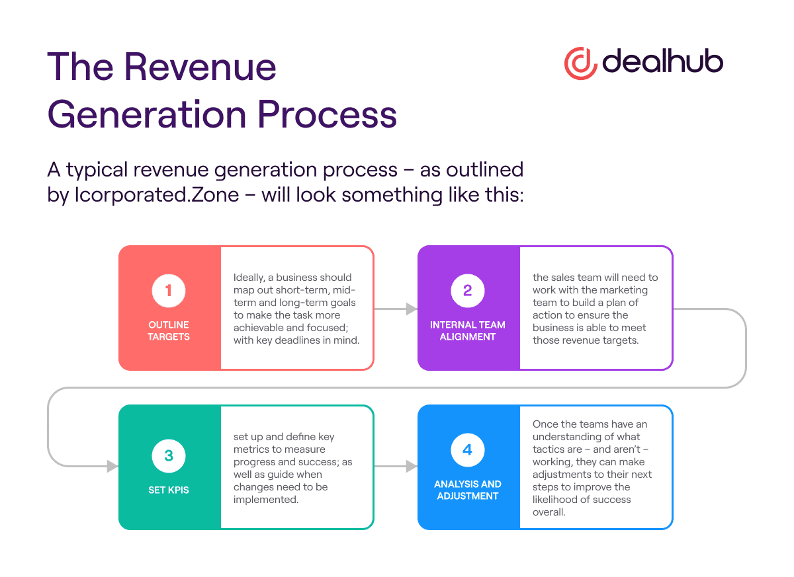

## Table of Contents

## What is a Revenue Generating Unit (RGU)?

A Revenue Generating Unit (RGU) is a way for companies, especially those in the telecom and media industries, to measure how much money they are making from different services. For example, if a customer subscribes to internet, TV, and phone services from the same company, each of these services is counted as one RGU. This helps the company understand which services are popular and how much revenue each one brings in.

By tracking RGUs, companies can see trends and make decisions about where to focus their efforts. For instance, if a lot of customers are signing up for internet service but not TV, the company might decide to improve their internet offerings or start promotions for TV to boost those RGUs. This simple counting system helps businesses keep track of their income sources and plan for the future.

## How does a Revenue Generating Unit function within a business?

A Revenue Generating Unit (RGU) helps a business keep track of how much money it makes from different services. Imagine a company that offers internet, TV, and phone services. Each time a customer signs up for one of these services, it counts as one RGU. For example, if a customer gets internet and TV from the company, that's two RGUs. By counting RGUs, the company can see which services are bringing in the most money and which ones might need more attention.

Using RGUs helps the business make smart decisions. If the company sees that a lot of people are signing up for internet but not TV, they might decide to offer special deals on TV to get more customers. This way, they can try to increase the number of TV RGUs. Keeping an eye on RGUs also helps the company plan for the future, figuring out where to spend money on improvements or new services to keep making more money.

## What are the key components of an RGU?

A Revenue Generating Unit, or RGU, is made up of a few main parts that help a business understand how much money they're making from different services. The first part is the service itself, like internet, TV, or phone. Each time a customer signs up for one of these services, it counts as one RGU. The second part is the customer. Every customer who subscribes to a service adds to the total number of RGUs.

The third part is the revenue. This is the money the business makes from each service. By looking at the revenue from each RGU, the business can see which services are doing well and which ones might need more work. Keeping track of these three parts helps the business make good choices about where to focus their efforts and how to grow in the future.

## Can you explain the difference between an RGU and other business units?

A Revenue Generating Unit (RGU) is different from other business units because it focuses on the money made from each service a customer subscribes to. For example, if a company offers internet, TV, and phone services, each service a customer signs up for is counted as one RGU. This helps the company see which services are making the most money and how many people are using them. Other business units might look at different things, like how much it costs to run the business or how many products are sold, but RGUs are all about tracking the money coming in from services.

Another difference is that RGUs are customer-focused. Each RGU represents a single service that a customer pays for, so the company can see how many customers are using each service and how much money they're making from each one. Other business units might focus on the company's overall sales, profits, or expenses, but RGUs give a clear picture of what customers are actually buying and how much they're willing to pay for it. This helps the company make decisions about where to put their effort and money to grow their business.

## How do businesses identify potential RGUs?

Businesses identify potential Revenue Generating Units (RGUs) by looking at what services they offer and how many customers are interested in them. For example, if a company provides internet, TV, and phone services, they can see how many people sign up for each one. By keeping track of these numbers, the company can figure out which services are popular and might bring in more money. They also look at customer feedback and market trends to see if there's a demand for new services that could become new RGUs.

To find potential RGUs, businesses also analyze their current customers. They look at how many services each customer is using and if there's a chance to offer them more. For instance, if a customer only has internet service, the company might offer them a special deal on TV to get them to sign up for another service, which would add another RGU. By understanding their customers' needs and preferences, businesses can find ways to increase the number of RGUs and make more money.

## What metrics are used to evaluate the performance of an RGU?

Businesses use a few key metrics to evaluate how well a Revenue Generating Unit (RGU) is doing. One important metric is the number of RGUs, which shows how many people are using each service. If the number of RGUs for a service is growing, it means more people are signing up for it, which is good for the business. Another metric is the average revenue per RGU, which tells the business how much money they're making from each service. If this number goes up, it means the service is becoming more profitable.

Another useful metric is the churn rate, which measures how many customers stop using a service over a certain time. A low churn rate means customers are happy with the service and are likely to keep using it. Businesses also look at the cost to acquire new RGUs, which is how much money they have to spend to get new customers to sign up for a service. By comparing these metrics, businesses can see which services are doing well and which ones might need more attention to improve their performance.

## How can an RGU contribute to overall company profitability?

An RGU, or Revenue Generating Unit, helps a company make more money by tracking how many people are using each service. For example, if a company offers internet, TV, and phone services, each service a customer signs up for counts as one RGU. By looking at how many RGUs each service has, the company can see which ones are popular and bringing in the most money. This helps the company focus on the services that are doing well and try to get more customers to sign up for them.

By understanding which services are making the most money, the company can make smart decisions about where to spend money on improvements or new services. If they see that a lot of people are signing up for internet but not TV, they might offer special deals on TV to increase the number of TV RGUs. This way, they can boost the overall number of RGUs and make more money. Keeping track of RGUs helps the company grow and be more profitable by focusing on what customers want and are willing to pay for.

## What are common strategies for optimizing an RGU's performance?

Businesses use a few common strategies to make their Revenue Generating Units (RGUs) perform better. One way is to offer special deals or promotions to get more people to sign up for their services. For example, if a company sees that a lot of people are getting internet but not TV, they might give a discount on TV to make it more attractive. This can help increase the number of TV RGUs and bring in more money. Another strategy is to improve the services they offer. If customers are happy with the service, they are more likely to keep using it and even tell their friends about it, which can help grow the number of RGUs.

Another important strategy is to understand what customers want and need. Companies can do this by asking for feedback and looking at what services are popular. If they see that a lot of people want a new service, like a faster internet plan, they might add it to their offerings. This can attract new customers and increase the number of RGUs. Keeping an eye on how many people are leaving the service, called the churn rate, is also helpful. If the churn rate is high, the company might need to fix something to make customers happier and keep them using the service. By using these strategies, businesses can make their RGUs perform better and make more money.

## How does technology impact the effectiveness of an RGU?

Technology can make Revenue Generating Units (RGUs) work better by helping companies keep track of their services more easily. For example, with good technology, a company can quickly see how many people are using their internet, TV, or phone services. This helps them know which services are popular and making the most money. Technology also lets companies offer new services, like streaming TV or faster internet, which can attract more customers and increase the number of RGUs.

Another way technology helps is by making it easier for customers to sign up for services. If a company has a good website or app, people can quickly choose what they want and start using it right away. This can help the company get more RGUs because it's easier for customers to join. Plus, technology can help companies find out what customers like and don't like, so they can make their services better and keep more people using them.

## What are the challenges faced when managing multiple RGUs?

Managing multiple RGUs can be tricky because it means keeping track of a lot of different services at the same time. For example, a company that offers internet, TV, and phone services needs to watch how many people are using each one and how much money they're making from them. This can be hard because each service might have different problems or needs. If the internet service is slow, customers might get upset and stop using it, which would lower the number of internet RGUs. The company has to fix these problems quickly to keep customers happy and keep the RGUs growing.

Another challenge is making sure that all the services work well together. Sometimes, when a customer signs up for more than one service, they might expect them to work together smoothly. If the internet and TV services don't work well together, the customer might get frustrated and leave. The company needs to make sure that all their services are easy to use and that customers can get help if they need it. This can be a lot of work, but it's important for keeping the number of RGUs up and making sure the company keeps making money.

## How can data analytics enhance the decision-making process for RGUs?

Data analytics can help businesses make better choices about their Revenue Generating Units (RGUs) by looking at numbers and finding patterns. For example, if a company sees that a lot of people are signing up for internet but not TV, they can use data to figure out why. Maybe the internet is faster or cheaper, or maybe people just don't want TV anymore. By understanding these patterns, the company can make changes to their TV service to make it more attractive, like offering new channels or better prices. This way, they can get more people to sign up for TV and increase the number of TV RGUs.

Data analytics also helps businesses keep an eye on how happy their customers are. If a lot of people are leaving a service, the company can use data to find out why. Maybe the service is too expensive, or maybe it's not working well. By looking at this information, the company can fix the problems and make their customers happier. This can help them keep the customers they have and attract new ones, which means more RGUs and more money for the business. Using data analytics helps companies make smart decisions about their services and grow their RGUs.

## What future trends are likely to influence the development of RGUs?

In the future, technology will play a big role in how Revenue Generating Units (RGUs) grow and change. As more people use smart devices and want everything to work together, companies will need to make their services better and easier to use. For example, if a company offers internet, TV, and phone services, they might start offering new things like smart home controls or better streaming options. This can help them get more customers and increase the number of RGUs. Also, as more people use the internet for everything, companies might focus more on internet services and less on traditional TV, which could change how they count and manage their RGUs.

Another trend that will affect RGUs is how companies use data to understand what customers want. With more advanced data tools, businesses can see what services are popular and why. They can use this information to make their services better and offer new things that people will like. For example, if a company sees that a lot of people are using their internet service to watch videos, they might offer a new video streaming service to get more customers. This can help them grow their RGUs and make more money. As data tools get better, companies will be able to make smarter choices about their services and keep their customers happy.

## What is the relationship between RGUs and Average Revenue Per Unit (ARPU)?

Average Revenue Per Unit (ARPU) is a critical metric derived from Revenue Generating Units (RGUs), offering valuable insights into the financial performance of businesses, particularly those operating with subscription-based models. ARPU reflects the revenue generated per subscriber or user, providing a clear picture of how effectively a company is monetizing its customer base.

The computation of ARPU is straightforward. It involves dividing the total revenue for a specific period by the average number of RGUs for the same period. Mathematically, it can be represented as:

$$
\text{ARPU} = \frac{\text{Total Revenue}}{\text{Average Number of RGUs}}
$$

This calculation serves as a vital tool for assessing a company’s pricing and profitability strategies. Companies can track ARPU over time to gauge the effectiveness of their pricing models and to identify trends in revenue generation.

Analyzing ARPU allows businesses to pinpoint areas for enhancing profitability. For instance, if ARPU is lower than expected, it may indicate that pricing strategies need adjustment or that additional value-added services should be considered to boost revenue per user. Conversely, a rising ARPU might suggest successful implementation of premium service offerings or effective customer retention strategies.

Moreover, a detailed examination of ARPU can help businesses tailor their service offerings to better align with customer preferences and willingness to pay. This could involve offering tiered services, personalized packages, or introducing innovative product features that justify a higher price point, ultimately driving increased ARPU and improved business outcomes.

By understanding and optimizing ARPU, companies can enhance their revenue strategies, ensuring they are competitive and sustainable in rapidly evolving market environments.

## References & Further Reading

[1]: Coussement, K., Van den Bossche, F., & De Bock, K. W. (2014). ["Data Accuracy's Impact on Segmentation Performance: Benchmarking RFM Analysis, Logistic Regression, and Decision Trees"](https://www.sciencedirect.com/science/article/abs/pii/S0148296312002615). Journal of Business & Industrial Marketing.

[2]: Lopez de Prado, M. (2018). ["Advances in Financial Machine Learning"](https://www.amazon.com/Advances-Financial-Machine-Learning-Marcos/dp/1119482089). Wiley.

[3]: Jansen, S. (2020). ["Machine Learning for Algorithmic Trading: Predictive Models to Extract Signals from Market and Alternative Data for Systematic Trading Strategies"](https://www.amazon.com/Machine-Learning-Algorithmic-Trading-alternative/dp/1839217715). Packt Publishing.

[4]: Chan, E. P. (2009). ["Quantitative Trading: How to Build Your Own Algorithmic Trading Business"](https://github.com/egorpe/EPChan-QuantitativeTrading/blob/master/example7_6.m). Wiley.

[5]: Aronson, D. R. (2007). ["Evidence-Based Technical Analysis: Applying the Scientific Method and Statistical Inference to Trading Signals"](https://onlinelibrary.wiley.com/doi/book/10.1002/9781118268315). Wiley.