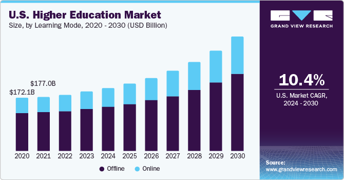

Higher education finance is a complex and multifaceted topic that has seen substantial evolution over the years. Traditionally, universities and colleges have relied on several revenue streams, including tuition and fees, government funding, private donations, research grants, and income from endowments. However, current challenges such as fluctuating enrollment rates, decreasing public funding, and the evolving economic climate necessitate the exploration of diverse and innovative revenue sources to achieve financial sustainability and independence.

In this context, algorithmic trading emerges as a promising and innovative revenue stream for educational institutions. Algorithmic trading involves the use of complex algorithms and automated systems to make trading decisions and execute orders in financial markets. These systems can analyze vast datasets at high speeds, identifying profitable trading opportunities that might not be evident through manual trading processes. The integration of technologies like artificial intelligence and machine learning further enhances the capabilities of algorithmic trading, enabling more sophisticated and precise trading strategies.



The purpose of this article is to examine the intersection of higher education finance and algorithmic trading, exploring how this technology-driven approach could benefit universities and colleges. Key terms in this discussion include "university income," which refers to the various sources of revenue for higher education institutions, and "college revenue," which encompasses similar financial inflows, including tuition, fees, and other operational income. "Algo trading," or algorithmic trading, represents the systematic, automated approach to trading that leverages advanced computational methods to optimize market outcomes.

Throughout this exploration, we will consider the potential impacts and benefits of incorporating algorithmic trading into the financial strategies of higher education institutions. This includes evaluating how such practices might diversify income streams, provide learning opportunities for students, and align with institutional missions, while also addressing challenges such as regulatory compliance and ethical considerations. By understanding these aspects, educational institutions can make informed decisions about leveraging algorithmic trading as a viable path toward sustainable financial health.

## Table of Contents

## The Financial Challenges Facing Higher Education

Universities and colleges traditionally rely on several revenue streams to finance their operations. The most common of these are tuition and fees, government funding, private donations and endowments, research grants, and auxiliary enterprises such as housing and dining services. However, these traditional sources are increasingly being challenged.

One significant challenge is the decline in student enrollment. Factors such as demographic changes, increasing tuition costs, and competition from online education platforms contribute to this trend. For example, as the birth rate in certain regions decreases, the pool of prospective students shrinks, directly impacting tuition revenue.

Government funding, another cornerstone of university finance, is often subject to cuts, particularly during economic downturns. Government appropriations for higher education can fluctuate based on political priorities and economic conditions. For instance, during recessions, governments might reduce funding for public institutions to reallocate resources to more immediate economic relief efforts, resulting in decreased income for these institutions.

Economic downturns further complicate the financial landscape for higher education. During such periods, endowments typically suffer as investment returns dwindle. Universities may also see a drop in charitable donations as potential benefactors focus on personal financial stability. The economic challenges not only diminish existing revenue streams but also make the cost of borrowing for capital projects more expensive, putting additional strain on university finances.

Given these financial challenges, diversification of revenue sources becomes crucial. By broadening their income streams, universities can ensure financial stability and reduce dependency on any single source of funding. This necessitates exploring innovative revenue options beyond traditional means, such as enhancing corporate partnerships, increasing engagement with alumni networks for fundraising, and investing in technology to provide online courses.

Key financial metrics in higher education are influenced by these challenges. Metrics such as net tuition revenue, operating margins, and endowment return rates are directly impacted by enrollment trends, government funding levels, and economic conditions. Monitoring these metrics is vital for university administrators to maintain financial health and make informed strategic decisions.

As traditional sources become less reliable, the push for novel revenue streams, including potential investments in financial markets, emerges as a necessary strategy for the financial sustainability of universities.

## The Basics of Algorithmic Trading

Algorithmic trading involves the use of computer programs to execute trading orders in financial markets automatically. These programs rely on a defined set of instructions—algorithms—that dictate the timing, price, and quantity of trades. This approach relies heavily on technology, data analysis, and computational techniques to increase efficiency in trading.

Algorithmic trading is underpinned by several key technologies and methodologies. High-frequency trading ([HFT](/wiki/high-frequency-trading-strategies)) is one such method, characterized by extremely rapid trading where a high [volume](/wiki/volume-trading-strategy) of orders are executed in fractions of a second. Electronic communication networks (ECNs) facilitate these transactions by matching buy and sell orders in the market. Another crucial technology is co-location, where traders place their algorithms on servers physically close to exchange servers to reduce latency.

Market performance in [algorithmic trading](/wiki/algorithmic-trading) is evaluated using data-driven decision-making processes. Algorithms analyze vast amounts of historical and real-time market data to identify trends and potential [arbitrage](/wiki/arbitrage) opportunities. Statistical models and quantitative techniques, such as regression analysis and time series forecasting, play crucial roles in this process. Moreover, sophisticated algorithms can adapt their strategies based on evolving market conditions, enhancing their effectiveness.

There are several types of algorithmic trading strategies commonly employed. Trend-following strategies, one of the simplest types, seek to capitalize on market [momentum](/wiki/momentum) by buying assets that have performed well or selling those that have underperformed. Arbitrage strategies involve taking advantage of price discrepancies between related financial instruments. Market-making strategies provide [liquidity](/wiki/liquidity-risk-premium) by continuously offering buy and sell quotes for a financial instrument, [earning](/wiki/earning-announcement) a profit from the spread. Mean-reversion strategies are based on the assumption that asset prices will revert to their historical averages over time.

The integration of [artificial intelligence](/wiki/ai-artificial-intelligence) (AI) and [machine learning](/wiki/machine-learning) (ML) has significantly enhanced trading algorithms' capabilities. Machine learning algorithms can improve their performance by learning from new data, thereby optimizing trading strategies over time. Deep learning models, a subset of machine learning, can process unstructured data such as news articles or social media posts to forecast market movements. The use of natural language processing (NLP) allows algorithmic systems to interpret and respond to qualitative data, further refining the decision-making process.

Python is a preferred language in algorithmic trading due to its simplicity and powerful libraries. With libraries such as Pandas for data manipulation, NumPy for numerical computations, and Scikit-learn for machine learning, developers can efficiently build sophisticated trading models. The following Python snippet demonstrates a simple moving average crossover strategy—a common trend-following technique:

```python
import pandas as pd

def moving_average_crossover(prices, short_window, long_window):
    short_mavg = prices.rolling(window=short_window, min_periods=1, center=False).mean()
    long_mavg = prices.rolling(window=long_window, min_periods=1, center=False).mean()

    # Generate signal: 1 for buy, -1 for sell
    signals = pd.DataFrame(index=prices.index)
    signals['signal'] = 0.0
    signals['short_mavg'] = short_mavg
    signals['long_mavg'] = long_mavg
    signals['signal'][short_window:] = np.where(signals['short_mavg'][short_window:] > signals['long_mavg'][short_window:], 1.0, -1.0)

    return signals
```

This code calculates moving averages for a time series of asset prices and generates trading signals based on the crossover points of short and long moving averages. It illustrates how algorithmic trading strategies are implemented using data analysis techniques to identify and act on market trends. The blend of technology, statistical analysis, and AI makes algorithmic trading a powerful tool for generating returns in the financial markets.

## Exploring Algorithmic Trading as a Revenue Source for Higher Education

Universities and colleges face increasing financial pressures due to reduced traditional revenue streams and/or financial instability. Algorithmic trading presents an innovative pathway for higher education institutions to diversify their income sources. This section explores how universities can leverage algorithmic trading, offers examples of institutions involved in such investments, discusses potential risks and ethical considerations, examines regulatory compliance and governance, and outlines necessary infrastructure and expertise.

Universities can utilize algorithmic trading by tapping their financial reserves or endowments into sophisticated trading strategies. This approach allows institutions to potentially generate significant income while managing their financial assets optimally. For instance, Stanford University’s endowment has been known to engage in sophisticated investment strategies, including quantitative finance, though not exclusively algorithmic trading [Stanford Management Company](https://smc.stanford.edu/). Similarly, Harvard University's endowment uses varied strategies that may encompass algorithmic methods involving complex data analytics and predictive modeling [Harvard Management Company](https://www.hmc.harvard.edu/).

However, algorithmic trading carries inherent risks, including market [volatility](/wiki/volatility-trading-strategies) and the potential for significant financial losses. Ethical considerations arise regarding the use of educational funds in speculative activities, as well as the potential diversion of resources from the primary educational mission. There is also the risk of creating inequitable outcomes if financial success becomes contingent on high-risk investments rather than stable educational funding.

Regulatory compliance and governance are paramount in ensuring that universities engaging in algorithmic trading adhere to legal and ethical standards. Institutions must navigate complex financial regulations, such as those imposed by the U.S. Securities and Exchange Commission (SEC) and other international counterparts. Establishing robust governance frameworks is critical for accountability and oversight, ensuring that trading activities align with institutional goals and stakeholder interests.

To execute successful algorithmic trading, institutions require substantial infrastructure, including advanced computing resources, real-time data feeds, and secure trading platforms. Expertise is equally crucial, necessitating skilled professionals in quantitative analysis, finance, and information technology. These professionals are responsible for developing and maintaining algorithms, analyzing market trends, and executing trades. Collaboration with business schools or establishing specialized research centers within universities can provide the needed skills and knowledge base, such as MIT's financial engineering programs.

In conclusion, while algorithmic trading offers universities a potentially lucrative revenue source, it demands careful consideration of risks, ethical implications, regulatory compliance, and the necessary infrastructure and expertise. Balancing financial pursuits with educational responsibilities is crucial in pursuing this innovative financial strategy.

## Benefits of Incorporating Algorithmic Trading in University Finance

Incorporating algorithmic trading into university finance can significantly diversify income streams. Unlike traditional investment methods that might rely heavily on manual processing and subjective decision-making, algorithmic trading uses complex computer algorithms to execute trades at optimized times, reducing human error and enhancing financial independence. This structured approach can offer universities the potential for substantial returns, aiding in endowment growth and long-term financial sustainability. 

Algorithmic trading allows universities to potentially outperform traditional investment strategies because it capitalizes on the speed and efficiency provided by technology. The computational power employed in algorithmic trading enables investments to be executed under precise parameters, making it possible to respond swiftly to market changes. An example algorithm might be:

```python
def trade_based_on_moving_average(prices, short_window, long_window):
    short_moving_avg = prices.rolling(window=short_window).mean()
    long_moving_avg = prices.rolling(window=long_window).mean()
    signals = short_moving_avg > long_moving_avg
    return signals

# Usage
# prices is a pandas Series of prices
signals = trade_based_on_moving_average(prices, short_window=40, long_window=100)
```

Furthermore, incorporating algorithmic trading presents valuable opportunities for research and student learning. It can be integrated into finance and computer science curricula, providing students with hands-on experience that enhances their financial literacy and analytical skills. This real-world application of classroom theories fosters a practical learning environment, preparing students for future careers in finance and data science.

University-aligned investment strategies can be tailored to align tightly with the institution's mission and ethical guidelines. These strategies can emphasize socially responsible investing or focus on sectors that support the university's educational goals. For instance, a university with a strong environmental sciences program might employ algorithms that prioritize investments in renewable energy stocks, marrying financial objectives with institutional values.

The incorporation of algorithmic trading into higher education finance does more than just bolster university assets; it serves as a learning tool that cultivates financial competence among students. By engaging in these strategies, students gain exposure to complex financial systems and develop a nuanced understanding of modern investment mechanisms. As they work alongside professionals in simulated or real environments, their problem-solving abilities and technical proficiencies are inherently strengthened, better equipping them for the evolving job market.

In summary, algorithmic trading offers universities a multifaceted opportunity: increased financial independence, enhanced student learning experiences, and strategic alignment with institutional missions. It is an innovative financial approach that holds promise for the future of higher education finance.

## Challenges and Considerations

Algorithmic trading offers higher education institutions an innovative approach to diversify income streams, but it also presents notable challenges and considerations that must be addressed carefully. One primary concern is the potential risks inherent in trading activities. Algorithmic trading, by nature, involves the use of complex algorithms and high-frequency transactions, which can lead to substantial financial losses if not managed properly. For example, the infamous "flash crash" of 2010 highlighted the vulnerabilities in high-frequency trading systems, emphasizing the necessity for institutions to implement robust risk management strategies. Financial institutions often use techniques such as Value at Risk (VaR) and stress testing to quantify and prepare for potential losses.

Overcoming barriers to entry in algorithmic trading is crucial for educational institutions. The initial setup requires significant capital investment in technology infrastructure, including high-speed internet connections and powerful computing resources. Furthermore, the technical expertise needed to develop, monitor, and optimize trading algorithms can be a significant hurdle. Universities should consider partnering with industry experts or investing in training programs to build internal capabilities.

Financial oversight and transparency represent another challenge. As universities engage in trading activities, ensuring that these actions align with institutional governance and financial policies is vital. Regular audits and transparent reporting can help maintain accountability and trust among stakeholders. It is essential to establish clear guidelines and oversight committees to monitor trading activities and ensure they are conducted ethically and in line with institutional goals.

Balancing educational objectives with financial pursuits is a delicate task. While algorithmic trading can potentially increase a university's financial resources, it should not overshadow the primary mission of education and research. Institutions must prioritize their educational commitments and ensure that any trading activities complement, rather than compete with, these objectives. This balance can be achieved by integrating trading activities with academic programs, allowing students and faculty to engage with real-world financial markets as part of their learning experience.

Public perception and stakeholder concerns also play a significant role. The involvement of universities in activities traditionally associated with profit-driven motives, such as trading, can lead to skepticism and negative public opinion. Engaging with stakeholders—students, faculty, alumni, and the broader community—in open dialogue about the objectives and expected outcomes of trading activities can help alleviate concerns. Emphasizing transparency, ethical considerations, and the alignment of trading goals with the institution's mission is paramount in addressing these perceptions.

In conclusion, while algorithmic trading holds promise as a revenue source for universities, it requires careful consideration of risk management, infrastructure needs, transparency, educational balance, and public perception. Institutions that navigate these challenges with foresight and strategic planning can enhance their financial stability while enriching their educational offerings.

## Case Studies and Real-World Applications

Universities around the world are increasingly exploring algorithmic trading as a means to bolster their financial strategies. A few institutions have implemented trading strategies and have provided valuable insights into their potential benefits and challenges.

### Detailed Examination of Universities that Have Successfully Implemented Trading Strategies

One prominent example is the Massachusetts Institute of Technology (MIT), which has a dedicated financial research center that explores [quantitative trading](/wiki/quantitative-trading) models. This initiative has not only generated additional revenue for the institute but has also played a significant role in advancing research in quantitative finance and trading algorithms. MIT’s approach involves leveraging its strong foundation in mathematical and computational sciences, enabling it to navigate the complexity of financial markets successfully.

Similarly, the University of Chicago's Booth School of Business has integrated algorithmic trading into its financial curriculum. By allowing students to manage a portion of the university’s endowment funds under guided supervision, the institution not only benefits financially but also provides students with practical experience in the field. This integration of algorithmic trading into educational programs has enhanced students' analytical skills, preparing them for competitive roles in quantitative finance sectors.

### Analyses of Outcomes and Financial Impact

The financial outcomes of these strategies have shown promise in terms of diversification and revenue generation. For example, MIT reported an increase in its financial reserves, thanks to the implementation of data-driven trading strategies that offered a competitive edge in the market. This financial growth has also supported groundbreaking research and scholarships, feeding back into the institution’s core educational mission.

The University of Chicago’s model has fostered a sustainable income stream while cultivating a rich educational environment for students. By using real-world data and trading environments, students develop a deeper understanding of market dynamics, which translates into high placement rates in top financial firms after graduation.

### Comparative Analysis on Traditional vs. Algorithmic Trading Outcomes

In comparison to traditional investment strategies, algorithmic trading presents several advantages. Traditional strategies often rely heavily on manual analysis and decision-making, limiting the speed and efficiency of trades. In contrast, algorithmic trading utilizes automated systems to analyze large volumes of data and execute trades at speeds unattainable by human traders. This automation can lead to better pricing, improved accuracy in forecasting market movements, and reduced transaction costs.

However, the transition from traditional to algorithmic trading is not without challenges. Initial infrastructure investments are required to develop and maintain the necessary technology platforms, and the complexity of algorithms demands a high level of expertise. Moreover, algorithmic trading requires constant monitoring and adjustment to remain effective in ever-changing market conditions.

### Lessons Learned and Best Practices

From the experiences of these institutions, several best practices have emerged:

1. **Invest in Technology and Expertise**: Successful implementation of algorithmic trading requires robust technological infrastructure and access to expertise in financial markets and data sciences.

2. **Integrate with Educational Programs**: Providing hands-on experience for students not only enhances their learning but also supports the institution’s financial goals. Programs should be designed to help students bridge theoretical knowledge with practical trading skills.

3. **Focus on Ethical and Regulatory Compliance**: Institutions must prioritize ethical considerations and adhere to financial regulations to mitigate risks associated with trading. Establishing comprehensive governance frameworks is crucial to safeguarding institutional integrity.

4. **Emphasize Risk Management**: Implementing algorithmic trading systems with stringent risk management protocols ensures that potential downsides are addressed proactively. This can be achieved by diversifying trading strategies and continuously analyzing risk exposure.

In conclusion, algorithmic trading offers a viable opportunity for universities to diversify their income streams while enriching their educational offerings. By learning from early adopters, institutions can develop strategies that align with their mission and educational goals, ultimately contributing to their long-term sustainability and success in the financial domain.

## Conclusion

Algorithmic trading presents significant potential as a revenue source for universities, offering a distinct avenue for financial diversification and growth. By integrating sophisticated trading systems, universities can not only enhance their financial portfolios but also boost their endowment funds. This innovative financial strategy could yield substantial returns, contributing to the long-term financial sustainability of these institutions.

Balancing the dual objectives of innovation and education is crucial in higher education finance. While algorithmic trading can provide substantial financial benefits, institutions must carefully weigh these gains against their core educational missions. The incorporation of such trading strategies should enhance, rather than overshadow, the academic and research objectives of the university. For example, involving students and faculty in the development and management of trading algorithms can serve as a valuable educational tool, aligning financial activities with the university's mission to foster learning and research.

Proactive steps are essential for institutions seeking to explore new revenue streams. Universities must invest in the necessary infrastructure, recruit and develop expertise in financial technology, and ensure robust governance structures are in place to manage the complexities of trading activities. Establishing partnerships with financial experts or firms can provide critical insights and mitigate risks.

Educational institutions are encouraged to explore innovative financial strategies, adopting a forward-thinking approach to finance. Algorithmic trading represents just one of many potential avenues for innovation. By leveraging data-driven decision-making and advanced modeling techniques, universities can position themselves at the forefront of financial innovation, enhancing both their financial stability and educational offerings.

Financial experts often underline the importance of adaptability in the current economic climate. As noted by some leaders in the financial sector, embracing technological advancements and integrating them into strategic planning is essential for navigating fiscal challenges in education. This proactive embrace of innovation can ensure higher education institutions remain both competitive and financially independent, enabling them to better serve their educational missions.

In conclusion, algorithmic trading offers a promising pathway for universities seeking to expand their financial resources. By carefully balancing innovation with educational imperatives and taking deliberate steps toward implementation, universities can harness the power of technology to secure their financial future.

## References & Further Reading

[1]: Bergstra, J., Bardenet, R., Bengio, Y., & Kégl, B. (2011). ["Algorithms for Hyper-Parameter Optimization."](https://papers.nips.cc/paper/4443-algorithms-for-hyper-parameter-optimization) Advances in Neural Information Processing Systems 24.

[2]: ["Advances in Financial Machine Learning"](https://www.amazon.com/Advances-Financial-Machine-Learning-Marcos/dp/1119482089) by Marcos Lopez de Prado

[3]: ["Evidence-Based Technical Analysis: Applying the Scientific Method and Statistical Inference to Trading Signals"](https://www.amazon.com/Evidence-Based-Technical-Analysis-Scientific-Statistical/dp/0470008741) by David Aronson

[4]: ["Machine Learning for Algorithmic Trading"](https://github.com/stefan-jansen/machine-learning-for-trading) by Stefan Jansen

[5]: ["Quantitative Trading: How to Build Your Own Algorithmic Trading Business"](https://www.amazon.com/Quantitative-Trading-Build-Algorithmic-Business/dp/1119800064) by Ernest P. Chan