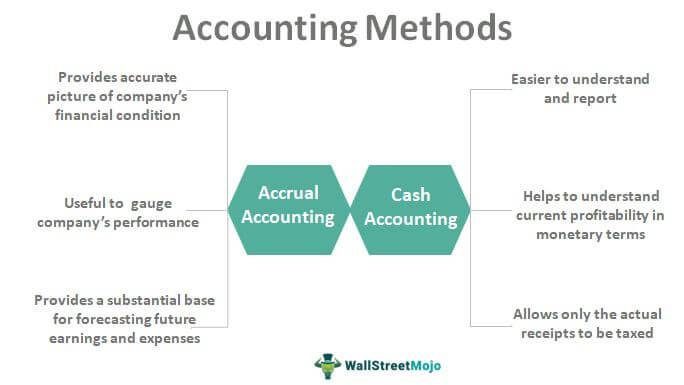

Twitch has rapidly evolved from a niche platform catering primarily to gaming enthusiasts into a mainstream service frequented by millions daily. This transformation is largely fueled by its diverse monetization strategies, which allow streamers to generate substantial revenue from their content. As a subsidiary of Amazon, Twitch benefits from the tech giant's infrastructure and strategic vision, offering streamers multiple avenues to monetize their channels effectively. These monetization methods are essential for streamers who aspire to turn their streaming activities from hobbies into lucrative enterprises.

The following article examines the monetization strategies available to Twitch streamers, Amazon's facilitative role in this process, and the significance of adapting these strategies to stay relevant with emerging trends such as algorithmic trading within the financial sector. Twitch's expansive user base and diverse content offerings enable creative and engaging opportunities for streamers to attract and retain audiences. This engagement potential is key to unlocking revenue streams that can rival more traditional forms of earnings.



Understanding how these specific monetization methods integrate with Amazon's ambitious revenue objectives is crucial. Twitch not only offers financial benefits to individual content creators but also aligns with Amazon's broader strategy to dominate the digital entertainment sphere. By tapping into the platform's potential, streamers can enhance their earning potential significantly, while contributing to Amazon's ongoing expansion into new frontiers such as gaming and algorithm-driven sectors.

## Table of Contents

## Subscription Fees on Twitch

Subscriptions provide a fundamental revenue stream for Twitch streamers. Subscribers contribute a monthly fee to support their preferred channels, which grants them access to various perks. These perks often include exclusive emotes, distinctive badges, and an ad-free viewing experience. This model fosters a sense of community and loyalty between streamers and their audience.

On Twitch, subscription fees are categorized into three tiers: $4.99, $9.99, and $24.99 per month. Each tier offers increasing levels of benefits and recognition, thereby encouraging viewers to choose a subscription level that aligns with their level of engagement and support for the channel. This tiered structure presents streamers with a significant opportunity to earn a steady income based on their ability to attract and maintain subscribers.

Amazon, the parent company of Twitch, plays a crucial role in the monetization process by splitting subscription revenue with streamers. Typically, this revenue share is conducted on a 50/50 basis. This arrangement underscores Amazon's commitment to facilitating digital content monetization while providing streamers with an appealing income opportunity. This system aligns with Amazon's broader strategy to enhance and expand digital content offerings, contributing to the growth and sustainability of the Twitch platform.

Understanding how to maximize subscription-based revenue is essential for streamers aiming to make a career out of their Twitch presence. By cultivating a loyal subscriber base and strategically utilizing platform features, streamers can significantly bolster their earnings and enhance the overall streaming experience for their community.

## Twitch Bits and Cheering

Twitch Bits are a virtual currency designed to facilitate viewer engagement and provide streamers with an additional revenue stream. Fans purchase Bits to cheer and support their favorite streamers during live broadcasts, with each Bit corresponding to a small financial reward for the streamer. The purchasing rate for Bits begins at approximately $1.40 for 100 Bits, which translates to a direct financial reward of one cent per Bit for the streamer. This transaction is expressed mathematically as:

$$
\text{Earnings per Bit} = \$0.01
$$

The process is designed to be interactive, enhancing the viewing experience by allowing fans to play a participatory role through cheering. As fans engage in cheering, they contribute not just financially but also to the overall dynamic atmosphere of a live stream. This mechanism incentivizes streamers to nurture their audience community by increasing the interactive components of their streams, thus fostering a stronger bond between viewers and streamers.

Furthermore, cheering with Bits allows viewers to visibly express their support, which can reinforce a sense of community and belonging within a streamer's audience. This model not only aids in direct monetization but also contributes to increased viewer retention by creating compelling and interactive viewer experiences. Viewers are encouraged to cheer more frequently as they witness their interactions impacting the stream's flow and see their contributions publicly acknowledged by the streamer, anchoring a reciprocal relationship between fans and content creators on the platform.

## Advertisement Revenue on Twitch

Advertisements are a pivotal element of Twitch's monetization model, serving both streamers and Amazon's broader revenue objectives. Streamers have the option to incorporate advertisements into their broadcasts, generating income directly proportional to the number of views these advertisements receive. This optional feature makes ad revenue an appealing supplement to direct community support mechanisms like subscriptions and Bits.

In tandem, Amazon, Twitch's parent company, incorporates these ads within its larger digital advertising ecosystem. By leveraging Twitch's substantial viewer base, Amazon sets ambitious targets for ad-generated income. Despite advertisement revenue constituting a smaller fraction of Twitch's total income, it remains a strategic focal point for Amazon. The company aims to increase its ad revenue across its platforms, targeting approximately $1 billion annually. This objective underscores Amazon's broader strategy to integrate content and commerce, maximizing profitability from its expansive digital footprint.

The ability to run ads gives streamers an additional avenue to monetize their channels effectively, differentiating Twitch's offering in the competitive streaming landscape. This approach not only enriches the viewing experience but also positions Amazon to capture value from an increasingly engaged and interactive audience. Streamers who effectively utilize ads can enhance their revenue streams while contributing to Twitch's—and by extension, Amazon's—financial ecosystem.

## Algorithmic Trading and Its Comparison

Algorithmic trading is a modern investment paradigm that leverages computer algorithms to execute trades based on predefined criteria. These algorithms analyze vast datasets across multiple markets and execute trades at speeds and frequencies that a human trader cannot match. The efficiency of [algorithmic trading](/wiki/algorithmic-trading) hinges on the use of quantitative models and statistical computations to identify profitable opportunities, mitigate risks, and optimize returns.

The same principles that govern algorithmic trading can be applied to content generation and monetization strategies on platforms like Twitch. Streamers can analyze audience behavior data to refine their content offerings—a practice comparable to using trade data to enhance investment strategies. By understanding metrics such as viewer engagement, peak streaming times, and content preferences, streamers can tailor their content to increase viewer retention and monetization.

For example, the application of linear regression models, which are commonly used in algorithmic trading to predict price movements, can help streamers forecast viewer metrics. In Python, a basic linear regression model for predicting future viewer counts based on historical data might be implemented as follows:

```python
import numpy as np
from sklearn.linear_model import LinearRegression

# Sample data: hours streamed and corresponding viewer counts
hours_streamed = np.array([2, 4, 6, 8, 10]).reshape(-1, 1)
viewer_counts = np.array([150, 300, 450, 600, 750])

# Train linear regression model
model = LinearRegression()
model.fit(hours_streamed, viewer_counts)

# Predict viewer count for a 12-hour stream
predicted_count = model.predict(np.array([12]).reshape(-1, 1))
print(f"Predicted viewer count for 12 hours of streaming: {predicted_count[0]}")
```

Utilizing such predictive analytics enables streamers to make informed decisions about their streaming schedules and content themes. This parallels algorithmic trading strategies where algorithms continuously adjust portfolios based on real-time data.

Moreover, algorithmic trading often employs sentiment analysis by processing news articles and social media posts to forecast market trends. Similarly, Twitch streamers might use sentiment analysis tools to gauge audience reactions to different types of content, potentially customizing their streams to enhance viewer satisfaction and foster a more engaging community.

Thus, by mirroring the analytic and data-centric strategies of algorithmic trading, Twitch streamers can effectively enhance their content strategies, maximize audience engagement, and optimize revenue generation.

## Amazon's Role and Broader Revenue Strategy

Amazon’s acquisition of Twitch in 2014 for $970 million marked a strategic move that reinforced its ecosystem of digital services. Through Twitch, Amazon taps into the burgeoning live-streaming market, integrating it seamlessly with its existing offerings like Prime Gaming. Prime Gaming, a service included with Amazon Prime subscriptions, offers Twitch users benefits such as free channel subscriptions and exclusive in-game content. This integration strengthens customer loyalty by providing added value to Amazon Prime members and expanding Amazon’s user engagement.

Twitch provides multiple monetization avenues for streamers, and this dynamic supports Amazon's extensive digital entertainment strategy. With subscription fees, Twitch Bits, and ad revenue, streamers have diverse income streams. This not only benefits the individual content creators but also boosts Amazon’s revenue. The platform’s design aligns with Amazon’s goals by drawing a vast audience that can be monetized through subscriptions and advertisements, enhancing Amazon's position in the digital market.

Amazon’s broader strategy includes leveraging Twitch’s platform for expansion into the gaming industry and developing algorithm-driven ventures. By understanding viewer preferences and engagement patterns, Amazon can refine its marketing approaches and tailor advertisements, thereby maximizing its ad revenue. The acquisition allows Amazon to explore synergies between Twitch and its extensive e-commerce and cloud computing infrastructure, potentially driving advancements in content delivery and data analytics.

This alignment with Twitch reinforces Amazon's ambition to dominate digital entertainment, harnessing live streaming as a tool to capture market share and foster innovation within its corporate ecosystem. Through Twitch, Amazon not only consolidates its foothold in the digital sphere but also pioneers paths for integrating digital content with broader technological advancements.

## Conclusion

Monetization on Twitch is multifaceted, providing streamers with diverse avenues for generating income, including subscriptions, bits, and advertisement revenue. These revenue streams not only benefit individual content creators but also contribute to Amazon's overarching strategy in the digital realm. As one of the pioneering platforms in the streaming industry, Twitch is pivotal to Amazon’s efforts to enhance its digital portfolio and establish a dominant presence in digital entertainment.

For aspiring content creators, comprehending and effectively utilizing these monetization strategies is crucial. Subscriptions, for example, allow streamers to cultivate a dedicated audience willing to pay for exclusive content and features. Similarly, Twitch Bits and cheering offer an interactive means for fans to financially support their favorite streamers, thereby fostering community engagement. Advertisement revenue, while accounting for a smaller portion, remains a critical facet of Twitch’s income model, aligning with Amazon’s goals to broaden its revenue streams through strategic ad placements.

As Amazon continues to expand its services, Twitch remains a key element in maintaining its competitive edge in the streaming landscape. This strategic focus positions Twitch not just as a platform for gaming enthusiasts but also as a viable career path for content creators worldwide, who can transform their passion into profitable endeavors by leveraging the sophisticated revenue-generating mechanisms available on the platform.

## Frequently Asked Questions

### Frequently Asked Questions

**What are the primary ways to earn money on Twitch?**

Streamers on Twitch can monetize their channels through several key methods:

1. **Subscriptions**: Viewers can subscribe to a channel at different tiers ($4.99, $9.99, and $24.99 per month), with Twitch typically splitting the revenue 50/50 with the streamer. Subscribers gain perks like exclusive content and ad-free viewing.

2. **Bits and Cheers**: Fans buy Bits to 'cheer' for their favorite streamers during live broadcasts. Streamers earn $0.01 per Bit, creating an interactive and engaging way for viewers to support channels.

3. **Advertisements**: Streamers can run ads on their channels, earning revenue based on ad impressions and views.

4. **Merchandise and Sponsorships**: Streamers often sell branded merchandise or partner with companies for sponsorships, adding to their income.

5. **Donations**: Viewers may directly donate money to streamers, often facilitated through third-party platforms.

**How does Amazon benefit from Twitch's revenue streams?**

Amazon, which owns Twitch, benefits from the platform's revenue streams in several ways:

- **Subscription Revenue**: Amazon takes a share of the subscription fees, leveraging its vast infrastructure to support and grow the Twitch community.

- **Advertising Revenue**: Twitch contributes significantly to Amazon's goal of increasing ad revenue, aligning with the company's strategy to expand its advertising capabilities across different media.

- **Digital Ecosystem Synergies**: With Twitch integrated into Amazon's ecosystem, particularly through Prime Gaming, Amazon enhances its value proposition, encouraging more Prime memberships and engagement with Amazon services.

**What similarities exist between Twitch monetization strategies and algorithmic trading?**

Twitch monetization and algorithmic trading share similarities in data-driven decision-making and strategic optimization:

- **Analytics Utilization**: Both involve analyzing large datasets to drive actions. For Twitch, this involves understanding viewer behavior and preferences to optimize content for engagement and monetization.

- **Strategic Execution**: Just as algorithmic trading executes trades based on set rules and patterns, Twitch streamers optimize their streaming schedules and content releases to maximize audience engagement and revenue potential.

- **Real-time Adjustments**: In both fields, swift adaptation to changing conditions is crucial, whether it’s modifying trading algorithms or altering streaming strategies to respond to audience feedback and trends.

**How can streamers optimize their Twitch channels for better monetization?**

Streamers can enhance their monetization potential through several strategies:

1. **Content Consistency and Quality**: Consistent streaming schedules and high-quality content increase viewer loyalty, crucial for attracting subscribers and maintaining viewer engagement.

2. **Engaging with the Community**: Active interaction with viewers through chats, social media, and community events fosters loyalty and encourages support through subscriptions and Bits.

3. **Leveraging Analytics**: Analyzing audience metrics can guide streamers in tailoring content to viewer preferences, optimizing streaming times, and aligning marketing efforts.

4. **Diversification of Revenue Streams**: Streamers should leverage multiple revenue streams, such as merchandise, sponsorships, and donations, to mitigate risks and increase income stability.

5. **Networking and Collaboration**: Collaborating with other streamers can introduce channels to new audiences and boost engagement and viewer counts.

## References & Further Reading

[1]: ["Twitch Monetization: How Twitch Streamers Make Money"](https://www.twitch.tv/creatorcamp/en/paths/monetize-your-content/) - Twitch Community Guidelines

[2]: Safner, Ryan. ["How Amazon Makes Money On Twitch"](https://ryansafner.com/) - Forbes

[3]: ["Amazon's Acquisition of Twitch: Looking Back After 5 Years"](https://www.cnbc.com/2019/08/25/amazons-twitch-acquisition-5-years-later.html) by Ryan Browne - CNBC

[4]: ["Machine Learning for Algorithmic Trading: Predictive models to extract signals from market and alternative data for systematic trading strategies with Python"](https://github.com/stefan-jansen/machine-learning-for-trading) by Stefan Jansen

[5]: ["Prime Gaming - Twitch"](https://blog.twitch.tv/en/2020/08/10/introducing-prime-gaming-more-of-what-you-love/) - Amazon Prime Gaming Official Site