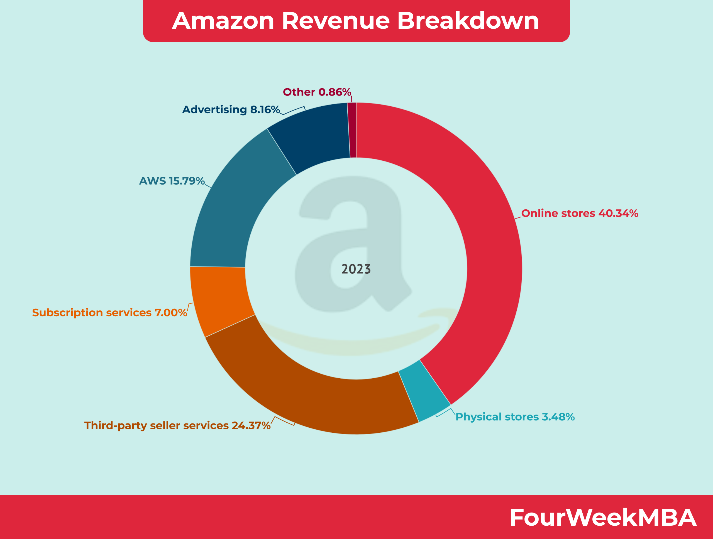

## Table of Contents

## What is Twitch and how does it relate to Amazon?

Twitch is a website where people can watch and share videos of themselves playing video games. It's like a big online TV channel just for gamers. People can watch others play, chat with friends, and even join in on games sometimes. It's very popular, with millions of people using it every day.

Twitch is owned by Amazon, a big company that sells things online. Amazon bought Twitch in 2014 because they saw how popular it was and wanted to be part of the gaming world. Now, Twitch works closely with Amazon, and sometimes you can see special deals or events that connect the two. This helps both Twitch and Amazon grow and reach more people.

## What are the basic revenue streams for Twitch?

Twitch makes money in a few main ways. One way is through ads. When people watch videos on Twitch, they might see ads, just like on TV or other websites. These ads help Twitch earn money. Another way Twitch makes money is by taking a cut from subscriptions. People can pay to subscribe to their favorite streamers, and Twitch gets a part of that money.

Another important way Twitch earns money is through bits. Bits are like virtual cheers that viewers can buy and use to support streamers. When someone uses bits, Twitch gets a share of that money. Lastly, Twitch also makes money from partnerships with game developers and other companies. These companies might pay Twitch to promote their games or products on the platform. All these ways help Twitch keep running and growing.

## How does Twitch generate revenue through subscriptions?

Twitch makes money from subscriptions when viewers pay to support their favorite streamers. People can choose to subscribe to a streamer's channel for a monthly fee. There are different levels of subscriptions, like $4.99, $9.99, or $24.99 a month. When someone subscribes, the streamer gets a part of that money, and Twitch keeps the rest. This helps Twitch earn money and also helps streamers make a living from their videos.

The subscriptions also give viewers special perks. For example, subscribers might get to see the streamer's videos without ads, get special emotes to use in chat, or even get to join in on exclusive events. These perks make people want to subscribe more, which means more money for both the streamers and Twitch. It's a win-win situation because viewers get cool stuff, streamers get support, and Twitch gets revenue.

## What role do advertisements play in Twitch's revenue model?

Advertisements are a big part of how Twitch makes money. When people watch videos on Twitch, they might see ads pop up, just like on TV or other websites. These ads can be short video clips or banners on the side of the screen. Every time an ad shows up and people watch it, Twitch gets paid by the companies that made the ads. This is a steady way for Twitch to earn money because lots of people watch videos on Twitch every day.

The money from ads helps Twitch keep the website running and growing. It's important because it doesn't depend on people paying for subscriptions or bits. Instead, it comes from advertisers who want to reach the millions of viewers on Twitch. This way, Twitch can make money even if some viewers don't want to spend money on the site. Ads help Twitch stay free for everyone to use, while still bringing in the cash needed to keep things going.

## How does Twitch monetize through Bits and Cheers?

Twitch makes money through Bits and Cheers by letting viewers buy Bits, which are like virtual coins. Viewers can use these Bits to cheer for their favorite streamers during live streams. When someone cheers with Bits, Twitch takes a cut of the money spent on those Bits. This means that every time a viewer cheers, Twitch earns a little bit of money. It's a fun way for viewers to show support and for Twitch to make money at the same time.

The money from Bits and Cheers helps Twitch a lot because it's another way for them to earn money without relying only on ads or subscriptions. Streamers also get a share of the Bits used to cheer for them, which helps them make money too. This system makes everyone happy: viewers can support their favorite streamers easily, streamers get more money, and Twitch gets a steady stream of income from the Bits people buy.

## What are Twitch Prime subscriptions and how do they contribute to revenue?

Twitch Prime subscriptions are a special kind of subscription that comes with Amazon Prime. If you have Amazon Prime, you get Twitch Prime for free. With Twitch Prime, you can subscribe to one Twitch channel every month without paying extra. This is called a Prime sub. When you use your Prime sub on a streamer's channel, the streamer gets money, just like with a regular subscription. But Twitch also makes money from this because Amazon pays Twitch for each Prime sub used.

These Prime subs help Twitch make money in a few ways. First, they encourage more people to use Twitch because Amazon Prime members get something extra for free. This can bring more viewers to the site. Second, even though viewers don't pay for the Prime sub, Twitch still gets money from Amazon. This adds up to a lot of money because there are many Amazon Prime members. So, Twitch Prime subscriptions are a big part of how Twitch earns money, helping both the streamers and the platform grow.

## How does Twitch's partnership program work and benefit the platform's revenue?

Twitch's partnership program is a way for Twitch to work with popular streamers. When streamers become partners, they get special perks like [earning](/wiki/earning-announcement) money from ads, subscriptions, and bits. In return, these partners help Twitch by bringing in lots of viewers and making the platform more exciting. Twitch takes a cut of the money that partners make from subscriptions and bits, which helps Twitch earn more money. This program also makes Twitch more attractive to viewers because they can watch their favorite streamers and even support them directly.

The partnership program benefits Twitch's revenue because it creates a cycle of growth. When more streamers become partners, more people come to Twitch to watch them. This means more viewers see ads, which brings in more ad money for Twitch. Also, viewers are more likely to subscribe or use bits to support their favorite partners, which gives Twitch another way to make money. By helping streamers succeed, Twitch grows its user base and keeps its revenue streams strong.

## What is the impact of affiliate marketing on Twitch's revenue?

Affiliate marketing on Twitch is when streamers promote products or services and earn money if their viewers buy them. This helps Twitch make more money because they get a small part of the sales that come from these promotions. Streamers often share special links or codes that their viewers can use to buy things. If someone uses these links or codes to make a purchase, the streamer gets a cut, and Twitch gets a little bit too. This way, Twitch makes money without having to do anything extra.

The impact of affiliate marketing on Twitch's revenue is pretty big. It's another way for Twitch to earn money on top of ads, subscriptions, and bits. When streamers promote products, it can bring in new viewers who are interested in those products. These new viewers might start watching more and even spending money on the site. So, affiliate marketing not only helps Twitch make money directly from sales but also helps grow the platform by attracting more people.

## How does Twitch leverage video-on-demand (VOD) and clips for additional revenue?

Twitch makes money from video-on-demand (VOD) and clips by letting streamers save their past broadcasts and share short video clips. When viewers watch these VODs and clips, they might see ads. Just like with live streams, Twitch earns money every time someone watches an ad in a VOD or [clip](/wiki/clip). This means that even after a live stream is over, it can still help Twitch make money.

Streamers can also use VODs and clips to promote their channels. If a clip goes viral, it can bring in new viewers who might want to watch more and even subscribe or use bits. This helps Twitch grow and make more money from subscriptions and bits. So, VODs and clips are not just for watching fun moments again; they're also a smart way for Twitch to keep earning money even when streams aren't live.

## What strategies does Twitch employ to increase viewer engagement and, consequently, revenue?

Twitch uses many fun ways to keep people watching and coming back, which helps them make more money. One way is by letting viewers chat with each other and the streamer during live streams. This makes watching feel more like hanging out with friends. Twitch also has special events and tournaments where people can watch their favorite games being played at a high level. These events get lots of viewers excited and talking about Twitch, which can bring in more people.

Another strategy Twitch uses is letting viewers support their favorite streamers easily. People can subscribe to a channel, use bits to cheer, or even buy special emotes and badges. All these things make viewers feel more connected to the streamers and the Twitch community. When viewers feel more involved, they are more likely to spend money on the site, which helps Twitch make more money. By making the platform fun and interactive, Twitch keeps viewers engaged and happy, which is good for their revenue.

## How does Twitch use data analytics to optimize its revenue generation?

Twitch uses data analytics to understand what people like to watch and how they use the site. They look at things like which games are popular, how long people watch, and what times of day they are most active. This helps Twitch decide where to show ads, which streamers to promote, and what new features to add. By knowing what viewers want, Twitch can make the site better and keep people coming back, which means more chances to make money from ads, subscriptions, and bits.

Twitch also uses data to help streamers grow their channels. They give streamers information about their viewers, like where they come from and what they like to watch. This helps streamers make better content and engage more with their audience. When streamers do well, they attract more viewers, which can lead to more subscriptions and bits being used. So, by using data to help both the platform and the streamers, Twitch can increase its revenue in many different ways.

## What future trends or technologies could influence Twitch's revenue model?

One big trend that could change how Twitch makes money is the rise of virtual reality (VR) and augmented reality (AR). If more people start using VR and AR to watch streams, Twitch could make new ways for viewers to spend money. For example, viewers might pay for special VR experiences or buy virtual items to use in AR streams. This could open up new ways for Twitch to earn money and make the platform more exciting.

Another thing that could affect Twitch's money is better ways to use data and AI. As technology gets smarter, Twitch could use it to learn even more about what people like to watch. This could help them show better ads or suggest streams that viewers will love. With smarter AI, Twitch could also make it easier for streamers to grow their channels, which would bring in more viewers and more money from subscriptions and bits.

## What are Twitch Bits and Cheering?

Twitch Bits are a virtual currency designed to facilitate viewer engagement and provide streamers with an additional revenue stream. Fans purchase Bits to cheer and support their favorite streamers during live broadcasts, with each Bit corresponding to a small financial reward for the streamer. The purchasing rate for Bits begins at approximately $1.40 for 100 Bits, which translates to a direct financial reward of one cent per Bit for the streamer. This transaction is expressed mathematically as:

$$
\text{Earnings per Bit} = \$0.01
$$

The process is designed to be interactive, enhancing the viewing experience by allowing fans to play a participatory role through cheering. As fans engage in cheering, they contribute not just financially but also to the overall dynamic atmosphere of a live stream. This mechanism incentivizes streamers to nurture their audience community by increasing the interactive components of their streams, thus fostering a stronger bond between viewers and streamers.

Furthermore, cheering with Bits allows viewers to visibly express their support, which can reinforce a sense of community and belonging within a streamer's audience. This model not only aids in direct monetization but also contributes to increased viewer retention by creating compelling and interactive viewer experiences. Viewers are encouraged to cheer more frequently as they witness their interactions impacting the stream's flow and see their contributions publicly acknowledged by the streamer, anchoring a reciprocal relationship between fans and content creators on the platform.

## References & Further Reading

[1]: ["Twitch Monetization: How Twitch Streamers Make Money"](https://www.twitch.tv/creatorcamp/en/paths/monetize-your-content/) - Twitch Community Guidelines

[2]: Safner, Ryan. ["How Amazon Makes Money On Twitch"](https://ryansafner.com/) - Forbes

[3]: ["Amazon's Acquisition of Twitch: Looking Back After 5 Years"](https://www.cnbc.com/2019/08/25/amazons-twitch-acquisition-5-years-later.html) by Ryan Browne - CNBC

[4]: ["Machine Learning for Algorithmic Trading: Predictive models to extract signals from market and alternative data for systematic trading strategies with Python"](https://github.com/stefan-jansen/machine-learning-for-trading) by Stefan Jansen

[5]: ["Prime Gaming - Twitch"](https://blog.twitch.tv/en/2020/08/10/introducing-prime-gaming-more-of-what-you-love/) - Amazon Prime Gaming Official Site