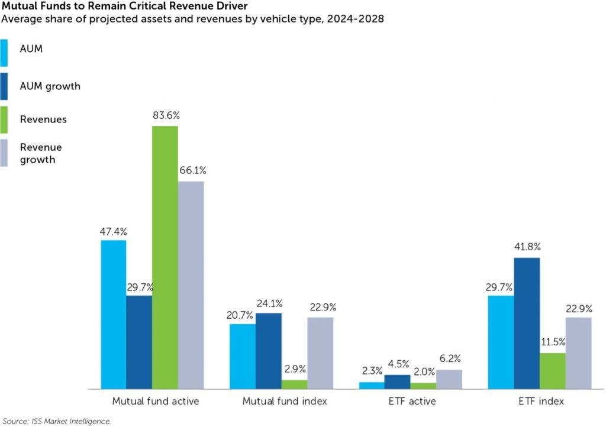

## Table of Contents

## What is a mutual fund?

A mutual fund is a type of investment where many people put their money together to buy different things like stocks, bonds, or other assets. It's managed by a professional who decides what to buy and sell. This makes it easier for people who don't have a lot of money or time to invest on their own.

When you invest in a mutual fund, you own a small part of everything the fund buys. This can help spread out the risk because your money is not all in one place. Mutual funds can be a good way to save for the future, like for retirement or buying a house, because they can grow over time.

## How do mutual fund companies generate revenue?

Mutual fund companies make money in a few main ways. One way is by charging fees to the people who invest in their funds. These fees can be called management fees or expense ratios, and they are a small percentage of the money you have in the fund. The fees help pay for the people who manage the fund and for other costs of running the fund. Another way mutual fund companies earn money is through something called a load. A load is a fee you might pay when you buy or sell shares of the fund. Not all funds have loads, but when they do, it's another way the company makes money.

Another way mutual fund companies generate revenue is through securities lending. This is when the fund lends out the stocks or bonds it owns to other investors or traders, usually for a short time. In return, the fund gets a fee or interest. This can add a bit more money to the fund, which can help cover costs or increase returns for investors. Overall, these different fees and charges help mutual fund companies keep running and make a profit while providing a service to investors.

## What are the main types of fees charged by mutual fund companies?

Mutual fund companies charge different types of fees. One common fee is the management fee, which is also called the expense ratio. This fee is a small percentage of the money you have in the fund. It pays for the people who manage the fund and other costs like keeping records and sending out reports. The expense ratio is taken out of the fund's assets every year, so it can affect how much your investment grows over time.

Another type of fee is called a load. A load is a fee you might have to pay when you buy or sell shares of the fund. There are different kinds of loads. A front-end load is charged when you buy shares, and a back-end load is charged when you sell shares. Not all funds have loads, but when they do, it's important to know about them because they can reduce the amount of money you make from your investment.

Some funds also charge other fees, like 12b-1 fees, which are used for marketing and distribution costs. These fees can be part of the expense ratio or charged separately. It's good to look at all the fees a fund charges because they can add up and affect your returns. Always read the fund's prospectus to understand all the fees you might have to pay.

## Can you explain the difference between front-end and back-end loads?

A front-end load is a fee you pay when you buy shares of a mutual fund. It's like an entrance fee. If you invest $1,000 in a fund with a 5% front-end load, you'll pay $50 right away, and only $950 will actually go into the fund. This fee is taken out before your money starts to grow, so it can make a big difference in how much you end up with over time.

A back-end load, on the other hand, is a fee you pay when you sell your shares. It's sometimes called a deferred sales charge. The fee might go down the longer you keep your money in the fund. For example, if you sell your shares within a year, you might pay a 5% back-end load, but if you wait five years, the fee could be smaller or even zero. This type of fee encourages you to keep your money in the fund longer.

## What is an expense ratio and how does it affect investors?

An expense ratio is a fee that mutual fund companies charge to manage your money. It's a small percentage of the money you have in the fund, and it's taken out every year. This fee pays for things like the salaries of the people who manage the fund, keeping records, and sending out reports to investors. The expense ratio is important because it can affect how much money you make from your investment.

The expense ratio matters because it reduces the amount of money that can grow over time. If a fund has a high expense ratio, it means more of your money is being used to pay fees instead of staying in the fund to grow. For example, if you invest $1,000 in a fund with a 1% expense ratio, you'll pay $10 in fees every year. Over many years, those fees can add up and make a big difference in your total returns. It's good to look for funds with lower expense ratios to keep more of your money working for you.

## How do mutual fund companies use 12b-1 fees?

Mutual fund companies use 12b-1 fees to pay for things like marketing and selling the fund. These fees help the company reach more people and get them to invest in the fund. The fees can be used for things like sending out brochures, paying for ads, or even paying the people who sell the fund. This helps the fund company grow bigger by attracting more investors.

The 12b-1 fee is part of the fund's expense ratio, which means it's taken out of the money in the fund every year. This can make the fund a bit more expensive for investors because it reduces the amount of money that stays in the fund to grow. It's good for investors to know about these fees because they can affect how much money they make from their investment over time.

## What role do management fees play in the revenue of mutual fund companies?

Management fees are a big part of how mutual fund companies make money. These fees are a small percentage of the money that people have in the fund. They are taken out every year to pay for the people who manage the fund and for other costs like keeping records and sending out reports. The more money people put into the fund, the more the company earns from these fees. So, it's important for mutual fund companies to attract and keep a lot of investors.

These fees are part of what's called the expense ratio. Even though the percentage might seem small, over time it can add up to a lot of money for the fund company. This steady stream of income helps the company keep running and making a profit. It's also good for investors to pay attention to these fees because they can affect how much their investment grows. Lower management fees can mean more money stays in the fund to grow over time.

## How do performance fees work and which types of funds typically use them?

Performance fees are special fees that some mutual fund companies charge when the fund does really well. Instead of just charging a regular fee every year, the company gets an extra fee if the fund's returns are better than a certain goal. This goal might be beating a certain stock market index or [earning](/wiki/earning-announcement) more than a set percentage. The idea is to reward the people who manage the fund for doing a great job. But, it also means that if the fund does not do well, the company won't get this extra fee.

These kinds of fees are often used by hedge funds and some other types of funds that take bigger risks to try to earn more money. They are not as common in regular mutual funds that many people invest in. The reason is that hedge funds and similar funds often promise to try to beat the market by a lot, so they think it's fair to charge more if they succeed. But, it's important for investors to know about these fees because they can make the cost of investing in the fund go up a lot if the fund does well.

## What are some strategies mutual fund companies use to maximize revenue?

Mutual fund companies use different ways to make more money. One way is by bringing in more investors. They do this by advertising their funds and making them look good. They might use 12b-1 fees to pay for these ads and other ways to reach people. The more money people put into the fund, the more the company earns from management fees. So, it's important for them to keep their funds looking good and growing.

Another way mutual fund companies make more money is by charging different kinds of fees. They have management fees, which are a small part of the money in the fund, taken out every year. They might also charge front-end or back-end loads when people buy or sell shares. Some funds even use performance fees, which are extra fees if the fund does really well. By using these fees, the company can earn more money, but it's important for them to balance this with keeping investors happy so they don't leave.

Sometimes, mutual fund companies also use securities lending to make more money. This means they lend out the stocks or bonds in the fund to other investors and get a fee in return. This can add a bit more money to the fund, which helps cover costs or increase returns for investors. By using these different ways to earn money, mutual fund companies can keep running and making a profit while providing a service to investors.

## How has the regulatory environment influenced revenue generation strategies for mutual fund companies?

The rules that govern mutual funds have a big impact on how these companies can make money. Over the years, regulators have made rules to protect people who invest in mutual funds. For example, they set limits on how much companies can charge in fees. This means mutual fund companies can't just raise their fees whenever they want. They have to follow the rules, which can make it harder for them to earn more money from fees. But, these rules also help keep things fair for investors, so they know what they're paying for.

Because of these rules, mutual fund companies have to be smart about how they make money. They might focus more on bringing in new investors to increase the total amount of money they manage, which means more money from management fees. They might also use other ways to earn money, like lending out the stocks or bonds in the fund. But, they always have to think about the rules and make sure they're following them. This can change how they run their business and plan their strategies to make more money while still taking care of their investors.

## What impact do economies of scale have on the revenue generation of mutual fund companies?

Economies of scale can help mutual fund companies make more money. When a fund gets bigger, it can spread out its costs over more money. This means the cost of running the fund, like paying the people who manage it and keeping records, doesn't go up as fast as the money in the fund grows. So, the more money people put into the fund, the less it costs per dollar to run it. This can make the fund more profitable for the company because they can keep more of the money they earn from fees.

But, it's not just about making more money. When a fund gets bigger, it can also attract more investors. People might feel safer putting their money in a big fund because it seems more stable. This can help the fund grow even more, which means more money from management fees for the company. So, economies of scale can help mutual fund companies earn more money and grow their business by making their funds more attractive to investors.

## How do mutual fund companies balance revenue generation with the need to attract and retain investors?

Mutual fund companies need to make money to keep running, but they also need to keep investors happy so they don't leave. One way they do this is by keeping their fees fair. If the fees are too high, people might not want to invest in their funds. So, they try to find a good balance where they can earn enough money from fees but still keep the costs low enough to attract and keep investors. They might also use different types of fees, like management fees and loads, but they have to be careful not to charge too much.

Another way mutual fund companies balance revenue and investor satisfaction is by focusing on growing their funds. When more people invest in their funds, the companies can earn more money from management fees without raising the fees. This is good for investors because it keeps the costs down. Plus, bigger funds can often run more efficiently, which means the company can make more money while still offering good value to investors. By keeping fees reasonable and growing their funds, mutual fund companies can make money and keep investors happy at the same time.

## References & Further Reading

[1]: ["Advances in Financial Machine Learning"](https://www.amazon.com/Advances-Financial-Machine-Learning-Marcos/dp/1119482089) by Marcos Lopez de Prado

[2]: ["Algorithmic Trading: Winning Strategies and Their Rationale"](https://www.wiley.com/en-us/Algorithmic+Trading%3A+Winning+Strategies+and+Their+Rationale-p-9781118460146) by Ernest P. Chan

[3]: ["Quantitative Trading: How to Build Your Own Algorithmic Trading Business"](https://www.amazon.com/Quantitative-Trading-Build-Algorithmic-Business/dp/1119800064) by Ernest P. Chan

[4]: Aldridge, I. (2013). ["High-Frequency Trading: A Practical Guide to Algorithmic Strategies and Trading Systems."](https://www.amazon.com/High-Frequency-Trading-Practical-Algorithmic-Strategies/dp/1118343506)

[5]: ["Machine Learning for Algorithmic Trading"](https://github.com/stefan-jansen/machine-learning-for-trading) by Stefan Jansen