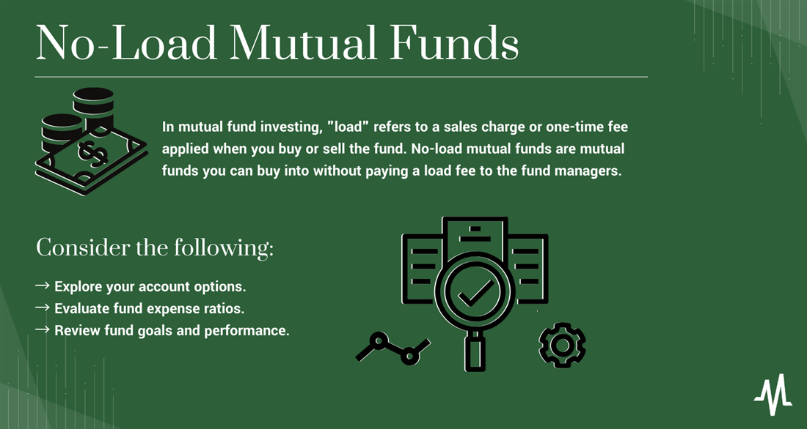

## Table of Contents

## What are no-load mutual funds?

No-load mutual funds are a type of investment where you don't have to pay any sales charges or commissions when you buy or sell the fund. This is different from load funds, which charge a fee for buying or selling. Because there are no sales charges, more of your money goes directly into the investment, which can help your investment grow faster over time.

These funds are popular with investors who want to keep their costs low. By avoiding the fees that come with load funds, investors can save money and potentially earn higher returns. No-load mutual funds are often available directly from the investment company, which means you can buy them without going through a broker or financial advisor.

## How do no-load mutual funds differ from load mutual funds?

No-load mutual funds and load mutual funds are different mainly because of the fees they charge. No-load mutual funds don't have any sales charges or commissions when you buy or sell them. This means all your money goes into the investment right away. On the other hand, load mutual funds charge a fee when you buy or sell them. This fee can be a percentage of your investment and it goes to the people who sell the fund, like brokers or financial advisors.

Because no-load mutual funds don't have these extra fees, they can be a good choice if you want to keep your costs low. More of your money stays in the fund and can work to grow over time. Load mutual funds, however, might offer you advice or services from a financial professional, but you pay for that with the load fee. So, it's important to think about whether you need that help and if it's worth the extra cost.

In the end, choosing between no-load and load mutual funds depends on what you need and what you're comfortable with. If you're okay with managing your investments on your own and want to avoid extra costs, no-load funds might be the way to go. But if you want some help and are willing to pay for it, load funds could be a better fit.

## What are the common methods of revenue generation for no-load mutual funds?

No-load mutual funds make money in a few different ways. One way is through management fees. These are fees that the fund charges to cover the costs of running the fund, like paying the people who manage the investments and other expenses. Even though no-load funds don't have sales charges, they still have these management fees, which are taken out of the fund's assets every year.

Another way no-load mutual funds make money is through expense ratios. This is the total percentage of the fund's assets that are used to cover operating expenses each year. The expense ratio includes the management fee and other costs like administrative fees and marketing expenses. Investors should look at the expense ratio to understand how much of their investment is being used to run the fund.

Sometimes, no-load mutual funds can also make money from securities lending. This is when the fund lends out some of its securities to other investors or institutions for a fee. This can add a little extra income to the fund, which helps to cover costs or increase returns for investors. Overall, these methods help no-load mutual funds to operate and provide returns to investors without charging sales fees.

## Can you explain the role of expense ratios in no-load mutual funds?

Expense ratios are important for no-load mutual funds because they show how much it costs to run the fund each year. This cost is taken out of the fund's total assets and is shown as a percentage. For example, if a fund has an expense ratio of 1%, that means 1% of the fund's assets are used every year to pay for things like managing the investments, keeping records, and marketing the fund. No-load funds don't charge sales fees, so the expense ratio is a big part of what investors pay to own the fund.

A lower expense ratio can be good for investors because it means more of their money stays in the fund and can grow over time. If two funds are similar but one has a lower expense ratio, the one with the lower cost might give you better returns in the long run. That's why it's a good idea to look at the expense ratio when you're choosing a no-load mutual fund. It helps you understand how much of your investment is being used to run the fund and how much is working to make you money.

## How do no-load mutual funds use management fees to generate revenue?

No-load mutual funds use management fees to help pay for the cost of running the fund. These fees are a part of the fund's expense ratio and are taken out of the fund's assets every year. The money from management fees helps pay the people who manage the investments, as well as other costs like keeping records and marketing the fund. Since no-load funds don't charge sales fees, management fees are an important way for them to cover their costs.

Even though no-load funds don't have sales charges, investors still need to think about the management fees. These fees can affect how much money stays in the fund to grow over time. A fund with lower management fees might let more of your money work for you, which can lead to better returns in the long run. So, when picking a no-load mutual fund, it's a good idea to look at the management fees to see how they might impact your investment.

## What are the other fees and charges that no-load mutual funds might impose?

No-load mutual funds might have other fees and charges besides management fees. One common fee is the expense ratio, which includes the management fee but also other costs like administrative fees and marketing expenses. This fee is taken out of the fund's assets every year and is shown as a percentage. For example, if a fund has an expense ratio of 1%, it means 1% of the fund's total money is used each year to cover these costs.

Another possible fee is the redemption fee, which some no-load funds charge if you sell your shares too soon after buying them. This fee is meant to stop people from buying and selling shares quickly, which can hurt the fund's performance. The fee is usually a small percentage of the value of the shares you're selling, and it's taken out of the money you get back from the sale. 

Sometimes, no-load funds can also charge fees for special services, like buying shares over the phone instead of online. These fees can vary, so it's good to check the fund's prospectus to see all the possible charges. Knowing about these fees can help you choose a no-load fund that fits your needs and keeps your costs low.

## How does the performance of no-load mutual funds impact their revenue generation?

The performance of no-load mutual funds can affect how much money they make. When a fund does well, more people might want to invest in it. This means the fund gets more money to manage, which can lead to higher management fees. Management fees are a big part of how no-load funds make money, so good performance can help increase this revenue. Also, when the fund's value goes up, the percentage taken for the expense ratio becomes a larger amount of money, which can help cover the costs of running the fund.

On the other hand, if a no-load mutual fund doesn't do well, it might have less money coming in. Fewer people might want to invest in a fund that's not performing well, which means less money for the fund to manage and lower management fees. If the fund's value goes down, the amount of money taken out for the expense ratio also goes down, making it harder to cover costs. So, the performance of no-load mutual funds is important for how much revenue they can generate.

## What strategies do fund managers of no-load mutual funds use to maximize revenue?

Fund managers of no-load mutual funds often try to pick good investments to make the fund perform well. When the fund does well, more people might want to invest in it. This means the fund gets more money to manage, and the managers can earn more from management fees. Management fees are a big part of how no-load funds make money, so choosing investments that do well can help the fund grow and bring in more investors.

Another strategy is to keep the costs of running the fund low. If the fund's expense ratio is low, it means more of the investors' money stays in the fund to grow. This can make the fund more attractive to people looking to invest, which can bring in more money and increase the revenue from management fees. Keeping costs down also helps the fund perform better, which can lead to more investors and more money to manage.

## How does asset growth in no-load mutual funds contribute to revenue?

When no-load mutual funds grow their assets, it means they have more money to manage. This is good for the fund because they can earn more from management fees. Management fees are a big part of how no-load funds make money. So, when more people invest in the fund and it grows, the fund managers can make more money from these fees.

Keeping the fund's costs low also helps with asset growth. If the expense ratio is low, more of the investors' money stays in the fund to grow. This can make the fund more attractive to people looking to invest, bringing in even more money. When the fund has more assets, it can earn more from management fees, which helps increase the fund's revenue.

## What are the regulatory considerations affecting revenue generation in no-load mutual funds?

No-load mutual funds have to follow rules set by groups like the Securities and Exchange Commission (SEC). These rules are there to make sure funds are fair and honest with investors. One big rule is that funds have to tell investors about all the fees they charge. This includes the expense ratio, which is how much it costs to run the fund each year. Funds also have to be clear about any other fees, like redemption fees if you sell your shares too soon. By being open about these costs, funds can keep trust with their investors, but it also means they can't hide fees to make more money.

Another rule that affects how no-load mutual funds make money is about how they can advertise. Funds have to be careful not to promise returns that are too good to be true. They can't say things that might trick people into thinking the fund will do better than it really will. This means funds can't use tricks to get more investors and more money to manage. They have to be honest about what they can do, which can limit how they grow their revenue. But it's good for investors because it helps them make smart choices about where to put their money.

## How do no-load mutual funds balance investor interests with revenue generation?

No-load mutual funds try to balance what's good for investors with making money for the fund. They do this by keeping their costs low. When a fund has a low expense ratio, it means more of the investors' money stays in the fund to grow. This can make the fund do better over time, which is good for investors. At the same time, a fund with more money in it can earn more from management fees, which is how the fund makes money. So, by keeping costs down, no-load funds can help investors and also make more money themselves.

Fund managers also pick good investments to make the fund do well. When the fund does well, more people might want to invest in it. This means the fund gets more money to manage, which can lead to higher management fees. But the managers have to be careful not to take too much risk just to make more money. They need to think about what's best for investors too. By picking good investments and keeping costs low, no-load mutual funds can grow their assets and make money while still looking out for their investors.

## What are the future trends and innovations in revenue generation for no-load mutual funds?

In the future, no-load mutual funds might use new technology to bring in more money. One way is by using robo-advisors, which are computer programs that help people invest. These robo-advisors can make it easier for people to invest in no-load funds without paying extra fees. This can bring in more investors and more money for the funds to manage, which means more revenue from management fees. Another trend could be using big data and artificial intelligence to pick better investments. If the fund does well, more people might want to invest, which can help the fund grow and make more money.

Another future trend could be offering new types of funds that are more focused on what investors want. For example, more no-load funds might focus on things like environmental, social, and governance (ESG) issues. If people care about these things and want to invest in funds that match their values, it could bring in more money for the funds. Also, no-load funds might start to offer more personalized investment options. By using technology to understand what each investor needs, funds can make better choices for them. This can make investors happier and more likely to keep their money in the fund, which helps the fund make more money over time.

## References & Further Reading

1. **Books:**
   - Malkiel, B. G. (1999). *A Random Walk Down Wall Street: The Time-Tested Strategy for Successful Investing.* This book provides foundational concepts of investing, including mutual fund strategies and the significance of fee structures.
   - Bogle, J. C. (2003). *Common Sense on Mutual Funds.* Bogle's work discusses the mutual fund industry with an emphasis on cost-related challenges and the benefits of index funds.

2. **Academic Journals:**
   - Sharpe, W. F. (1966). "Mutual Fund Performance." *Journal of Business*, 39(1), 119-138. This seminal paper explores mutual fund performance metrics and management efficacy.
   - Chordia, T., Roll, R., & Subrahmanyam, A. (2002). "Order Imbalance, Liquidity, and Market Returns." *Journal of Financial Economics*, 65(1), 111-130. This paper examines liquidity dynamics influenced by trading algorithms, relevant for understanding algorithmic trading's role in mutual funds.

3. **Online Resources:**
   - Morningstar (www.morningstar.com). An essential platform providing data, research, and analysis on mutual funds, including load and no-load options.
   - Investopedia (www.investopedia.com). Offers detailed articles and tutorials on various investment strategies, including an in-depth look at mutual funds and algorithmic trading.

4. **Algorithmic Trading Insights:**
   - Aldridge, I. (2010). *High-Frequency Trading: A Practical Guide to Algorithmic Strategies and Trading Systems.* This book includes detailed insights into algorithmic trading strategies and their integration into modern financial markets.
   - Kissell, R. (2013). *The Science of Algorithmic Trading and Portfolio Management.* This resource covers the technical aspects and applications of algorithmic trading within portfolio management.

5. **Industry Reports:**
   - Investment Company Institute (www.ici.org). This organization offers reports and statistics on mutual fund trends and issues, valuable for understanding industry-level changes.
   - The Financial Times (www.ft.com). Regularly publishes articles on the latest trends in mutual fund management and algorithmic trading practices.

These references offer a comprehensive foundation for further study in mutual funds, no-load funds, and algorithmic trading, empowering investors and researchers to broaden their knowledge and adapt to evolving financial landscapes.

