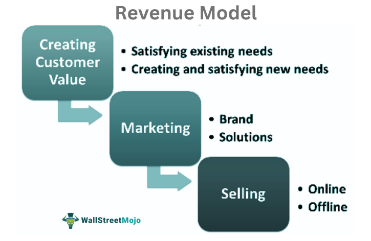

In this digital era, businesses are transforming their models to align with rapid technological advancements. Sonos Inc., a pioneer in smart audio technology, serves as an exemplary case of such transformation. Established in 2002, Sonos has consistently demonstrated its ability to innovate and adapt, enhancing the way we experience sound. The company's fundamental aim is to create superior sound systems that transform the ordinary into an interactive audio environment. This article offers an in-depth analysis of Sonos' business model, profitability, revenue strategies, and the potential role of algorithmic trading in their financial operations.

The success of Sonos is largely attributed to its ability to seamlessly integrate technological advances with consumer needs. Its strategic focus on quality, user experience, and connectivity sets it apart in the audio industry. As we evaluate the company's market position, it's essential to consider how Sonos has leveraged innovation and strategic partnerships to build a strong brand. By partnering with tech giants and popular streaming services, Sonos reinforces its presence and accessibility in the smart home landscape. This allows the company to not only sell cutting-edge audio products but also to expand its ecosystem and engagement through complementary services like Sonos Radio.



Join us as we examine the elements that contribute to Sonos' market success, which includes an astute understanding of consumer preferences, strategic market positioning, and efficient resource management. Moreover, we will assess potential future growth avenues, including the impact of algorithmic trading. As Sonos continues to evolve within an ever-changing technological landscape, its approach to tackling future challenges and seizing opportunities could serve as a vital model for similar firms aiming for sustainability and growth.

## Table of Contents

## Sonos Business Model

Sonos Inc. operates on a sophisticated business model centered around high-quality audio products. A key aspect of their model is the seamless integration of their products with various music streaming platforms, thereby creating a robust and interconnected ecosystem. This integration not only enhances user experience but also strengthens customer loyalty by providing easy access to diverse music sources.

Sonos positions itself as a premium brand, enabling the company to maintain a higher pricing strategy. This premium positioning is further bolstered by strategic partnerships with notable tech companies such as Google and Amazon. These alliances allow Sonos products to incorporate advanced voice-assistant technologies, like Google Assistant and Amazon Alexa, enhancing product functionality and market appeal.

In addition to hardware sales, Sonos diversifies its offerings through services like Sonos Radio. This service builds on their hardware to create a recurring revenue stream, tapping into the growing demand for streaming services. By offering curated radio stations and exclusive programming, Sonos Radio not only adds value to their product line but also deepens consumer engagement, leading to potential long-term subscriber retention.

Through this multi-faceted business model, Sonos effectively captures various revenue streams—from direct product sales to strategic service offerings—thereby reinforcing its market position as a leader in the smart audio technology industry.

## Analyzing Sonos' Profitability

Sonos Inc. has demonstrated a remarkable turnaround in its profitability trajectory, especially highlighted during the fiscal year of 2021. Initially grappling with net losses, the company has capitalized on shifting consumer trends and optimized operational practices to foster financial growth.

A significant catalyst for Sonos' profitability surge was the global pandemic, which precipitated an increase in consumer demand for home entertainment systems. As individuals spent more time at home, there was a notable drive for high-quality audio products, which perfectly aligned with Sonos' market offerings. This unexpected demand allowed Sonos to amplify its revenue streams significantly during this period.

Furthermore, Sonos has effectively curtailed operational costs while preserving the high-quality standards that its customer base expects. This operational efficiency is reflected in the company's capacity to maintain consumer demand without compromising on product excellence. Strategies such as streamlined manufacturing processes and a refined supply chain have contributed to reduced costs, thereby improving profit margins.

As sales have continued their upward trajectory, Sonos has adeptly enhanced its margins despite facing intense competitive pressures from other audio technology companies. By leveraging its brand's strong market position and emphasizing innovative product offerings, Sonos has managed not only to retain its existing customer base but also to attract a new audience, further solidifying its financial foundation.

In summary, Sonos has adeptly navigated through periods of financial difficulty by capitalizing on increased market demand and implementing cost-efficient strategies, demonstrating resilience and adaptability in bolstering its profitability in a competitive landscape.

## Sonos Revenue and Growth Strategies

Sonos Inc. generates the majority of its revenue through the sale of high-quality audio products, including smart speakers, home theater systems, and portable audio devices. The company's focus on premium products allows it to maintain higher price points, contributing to robust revenue streams. In addition to hardware sales, Sonos has ventured into subscription services, notably with the introduction of Sonos Radio, which provides exclusive curated content and offers potential recurring revenue.

Strategic partnerships play a crucial role in enhancing Sonos' revenue and growth. Alliances with leading streaming services such as Spotify, Apple Music, and Amazon Music not only facilitate seamless user experiences but also serve to elevate brand visibility and create synergies in audience reach. Through these partnerships, Sonos capitalizes on cross-promotional opportunities that can drive system adoption and boost sales.

Global market expansion remains a strategic imperative for Sonos. The company is continually working to penetrate new international markets, leveraging its reputation for quality and innovation. By tailoring its marketing strategies to encompass localized content and cultural preferences, Sonos broadens its customer base and increases its market share across diverse regions.

Innovation is at the core of Sonos' growth strategy. The company invests significantly in research and development to offer cutting-edge audio technologies and features. This commitment to innovation ensures the regular launch of upgraded and new products, keeping Sonos competitive in an industry characterized by rapid technological advancements and evolving consumer demands.

Through these strategies, Sonos continues to build its revenue base while positioning itself for sustainable growth in the global audio technology market.

## Potential Role of Algorithmic Trading

Algorithmic trading can provide Sonos Inc. with numerous advantages in optimizing its financial operations by leveraging advanced computational techniques and predictive analytics. As the audio technology landscape becomes increasingly competitive, Sonos could use [algorithmic trading](/wiki/algorithmic-trading) to manage financial risks more effectively and enhance its market position.

Predictive analytics, a core component of algorithmic trading, utilizes vast datasets to forecast market trends and financial outcomes. Sonos could benefit from employing [machine learning](/wiki/machine-learning) models to analyze historical financial data, identify patterns, and predict future market behaviors. For instance, by using time series analysis and regression models, Sonos could forecast stock price movements or revenue fluctuations, enabling the company to make more informed financial decisions.

Furthermore, algorithmic trading could improve Sonos' asset allocation. By automating trading strategies, Sonos can optimize the distribution of resources across different investment opportunities, ensuring a balance between risk and return. This optimization can be achieved through techniques such as portfolio optimization, which aims to maximize expected returns for a given level of risk or minimize risk for a given return. The Markowitz Efficient Frontier is one such method, presenting a set of optimal portfolios that offer the highest expected return for a defined level of risk.

```python
import numpy as np
import matplotlib.pyplot as plt
from scipy.optimize import minimize

# Example of portfolio optimization
# Assuming historical returns and covariance of assets
returns = np.array([0.12, 0.18, 0.15])
cov_matrix = np.array([[0.005, -0.010, 0.004], 
                       [-0.010, 0.040, -0.002], 
                       [0.004, -0.002, 0.023]])

# Define objective function to minimize
def portfolio_variance(weights, cov_matrix):
    return weights.T @ cov_matrix @ weights

# Constraints and bounds
constraints = [{'type': 'eq', 'fun': lambda weights: np.sum(weights) - 1}]
bounds = [(0, 1) for _ in range(len(returns))]

# Finding the optimal weights
result = minimize(portfolio_variance, [1/3, 1/3, 1/3], args=(cov_matrix), 
                  method='SLSQP', constraints=constraints, bounds=bounds)

optimal_weights = result.x
print("Optimal Weights:", optimal_weights)
```

Algorithmic trading also opens avenues for Sonos to invest further in research and development (R&D) by reallocating gains from better-managed financial risks. Stable and efficient cash flow management achieved through AI-driven trading strategies could ensure that funds are available for innovation and strategic initiatives.

Implementing algorithmic trading aligns with Sonos' forward-thinking approach and can create a synergy between financial management and its core business operations. By incorporating these advanced trading strategies, Sonos stands to enhance its stability in cash flow management, ultimately leading to steady growth and innovation in a rapidly evolving industry.

## Conclusion

Sonos Inc. exemplifies a forward-thinking business model that adeptly navigates market and technological shifts. The company's dedication to product excellence and its strategic partnerships have significantly enhanced its profitability and solidified its market presence. By creating innovative audio products and forming alliances with major tech companies, Sonos has positioned itself as a leader in the smart audio technology sector.

The potential integration of algorithmic trading could present new financial opportunities for Sonos, potentially amplifying its revenue prospects. Algorithmic trading, with its ability to analyze large datasets and execute trades at optimal speeds, could offer Sonos a means to manage financial risks more effectively and enhance asset allocation strategies. This could enable Sonos to channel more resources toward research and development, further strengthening its innovation pipeline.

As the audio technology landscape continues to evolve, Sonos remains poised to capitalize on emerging trends through its robust product lineup and enduring brand reputation. By leveraging its strengths and embracing new technological advancements, such as algorithmic trading, Sonos is well-positioned for sustained growth and innovation in the competitive market of smart audio solutions.

## References & Further Reading

[1]: ["The Sonos Story: Sound Experience and Smart Technology Integration"](https://www.msn.com/en-us/news/technology/sonos-arc-ultra-sound-redefined/ar-AA1vxSgS), Forbes.

[2]: ["Sonos Reports Third Quarter Fiscal 2021 Results"](https://investors.sonos.com/news-and-events/investor-news/latest-news/2021/Sonos-Reports-Record-Third-Quarter-Fiscal-2021-Results-and-Raises-Fiscal-Year-2021-Outlook/default.aspx), Sonos Investor Relations.

[3]: ["Smart Audio Reports: The Ecosystem Model"](https://www.nationalpublicmedia.com/insights/reports/smart-audio-report/), Strategy Analytics.

[4]: ["Advances in Financial Machine Learning"](https://www.amazon.com/Advances-Financial-Machine-Learning-Marcos/dp/1119482089) by Marcos Lopez de Prado

[5]: ["Quantitative Trading: How to Build Your Own Algorithmic Trading Business"](https://github.com/LucindaYa/quant-resources/blob/master/Quantitative%20Trading%20How%20to%20Build%20Your%20Own%20Algorithmic%20Trading%20Business.pdf) by Ernest P. Chan

[6]: ["Machine Learning for Asset Managers"](https://github.com/emoen/Machine-Learning-for-Asset-Managers) by Marcos Lopez de Prado

[7]: ["Sound and Signal Technology: Industry Overview"](https://www.mordorintelligence.com/market-analysis/audio-systems) by TechFilePath.