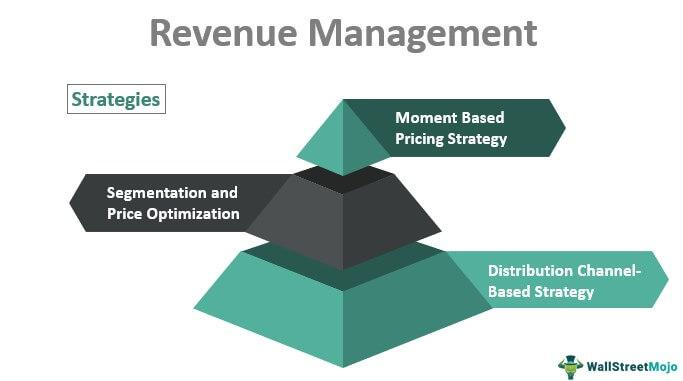

Zola's business model presents a compelling case study in modern revenue generation within the digital marketplace. This model's integration with algorithmic trading highlights innovative approaches to leveraging technology for maximizing profits. Fundamentally, Zola revolutionized the wedding industry by providing a comprehensive online platform that merges gift registries, wedding planning, and vendor partnerships. This allows the company to tap into multiple revenue streams, directly contrasting with traditional retail models that often rely on singular, linear sales channels.

Algorithmic trading, similarly, utilizes technology and data to optimize revenue streams. It involves creating algorithms to execute trading instructions automatically, leading to efficiency and potential profit maximization. This process is comparable to how Zola employs digital automation to offer personalized and scalable wedding solutions. Both business models emphasize scalability and data-driven strategies, providing insights into contemporary approaches for revenue enhancement.

By examining Zola's financial strategies, insights can be gained into how similar mechanisms might be applied to algorithmic trading initiatives. For instance, the use of strategic partnerships and the efficient management of operations through digital platforms are strategies that, if adapted, could potentially enhance the performance and revenue generation in algorithmic trading contexts. Understanding and contrasting these models provides a lens through which modern digital revenue strategies can be explored and optimized for businesses seeking to innovate and expand in competitive markets.

## Table of Contents

## Zola’s Business Model Overview

Zola has significantly transformed the wedding industry by offering a comprehensive online platform that seamlessly integrates various wedding-related services. This includes a combination of gift registries, wedding planning tools, and vendor partnerships. The innovation within Zola's platform is primarily driven by its ability to consolidate multiple aspects of wedding planning into a single digital experience, thus enhancing user convenience and engagement. This approach contrasts sharply with traditional retailers, which often require customers to navigate disparate systems and services.

One of the standout features of Zola's business model is its flexibility, exemplified by customizable wedding websites. These websites allow couples to create personalized portals for their wedding, encompassing details such as schedules, venue information, and gift registries. This customization fosters a unique user experience, aligning the service closely with the preferences and tastes of users, and promoting increased satisfaction and loyalty.

Furthermore, Zola's guest list management tools provide users with an organized method to plan and track invitations, RSVPs, and meal preferences. This digital facilitation reduces the logistical burden on couples, further distinguishing Zola from traditional, more fragmented planning methods.

A critical aspect of Zola's modern business strategy is its strategic partnerships with over 600 brands. These alliances facilitate a broad range of product offerings available on the platform, empowering users with a diverse selection of gifts and services. By not limiting offerings to a single brand or item category, Zola enhances its appeal to a wider audience, effectively catering to diverse customer needs and preferences.

Additionally, Zola has pursued expansion into new markets to increase its reach and impact. These endeavors are indicative of Zola's commitment to evolving its business model, ensuring it remains competitive and relevant in a rapidly changing digital landscape. The company's adaptability and forward-thinking strategies not only solidify its position in the wedding industry but also serve as a testament to how modern businesses can thrive by embracing comprehensive, user-aligned platforms.

## Revenue Streams at Zola

Zola generates revenue primarily by taking a percentage of sales conducted through its platform, emphasizing both tangible goods and experiential gifts. This approach allows Zola to cater to the varied preferences of its users, making it a versatile option for wedding planning.

The company extends its revenue streams with a cash registry option, which broadens its service offerings and enhances monetization capabilities. This feature allows users to gift money directly to couples, an increasingly popular choice among modern consumers. Zola applies transaction fees to these monetary gifts, thereby creating an additional revenue avenue without the requirement for physical product handling. This model aligns with contemporary consumer trends, emphasizing convenience and personalization.

To optimize operational efficiency and minimize costs, Zola employs a dropship model. By using this model, Zola reduces the need for maintaining large inventories and eliminates substantial overhead linked with storage facilities and inventory management. Dropshipping involves transferring customer orders and shipment details to the manufacturer or a wholesaler, who then ships the goods directly to the customer. This streamlined method allows Zola to focus its resources on enhancing user experience and expanding its digital infrastructure.

This blend of taking a percentage of sales, enhancing cash registry functionalities, and implementing a dropship model underscores Zola's adaptive strategy in a competitive marketplace. Such a framework not only mitigates the risks associated with inventory but also aligns with contemporary digital commerce trends.

## Comparison with Algorithmic Trading Revenue Models

Algorithmic trading and Zola's business model share foundational principles in utilizing data and technology to optimize revenue generation. Both exploit advanced algorithms and infrastructure to achieve scalability and flexible operations.

Algorithmic trading employs quantitative methods and software algorithms to execute trades at speeds far beyond human capabilities. This involves analyzing vast datasets to predict market movements and optimize trade execution. Similarly, Zola leverages data analytics to refine its business processes, offering a personalized user experience that maximizes sales and customer satisfaction.

Both sectors rely on a digital-first approach to minimize costs and maximize efficiency. For [algorithmic trading](/wiki/algorithmic-trading), this often means leveraging cloud-based infrastructure to ensure low-latency access to markets, utilizing high-performance computing resources, and employing APIs for seamless data integration and execution. Zola, on the other hand, reduces overhead through a dropship model, which eliminates the need for maintaining physical inventory and leverages partnerships with over 600 brands.

The scalability observed in both algorithmic trading and Zola’s business model stems from their ability to handle increased demand without a proportional increase in costs. In algorithmic trading, this is evident when trading volumes rise, yet marginal costs remain constant due to the automated nature of trade execution. Zola achieves scalability through its platform, which can support a large number of users planning weddings without additional cost per user.

Analyzing Zola’s revenue generation provides insights that may be applied to algorithmic trading systems. For example, Zola’s success with offering customizable services and experiences can inspire algorithmic trading platforms to develop personalized strategies for clients, enhancing engagement and retention. Additionally, Zola’s data-driven approach to engaging customers suggests that algorithmic trading systems could benefit from employing similar [machine learning](/wiki/machine-learning) techniques to predict and respond to market conditions more effectively.

Overall, by examining the infrastructure and strategies leveraged by Zola, algorithmic trading businesses can gain valuable insights into optimizing their operations and revenue models, maintaining competitiveness in a technology-driven marketplace.

## Integrating Zola's Business Model into Algorithmic Trading

Integrating Zola's business model into algorithmic trading offers several intriguing possibilities, particularly in terms of reducing operational costs and enhancing customer engagement through data-driven tactics. Zola's approach to direct manufacturer engagement significantly reduces the need for physical inventory by leveraging a dropship model. This strategy not only lowers overhead costs but also increases flexibility and scalability, attributes highly valued in algorithmic trading environments.

In algorithmic trading, minimizing operational costs is paramount. Analogous to Zola's model, trading firms can benefit from building direct relationships with data providers or exchanges to obtain real-time data at lower costs, thus bypassing additional fees from intermediary brokers. Such direct engagement can be represented mathematically as reducing a cost function $C(x)$, where $x$ represents intermediary costs, allowing firms to minimize $C(x)$ by optimizing their direct connections.

Zola's personalized experiences for users parallel sophisticated customer-targeting algorithms used in trading strategies. By utilizing customer data to tailor experiences, Zola enhances user engagement and satisfaction. Algorithmic trading platforms can adopt similar personalized approaches by employing machine learning techniques to predict investor behavior and tailor trading strategies accordingly. For instance, clustering algorithms could categorize different types of traders, allowing trading systems to offer specialized products or strategies for each cluster.

The data-driven customer engagement tactics utilized by Zola are applicable in creating more refined trading algorithms. Sentiment analysis and customer feedback loops provide Zola with insights into consumer preferences, which could be mirrored by algorithmic traders who analyze market sentiment to adjust trading parameters. Moreover, implementing real-time analytics and feedback mechanisms in trading platforms can improve decision-making and adaptability, akin to Zola's adjustments from customer feedback.

In conclusion, integrating elements of Zola's business model into algorithmic trading could offer substantial benefits, such as reduced costs and enhanced strategic engagement with customers. Both industries can learn from each other's innovative applications of technology and data to improve their respective operational efficiencies and customer experiences.

## Challenges and Future Projections

Zola's business model has carved a niche in the wedding industry by leveraging strategic partnerships and a robust online presence. However, it is not immune to the competitive pressures exerted by industry giants like Amazon. These challenges parallel those faced in algorithmic trading, where firms contend with significant market players who possess vast resources and technological capabilities.

In terms of revenue and expansion strategies, Zola must navigate the delicate balance of innovation and market adaptation. The company could potentially increase its revenue by expanding internationally, tapping into global wedding markets. Additionally, developing more comprehensive lifestyle offerings beyond weddings might provide diversified revenue streams. This strategy mirrors algorithmic trading platforms that explore diversified asset classes to hedge against market [volatility](/wiki/volatility-trading-strategies).

Strategic partnerships play a pivotal role in reinforcing Zola’s market position. By forming alliances with popular brands and media entities, Zola can enhance its product offerings and reach a broader audience. These collaborations not only boost visibility but also generate increased customer engagement, similar to algorithmic trading platforms' reliance on data-sharing partnerships to refine trading algorithms and improve market predictions.

Moreover, media engagement is crucial for maintaining customer engagement and brand loyalty. By leveraging social media channels and digital marketing campaigns, Zola can sustain interest in its platform, driving consistent traffic and transactions. Algorithmic trading systems also benefit from media engagement strategies, as companies utilize news and social media sentiment analysis to adjust trading strategies and optimize returns.

Future projections for Zola’s growth must account for evolving consumer preferences and technological advancements. Mobile-first approaches, AI-driven personalization, and enhanced data analytics capabilities could transform user experiences and drive revenue growth. These same elements influence algorithmic trading, where technology and consumer trends dictate the efficacy of trading models and operational strategies.

In summary, Zola's forward-looking strategies and adaptability to competitive pressures can provide valuable insights into algorithmic trading's need for constant innovation and strategic positioning. These considerations highlight the interconnected nature of modern digital business models and the mutual learning opportunities they present across different sectors.

## Conclusion

Zola's business model showcases a pioneering effort in merging digital convenience with personalized services, encapsulating a dynamic approach to modern commerce that can be translated into algorithmic trading. By integrating direct manufacturer engagement and facilitating a seamless user experience, Zola has effectively leveraged technology to not only grow its market presence but also maximize operational efficiency. This model exemplifies how businesses can maximize revenue streams by focusing on customer engagement and strategic partnerships, providing a template for algorithmic trading platforms seeking similar customer-centric efficiencies.

Understanding the intricacies of different revenue generation models, such as Zola's, inspires broader strategies within digital and tech markets. As digital platforms continue to expand, lessons drawn from models focusing on user experience, customization, and strategic partnerships become increasingly valuable. Algorithmic trading can similarly benefit from adopting business strategies that emphasize personalization and data-driven decisions, thus enhancing customer satisfaction and loyalty.

The evolution of business models in response to technology and consumer demand is a concept mirrored closely in algorithmic trading. As technology advances, so too must the methodologies companies employ to engage customers and enter new markets. The continuous adaptation to technological trends and consumer preferences ensures that businesses remain competitive and relevant. This adaptive capability is key to thriving in both digital marketplaces and algorithmic trading environments, underscoring the necessity of innovation and dynamic strategic development in achieving long-term success.

## References & Further Reading

[1]: Bergstra, J., Bardenet, R., Bengio, Y., & Kégl, B. (2011). ["Algorithms for Hyper-Parameter Optimization."](https://dl.acm.org/doi/10.5555/2986459.2986743) Advances in Neural Information Processing Systems 24.

[2]: ["Advances in Financial Machine Learning"](https://www.amazon.com/Advances-Financial-Machine-Learning-Marcos/dp/1119482089) by Marcos Lopez de Prado

[3]: ["Evidence-Based Technical Analysis: Applying the Scientific Method and Statistical Inference to Trading Signals"](https://www.amazon.com/Evidence-Based-Technical-Analysis-Scientific-Statistical/dp/0470008741) by David Aronson

[4]: ["Machine Learning for Algorithmic Trading"](https://github.com/stefan-jansen/machine-learning-for-trading) by Stefan Jansen

[5]: ["Quantitative Trading: How to Build Your Own Algorithmic Trading Business"](https://www.amazon.com/Quantitative-Trading-Build-Algorithmic-Business/dp/1119800064) by Ernest P. Chan