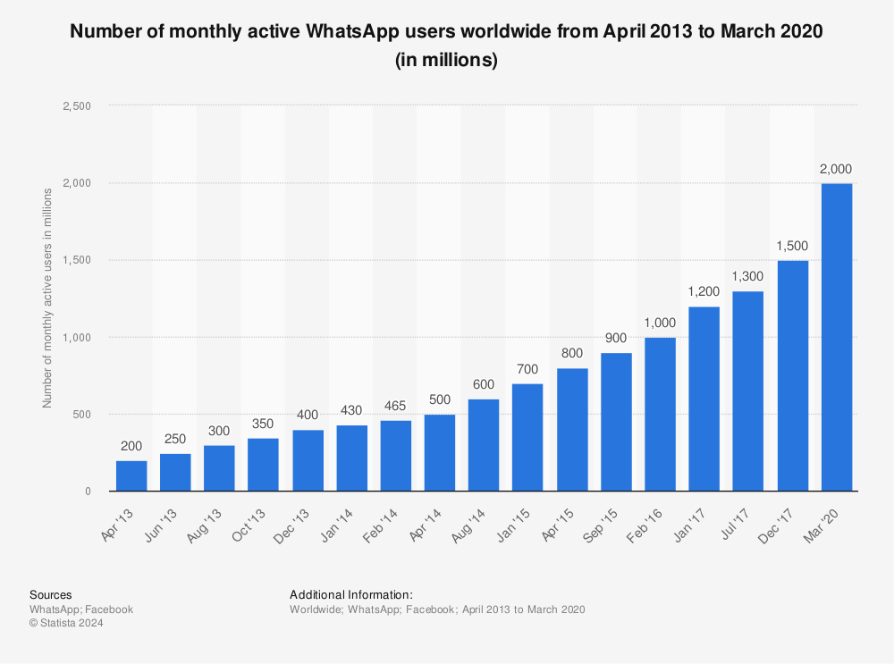

WhatsApp is a prominent global messaging platform that has fundamentally altered how individuals communicate worldwide. Launched in 2009 by Brian Acton and Jan Koum, WhatsApp gained rapid popularity due to its user-friendly interface and the promise of offering a cost-effective alternative to traditional texting services. The platform's user base expanded exponentially, making it one of the most widely used messaging apps worldwide.

In 2014, WhatsApp was acquired by Facebook Inc., now known as Meta Platforms, Inc., for approximately $19 billion—an acquisition that underscored the platform's significant influence and potential for further growth within the global digital communication landscape. Despite its integration into Meta's ecosystem, WhatsApp has maintained a distinctive position by adhering to an ad-free model, a decision that has notably contributed to its sustained user growth. This approach has set WhatsApp apart from many digital platforms that heavily rely on advertising revenue, fostering an environment focused on user experience and data privacy.



The ad-free model has historically been a key factor in WhatsApp's appeal, as it ensures an uninterrupted and seamless messaging experience for users. This focus on a clean user interface and non-intrusive operation has helped WhatsApp secure billions of users across various demographics and geographies. However, the absence of in-app advertising has also prompted WhatsApp, under Meta's ownership, to explore alternative monetization strategies to leverage its vast user base effectively.

As one of Meta's key assets, WhatsApp's monetization journey involves balancing the preservation of its core user-centric principles while implementing revenue-generating initiatives. The subsequent strategies encompass diverse methods such as the introduction of business communication tools and payment services. These initiatives aim to enhance business interactions on the platform while exploring new areas to drive financial growth.

This exploration of monetization strategies is crucial, considering the competitive nature of the global messaging and communication space. As WhatsApp continues to evolve, the challenge remains to sustain its growth trajectory and meet the financial expectations set by its parent entity, Meta Platforms. This section lays the groundwork for an in-depth examination of the various revenue streams and strategic choices that define WhatsApp's business model, offering insights into its potential future endeavors within the digital economy.

## Table of Contents

## WhatsApp's Business Model and Evolution

WhatsApp initially adopted a subscription-based revenue model. When the app launched in 2009, users were charged a nominal fee, typically around $0.99 annually after a year of free service. This model aimed to fund the costs associated with operating the app, including server maintenance and continual software improvements, while keeping the service affordable. WhatsApp's founders, Jan Koum and Brian Acton, were committed to an ad-free experience, emphasizing user privacy and an uncluttered interface.

However, as WhatsApp expanded globally, the subscription model presented barriers to user growth, particularly in emerging markets where payment infrastructure was less developed and affordability was a concern. Recognizing the potential user base growth from lifting these barriers, WhatsApp transitioned to a free-to-use model in 2014. The decision to eliminate subscription fees significantly accelerated user acquisition, helping WhatsApp surpass 700 million active users by early 2015.

In February 2014, WhatsApp was acquired by Facebook, Inc. (now Meta Platforms, Inc.) for approximately $19 billion. This acquisition marked a significant turning point in WhatsApp's evolution. Post-acquisition, WhatsApp began integrating into Meta's broader ecosystem, allowing it to leverage Meta's vast resources and technological infrastructure. The integration facilitated enhancements in service reliability, scalability, and the introduction of new features while maintaining WhatsApp's core values of simplicity and privacy.

This strategic shift also aligned with Meta's broader objective to create a suite of interconnected applications, expanding its footprint in the messaging sector alongside its existing platforms like Facebook Messenger. The backing of Meta allowed WhatsApp to focus on exponential user growth without the immediate pressure of revenue generation, given Meta's diversified income streams from its advertising business. Additionally, combining WhatsApp's communication capabilities with Meta's social media platforms opened new avenues for potential monetization, although WhatsApp maintained its promise of an ad-free user experience.

Through these strategic changes, WhatsApp solidified its position as a leading global messaging platform, continually shaping its business model in alignment with evolving market dynamics and technological advancements.

## Key Revenue Streams for WhatsApp

WhatsApp, under the ownership of Meta Platforms, Inc., has developed various revenue streams that sustain its operations while maintaining its ad-free model for general users. A significant contributor to WhatsApp's revenue is its Business API, which allows businesses to communicate with customers efficiently. The API facilitates interactions where businesses can send notifications, alerts, and customer service messages, effectively streamlining various business communication processes. Companies utilizing the API are charged based on the number of messages initiated, a model that provides a scalable revenue stream as more businesses integrate WhatsApp into their customer interaction strategies.

Business-initiated messaging fees form a core part of WhatsApp's monetization strategy. These fees are applied to messages that businesses send to users post the initial 24-hour customer service window, which are often at a higher cost. This tiered pricing model encourages prompt customer service interactions within the first 24 hours and subsequently charges businesses for additional outreach, aligning the fee structure with both user engagement and business benefit.

Click-to-WhatsApp ads represent another key revenue stream, integrating WhatsApp with Meta's broader advertising ecosystem. These advertisements appear on Facebook and Instagram and feature a direct link for users to start a conversation on WhatsApp. This functionality helps drive business engagement through seamless user transitions from social media to direct communication, enhancing the overall value proposition for advertisers. The efficacy of these ads directly correlates with an increase in revenue, as they encourage businesses to invest in these formats to facilitate customer interactions.

Exploration of WhatsApp Pay illustrates its strategic placement in the payments sector. Operantly functional in regions like Brazil and India with large user bases, WhatsApp Pay integrates seamlessly with local financial systems, leveraging Unified Payments Interface (UPI) in India, for instance. While WhatsApp Pay itself does not directly generate significant revenue, it serves as a strategic tool enhancing user stickiness, thereby contributing to Meta's broader financial services ambitions.

Lastly, WhatsApp contributes indirectly to Meta's advertising revenue via data. Although WhatsApp maintains a high standard of user privacy by encrypting messages, the metadata and user interaction patterns can still enrich Meta's advertising algorithms. This contribution enhances ad targeting and personalization across Meta's platforms, indirectly reinforcing revenue generation from advertising channels without compromising WhatsApp’s commitment to user privacy and content encryption.

## Strategies for Monetization and Market Expansion

Meta Platforms, Inc., the parent company of WhatsApp, has strategically focused on expanding WhatsApp's presence in emerging markets, particularly in regions like Brazil and India. These countries present lucrative opportunities due to their large populations and increasing internet penetration rates. Meta has tailored its approach to accommodate the unique needs and challenges of these markets.

### Expansion in Emerging Markets

In Brazil and India, WhatsApp holds a significant user base. These markets offer potential not just for user expansion but also for monetization. Meta's strategy involves leveraging WhatsApp's widespread use in these regions to introduce features that cater to local needs. In India, for instance, WhatsApp is often utilized for business communications, driving Meta to enhance its Business API to better support small and medium enterprises (SMEs) in this ecosystem.

### AI-Driven Tools for Businesses

Meta is investing in AI-driven tools to facilitate businesses in engaging with customers more effectively on WhatsApp. These tools are designed to automate customer service, improve communication efficiency, and provide personalized experiences. AI chatbots can handle common queries, allowing businesses to operate round the clock without increasing staff. Such innovations not only improve customer satisfaction but also enhance business loyalty, creating a strong foundation for monetization.

The potential for AI lies in its ability to analyze user interactions and provide insights that can drive marketing strategies and product offerings. This data-driven approach enables businesses to tailor their services according to customer preferences, thereby opening further avenues for revenue generation.

### Integration of WhatsApp Pay with Local Payment Systems

WhatsApp Pay is a peer-to-peer payment service integrated within the messaging app, allowing users to send and receive money seamlessly. In India, WhatsApp Pay has been integrated with the Unified Payments Interface (UPI), a real-time payment system developed by the National Payments Corporation of India. This integration has facilitated rapid adoption, as it allows users to transact with minimal friction.

By collaborating with local payment systems, WhatsApp Pay leverages existing infrastructures to enhance its reach. This strategy not only boosts user trust but also increases transaction volumes, contributing to the monetization of payment services. In Brazil, similar strategies are being employed, with WhatsApp Pay launching as a reliable option for digital payments.

Meta's focus on payment services highlights its commitment to capturing market share in the burgeoning digital economy of these regions. By embedding financial services into WhatsApp, Meta is not only encouraging user retention but also fostering an ecosystem where all services are interlinked, driving monetization through increased user engagement and transactional activity.

Overall, Meta's strategies for expanding WhatsApp in emerging markets and integrating advanced tools and payment systems underscore a comprehensive approach aimed at sustaining long-term growth and monetization. These efforts are pivotal in cementing WhatsApp's role as a critical component in Meta's broader ecosystem.

## Challenges and Risks in Monetization

Balancing user privacy with monetization strategies remains one of the most significant challenges for WhatsApp. As a platform known for its commitment to secure communication through end-to-end encryption, monetization efforts must align with privacy expectations. This alignment is crucial to maintaining user trust and preventing backlash from privacy advocates. Implementing revenue-generating features without compromising encryption and privacy is a delicate balance that WhatsApp continues to navigate.

Regulatory scrutiny poses another substantial challenge to WhatsApp's monetization. Governments and regulatory bodies worldwide are increasingly vigilant in ensuring that digital platforms, especially those dealing with personal data, comply with strict data protection regulations. The General Data Protection Regulation (GDPR) in the European Union exemplifies such regulatory challenges, with stringent requirements on data management and user consent. Adhering to these regulations without obstructing monetization strategies involves navigating complex legal landscapes and implementing robust compliance mechanisms.

Potential legal challenges are also a risk. Any misstep in handling user data or in the execution of monetization features can result in significant legal repercussions. These can include lawsuits, fines, and restrictions that may hamper operational capabilities. WhatsApp must, therefore, invest in comprehensive risk management and legal analyses to preemptively address any possible legal conflicts.

Competition from other messaging apps and traditional SMS services adds another layer of complexity. Platforms like Telegram, Signal, and Messenger provide similar services and often differentiate themselves through unique features, superior privacy policies, or integration with other services. Traditional SMS, though losing ground to internet-based messaging, remains a fallback for many users due to its reliability and universal accessibility. WhatsApp's monetization initiatives must therefore not only be innovative but also compelling enough to retain and expand its user base in the face of such competition. By addressing these challenges strategically, WhatsApp can fortify its position while continuing to expand its revenue streams.

## Algorithmic Trading Opportunities

Algorithmic trading, which uses computer algorithms to automate trading strategies and decisions, is seeing new opportunities through WhatsApp's environment. WhatsApp, with its extensive global messaging reach, offers a unique platform for facilitating real-time trading communication, especially when leveraging the capabilities of the WhatsApp Business API.

The WhatsApp Business API allows businesses, including those in the financial sector, to engage with customers at scale through automated responses, notifications, and interactive messaging. In the context of [algorithmic trading](/wiki/algorithmic-trading), this API can be used to establish a direct and efficient communication channel between traders and brokers. This setup can enhance the speed of decision-making and execution—a critical [factor](/wiki/factor-investing) in trading success.

Real-time trading communication through WhatsApp can benefit from the application's cryptographic security features, ensuring that sensitive trading information remains private and secure. Furthermore, by integrating WhatsApp's API into their systems, trading firms can send instant notifications to clients about market movements, trade confirmations, and account updates, thus improving client engagement and satisfaction.

Traders and brokers can also leverage WhatsApp to facilitate instantaneous trade discussions and strategy adjustments. The application supports multimedia messages, allowing the sharing of charts, analysis, and advice in real-time. This feature is particularly valuable in volatile market conditions where seconds can make a significant difference in trade outcomes.

Moreover, with WhatsApp's massive adoption across various demographics and geographies, traders and brokers can utilize the platform to reach a diverse client base. The accessibility and user-friendly interface of WhatsApp make it an attractive option for both individual and institutional traders.

Python, a popular language for developing trading algorithms, can be used in conjunction with WhatsApp API to automate such trading communication processes. For instance, a simple Python script can be developed to send alerts to WhatsApp users when specific market conditions are met:

```python
from twilio.rest import Client

def send_whatsapp_alert(to, message):
    client = Client("account_sid", "auth_token")

    from_whatsapp_number = "whatsapp:+14155238886"
    to_whatsapp_number = f"whatsapp:{to}"

    client.messages.create(body=message,
                           from_=from_whatsapp_number,
                           to=to_whatsapp_number)

# Example usage: send alert when a certain stock price threshold is crossed
if stock_price > threshold:
    send_whatsapp_alert("+1234567890", f"Alert: Stock price has reached {stock_price}")
```

In conclusion, WhatsApp provides significant opportunities for algorithmic trading by enhancing communication efficiency and security between traders and brokers. As the technology and its applications continue to develop, WhatsApp is poised to become an integral tool in the rapidly evolving landscape of trading and finance.

## Conclusion

WhatsApp's monetization journey is a reflection of strategic pivots and innovative approaches that have enabled the platform to maintain its widespread popularity while exploring viable avenues for revenue generation. Originally adopting a subscription-based model, WhatsApp transitioned to a free-to-use platform, significantly boosting its user base. This shift laid the groundwork for its current monetization strategies, particularly under the ownership of Meta Platforms, Inc.

As part of Meta's ecosystem, WhatsApp has integrated various monetization streams, such as the Business API and Click-to-WhatsApp ads, which cater to businesses seeking to leverage the messaging app's vast user base for customer interactions. These revenue models crucially balance generating income while keeping the core user experience free of direct charges, thus supporting continued user engagement and growth. The introduction of WhatsApp Pay has further expanded monetization possibilities, although its effectiveness is contingent on successful integration with local payment systems and regulatory environments.

Positioned within Meta's overarching strategy, WhatsApp acts as both a standalone platform and a conduit for broader integration into Meta's advertising and data ecosystem. This dual role not only enhances Meta's overall product offering but also solidifies WhatsApp's position as a key player in digital communication and commerce. Future monetization opportunities likely hinge on the expansion of existing features and the development of new tools, such as AI-driven solutions for businesses. These advancements could foster deeper engagement and offer tailored solutions that meet evolving market needs.

Looking forward, WhatsApp faces the challenge of sustaining its growth through monetization while addressing inherent risks such as user privacy, regulatory hurdles, and competition from other messaging services. By navigating these challenges, WhatsApp has the potential to further entrench itself within Meta's strategic vision and continue evolving as a multifaceted platform with diverse revenue streams. Through careful management and innovative approaches, WhatsApp's monetization story has the potential to unfold in ways that contribute significantly to its longevity and prominence in the global messaging landscape.

## References & Further Reading

[1]: ["Payments 2.0: How Whatsapp Challenges Online Payments in India"](https://www.ft.com/content/64104575-50ed-49ef-b9c9-4354294d96d2) by Harvard Business Review

[2]: ["The Economic Impact of WhatsApp in Global Markets"](https://www.analysisgroup.com/globalassets/uploadedfiles/content/news_and_events/news/2017-analysisgroup_whatsapp_economic_impact_report-final.pdf) by PwC Strategy&

[3]: ["Facebook's $19 Billion WhatsApp Acquisition: Implications For Businesses, Investors, And Users."](https://www.forbes.com/sites/oliversmith/2014/02/20/whatsapps-19-billion-deal-real-or-fake-news/) by Forbes

[4]: ["WhatsApp Business API: A Breakthrough in Business Communication."](https://business.whatsapp.com/developers/developer-hub) by WhatsApp Developers

[5]: ["India: WhatsApp Pay finally receives approval, with UPI reaching 2 billion transactions."](https://economictimes.indiatimes.com/industry/banking/finance/banking/whatsapp-pay-goes-official-after-npci-approval/payment-service-behemoth/slideshow/79082671.cms) by National Payments Corporation of India

[6]: ["A Study of Business Messaging and User Interaction on WhatsApp"](https://www.researchgate.net/publication/377011612_A_Study_on_Comparing_User_Experience_Design_for_Messenger_Services_Focused_on_WhatsApp_and_Telegram/fulltext/6591a3c56f6e450f19ba3cd3/A-Study-on-Comparing-User-Experience-Design-for-Messenger-Services-Focused-on-WhatsApp-and-Telegram.pdf) by Springer - Communications in Computer and Information Science Series

[7]: ["Privacy and Data Protection in Digital Communication Platforms"](https://business.columbia.edu/insights/digital-future/privacy-protection-and-future-digital-platforms) by International Journal of Law and Information Technology