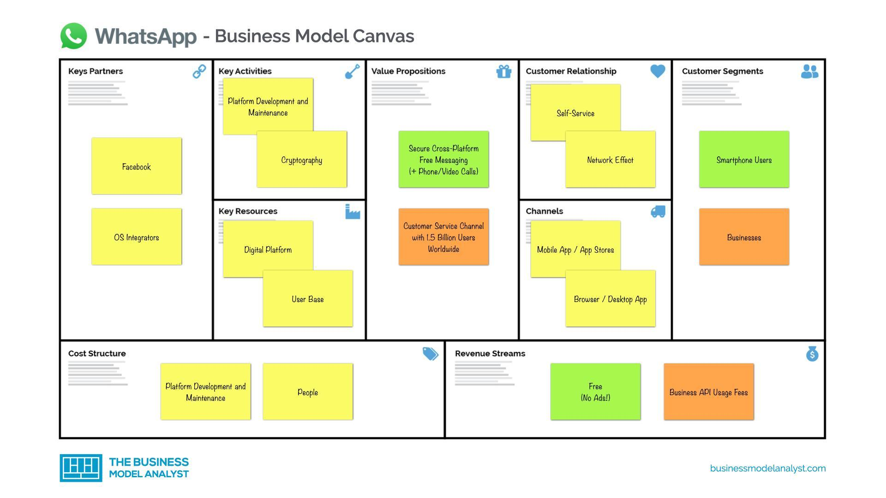

## Table of Contents

## What is WhatsApp and how does it function as a messaging app?

WhatsApp is a popular messaging app that lets people send messages, make voice and video calls, and share files like photos and videos. It works on smartphones and computers. You need the internet to use WhatsApp, either through Wi-Fi or mobile data. To start using it, you download the app, enter your phone number, and then you can chat with anyone who also has WhatsApp.

When you send a message on WhatsApp, it goes through the internet to reach the other person's phone. This is different from regular text messages, which use your phone's texting service. WhatsApp uses end-to-end encryption, which means your messages are private and only the person you're talking to can read them. You can also create groups to chat with many people at once, or use the status feature to share updates with your contacts.

## What is a revenue model and why is it important for businesses like WhatsApp?

A revenue model is like a plan that a business uses to make money. It shows how the business will earn income from its products or services. For example, a company might sell things directly, charge for using their service, or show ads to make money. A good revenue model helps a business know if it can make enough money to keep going and grow.

For a business like WhatsApp, having a solid revenue model is really important. WhatsApp started by not charging users directly but later added ways to make money, like showing ads in the Status feature and charging businesses for special tools to talk to customers. A good revenue model helps WhatsApp keep the app running smoothly, pay its workers, and keep improving the app for users. Without a clear way to make money, WhatsApp wouldn't be able to offer its services for free to so many people around the world.

## How does WhatsApp generate revenue through its basic services?

WhatsApp makes money mainly through its business services and ads. It offers a tool called WhatsApp Business API for companies to talk to their customers. This tool helps businesses send messages like order updates or customer support. Companies pay WhatsApp to use this service, which helps WhatsApp make money.

Another way WhatsApp earns money is by showing ads in the Status feature. The Status feature lets users share photos or videos that disappear after 24 hours, similar to stories on other apps. By putting ads in this feature, WhatsApp can make money from advertisers who want to reach its large user base. These two main ways help WhatsApp keep its basic services free for everyone while still making enough money to run and grow the app.

## What is WhatsApp's primary source of income?

WhatsApp's main way to make money is through its business services. It has a tool called WhatsApp Business API that lets companies talk to their customers directly. Companies can use this to send messages like order updates or customer support. They pay WhatsApp to use this tool, which helps WhatsApp earn money.

Another way WhatsApp makes money is by showing ads in the Status feature. The Status feature is where users can share photos or videos that go away after 24 hours. By putting ads here, WhatsApp can earn money from companies that want to show their ads to lots of people. These two ways help WhatsApp keep its basic services free for everyone while still making enough money to keep the app running and growing.

## Can you explain how WhatsApp Business API contributes to its revenue?

WhatsApp Business API helps WhatsApp make money by letting businesses talk to their customers directly through the app. Companies pay WhatsApp to use this special tool, which lets them send messages like order updates or customer support. This is really helpful for businesses because it lets them reach their customers easily and quickly. Since many companies are willing to pay for this service, it becomes a big way for WhatsApp to earn money.

By offering the WhatsApp Business API, WhatsApp can keep its basic services free for everyone while still making money. The money that businesses pay to use the API helps WhatsApp cover the costs of running the app and also allows them to keep improving it. This way, WhatsApp can continue to offer a great service to its users without charging them directly, while also making enough money to keep the business going and growing.

## How does WhatsApp monetize its platform through advertising?

WhatsApp makes money from ads by showing them in the Status feature. The Status feature is where users can share photos or videos that disappear after 24 hours. When people look at their friends' statuses, they might also see ads. Companies pay WhatsApp to show these ads because they want to reach the many people who use WhatsApp every day. This way, WhatsApp can make money while letting its users keep using the app for free.

By putting ads in the Status feature, WhatsApp can earn money without charging users directly. This helps WhatsApp keep the app running smoothly and pay for things like servers and workers. It also allows WhatsApp to keep improving the app and adding new features. So, the ads help WhatsApp stay a free and useful service for everyone while also bringing in the money needed to grow the business.

## What role do in-app purchases play in WhatsApp's revenue model?

In-app purchases do not play a big role in WhatsApp's revenue model right now. WhatsApp does not charge users for things like stickers or special features inside the app. Instead, WhatsApp focuses on making money from businesses and ads. This means that users can use WhatsApp for free without needing to buy anything inside the app.

Even though in-app purchases are not a main way WhatsApp makes money, they could be something WhatsApp looks at in the future. Other apps make a lot of money from in-app purchases, so WhatsApp might think about adding them if it helps the business grow. But for now, WhatsApp's main ways to make money are through its business services and showing ads in the Status feature.

## How does WhatsApp's subscription model work, if any?

WhatsApp used to have a subscription model a long time ago. Back then, people had to pay a small amount every year to use WhatsApp. This was how WhatsApp made money when it first started. But they stopped this subscription model in 2016 because they wanted to make the app free for everyone to use.

Now, WhatsApp does not use a subscription model at all. They make money in other ways, like letting businesses pay to use special tools to talk to customers and showing ads in the Status feature. This way, everyone can use WhatsApp for free, and WhatsApp can still make money to keep the app running and growing.

## What are the different pricing strategies WhatsApp uses for its services?

WhatsApp uses different ways to make money from its services. One main way is through the WhatsApp Business API. This is a special tool that lets businesses send messages to their customers directly through WhatsApp. Companies pay WhatsApp to use this tool, which helps them talk to customers about things like orders or customer support. This is a big way WhatsApp makes money because many businesses are willing to pay for it.

Another way WhatsApp earns money is by showing ads in the Status feature. The Status feature is where users can share photos or videos that disappear after 24 hours. When people look at statuses, they might see ads too. Companies pay WhatsApp to show these ads because they want to reach lots of people. This helps WhatsApp make money without charging users directly, so everyone can use the app for free.

WhatsApp used to have a subscription model where users paid a small yearly fee to use the app. But they stopped this in 2016 and made WhatsApp free for everyone. Now, they focus on making money from businesses and ads instead of charging users. This way, WhatsApp can keep the app running and growing while letting everyone use it for free.

## How does WhatsApp leverage data and user information for revenue generation?

WhatsApp uses the information it collects from users to help make money, especially through its business services and ads. When businesses use the WhatsApp Business API to talk to customers, they can see things like how many people opened their messages or clicked on links. This helps businesses understand how well their messages are working. WhatsApp doesn't sell this data directly, but it uses it to make its business services better and more useful, which makes companies want to pay for them.

WhatsApp also uses user data to show ads in the Status feature. By knowing what people like and how they use the app, WhatsApp can show ads that are more interesting to each user. This makes the ads more effective, so companies are happy to pay WhatsApp to show them. This way, WhatsApp can make money from ads without charging users anything, which helps keep the app free for everyone.

## What future revenue strategies might WhatsApp consider implementing?

WhatsApp might think about adding in-app purchases in the future. Right now, they don't charge users for things like stickers or special features inside the app. But other apps make a lot of money this way, so WhatsApp could start doing it too. If they add fun stickers or cool features that people want to buy, it could be another way for WhatsApp to make money while keeping the app free for everyone.

Another thing WhatsApp could do is start charging for some premium features. For example, they might offer a special version of WhatsApp with extra things like more storage for messages or better video call quality. People who want these extra features could pay a small fee to use them. This way, WhatsApp could make money from users who are willing to pay for a better experience, while still keeping the basic app free for everyone else.

Lastly, WhatsApp might look into more ways to use data to make money. They already use user information to help businesses and show ads, but they could do more. For example, they could offer businesses even better tools to understand their customers, or they could show more personalized ads. By using data in smarter ways, WhatsApp could find new ways to make money without changing the free experience for regular users.

## How does WhatsApp's revenue model compare to other messaging apps like Telegram and Signal?

WhatsApp's revenue model is different from apps like Telegram and Signal. WhatsApp makes most of its money by letting businesses use a special tool called the WhatsApp Business API. This tool helps companies talk to their customers directly through WhatsApp, and companies pay for it. WhatsApp also shows ads in the Status feature, where users share photos or videos that go away after 24 hours. This way, WhatsApp can make money without charging users directly, so everyone can use the app for free.

Telegram and Signal have different ways of making money. Telegram makes some money by letting users buy special stickers and emojis inside the app. They also have a premium version called Telegram Premium, where people pay for extra features like more storage and better download speeds. Signal, on the other hand, is a non-profit and relies on donations from users to keep running. They don't show ads or charge for special features, so they depend on people giving them money to keep the app free and private for everyone.

## References & Further Reading

[1]: ["Payments 2.0: How Whatsapp Challenges Online Payments in India"](https://www.ft.com/content/64104575-50ed-49ef-b9c9-4354294d96d2) by Harvard Business Review

[2]: ["The Economic Impact of WhatsApp in Global Markets"](https://www.analysisgroup.com/globalassets/uploadedfiles/content/news_and_events/news/2017-analysisgroup_whatsapp_economic_impact_report-final.pdf) by PwC Strategy&

[3]: ["Facebook's $19 Billion WhatsApp Acquisition: Implications For Businesses, Investors, And Users."](https://www.forbes.com/sites/oliversmith/2014/02/20/whatsapps-19-billion-deal-real-or-fake-news/) by Forbes

[4]: ["WhatsApp Business API: A Breakthrough in Business Communication."](https://business.whatsapp.com/developers/developer-hub) by WhatsApp Developers

[5]: ["India: WhatsApp Pay finally receives approval, with UPI reaching 2 billion transactions."](https://economictimes.indiatimes.com/industry/banking/finance/banking/whatsapp-pay-goes-official-after-npci-approval/payment-service-behemoth/slideshow/79082671.cms) by National Payments Corporation of India

[6]: ["A Study of Business Messaging and User Interaction on WhatsApp"](https://www.researchgate.net/publication/377011612_A_Study_on_Comparing_User_Experience_Design_for_Messenger_Services_Focused_on_WhatsApp_and_Telegram/fulltext/6591a3c56f6e450f19ba3cd3/A-Study-on-Comparing-User-Experience-Design-for-Messenger-Services-Focused-on-WhatsApp-and-Telegram.pdf) by Springer - Communications in Computer and Information Science Series

[7]: ["Privacy and Data Protection in Digital Communication Platforms"](https://business.columbia.edu/insights/digital-future/privacy-protection-and-future-digital-platforms) by International Journal of Law and Information Technology