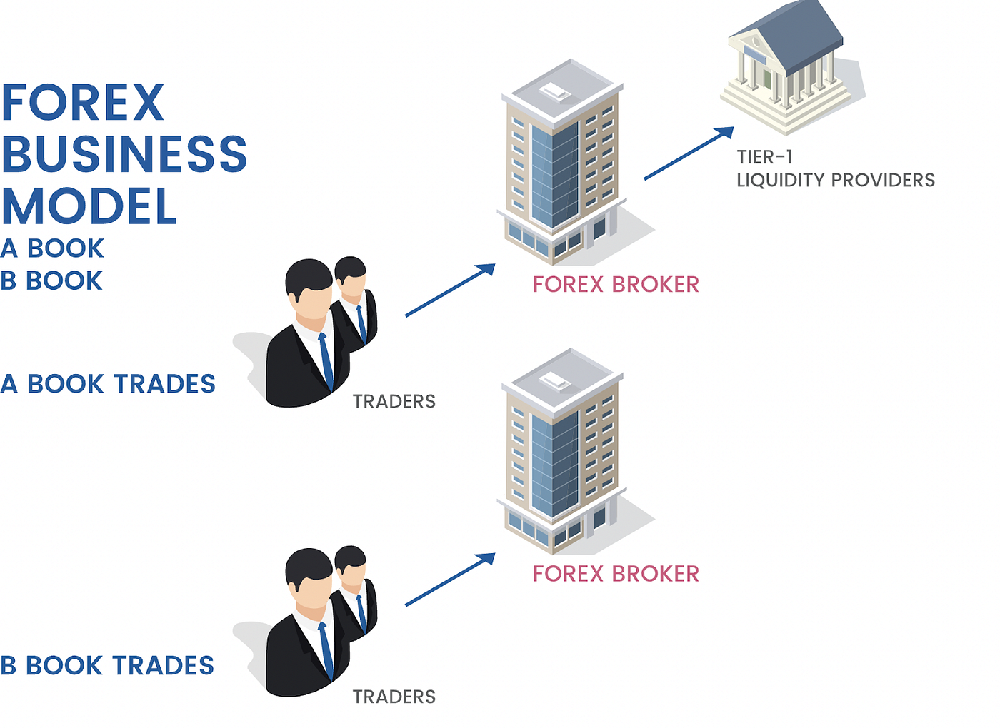

The global forex market is a complex and ever-evolving ecosystem where currencies are exchanged around the clock. Every day, trillions of dollars are traded, making it the largest financial market worldwide. Forex brokers are pivotal to this process, bridging the gap between currency traders and the market by providing platforms, tools, and resources necessary for trading activities. These brokers play an essential role in ensuring liquidity, which allows trades to be executed with minimal delays—a critical component for the fluid functioning of the forex market.

In recent years, algorithmic trading, often referred to as algo trading, has emerged as a cornerstone of modern trading practices. This method leverages computer algorithms to execute trades at high speeds based on pre-defined criteria and market data signals, thus reducing human error and emotional biases. The rise of algo trading has been driven by its ability to manage large volumes of data and execute trades with precision and speed, which are paramount in the fast-paced forex environment.



Understanding the revenue models of forex brokers is crucial for traders to minimize costs and maximize returns. Brokers typically earn through spreads—the difference between the bid and ask prices—as well as through commissions and various fees. Awareness of these costs allows traders to make informed decisions when selecting a broker for their trading activities.

Furthermore, grasping the impact of algorithmic trading helps traders appreciate how market efficiencies and opportunities are evolving. As algorithmic trading continues to gain traction, it influences market dynamics, offering both new opportunities and challenges. Therefore, traders who are knowledgeable about these developments are better positioned to enhance their trading strategies and achieve success in the forex market. This article examines how forex brokers sustain their operations and highlights the significant role that algorithmic trading plays in the contemporary trading landscape.

## Table of Contents

## Understanding Forex Brokers

Forex brokers serve as critical intermediaries that connect individual traders to the expansive forex market, facilitating the exchange of currencies globally. These brokers provide essential platforms equipped with the tools and resources necessary for executing trades effectively. By performing this intermediary role, brokers ensure that traders can access the forex market with relative ease and benefit from liquidity, which is vital for executing trades without significant delays.

The platforms offered by forex brokers are user-centric, equipped with features that cater to both novice and experienced traders. These platforms typically provide real-time market data, analytical tools, and customizable interfaces to suit individual trading strategies. By ensuring liquidity, brokers enable traders to execute trades seamlessly, meaning that for any given trade, a counterpart is readily available. This capability reduces the occurrence of slippage, where the executed price diverges from the expected price due to market volatility or insufficient market depth.

Understanding how brokers operate is crucial for traders aiming to make informed decisions about their trading activities. Different brokers may offer varying features, spreads, and fee structures, which can significantly affect trading outcomes. Some brokers act purely as intermediaries (Straight Through Processing - STP) or as market makers who may take the other side of trades. Each model has its advantages and potential drawbacks, influencing factors such as transparency, execution speed, and costs.

Choosing the right broker involves analyzing their platform capabilities, the level of support provided, and how they manage [liquidity](/wiki/liquidity-risk-premium) and execution. By understanding these operational aspects, traders can select brokers that align with their trading objectives and strategies, optimizing their interactions within the [forex](/wiki/forex-system) market.

## Revenue Models of Forex Brokers

Forex brokers primarily earn revenue through spreads, commissions, and fees associated with the trading activities of their clients.

1. **Spreads**: The spread is the difference between the bid (buying) price and the ask (selling) price of a currency pair. For example, if the EUR/USD currency pair is quoted with a bid price of 1.1000 and an ask price of 1.1002, the spread is 0.0002 or 2 pips. Brokers profit from this spread when they execute trades, effectively acting as the middleman in the transaction. The size of the spread can vary based on market conditions, the currency pair being traded, and the type of trading account.

2. **Commission-Based Models**: Some forex brokers implement a commission-based model where they charge a fixed fee per trade, irrespective of the spread. This model is typically seen in brokerages that offer ECN (Electronic Communication Network) or STP (Straight Through Processing) accounts, which pass trades directly to the market, providing tighter spreads. Commissions might be more suitable for traders handling larger volumes, as they can help minimize total trading costs.

3. **Additional Fees**: Beyond spreads and commissions, brokers may charge various fees to maintain profitability:
   - **Overnight Holding Costs (or Swap Fees)**: These are charged when a position is held open overnight and are associated with the interest rate differential between the two currencies in a pair. The fee can be positive or negative, depending on the interest rates.
   - **Withdrawal Fees**: Some brokers impose fees on withdrawing funds from a trading account, often based on the withdrawal method.
   - **Account Maintenance Fees**: Although less common, certain brokers charge maintenance fees for account management, particularly if accounts are inactive for a specified period.

Understanding these revenue models is crucial for traders as they directly impact the cost of trading. By analyzing and comparing these models, traders can select brokers that align with their trading strategies and minimize their total trading expenses.

 to Algorithmic Trading

Algorithmic trading automates the trading process by using pre-defined rules and strategies. These systems leverage complex algorithms and computer programs to execute trades based on real-time market signals. The primary advantage of [algorithmic trading](/wiki/algorithmic-trading) is its capability to execute transactions at a speed and frequency far exceeding human traders, capitalizing on short-lived market opportunities that might otherwise be missed.

The precision and efficiency of algorithmic trading systems help to minimize human error and emotional decision-making, which are often significant impediments in manual trading. By following pre-set guidelines, these algorithms can make unbiased decisions, thus potentially yielding more consistent returns.

In high-frequency trading ([HFT](/wiki/high-frequency-trading-strategies)), which is a subset of algorithmic trading, the speed of trade execution is paramount. HFT requires advanced technology infrastructure and sophisticated algorithms to process vast amounts of market data quickly and efficiently. The goal in HFT is to profit from the smallest of price discrepancies that may only exist for milliseconds, necessitating ultra-fast data processing capabilities.

Using programming languages like Python, traders can implement algorithmic trading strategies. A simple example in Python for placing a trade when a moving average crossover occurs could look like this:

```python
import pandas as pd

def moving_average_strategy(data, short_window, long_window):
    signals = pd.DataFrame(index=data.index)
    signals['price'] = data['price']
    signals['short_mavg'] = data['price'].rolling(window=short_window, min_periods=1, center=False).mean()
    signals['long_mavg'] = data['price'].rolling(window=long_window, min_periods=1, center=False).mean()
    signals['signal'] = 0.0
    signals['signal'][short_window:] = np.where(signals['short_mavg'][short_window:] > signals['long_mavg'][short_window:], 1.0, 0.0)
    signals['positions'] = signals['signal'].diff()

    # Buy where short moving average crosses above long moving average
    signals.loc[signals.positions == 1.0, 'buy'] = signals['price']
    # Sell where short moving average crosses below long moving average
    signals.loc[signals.positions == -1.0, 'sell'] = signals['price']

    return signals

data = pd.DataFrame({"price": [120, 121, 122, 123, 122, 124, 125, 126]})
signals = moving_average_strategy(data, short_window=2, long_window=3)
print(signals)
```

In this example, the strategy involves buying when the short-term moving average crosses above the long-term moving average, and selling when the opposite occurs. This simple strategy is only a basic illustration; in practice, algorithmic trading strategies can become highly intricate, involving various indicators and trade conditions.

## Impact of Algo Trading on Forex Market

Algorithmic trading, commonly known as algo trading, has significantly transformed the forex market by enhancing overall efficiency and liquidity. This form of trading utilizes computer algorithms to automate the trading process, which allows for the rapid execution of transactions based on specific market conditions and predetermined criteria.

One of the primary benefits of algo trading is its ability to improve market liquidity. By automating trades, algorithmic systems can execute a high [volume](/wiki/volume-trading-strategy) of transactions in a fraction of a second, making it easier for traders to enter and [exit](/wiki/exit-strategy) positions without significant price changes. This increased liquidity facilitates smoother and more efficient markets, benefiting both retail and institutional participants.

Algo trading also enables the execution of complex trading strategies that would be cumbersome or nearly impossible to perform manually. Strategies involving [arbitrage](/wiki/arbitrage), statistical analysis, or predictive modeling can be programmed into an algorithm, allowing for precise and timely execution. For instance, a trader might develop an algorithm that exploits minor discrepancies in currency pairs across different markets. This kind of strategy relies on speed and accuracy, which are inherent in algorithmic systems.

The speed of execution provided by algo trading is crucial for taking advantage of fleeting market opportunities. Algorithms can monitor multiple markets simultaneously and act within milliseconds when a favorable condition arises. This ability to act quickly is particularly advantageous in situations where market prices are volatile or rapidly changing.

However, while algo trading enhances market efficiency, it can also introduce new challenges, particularly concerning market [volatility](/wiki/volatility-trading-strategies). Algorithms can sometimes exacerbate market fluctuations, especially during atypical conditions. For example, an algorithm reacting to a sudden drop in currency value might trigger a cascade of similar responses from other algorithms, potentially leading to a rapid and significant market shift. This phenomenon underscores the importance of implementing robust risk management measures within algorithmic trading systems to mitigate unintended consequences.

In summary, algorithmic trading plays a vital role in the modern forex market by boosting liquidity and enabling sophisticated trading strategies. The swift execution of trades provided by algorithms allows traders to capitalize on opportunities, while also posing new challenges related to market volatility. Balancing these aspects is essential for maintaining stability and maximizing the benefits of algo trading in forex markets.

## How Forex Brokers Adapt to Algo Trading

Forex brokers have increasingly adapted their services to support algorithmic trading, offering specialized platforms and tools that cater to the needs of algo traders. A key feature provided by many brokers is API access, which allows traders to integrate their automated trading algorithms directly with the brokers' systems. APIs enable real-time data exchange and order execution, crucial for the time-sensitive nature of algorithmic trading.

To further accommodate algo traders, some brokers have developed proprietary trading platforms with built-in tools for algorithm development and [backtesting](/wiki/backtesting). These platforms often include features such as strategy builders, which allow traders to create and test their algorithms without extensive programming knowledge. Others might choose to partner with third-party platforms like MetaTrader 4/5, which are well-known for their algorithmic trading capabilities.

The ability to deliver robust data and maintain high execution speeds is a critical concern for brokers in this space. The effectiveness of algorithmic trading can be heavily reliant on the availability of accurate and real-time market data. Brokers need to ensure that they provide data without latency and that their systems can process this data efficiently to execute trades swiftly. This often involves investing in high-quality server infrastructure and low-latency network connections.

Furthermore, there is a delicate balance that brokers must manage in offering competitive spreads while maintaining their profitability. Spreads are a primary revenue source for brokers, and they need to remain attractive to traders, including those using algorithms that frequently execute trades. Brokers must equip themselves with the capability to efficiently handle the high volume of transactions generated by algo trading without sacrificing speed or accuracy, which in turn can influence spreads and trading costs.

In conclusion, forex brokers have embraced the evolution towards algorithmic trading by enhancing their platforms and services to meet the specific requirements of algo traders. By fostering environments that support rapid execution and robust data access, brokers not only create competitive advantages but also drive the potential growth and success of traders utilizing algorithmic strategies.

## Risks and Challenges of Algo Trading

Algorithmic trading, while offering numerous advantages, is not without its risks and challenges. One of the primary concerns is the potential for rapid financial losses due to its automated nature. The speed at which trades are conducted means that any error in the algorithm can quickly lead to significant financial consequences.

A critical aspect of algo trading is the reliance on algorithms that can be flawed or over-optimized. Algorithms are designed to follow specific strategies, and if these strategies are based on incorrect assumptions or historical data that is no longer relevant, the outcomes can be detrimental. Over-optimization, or "curve fitting," occurs when an algorithm is tailored too closely to past data, potentially failing when applied to new, unseen market conditions.

Another challenge traders face is technical issues such as latency and software bugs. Latency, defined as the delay between the initiation and execution of a trade, can be a significant disadvantage in high-frequency trading where milliseconds matter. Software bugs or failures can lead to incorrect trades being placed, exacerbating potential losses.

To mitigate these risks, continuous backtesting and updating of algorithms are crucial. Backtesting involves simulating an algorithm's performance using historical data, helping identify possible weaknesses or improvements. Regular updates ensure the algorithm can adapt to changing market conditions, maintaining its effectiveness over time.

For example, consider a simple moving average crossover strategy. In Python, this could be implemented as follows:

```python
import pandas as pd

def calculate_moving_averages(prices, short_window, long_window):
    """
    Calculate short-term and long-term moving averages.
    :param prices: A pandas Series of historical prices.
    :param short_window: The window size for the short-term moving average.
    :param long_window: The window size for the long-term moving average.
    :return: DataFrame with short and long moving averages.
    """
    data = pd.DataFrame(prices, columns=['Price'])
    data['Short_MA'] = data['Price'].rolling(window=short_window, min_periods=1).mean()
    data['Long_MA'] = data['Price'].rolling(window=long_window, min_periods=1).mean()
    return data

prices = pd.Series([100, 101, 102, 101, 103, 104, 105])
moving_averages = calculate_moving_averages(prices, short_window=3, long_window=5)

print(moving_averages)
```

This simple code snippet demonstrates the calculation of short and long-term moving averages, which could form the basis of an algorithmic trading strategy. The essence is to continuously assess and recalibrate such strategies to align with current market behavior, reducing the risks associated with outdated or inaccurate models. 

Overall, while algo trading can offer significant strategic advantages, understanding and managing its inherent risks is paramount for traders aiming for long-term success.

## Conclusion

The intersection of forex broker revenue models and algorithmic trading significantly influences the modern forex trading environment. A core consideration for traders is selecting the right broker, which necessitates understanding the cost implications of different revenue models, such as spreads, commissions, and various fees. By grasping the nuances of these models, traders can make more informed choices, optimizing their trading strategies to align with operational costs.

Algorithmic trading offers numerous advantages, notably its ability to execute trades with precision and speed, reducing human error and emotional decision-making. However, it's crucial to recognize that these benefits come with inherent risks. The automated nature of algorithmic systems can lead to rapid financial losses if algorithms are flawed or over-optimized. Moreover, traders must remain vigilant against technical challenges like latency issues and software bugs, emphasizing the importance of regular updates and backtesting of algorithms to adapt to dynamic market conditions.

Looking ahead, the forex market is poised for continued evolution with the integration of [artificial intelligence](/wiki/ai-artificial-intelligence) and [machine learning](/wiki/machine-learning) into trading strategies. These technologies offer the potential to further enhance decision-making processes and efficiency in the forex market, reshaping trading paradigms. As these tools become more sophisticated, they promise to offer deeper insights and more precise predictive capabilities, potentially transforming the landscape of forex trading. Understanding these developments will be crucial for traders aiming to leverage the full potential of modern trading strategies while navigating the complexities of the forex market landscape.

## References & Further Reading

[1]: ["The Impact of Algorithmic Trading on the Foreign Exchange Market"](https://www.federalreserve.gov/econres/ifdp/rise-of-the-machines-algorithmic-trading-in-the-foreign-exchange-market.htm) by the Bank for International Settlements

[2]: ["Algorithmic Trading: Winning Strategies and Their Rationale"](https://www.wiley.com/en-us/Algorithmic+Trading%3A+Winning+Strategies+and+Their+Rationale-p-9781118460146) by Ernie Chan

[3]: ["The Role of Brokers in Managing Liquidity and Risk"](https://www.investopedia.com/terms/l/liquidityrisk.asp) by the Centre for Economic Policy Research

[4]: ["High-Frequency Trading and Price Discovery"](https://academic.oup.com/rfs/article-abstract/27/8/2267/1582754) by Jonathan A. Brogaard, Terrence Hendershott, and Ryan Riordan

[5]: ["Algorithmic and High-Frequency Trading"](https://assets.cambridge.org/97811070/91146/frontmatter/9781107091146_frontmatter.pdf) by Álvaro Cartea, Sebastian Jaimungal, and José Penalva