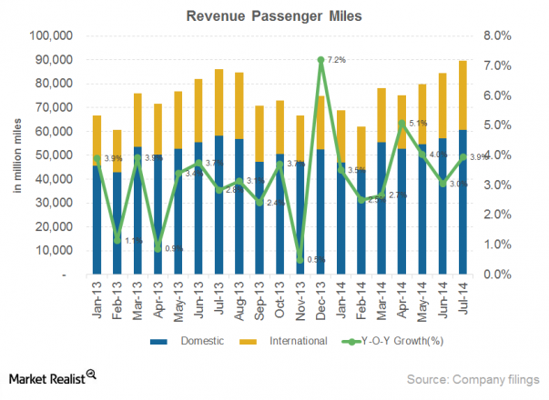

## Table of Contents

## What is a Revenue Passenger Mile (RPM)?

A Revenue Passenger Mile (RPM) is a measure used in the airline industry to show how many miles passengers fly while paying for their tickets. It is calculated by multiplying the number of paying passengers by the number of miles they travel. For example, if 100 passengers each fly 500 miles, the total RPM would be 50,000.

RPM is important because it helps airlines understand how much money they are making from passengers. By tracking RPM, airlines can see if they are getting more or fewer passengers over time and adjust their business strategies accordingly. It is a key performance indicator that shows the effectiveness of an airline's operations in terms of passenger revenue.

## How is RPM calculated?

Revenue Passenger Mile, or RPM, is a way to measure how many miles passengers fly when they pay for their tickets. To find the RPM, you take the number of passengers who paid for their tickets and multiply it by the number of miles they flew. For example, if 100 passengers each flew 500 miles, you would multiply 100 by 500 to get an RPM of 50,000.

This number is important for airlines because it helps them see how much money they are making from passengers. By looking at the RPM, airlines can tell if they are carrying more or fewer passengers over time. This helps them make decisions about their business, like whether to add more flights or change their prices.

## Why is RPM important for airlines?

RPM is important for airlines because it shows how much money they are making from passengers. By knowing the RPM, airlines can see if they are carrying more or fewer passengers over time. This helps them understand if their business is doing well or if they need to make changes.

Airlines use RPM to make decisions about their business. For example, if the RPM is going up, it might mean they should add more flights or keep their prices the same. If the RPM is going down, they might need to lower their prices or find new ways to attract passengers. RPM is a key number that helps airlines run their business better.

## What is the difference between RPM and Available Seat Mile (ASM)?

Revenue Passenger Mile (RPM) and Available Seat Mile (ASM) are two important measures used by airlines, but they show different things. RPM tells you how many miles passengers fly when they pay for their tickets. It's calculated by multiplying the number of paying passengers by the number of miles they fly. This helps airlines see how much money they are making from passengers.

On the other hand, Available Seat Mile (ASM) shows how many seats an airline has available for passengers to fly, regardless of whether those seats are filled or not. ASM is calculated by multiplying the total number of seats on all flights by the number of miles those flights travel. This measure helps airlines understand their capacity and how efficiently they are using their planes.

Both RPM and ASM are important for airlines to understand their business. RPM shows how well they are doing at getting passengers to fly and pay for their tickets, while ASM shows how much space they have to offer. By comparing RPM and ASM, airlines can see how full their planes are and make decisions about pricing, adding or removing flights, and other business strategies.

## How does RPM affect an airline's profitability?

RPM, or Revenue Passenger Mile, is important for an airline's profitability because it shows how much money the airline makes from passengers. When more people fly and pay for their tickets, the RPM goes up. This means the airline is [earning](/wiki/earning-announcement) more money from the seats on its planes. If the RPM is high, it can mean the airline is doing well and making a good profit.

On the other hand, if the RPM is low, it can mean fewer people are flying with the airline. This can hurt the airline's profits because they are not making as much money from passengers. Airlines need to watch their RPM closely to make sure they are pricing their tickets right and attracting enough passengers to stay profitable.

## Can you provide an example of how to calculate RPM?

Let's say an airline has a flight from New York to Los Angeles. This flight is 2,500 miles long. On this flight, there are 200 passengers who paid for their tickets. To find the Revenue Passenger Mile (RPM) for this flight, you multiply the number of paying passengers by the number of miles they flew. So, you would multiply 200 passengers by 2,500 miles. This gives you an RPM of 500,000 for that flight.

Now, let's say the airline has another flight from Chicago to Miami. This flight is 1,200 miles long and has 150 paying passengers. To calculate the RPM for this flight, you multiply 150 passengers by 1,200 miles. This gives you an RPM of 180,000 for this flight. By adding up the RPM from all flights, the airline can see how much money they are making from passengers overall.

## How do airlines use RPM to measure performance?

Airlines use RPM to see how well they are doing in getting passengers to fly and pay for their tickets. By looking at the RPM, airlines can tell if more people are flying with them or if fewer people are choosing their flights. This helps them understand if their business is growing or shrinking. If the RPM is going up, it means more passengers are flying, which is good for the airline. If the RPM is going down, it might mean they need to change something, like their prices or the number of flights they offer.

Airlines also use RPM to compare with other numbers like ASM, which shows how many seats are available. By comparing RPM and ASM, airlines can see how full their planes are. If the RPM is close to the ASM, it means the planes are almost full, which is good for profits. If the RPM is much lower than the ASM, it means the planes are not full, and the airline might need to do something to attract more passengers. This helps airlines make smart decisions about their business to keep making money.

## What factors can influence RPM?

Several things can change an airline's Revenue Passenger Mile (RPM). One big thing is how many people want to fly. If more people want to go on trips, the RPM will go up because more passengers are flying and paying for their tickets. Another thing that can change RPM is how much tickets cost. If tickets are cheaper, more people might buy them, and the RPM could go up. But if tickets are too expensive, fewer people might fly, and the RPM could go down.

Other things like the economy can also affect RPM. If people have more money to spend, they might fly more, which would make the RPM go up. But if times are tough and people are saving money, they might not fly as much, and the RPM could go down. Airlines can also change their routes or how often they fly, which can affect RPM. If they add more flights to popular places, more people might fly, and the RPM could go up. But if they cut flights or fly to less popular places, the RPM might go down.

## How does RPM vary across different types of airlines (e.g., low-cost vs. full-service)?

RPM can be different for low-cost airlines and full-service airlines because they have different ways of doing business. Low-cost airlines usually have cheaper tickets to attract more people to fly. They might not offer things like free meals or checked bags, which can help keep their costs down. Because their tickets are cheaper, more people might choose to fly with them, so their RPM could be higher. But, they might also have to work harder to fill up all their seats because they don't have as many extras to attract passengers.

Full-service airlines, on the other hand, usually charge more for their tickets but offer more things like free meals, more leg room, and better service. Because their tickets are more expensive, they might not have as many passengers as low-cost airlines. But the passengers they do have might fly longer distances or pay more for their tickets, which can still make their RPM high. Full-service airlines might also have more business travelers who need to fly often and are willing to pay more, which can help keep their RPM up even if they don't have as many passengers as low-cost airlines.

## What trends have been observed in RPM over the past decade?

Over the past ten years, the Revenue Passenger Mile (RPM) has seen ups and downs. When the economy is doing well, more people want to travel, so the RPM goes up. Airlines see more passengers flying longer distances, which means they make more money from tickets. But when there are big events like the global health crisis in 2020, the RPM can drop a lot. During that time, fewer people were flying because of travel restrictions and worries about getting sick, so airlines made less money from passengers.

In recent years, the trend has been toward more people flying with low-cost airlines. These airlines have been able to keep their RPM high by offering cheap tickets and flying to popular places. At the same time, full-service airlines have been working hard to keep their RPM up by offering better services and flying to more places around the world. Overall, the RPM has been recovering since the big drop in 2020, but it's still affected by things like the economy and how much people want to travel.

## How can airlines improve their RPM?

Airlines can improve their RPM by making their tickets cheaper. When tickets cost less, more people might choose to fly with that airline. This means more passengers flying more miles, which makes the RPM go up. Low-cost airlines do this well. They offer cheap tickets and try to fill up their planes with as many passengers as possible. By doing this, they can get a lot of people to fly even if each ticket doesn't make as much money.

Another way to improve RPM is by adding more flights to popular places. If an airline flies to places where lots of people want to go, more passengers will buy tickets. This can help the airline make more money from passengers flying longer distances. Airlines can also offer better services to attract more people, like free meals or more leg room. This can make people willing to pay more for tickets, which can also help the RPM go up. By doing these things, airlines can get more passengers and improve their RPM.

## What are the limitations of using RPM as a performance metric?

Using RPM as a performance metric has some limits. One big limit is that RPM only shows how many miles passengers fly when they pay for their tickets. It doesn't tell you anything about how much it costs the airline to fly those passengers. So, an airline could have a high RPM but still lose money if their costs are too high. Also, RPM doesn't show how full the planes are. An airline could have a high RPM because they fly a lot of long flights, but if their planes are not full, they might not be making as much money as they could.

Another limit of RPM is that it doesn't tell you about the different types of passengers. Some passengers, like business travelers, might pay more for their tickets and fly more often. But RPM treats all passengers the same, so it doesn't show how much money the airline makes from different kinds of passengers. Also, RPM can be affected by things the airline can't control, like the economy or big events like a health crisis. So, while RPM is a good way to see how many passengers are flying, it doesn't give the whole picture of how well an airline is doing.

## What is Revenue Passenger Mile (RPM)?

Revenue Passenger Mile (RPM) is a key metric in the transportation industry that quantifies the total distance traveled by paying passengers. It is calculated by multiplying the number of revenue-paying passengers by the number of miles they have traveled. Mathematically, RPM can be expressed as:

$$
\text{RPM} = \text{Number of Passengers} \times \text{Distance Traveled (in miles)}
$$

This formula provides an aggregate measure of passenger traffic and is essential for understanding the overall demand for air travel services. For airlines, RPM serves as a critical indicator of market demand and operational efficiency. By analyzing RPM data, airlines can assess their revenue potential and adjust their capacity to align with current and projected passenger demand.

The RPM metric allows airlines to make informed decisions about route planning, frequency of flights, and fleet utilization. An increase in RPM indicates higher passenger volumes, signaling robust market demand. Conversely, a decline in RPM may prompt airlines to reassess their service offerings to optimize profitability and enhance operational effectiveness.

In addition to providing insights into passenger traffic [volume](/wiki/volume-trading-strategy), RPM is often used in conjunction with other metrics, such as Available Seat Miles (ASM) and load [factor](/wiki/factor-investing), to gain a comprehensive understanding of an airline's performance. While ASM measures the total available seating capacity, the load factor is the percentage of ASM that are actually utilized by passengers. Together, these metrics help airlines evaluate their efficiency in using seating capacity to generate revenue.

In summary, RPM is a fundamental metric for airlines, offering a clear view of passenger demand and enabling strategic adjustments to optimize financial performance and operational efficiency.

## What is the Importance of RPM in the Airline Industry?

Revenue Passenger Mile (RPM) is a pivotal metric in the airline industry, playing a crucial role in financial and performance analyses. As a measure of the distance flown by paying passengers, RPM provides insights that are indispensable for strategic planning and operational efficiency. When used in conjunction with other metrics such as Available Seat Miles (ASM) and load factor, RPM becomes even more powerful in shaping airline strategies.

RPM is calculated by multiplying the number of revenue passengers by the miles flown. This formula allows airlines to quantify actual passenger traffic, which is foundational for assessing market demand and operational capacity. It is expressed as:

$$
\text{RPM} = \text{Number of Revenue Passengers} \times \text{Miles Flown}
$$

Regularly reporting RPM helps airlines monitor performance and make informed decisions to optimize routes and enhance capacity utilization. Tracking RPM over time enables airlines to identify trends and adjust their strategies to maximize revenue. For example, a significant increase in RPM may indicate strong market demand, prompting airlines to increase flight frequency or deploy larger aircraft on specific routes. Conversely, a decrease may lead to a reassessment of routes to improve profitability.

In addition to benefiting airlines, RPM data is critical for governmental and regulatory bodies. These organizations rely on RPM metrics to observe aviation trends and assess the need for infrastructure investments and policy adjustments. Comprehensive RPM data provides a clearer picture of passenger flow, assisting regulators in making informed decisions on airport expansion, air traffic control enhancements, and transportation policy updates.

Overall, RPM is not only a barometer of an airline’s revenue-generating capabilities but also a key input for strategic decisions across the aviation industry. Regular analysis and reporting of RPM and its related metrics ensure that airlines remain responsive to the ever-changing dynamics of passenger demand and market conditions.

## References & Further Reading

[1]: Bergstra, J., Bardenet, R., Bengio, Y., & Kégl, B. (2011). ["Algorithms for Hyper-Parameter Optimization."](https://dl.acm.org/doi/10.5555/2986459.2986743) Advances in Neural Information Processing Systems 24.

[2]: ["Advances in Financial Machine Learning"](https://www.amazon.com/Advances-Financial-Machine-Learning-Marcos/dp/1119482089) by Marcos Lopez de Prado

[3]: ["Evidence-Based Technical Analysis: Applying the Scientific Method and Statistical Inference to Trading Signals"](https://www.amazon.com/Evidence-Based-Technical-Analysis-Scientific-Statistical/dp/0470008741) by David Aronson

[4]: ["Machine Learning for Algorithmic Trading"](https://github.com/stefan-jansen/machine-learning-for-trading) by Stefan Jansen

[5]: ["Quantitative Trading: How to Build Your Own Algorithmic Trading Business"](https://github.com/LucindaYa/quant-resources/blob/master/Quantitative%20Trading%20How%20to%20Build%20Your%20Own%20Algorithmic%20Trading%20Business.pdf) by Ernest P. Chan