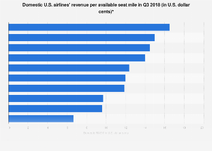

## Table of Contents

## What is Revenue Per Available Seat Mile (RASM)?

Revenue Per Available Seat Mile (RASM) is a measure used by airlines to show how much money they make for each seat they fly one mile. It helps airlines understand how well they are doing at making money from the seats they have available. To calculate RASM, you take the total revenue earned by the airline and divide it by the total number of seat miles available. This number is important because it shows how efficiently an airline is using its seats to make money.

RASM is useful for comparing the performance of different airlines or for tracking an airline's performance over time. If an airline's RASM goes up, it means they are making more money per seat mile, which is good. If it goes down, it might mean they need to find ways to increase their revenue or reduce the number of available seat miles. By looking at RASM, airlines can make better decisions about pricing, routes, and how to manage their fleet to improve their financial performance.

## How is RASM calculated?

RASM is calculated by taking the total revenue an airline makes and dividing it by the total number of available seat miles. The total revenue includes money from tickets, fees, and other services. Available seat miles are found by multiplying the number of seats on a plane by the number of miles that plane flies. So, if an airline has 100 seats on a plane and flies 1,000 miles, they have 100,000 available seat miles for that flight.

To get RASM, you divide the total revenue by the total available seat miles. For example, if an airline makes $50,000 from a flight and has 100,000 available seat miles, the RASM would be $50,000 divided by 100,000, which equals $0.50. This means the airline earns $0.50 for each seat they fly one mile. RASM helps airlines see how well they are doing at making money from the seats they have available.

## Why is RASM important for airlines?

RASM is important for airlines because it tells them how much money they make for each seat they fly one mile. This helps them see if they are doing a good job at making money from the seats they have. If RASM is high, it means the airline is making more money per seat mile, which is good. If RASM is low, it might mean they need to change something, like how much they charge for tickets or which routes they fly.

Airlines use RASM to compare themselves with other airlines or to see how they are doing over time. By looking at RASM, airlines can make better decisions about how to run their business. They might decide to change their prices, fly different routes, or use their planes in a different way to make more money. RASM is a simple but powerful tool that helps airlines understand their financial health and plan for the future.

## What factors can affect RASM?

Many things can change RASM for airlines. One big thing is how much people pay for tickets. If ticket prices go up, RASM can go up too because the airline makes more money for each seat. But if ticket prices go down, RASM can go down. Another thing that affects RASM is how full the planes are. If more people buy tickets and the planes are full, RASM can go up because the airline makes money on more seats. But if planes are empty, RASM can go down.

Other things that can change RASM include the routes the airline flies and how much they charge for extra services. If an airline flies to popular places where people want to go, they might be able to charge more for tickets, which can make RASM go up. Also, if an airline makes more money from things like baggage fees or food on the plane, that can help RASM too. But if fuel prices go up, the airline might have to spend more money to fly, which can make RASM go down if they can't charge more for tickets.

## How does RASM differ from other airline metrics like yield?

RASM and yield are both important numbers for airlines, but they measure different things. RASM, or Revenue Per Available Seat Mile, tells us how much money an airline makes for each seat they fly one mile. It includes all the money the airline makes, like ticket sales, fees for bags, and money from food and drinks. Yield, on the other hand, is about how much money an airline makes from each passenger for each mile they fly. It only looks at the money from tickets, not other things like fees.

While RASM gives a broad view of how well an airline is doing at making money from all its seats, yield focuses just on the money from tickets. RASM is useful for understanding the overall financial health of an airline, including how well they use their planes and how much they make from extra services. Yield is helpful for looking at how much people are willing to pay for tickets and can help airlines decide on pricing strategies. Both numbers are important, but they help airlines answer different questions about their business.

## Can you provide an example of how to calculate RASM?

Let's say an airline has a plane with 200 seats, and they fly it 500 miles. That means they have 200 seats times 500 miles, which equals 100,000 available seat miles for that flight. Now, if they make $30,000 from ticket sales, baggage fees, and food on that flight, we can figure out their RASM. We do this by dividing the total revenue, which is $30,000, by the total available seat miles, which is 100,000. So, $30,000 divided by 100,000 equals $0.30. This means the airline makes $0.30 for each seat they fly one mile on that flight.

RASM is useful because it helps airlines see how well they are doing at making money from all the seats they have. If another airline flies the same route but makes more money per seat mile, they might be doing a better job at pricing their tickets or filling their planes. By looking at RASM, airlines can decide if they need to change their prices, fly different routes, or find other ways to make more money from the seats they have available.

## How do airlines use RASM to make strategic decisions?

Airlines use RASM to figure out if they are making enough money from the seats on their planes. If RASM is high, it means they are doing well and making good money for each seat they fly. If RASM is low, it might mean they need to change something. They might decide to raise ticket prices or offer more services like food and drinks to make more money. Or, they might look at flying to different places where people are willing to pay more for tickets.

Airlines also use RASM to compare themselves with other airlines. If another airline has a higher RASM on the same route, it might mean they are doing something better, like filling more seats or charging more for tickets. By looking at RASM, airlines can see where they need to improve. They might decide to change their marketing to attract more passengers, or they might decide to use their planes in a different way to make more money. RASM helps airlines make smart choices about how to run their business and make more money.

## What are the industry benchmarks for RASM?

RASM, or Revenue Per Available Seat Mile, is a number that airlines use to see how much money they make for each seat they fly one mile. Industry benchmarks for RASM can change a lot because they depend on things like the type of airline, the routes they fly, and what's happening in the economy. For big airlines that fly all over the world, a good RASM might be around 12 to 15 cents per available seat mile. But for smaller airlines that fly shorter routes, a good RASM might be different, maybe around 10 to 13 cents.

These numbers are just examples and can change over time. Airlines look at these benchmarks to see if they are doing well compared to other airlines. If an airline's RASM is lower than the benchmark, it might mean they need to find ways to make more money, like raising ticket prices or adding more services. If their RASM is higher, it means they are doing a good job at making money from the seats they have. By keeping an eye on these benchmarks, airlines can make better decisions about how to run their business and stay competitive.

## How does RASM vary across different airline business models?

RASM can be different for different types of airlines. For big airlines that fly all over the world, their RASM might be higher because they can charge more for long flights and offer lots of extra services like fancy meals and better seats. These airlines often have a RASM around 12 to 15 cents per available seat mile. But for smaller airlines that fly shorter routes, their RASM might be lower because they can't charge as much for tickets and might not offer as many extra services. These airlines might have a RASM around 10 to 13 cents per available seat mile.

Low-cost airlines, which focus on keeping prices low and offering fewer services, have a different way of making money. They try to fill as many seats as possible and might charge for things like bags and food. Their RASM can be lower than big airlines, maybe around 8 to 11 cents per available seat mile, but they make up for it by flying more often and keeping their costs down. Each type of airline looks at RASM to see if they are making enough money from the seats they have, and they use it to decide if they need to change their prices or services.

## What are the limitations of using RASM as a performance metric?

RASM is a good way for airlines to see how much money they make for each seat they fly, but it has some problems. One big problem is that RASM doesn't tell the whole story about how an airline is doing. It only looks at the money coming in, not the money going out. So, an airline might have a high RASM but still lose money if their costs are too high. Also, RASM can be different for different types of airlines, so it's hard to compare them fairly. A big airline that flies long distances might have a higher RASM than a small airline that flies short routes, but that doesn't mean the big airline is doing better overall.

Another problem with RASM is that it can be affected by things the airline can't control, like the price of fuel or what's happening in the economy. If fuel prices go up, an airline might have to charge more for tickets, which can make their RASM go up, but it doesn't mean they are making more money overall. Also, RASM doesn't show how full the planes are. An airline could have a high RASM because they charge a lot for tickets, but if their planes are empty, they might still lose money. So, while RASM is a helpful number, airlines need to look at other things too to really understand how they are doing.

## How has RASM evolved over time in the airline industry?

Over the years, RASM in the airline industry has gone up and down because of many different things. When the economy is doing well, people fly more and are willing to pay more for tickets, which can make RASM go up. But when the economy is bad, people might not fly as much, and airlines might have to lower their prices, which can make RASM go down. Also, changes in the price of fuel can affect RASM. If fuel gets more expensive, airlines might have to charge more for tickets to cover their costs, which can make RASM go up. But if fuel prices drop, they might lower ticket prices, and RASM could go down.

Another thing that has changed RASM over time is how airlines run their business. In the past, many airlines offered lots of services like meals and better seats, which could make RASM go up because they could charge more for tickets. But now, more airlines are trying to keep costs down by offering fewer services and charging for things like bags and food. This can make RASM go up if they can fill more seats and make money from these extra services. Also, new technology and better ways to manage flights have helped airlines fly more efficiently, which can affect RASM too. So, RASM has changed over time because of the economy, fuel prices, and how airlines do business.

## What advanced analytics can be applied to improve RASM?

Airlines can use advanced analytics to improve their RASM by looking at a lot of data to find patterns and make smart decisions. They can use something called predictive analytics to guess how many people will want to fly on certain days and times. This helps them set ticket prices just right so they can fill more seats and make more money. They can also use machine learning to look at things like when people buy tickets, how much they are willing to pay, and what routes are popular. This helps airlines change their prices and routes to make more money from each seat they fly.

Another way advanced analytics can help is by looking at customer behavior. Airlines can use data to see what kinds of services people like and are willing to pay for, like better seats or food on the plane. By offering the right services at the right price, airlines can make more money from each passenger. Also, analytics can help airlines find new ways to save money, like flying more direct routes or using their planes in a smarter way. By using all this data, airlines can make better choices to improve their RASM and make more money overall.

## What is RASM?

RASM, which stands for Revenue per Available Seat Mile, is a key metric used to assess an airline's financial performance. This metric provides a measurement of how effectively an airline generates revenue relative to its seating capacity over a mile. It is calculated using the formula:

$$
\text{RASM} = \frac{\text{Total Operating Revenue}}{\text{Available Seat Miles (ASM)}}
$$

Total operating revenue includes all the income an airline earns from its operations, which can be from ticket sales, baggage fees, ancillary services, and other revenue streams. Available Seat Miles (ASM) represents the total number of seat miles available for sale, calculated by multiplying the number of available seats by the miles flown.

RASM serves as an indicator of how well an airline is utilizing its seats to generate income. A higher RASM suggests that the airline is experiencing strong demand for its services, employing effective pricing strategies, or achieving high operational efficiency. It reflects the airline's ability to maximize revenue from each seat offered over a mile, thus providing insights into its market competitiveness and performance.

## How is RASM calculated?

RASM, or Revenue per Available Seat Mile, is a straightforward yet powerful metric used in the airline industry to assess the efficiency of revenue generation relative to seating capacity. To compute RASM, the formula used is: 

$$
\text{RASM} = \frac{\text{Total Operating Revenues}}{\text{Available Seat Miles (ASM)}}
$$

This calculation provides a clear perspective on how effectively an airline is utilizing its seats to generate revenue. Total Operating Revenues encompass income from various sources such as passenger fares, baggage fees, and ancillary services, while Available Seat Miles (ASM) represent the total number of seats available multiplied by the miles flown. The result is a ratio indicating average revenue earned for every mile each seat is available for sale, helping airlines gauge market demand, pricing strategies, and operational efficiency.

Airlines commonly report RASM in their financial statements, offering stakeholders transparency into the revenue performance measured against their offered capacity. This metric aids investors and analysts in benchmarking an airline's financial health against industry peers and understanding its ability to capitalize on its fleet's capacity.

## How does RASM compare with other metrics like CASM and RPM?

Cost per Available Seat Mile (CASM) and Revenue Passenger Mile (RPM) are essential metrics that complement Revenue Per Available Seat Mile (RASM) in evaluating an airline's performance. Together, they provide a holistic understanding of an airline's financial and operational efficiency.

CASM is a metric that measures the cost efficiency of an airline by evaluating the expenses incurred per available seat mile. It is calculated by dividing the total operating expenses by the total available seat miles (ASM):

$$
\text{CASM} = \frac{\text{Total Operating Expenses}}{\text{Available Seat Miles (ASM)}}
$$

This metric helps airlines understand how effectively they are managing their costs in relation to the seating capacity offered, providing insights into cost containment measures and operational efficiency. A lower CASM indicates better cost management, enabling airlines to improve profitability by either increasing revenue through RASM or reducing expenditures.

RPM, on the other hand, assesses the revenue generation from passengers for each mile traveled. It is calculated by multiplying the number of revenue-paying passengers by the distance traveled:

$$
\text{RPM} = \text{Number of Passengers} \times \text{Miles Flown}
$$

While RASM provides a view of revenue relative to capacity, RPM focuses on actual revenue collected based on passenger traffic.

Analyzing the interplay between RASM, CASM, and RPM is crucial for airlines to optimize both revenue and cost structures. For example, an airline might achieve high RASM through strong demand and efficient pricing but could still face financial challenges if CASM is disproportionately high. Similarly, a solid RPM indicates good passenger traffic, but only when aligned with RASM and CASM can it translate into overall financial success.

By understanding these metrics collectively, airlines can identify strategies to balance revenue and costs, such as optimizing route networks, adjusting flight frequencies, or enhancing ancillary revenues. This comprehensive approach ensures sustainable financial health and competitiveness in the airline market.

## References & Further Reading

[1]: Belobaba, P., Odoni, A., & Barnhart, C. (2009). ["The Global Airline Industry."](https://onlinelibrary.wiley.com/doi/book/10.1002/9780470744734) Wiley.

[2]: Hansen, M. (2002). ["Micro-level Analysis of Airline Cost and Productivity."](https://www.sciencedirect.com/science/article/abs/pii/S096969970100045X) Transportation Research Record.

[3]: Boyd, E. A. (2007). ["Revenue Management as a Mechanism to Optimise Airline Revenue."](https://www.jstor.org/stable/4134011) Journal of Transportation and Logistics.

[4]: ["Airline Operations and Management: A Management Textbook by Gerald N. Cook and Bruce Billig."](https://www.taylorfrancis.com/books/mono/10.4324/9781003290308/airline-operations-management-gerald-cook-bruce-billig) Routledge. 

[5]: Kimms, A., & König, A. (2005). ["Simulation Approaches for Revenue Management in the Airline Industry."](https://www.sciencedirect.com/science/article/abs/pii/S0305048315001383) In Operations Research Proceedings 2004.