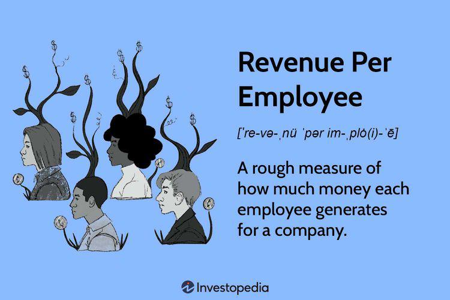

Business performance metrics are essential tools for evaluating and enhancing the success of any organization, particularly within the financial sector. These metrics serve as quantifiable measures used to assess various aspects of a business's productivity and financial health. Among these metrics, revenue per employee stands out as a key performance indicator, offering insights into how efficiently a business is utilizing its workforce. This metric is calculated by dividing total revenue by the number of employees, providing a straightforward measure of workforce productivity. For instance, a higher revenue per employee typically indicates that a company is generating more income for each person on its payroll, reflecting effective operational strategies and resource management.

Algorithmic trading, a sophisticated method employed mostly in the financial markets, heavily depends on performance metrics to evaluate the viability and efficiency of trading strategies. By employing complex mathematical models and algorithms to make trading decisions, algorithmic trading relies on precise and timely measures to ensure optimal execution. Key performance metrics such as the Sharpe ratio, win rate, and maximum drawdown are vital for assessing risk, return, and overall strategy effectiveness in this context.



This article will explore various financial metrics, with a particular focus on revenue per employee, and how these metrics correlate with business performance and algorithmic trading. Understanding and leveraging these metrics can provide businesses with a competitive edge, fostering growth and stability in a dynamic market environment.

## Table of Contents

## Understanding Financial Metrics and Key Performance Indicators

Financial metrics and Key Performance Indicators (KPIs) are essential tools in the assessment of any business's performance. These metrics serve as quantifiable measures that companies use to evaluate their success and efficiency over time. By providing a clear snapshot of how well a business is performing, financial metrics enable organizations to make informed decisions that can drive growth and improvement.

Financial metrics can be defined as numerical indicators derived from a company’s financial statements, reflecting different aspects of its financial performance. KPIs, on the other hand, are specific, measurable indicators that align with a company's strategic goals. They go beyond financial data to include non-financial performance measures, such as customer satisfaction or employee efficiency, providing a comprehensive view of organizational performance.

Among the most critical financial KPIs are revenue growth, net profit margin, and return on investment (ROI). Revenue growth measures the increase in a company's sales over a given period and is a direct indicator of the company's ability to expand its operations and market reach. To calculate revenue growth, the formula is:

$$

\text{Revenue Growth (\%)} = \left( \frac{\text{Current Period Revenue} - \text{Previous Period Revenue}}{\text{Previous Period Revenue}} \right) \times 100 
$$

Net profit margin offers insight into a company’s overall profitability by measuring how much of its revenue is translated into profit. This is calculated using the formula:

$$

\text{Net Profit Margin (\%)} = \left( \frac{\text{Net Profit}}{\text{Revenue}} \right) \times 100 
$$

A higher net profit margin indicates effective cost management and price optimization strategies, making it a critical [factor](/wiki/factor-investing) for operational improvements.

Return on Investment (ROI) assesses the efficiency of an investment in generating profits relative to its cost. The formula for ROI is:

$$

\text{ROI (\%)} = \left( \frac{\text{Net Profit from Investment}}{\text{Cost of Investment}} \right) \times 100 
$$

This metric allows businesses to evaluate the effectiveness of investment strategies and resource allocations, guiding strategic decision-making to optimize returns.

These financial metrics are instrumental in strategic decision-making and operational improvements. By analyzing trends and variances in these KPIs, organizations can identify areas that require attention, adjust their strategies accordingly, and allocate resources more effectively. In an increasingly competitive business environment, the ability to interpret and act on these metrics allows companies to enhance their performance, drive growth, and achieve their strategic objectives. Therefore, integrating financial metrics into regular performance assessments is indispensable for achieving long-term financial success.

## Revenue per Employee: A Measure of Efficiency

Revenue per employee is a critical financial metric that assesses how efficiently a company utilizes its human resources to generate revenue. It is calculated by dividing the total revenue of a company by the number of employees:

$$
\text{Revenue per Employee} = \frac{\text{Total Revenue}}{\text{Number of Employees}}
$$

This metric is significant as it provides insights into a company's operational efficiency and productivity. High revenue per employee indicates that a company can generate substantial revenue with a smaller workforce, suggesting efficient processes, innovative products, or effective management. Conversely, low revenue per employee may highlight issues such as overstaffing, inefficiencies, or a lack of market demand for the company’s products or services.

Several factors influence revenue per employee, making it essential to consider the context in which a company operates. Industry type is a primary determinant, as industries vary widely in their capital and labor intensity. For instance, technology companies often have higher revenue per employee due to their reliance on high-margin software or digital products, which require fewer employees compared to traditional manufacturing industries. In contrast, labor-intensive sectors such as hospitality may naturally exhibit lower revenue per employee metrics.

Employee turnover is another factor impacting this metric. High turnover can lead to increased training and recruitment costs, disrupting business operations and negatively affecting revenue generation. Companies with stable and satisfied workforces tend to maintain or improve their revenue per employee ratios as experienced staff are generally more productive.

The age of the company also plays a role. Startup companies may initially have lower revenue per employee as they invest in building their teams and infrastructure, whereas established companies can capitalize on economies of scale and a mature market presence to optimize this metric.

Different companies utilize revenue per employee for competitive advantage across various sectors. For example, technology giants like Apple and Google often report high revenue per employee figures due to their focus on innovation and high-value product offerings. In contrast, companies in the retail or consumer goods sectors might use this metric to streamline operations, automate processes, and improve supply chain efficiencies to boost their figures.

In conclusion, revenue per employee is a vital performance indicator, providing businesses with insights into how effectively they use their workforce to drive revenue. By analyzing this metric alongside industry benchmarks and internal factors such as employee retention and company maturity, businesses can make informed decisions to enhance their operational efficiency and competitive positioning.

## Algorithmic Trading and Performance Metrics

Algorithmic trading employs computer algorithms to automate trading decisions and transactions. These algorithms rely heavily on performance metrics to evaluate their efficiency and risks. Key performance metrics in [algorithmic trading](/wiki/algorithmic-trading) include win rate, maximum drawdown, and the Sharpe ratio.

1. **Win Rate**: This metric represents the proportion of profitable trades to the total number of trades executed by the algorithm. A higher win rate suggests a more consistently profitable strategy. Mathematically, the win rate is expressed as:
$$
   \text{Win Rate} = \left(\frac{\text{Number of Winning Trades}}{\text{Total Number of Trades}}\right) \times 100\%

$$

2. **Maximum Drawdown**: Maximum drawdown (MDD) measures the largest single drop in the portfolio's value, from peak to trough, during a specific period. It is a critical metric for assessing the risk of trading strategies. A smaller MDD indicates lesser volatility and potential loss. It can be depicted as:
$$
   \text{Maximum Drawdown} = \frac{\text{Peak Value} - \text{Trough Value}}{\text{Peak Value}}

$$

3. **Sharpe Ratio**: The Sharpe ratio evaluates the performance of an investment by adjusting for its risk. It is calculated by taking the difference between the returns of the investment and the risk-free rate, divided by the standard deviation of the investment's excess return. A higher Sharpe ratio suggests better risk-adjusted returns. The formula is given by:
$$
   \text{Sharpe Ratio} = \frac{E[R_i] - R_f}{\sigma_i}

$$

   where $E[R_i]$ is the expected return of the investment, $R_f$ is the risk-free rate, and $\sigma_i$ is the standard deviation of the excess return.

These metrics provide insights into the overall effectiveness and risk of trading strategies. A successful algorithmic trading strategy typically seeks to maximize the win rate and the Sharpe ratio while minimizing the maximum drawdown. Regular evaluation of these metrics helps traders adjust their strategies to optimize performance under varying market conditions.

## Improving Business Performance and Trading Strategies

Improving business performance and trading strategies involves a multi-faceted approach focusing on enhancing revenue per employee and refining algorithmic trading mechanisms. These strategic improvements are essential for businesses seeking to maintain a competitive edge and achieve better financial outcomes.

To improve revenue per employee, businesses must optimize workforce management and operational efficiency. Effective workforce management involves ensuring that employees are adequately trained, properly motivated, and optimally utilized. This can be achieved through measures such as professional development programs, performance incentives, and proper alignment of employee skills with job roles. Additionally, adopting technology solutions like automated processes can significantly enhance operational efficiency, reducing overhead costs and improving productivity.

Operational efficiency can be further improved by streamlining workflows, eliminating unnecessary tasks, and implementing data-driven decision-making processes. Employing data analytics allows businesses to identify bottlenecks and areas of wastage, thereby enabling more focused allocation of resources. Moreover, fostering a culture of continuous improvement where feedback is actively sought and implemented can lead to sustained enhancements in efficiency.

Enhancing algorithmic trading performance requires careful refinement of algorithms and diversification of strategies. Refining algorithms involves using advanced statistical techniques and [machine learning](/wiki/machine-learning) models to increase prediction accuracy and reduce biases in trading decisions. This includes regularly back-testing strategies against historical data to ensure robustness under different market conditions. 

A typical method is to optimize algorithms using metrics like the Sharpe ratio, win rate, and maximum drawdown. Here's a simple Python snippet that demonstrates how the Sharpe ratio can be calculated to evaluate an algorithm:

```python
import numpy as np

def calculate_sharpe_ratio(returns, risk_free_rate=0.0):
    excess_returns = returns - risk_free_rate
    return np.mean(excess_returns) / np.std(excess_returns)

# Example usage
daily_returns = np.array([0.01, 0.02, -0.005, 0.007, 0.015])
sharpe_ratio = calculate_sharpe_ratio(daily_returns)
print("Sharpe Ratio:", sharpe_ratio)
```

Diversification of algorithmic strategies helps mitigate risks associated with relying on a single approach. This can involve combining different trading models, time horizons, and asset classes to achieve a balanced risk-return profile. Diversification ensures that losses in one strategy can potentially be offset by gains in another, resulting in more stable overall performance.

Continuous evaluation and adaptation of strategies are crucial in maintaining alignment with dynamic market conditions. Regular evaluation involves assessing both quantitative metrics and qualitative factors that may affect business performance or trading success. This process necessitates staying abreast of market trends, regulatory changes, and technological advancements.

Strategies should be flexible enough to accommodate adjustments based on real-time data and changing circumstances. Incorporating machine learning can enhance the adaptability of trading algorithms, allowing them to learn from changing market patterns and improve over time.

In sum, augmenting business performance and algorithmic trading strategies necessitates a comprehensive approach that integrates workforce optimization, technological advancements, diversification of methods, and ongoing evaluation and refinement to thrive in fluctuating environments.

## Challenges and Considerations in Tracking Performance Metrics

Tracking performance metrics, especially key performance indicators (KPIs), involves several challenges that businesses must address to ensure accurate and meaningful analysis. One primary challenge is data accuracy. In an era where decision-making is increasingly data-driven, the integrity of data sources is critical. Errors in data collection, entry, or processing can lead to misleading metrics, which, in turn, can affect strategic decisions. Organizations must implement robust data management systems and validation processes to minimize inaccuracies. 

Algorithmic trading, heavily reliant on performance metrics, introduces specific challenges such as overfitting. Overfitting occurs when a trading model is excessively complex, capturing noise instead of the underlying market patterns. While it may perform exceptionally well on historical data, its effectiveness often diminishes in live trading due to its lack of generalization. To mitigate this, traders use techniques like cross-validation and divide the data into training, validation, and test sets. A simplified example in Python can illustrate this:

```python
from sklearn.model_selection import train_test_split
from sklearn.linear_model import LinearRegression
from sklearn.metrics import mean_squared_error

# Sample data
X, y = some_financial_data, some_market_results

# Split the data
X_train, X_valid, y_train, y_valid = train_test_split(X, y, test_size=0.2, random_state=42)

# Train the model
model = LinearRegression().fit(X_train, y_train)

# Validate the model
y_pred = model.predict(X_valid)
error = mean_squared_error(y_valid, y_pred)
print("Validation Error:", error)
```

Beyond quantitative metrics, integrating qualitative assessments is essential for a comprehensive evaluation. Quantitative data provides a numerical basis, but qualitative insights such as employee satisfaction or market sentiment offer context that may impact performance outcomes. A balanced evaluation considers both dimensions to form a holistic view of organizational health and strategic efficacy.

Moreover, the broader business environment plays a critical role in the interpretation of performance metrics. External factors like economic conditions, competitive landscape, regulatory changes, and technological advancements can significantly alter business dynamics. When tracking and analyzing performance metrics, it's important to contextualize them within these external parameters. This approach not only aids in identifying anomalies or shifts in trends but also assists strategic leaders in aligning organizational objectives with external realities, fostering adaptability and resilience.

## Conclusion

Financial metrics and key performance indicators (KPIs) play an essential role in establishing a competitive edge and enhancing business performance. By providing quantifiable data, these metrics enable companies to assess their operational efficiency and strategic alignment, ultimately leading to informed decision-making and the identification of growth opportunities. Among these metrics, revenue per employee is often utilized to gauge workforce efficiency, ensuring that human resources are optimally leveraged to generate maximum output.

To maintain and fortify their competitive position, businesses must commit to the regular review and adaptation of KPIs and trading strategies. The financial landscape is dynamic, influenced by market trends, technological advancements, and economic fluctuations. A static approach to performance measurement and strategy may result in missed opportunities or inefficiencies. Consequently, businesses should periodically evaluate their KPIs to ensure relevance and incorporate emerging metrics that provide a deeper understanding of performance.

Algorithmic trading, dependent on precise and robust metrics, exemplifies the need for continuous evaluation and adaptation. Metrics such as win rate, maximum drawdown, and Sharpe ratio are critical in gauging the effectiveness and risk of trading strategies. Regular assessment allows traders to refine algorithms and adapt them to shifting market dynamics, thereby optimizing returns and minimizing risk.

Moreover, leveraging financial metrics and KPIs fosters resilience and strategic agility within business operations. By establishing a strong foundation of data-driven insights, organizations can swiftly adapt to changing conditions, allocate resources more efficiently, and implement strategies that align with long-term objectives. This proactive approach not only mitigates risks associated with market [volatility](/wiki/volatility-trading-strategies) but also cultivates a culture of continuous improvement.

In conclusion, the strategic use of financial metrics and KPIs facilitates the identification of competitive advantages and boosts business performance. By committing to the regular evaluation and adaptation of these metrics, businesses can enhance their operational resilience and strategic agility, ensuring sustained success in an ever-evolving financial landscape.

## References & Further Reading

1. **Bodie, Z., Kane, A., & Marcus, A. J. (2021). Essentials of Investments. McGraw Hill.** 
   - This textbook provides a comprehensive overview of investment principles, detailing various financial metrics and their application in assessing investment opportunities, including algorithmic trading strategies.

2. **Chan, E. (2009). Quantitative Trading: How to Build Your Own Algorithmic Trading Business. John Wiley & Sons.**
   - This book offers practical insights into algorithmic trading, explaining essential performance metrics such as Sharpe ratio and win rate. It is an excellent resource for anyone looking to understand the quantifiable aspects of trading strategies.

3. **Sharpe, W. F. (1966). Mutual Fund Performance. The Journal of Business, 39(1), 119-138.**
   - William Sharpe introduces the Sharpe ratio, a measure of risk-adjusted return, which is a crucial metric in evaluating the effectiveness of trading strategies. This paper is fundamental for understanding performance measurement in investments.

4. **Pike, R., & Neale, B. (2006). Corporate Finance and Investment: Decisions and Strategies. Pearson Education.**
   - This resource discusses the application of various financial metrics and key performance indicators in strategic decision-making, offering insights into how businesses can improve operational efficiency.

5. **Hull, J. C. (2015). Options, Futures, and Other Derivatives. Pearson.**
   - A staple in the field of derivatives and trading, this book provides an understanding of complex financial instruments and the metrics used to evaluate trading decisions and risk.

6. **Fabozzi, F. J., Focardi, S. M., & Kolm, P. N. (2010). Quantitative Equity Investing: Techniques and Strategies. John Wiley & Sons.**
   - It focuses on quantitative approaches to equity investing, highlighting key performance indicators that inform strategy formulation and assessment in algorithmic trading environments.

7. **GitHub - alpaca-backtrader-api/alpaca-backtrader-api: Interface for Backtrader with Alpaca's trading API.** 
   - A practical open-source resource for algorithmic traders interested in utilizing Python-based backtesting and trading strategies, integrating easily with real-time financial metrics tracking.

8. **Investopedia. Financial Metrics.**
   - An easily accessible online resource that provides detailed explanations of various financial metrics and key performance indicators for businesses and traders looking to enhance their knowledge in this area.

