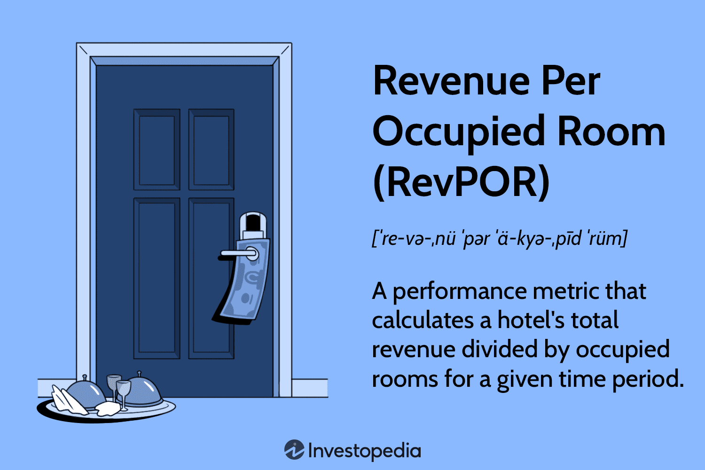

## Table of Contents

## What is Revenue Per Occupied Room (RevPOR)?

Revenue Per Occupied Room (RevPOR) is a measure used in the hospitality industry to understand how much money a hotel makes from each room that is being used. It is calculated by taking the total revenue generated from occupied rooms and dividing it by the number of rooms that were occupied during a specific period. This measure helps hotel managers see how well they are doing in terms of making money from the rooms that guests are actually using.

RevPOR is useful because it gives a clearer picture of the revenue generated per room, compared to other metrics like Revenue Per Available Room (RevPAR), which includes rooms that are not occupied. By focusing on occupied rooms, RevPOR can help hotels understand the effectiveness of their pricing strategies and additional services offered to guests. This can lead to better decisions on how to increase revenue from the rooms that are in use.

## How is RevPOR calculated?

RevPOR, or Revenue Per Occupied Room, is calculated by taking the total revenue from all occupied rooms and dividing it by the number of rooms that were occupied. This gives you the average amount of money made from each room that had a guest staying in it.

For example, if a hotel made $10,000 from rooms that were occupied over a certain period, and 50 rooms were occupied during that time, the RevPOR would be $10,000 divided by 50, which equals $200. This simple calculation helps hotels understand how much money they are making from the rooms that are actually being used by guests.

## Why is RevPOR important for hotels?

RevPOR is important for hotels because it shows how much money they make from each room that has a guest. This helps hotel managers see if they are doing a good job at making money from the rooms that are being used. By looking at RevPOR, hotels can figure out if they need to change their prices or offer more things to guests to make more money.

Also, RevPOR is different from other measures like RevPAR, which looks at all rooms, even the empty ones. RevPOR only focuses on the rooms with guests, so it gives a clearer picture of how well the hotel is doing with the rooms that are actually being used. This can help hotels make better choices about how to increase their earnings from the rooms that are occupied.

## How does RevPOR differ from Revenue Per Available Room (RevPAR)?

RevPOR and RevPAR are both used by hotels to see how much money they are making, but they look at different things. RevPOR, or Revenue Per Occupied Room, only counts the money made from rooms that have guests in them. It shows how much a hotel earns from each room that is actually being used. This helps hotels understand if they are charging enough or if they should offer more services to make more money from the rooms that are occupied.

On the other hand, RevPAR, or Revenue Per Available Room, looks at all the rooms in the hotel, whether they are full or empty. It gives a broader view of how well the hotel is doing overall, including how well it fills up its rooms. RevPAR can be useful for seeing how the hotel is doing compared to other hotels, but it doesn't tell you as much about how much money is being made from the rooms that are actually being used by guests.

## What are the key factors that influence RevPOR?

Several things can affect how much money a hotel makes from each room that has a guest, which is called RevPOR. One big thing is the price of the room. If a hotel charges more for its rooms, the RevPOR will go up, as long as people are still willing to pay that price. Another [factor](/wiki/factor-investing) is how much extra money the hotel can make from things like room service, mini-bar sales, or special packages. If guests spend more on these extras, the RevPOR will be higher.

The type of guests staying at the hotel also matters. Business travelers might be willing to pay more and spend more on extras than families on vacation, which can change the RevPOR. The hotel's location and the time of year can also make a difference. Hotels in busy cities or during peak travel times might be able to charge more and have higher RevPOR. Finally, how well the hotel takes care of its guests can influence RevPOR. If guests are happy, they might spend more money and come back, which helps keep the RevPOR high.

## How can hotels improve their RevPOR?

Hotels can improve their RevPOR by adjusting their room rates. If they see that guests are willing to pay more, they can increase the price of the rooms. This will make more money from each room that is occupied. Another way is to offer more things that guests might want to buy, like special room service menus or packages that include spa treatments or meals. If guests spend more on these extras, the hotel will make more money from each occupied room.

The type of guests staying at the hotel also matters. Hotels can target business travelers who might spend more on rooms and extras, which can boost RevPOR. They can also focus on making guests happy by providing excellent service. Happy guests are more likely to spend more money and come back, which helps keep the RevPOR high. By understanding what their guests want and offering it at the right price, hotels can make more money from the rooms that are being used.

## Can RevPOR be used to compare performance across different types of accommodations?

Yes, RevPOR can be used to compare the performance of different types of accommodations, like hotels, resorts, and bed and breakfasts. It shows how much money each place makes from the rooms that are actually being used by guests. This helps to see which type of accommodation is doing a better job at making money from the rooms they have filled.

However, it's important to remember that different types of accommodations might have different goals and services. A luxury resort might have a higher RevPOR because it charges more for rooms and offers many extras, while a budget hotel might have a lower RevPOR but still be doing well for its type of business. So, when comparing RevPOR across different types of accommodations, it's helpful to think about what each place is trying to achieve and what kind of guests they are serving.

## What are the limitations of using RevPOR as a performance metric?

RevPOR, or Revenue Per Occupied Room, can be a useful way for hotels to see how much money they make from each room that has a guest. But it has some problems. One big problem is that RevPOR doesn't tell you anything about how full the hotel is. A hotel could have a high RevPOR but still have lots of empty rooms, which means they are not making as much money as they could. Also, RevPOR doesn't help you compare hotels that are very different. A fancy hotel might have a higher RevPOR than a budget hotel, but that doesn't mean the fancy hotel is doing better overall.

Another issue with RevPOR is that it can be affected by things that the hotel can't control, like the economy or big events happening nearby. If there's a big convention in town, the RevPOR might go up because more people are willing to pay for rooms. But if there's a recession, the RevPOR might go down even if the hotel is doing a good job. So, while RevPOR can show how much money a hotel is making from the rooms that are full, it doesn't give the whole picture of how well the hotel is doing.

## How does RevPOR relate to other key performance indicators in the hospitality industry?

RevPOR is one of many key performance indicators (KPIs) used in the hospitality industry, and it relates to others like RevPAR, Average Daily Rate (ADR), and Occupancy Rate. RevPAR, or Revenue Per Available Room, looks at the total revenue from all rooms, whether they are full or empty, while RevPOR only counts the revenue from rooms that are occupied. This makes RevPOR a good way to see how much money the hotel makes from the rooms that are actually being used by guests. On the other hand, ADR, or Average Daily Rate, shows the average price that guests pay for a room each night. If ADR goes up, and the hotel can keep its rooms full, RevPOR will also go up because the hotel is making more money from each occupied room.

Occupancy Rate, which is the percentage of rooms that are filled, also affects RevPOR. If a hotel has a high Occupancy Rate, it means more rooms are being used, which can help increase the total revenue from occupied rooms. But if the Occupancy Rate is low, even if the ADR is high, the RevPOR might not be as good because fewer rooms are contributing to the total revenue. By looking at these different KPIs together, hotel managers can get a better understanding of their performance and make smart decisions about pricing, promotions, and services to improve their RevPOR and overall success.

## What role does pricing strategy play in maximizing RevPOR?

Pricing strategy is really important for hotels that want to make more money from each room that has a guest, which is called RevPOR. If a hotel can charge more for its rooms and still have them full, the RevPOR will go up. Hotels need to figure out how much people are willing to pay and then set their prices at the right level. They can also change their prices depending on the time of year, special events, or how busy the hotel is. By doing this, they can make the most money from the rooms that are being used.

Hotels can also use different pricing strategies to offer special deals or packages that make guests want to spend more money. For example, they might offer a package that includes a room, meals, and spa services for a special price. If guests like these deals, they will spend more money, which helps the hotel's RevPOR. By understanding what guests want and setting the right prices, hotels can make more money from the rooms that are full and improve their overall RevPOR.

## How can data analytics be used to optimize RevPOR?

Data analytics can help hotels make more money from the rooms that are full by looking at lots of information and finding patterns. Hotels can use data to see what kinds of guests are staying with them, how much they are willing to pay, and what extra things they like to buy. By understanding this, hotels can set their room prices just right so they make the most money from each room that has a guest. They can also offer special deals or packages that guests will like, which helps increase the money they make from each occupied room.

Another way data analytics helps is by predicting when more people will want to stay at the hotel. By looking at past data, hotels can guess when busy times will be and set higher prices during those times. They can also see if there are times when the hotel is not as full and offer lower prices or special promotions to fill more rooms. This way, they can keep their rooms full and make more money from each room that has a guest, which makes their RevPOR go up.

## What advanced strategies can be implemented to enhance RevPOR in competitive markets?

In competitive markets, hotels can use advanced strategies to boost their RevPOR by focusing on personalized pricing and dynamic pricing models. Personalized pricing means using data to understand what each guest might be willing to pay and setting prices that match their willingness to spend. For example, if data shows that business travelers are willing to pay more, the hotel can offer them higher-priced rooms with added benefits like a free breakfast or late checkout. Dynamic pricing involves changing room rates based on demand, events, or even the time of day. By using real-time data to adjust prices, hotels can make sure they are always charging the most they can for each room, which helps increase the money they make from the rooms that are full.

Another strategy is to create unique experiences and packages that guests will want to buy. Hotels can use data to figure out what kinds of extras guests like, such as special dining experiences, guided tours, or wellness packages. By offering these at the right price, hotels can get guests to spend more money, which boosts RevPOR. Additionally, hotels can use loyalty programs and targeted marketing to keep guests coming back and spending more. By understanding their guests better and offering them what they want, hotels can make more money from each room that has a guest, even in a competitive market.

## What is RevPOR and why is it important?

RevPOR, or Revenue Per Occupied Room, is a critical performance metric in the hospitality industry, capturing the revenue generated from occupied rooms. Unlike RevPAR (Revenue Per Available Room), which considers overall room availability, RevPOR zeroes in on the spending by guests on a per-occupied-room basis. This includes additional revenue streams beyond the basic room rate, such as expenditures on room service, mini-bar items, and other in-room amenities.

The significance of RevPOR lies in its ability to provide nuanced insights into guest spending behaviors. Since it is calculated based on occupied rooms, RevPOR remains unaffected by seasonal occupancy variations, offering a more consistent measure of guest engagement with hotel services. This consistency enables hoteliers to assess the effectiveness of operational management and the appeal of ancillary services.

RevPOR serves as a tool for evaluating the internal management efficacy of hotel operations. By analyzing this metric, hotel managers can identify strengths and weaknesses in service offerings, optimize cross-selling opportunities, and enhance guest satisfaction. For example, if the RevPOR indicates that guests frequently engage with high-margin services such as spa treatments or in-room dining, hotels can focus on promoting these areas to further boost revenue.

To calculate RevPOR, the following formula is applied:

$$
\text{RevPOR} = \frac{\text{Total Revenue from Occupied Rooms}}{\text{Number of Occupied Rooms}}
$$

This metric is particularly instrumental for financial oversight, helping hotels to align strategic plans with actual performance and make necessary adjustments. Moreover, RevPOR highlights potential revenue maximization areas beyond room bookings, illustrating success in delivering additional service offerings. By optimizing these extra revenue streams, hotels can significantly enhance their overall financial health and guest experience, leveraging data-driven insights to drive sustained profitability and market competitiveness.

## What is the comparative analysis between RevPOR and RevPAR?

RevPAR (Revenue Per Available Room) and RevPOR (Revenue Per Occupied Room) are both critical metrics for hoteliers striving to maximize revenue and operational efficiency. While they are often discussed together, they differ fundamentally in scope and application.

RevPAR is defined as:

$$
\text{RevPAR} = \frac{\text{Total Room Revenue}}{\text{Total Available Rooms}}
$$

This metric gives a comprehensive view of revenue generated across the entire hotel, considering both the average daily rate (ADR) and the occupancy rate. It provides insights into market positioning and the hotel's appeal relative to competitors, as it encapsulates the revenue-generating capacity of all available rooms. By factoring in unoccupied rooms, RevPAR helps hoteliers assess the effectiveness of their pricing strategies and overall demand management.

In contrast, RevPOR is calculated as:

$$
\text{RevPOR} = \frac{\text{Total Revenue from Occupied Rooms}}{\text{Total Occupied Rooms}}
$$

RevPOR zooms in on the revenue derived specifically from occupied rooms, making it a more focused metric for understanding guest spending behavior. It often reflects the success of ancillary services and in-room offerings such as dining, mini-bar usage, and other paid amenities. RevPOR is particularly useful for internal operational refinement, identifying potential areas where the hotel can boost income without necessarily increasing room bookings.

Both RevPAR and RevPOR are crucial, but they serve different strategic purposes. RevPAR offers a macro-level perspective essential for evaluating market positioning, while RevPOR provides a micro-level view that aids in fine-tuning internal processes and enhancing guest satisfaction through improved service offerings.

Integratively using RevPAR and RevPOR can provide a comprehensive financial picture, enabling hoteliers to refine pricing strategies effectively and enrich the overall guest experience. By leveraging the strengths of both metrics, hotels can navigate the complexities of the hospitality industry more adeptly, ensuring a balanced approach to revenue management that combines market insight with operational excellence.

## References & Further Reading

[1]: Cross, R. G., Higbie, J. A., & Cross, D. Q. (2009). ["Milestones in the Application of Analytical Pricing and Revenue Management."](https://journals.sagepub.com/doi/full/10.1177/1938965508328716) Journal of Revenue and Pricing Management.

[2]: Enz, C. A., Canina, L., & Lomanno, M. V. (2009). ["Competitive hotel pricing in uncertain times."](https://www.researchgate.net/publication/247785147_Competitive_Pricing_Decisions_in_Uncertain_Times) Cornell Hospitality Quarterly.

[3]: Phillips, R. L. (2005). ["Pricing and Revenue Optimization."](https://archive.org/details/pricingrevenueop0000phil) Stanford Business Books.

[4]: Talluri, K. T., & Van Ryzin, G. J. (2004). ["The Theory and Practice of Revenue Management."](https://link.springer.com/book/10.1007/b139000) Springer.

[5]: Anderson, C. K., & Xie, X. (2010). ["Improving hospitality industry sales: Twenty-five years of revenue management."](https://journals.sagepub.com/doi/abs/10.1177/1938965509354697) Cornell Hospitality Quarterly.