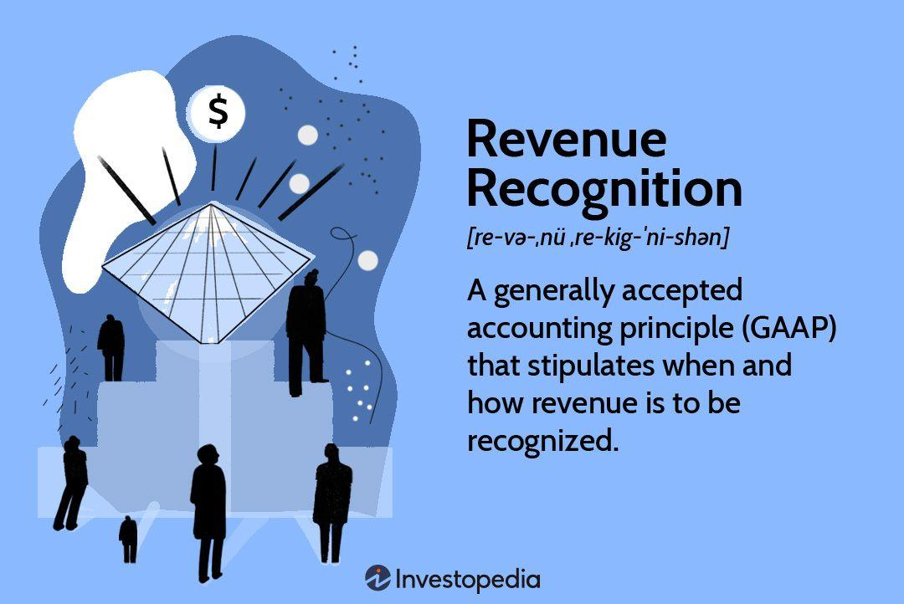

In the ever-evolving world of finance and technology, revenue recognition and algorithmic trading stand as pillars for businesses seeking efficiency and regulatory compliance. Understanding the foundational concepts of accounting processes and integrating them with modern trading algorithms is a crucial need for financial professionals. Revenue recognition, a fundamental accounting principle, dictates the specific conditions under which income becomes realized, thus providing a realistic overview of a company's financial health. Algorithmic trading, on the other hand, employs computer programs to analyze market data and execute trading orders at speeds that far exceed human capability, boosting market liquidity and minimizing transaction costs.

This article explores the synergy between accounting processes, particularly revenue recognition, and the functionality of algorithmic trading. By examining the intersection of these domains, we aim to enhance your comprehension and application of these critical financial processes. A thorough understanding of how accounting principles can be married with trading algorithms allows for more informed decision-making, aligning trading strategies with financial objectives and regulatory requirements. Additionally, this integration can boost transparency and build trust among stakeholders by ensuring that financial reporting and trading activities are accurately aligned and compliant with standards.



From general principles to specific processes, we will unravel the intricate connections underpinning these important finance sectors. The convergence of revenue recognition principles and algorithmic trading techniques represents a frontier in financial operations, promising enhanced operational efficiency, compliance, and strategic clarity.

## Table of Contents

## Understanding the Accounting Process

The accounting process serves as the backbone of financial reporting, focusing on producing accurate and reliable financial statements. It encompasses several key steps:

1. **Transaction Recording:** The first essential step in the accounting process involves capturing all financial transactions. These include sales revenue, expenses, asset acquisitions, and other financial activities. Each transaction is documented via source documents, such as invoices or receipts, which are then recorded in appropriate journals.

2. **Ledger Maintenance:** After recording transactions, the next step involves posting these entries to respective ledger accounts. These accounts compile transactions of a similar nature, aiding in the organization and tracking of financial data. The ledger is a critical component in ensuring the accuracy of financial statements, as it provides a consolidated view of all transactions made by a company.

3. **Statement Preparation:** Building on the ledger’s information, financial statements such as the balance sheet, income statement, and cash flow statement are prepared. These documents provide a comprehensive overview of a company's financial health, detailing its revenue, expenses, assets, liabilities, and cash operations.

A structured accounting process provides multiple benefits. Primarily, it ensures compliance with accounting standards, such as Generally Accepted Accounting Principles (GAAP) or International Financial Reporting Standards (IFRS), fostering trust and transparency with stakeholders. Moreover, having accurate and well-maintained financial records significantly aids in decision-making by offering valuable insights that can guide strategic planning and operational adjustments. Furthermore, rigorous financial analysis and performance assessment rely on these precise records to evaluate a company’s financial health over time.

As businesses expand, the [volume](/wiki/volume-trading-strategy) of financial data increases, creating both challenges and opportunities for the accounting process. Automating these processes through advanced accounting software can revolutionize financial management by improving both efficiency and accuracy. Automation reduces manual errors, facilitating faster processing of transactions and timely preparation of financial statements. Automating repetitive tasks also allows accountants to focus on higher-value activities, such as financial analysis and strategic planning, thereby enhancing the overall efficiency of financial operations. In summary, a robust and automated accounting process is indispensable for businesses aiming for sustainable growth and financial stability.

## Revenue Recognition Principles

Revenue recognition is a fundamental element of accounting that establishes the conditions and timing for when income should be acknowledged in a company’s financial records. This principle is critical in ensuring that financial statements truly reflect the economic realities of a business, providing both consistency and transparency for stakeholders. The establishment of ASC 606 and IFRS 15 standards marked a significant evolution in revenue recognition practices, introducing a comprehensive five-step model applicable across various industries. 

ASC 606 and IFRS 15 aim to standardize revenue reporting by ensuring that revenues are documented only when they are both earned and realizable. This is achieved through a methodical approach that enhances comparability across financial statements. The central framework under these standards involves:

1. **Identifying Contracts with Customers**: This initial step involves recognizing the agreement between two or more parties to create enforceable rights and responsibilities. A contract must meet specific criteria, such as having commercial substance and being approved by all involved parties.

2. **Identifying Performance Obligations**: Organizations must distinguish the distinct goods or services agreed to be transferred to the customer. Each promised product or service—capable of standing alone—represents a separate performance obligation.

3. **Determining Transaction Price**: This involves setting the amount of consideration a company expects to be entitled to in exchange for the transfer of goods or services. Factors like variable consideration, financing components, and non-cash consideration are considered to achieve an accurate transaction price.

4. **Allocating the Transaction Price to Performance Obligations**: After determining the transaction price, businesses allocate this price to the identified performance obligations based on their relative standalone selling prices. This allocation should be systematic and logical to reflect the economic value delivered to the customer.

5. **Recognizing Revenue as Performance Obligations are Fulfilled**: Revenue is acknowledged when an entity satisfies a performance obligation by transferring a promised good or service to the customer, who then gains control over it. This can occur either at a specific point in time or over time, depending on the terms of the contract.

Understanding and meticulously applying these principles is vital for accountants and financial analysts. These standards not only affect how revenue is reported but also influence business valuations and the perception of a company’s financial health. Compliance with ASC 606 and IFRS 15 is integral for maintaining credibility and ensuring that financial statements reflect a true and fair view of an entity’s performance. The application of these principles supports informed decision-making by various stakeholders and aligns accounting practices with the economic substance of transactions.

## The Five Steps of Revenue Recognition

The five-step model of revenue recognition, as defined by the Accounting Standards Codification (ASC) 606 and the International Financial Reporting Standard (IFRS) 15, establishes a comprehensive framework aimed at ensuring consistency and transparency in recognizing revenue. Below is an exploration of each step in this model:

1. **Identifying Contracts with Customers**: A contract is an agreement between two or more parties that creates enforceable rights and obligations. For revenue recognition purposes, a contract must be approved, have clear payment terms, and both parties must demonstrate an ability and intention to fulfill the terms. In practice, companies must ascertain that the contract has commercial substance and rights to payment are present.

2. **Identifying Performance Obligations**: A performance obligation is a promise to transfer a distinct good or service to the customer. A single contract may have multiple performance obligations, and identifying them correctly is crucial. For business applications, this involves a thorough assessment of the goods and services promised to the customer and determining which ones should be accounted for separately.

3. **Determining the Transaction Price**: The transaction price is the amount of consideration a company expects to receive in exchange for transferring promised goods or services. This step requires companies to consider variable considerations, such as discounts, rebates, and performance bonuses. To estimate the transaction price, firms often utilize probability-weighted amounts or most likely amounts, depending on which method better predicts the amount of consideration.

4. **Allocating the Transaction Price to Performance Obligations**: Once the transaction price is determined, it must be allocated to each performance obligation based on the relative standalone selling prices of the goods or services. If standalone selling prices are not directly observable, estimation techniques, such as the adjusted market assessment approach or expected cost plus margin approach, are used.

5. **Recognizing Revenue as Performance Obligations are Fulfilled**: Revenue is recognized as the entity satisfies each performance obligation. This can occur either at a point in time or over time, depending on the nature of the obligation. For instance, if a service is provided over a contract period, revenue is recognized over time, generally based on input or output methods reflecting the transfer of control.

The practical application of these steps often necessitates a detailed understanding of the specific business context. For example, software companies might have complex contracts requiring extensive judgment to identify and allocate performance obligations accurately. Many companies have adopted technology solutions that integrate these steps with their accounting systems to automate and streamline the revenue recognition process, ensuring both compliance and operational efficiency. Advanced software tools can assist in data analysis and decision-making, thereby reducing manual errors and enhancing the precision of financial reporting.

## Algorithmic Trading: An Overview

Algorithmic trading employs sophisticated computer programs to automatically execute trading orders with minimal human intervention. This technology relies on algorithms to assess and interpret vast amounts of market data, facilitating trading decisions at speeds unattainable by human traders. Through the automation of trading processes, [algorithmic trading](/wiki/algorithmic-trading) has undergone significant changes within financial markets.

One of the core advantages of algorithmic trading is its ability to enhance market efficiency. By processing data and executing trades based on pre-defined criteria, these algorithms help decrease the bid-ask spread, thus, increasing market [liquidity](/wiki/liquidity-risk-premium). This improvement in liquidity ensures that securities can be bought and sold more efficiently, often at fairer prices, which contributes to the overall health of financial markets.

Moreover, algorithmic trading significantly reduces transactional costs. Traditional trading methods often involve higher costs due to manual processing. In contrast, algorithms can execute trades in volume and at reduced latency, optimizing the timing of orders to minimize market impact and taking advantage of price discrepancies across different trading platforms. This precision in execution allows for cost savings that are difficult to achieve through manual trading processes.

Understanding algorithmic trading is crucial for finance professionals aiming to enhance trading strategies and seize market opportunities. The use of algorithms enables the design and implementation of complex trading strategies that align with specific investment goals and risk tolerances. Advanced algorithmic strategies can include market-making, statistical [arbitrage](/wiki/arbitrage), and trend-following models, which utilize historical data and real-time analysis to predict market movements.

In practice, the algorithms used in trading can vary significantly in complexity. Basic strategies may involve simple moving averages or mean reversion tactics, while more advanced algorithms could use [machine learning](/wiki/machine-learning) techniques and [artificial intelligence](/wiki/ai-artificial-intelligence) to adapt to evolving market conditions. Implementing these strategies typically involves languages such as Python, popular for its extensive libraries and flexibility in handling data-intensive tasks. For example, using the `pandas` library in Python, traders can analyze historical price data and develop predictive models to inform trading decisions:

```python
import pandas as pd

# Load historical price data
data = pd.read_csv('market_data.csv')

# Calculate moving average
data['Moving Average'] = data['Price'].rolling(window=20).mean()

# Generate trading signals
data['Signal'] = 0
data['Signal'][20:] = np.where(data['Price'][20:] > data['Moving Average'][20:], 1, 0)
```

As such, algorithmic trading not only modernizes trade execution but also transforms strategic planning, offering financial professionals a robust toolset to navigate and leverage the complexities of contemporary markets.

## Integrating Revenue Recognition in Algorithmic Trading Strategies

Integrating revenue recognition principles into algorithmic trading strategies marks a crucial advancement in enhancing the accuracy and reliability of these automated systems. Algorithmic trading, which leverages computer algorithms to execute trades at speeds beyond human capability, is heavily dependent on accurate financial data. By incorporating robust revenue processes, algorithms can access precise and up-to-date financial information, allowing for more informed decision-making.

For instance, the accurate identification of revenue streams and timing, as guided by standards like ASC 606/IFRS 15, provides a clearer financial picture. This information enables trading algorithms to align closely with a company's financial forecasts and objectives. Such integration ensures that trading strategies are not only based on market data but also grounded in the financial realities of the company, thus aligning with both operational and regulatory goals.

Moreover, this alignment enhances transparency and trust among stakeholders. Accurate financial data fosters a deeper level of transparency, as stakeholders can see that trading activities are aligned with financial reporting. This transparency is critical in building trust and ensuring that financial representations reflect actual performance, which is essential for compliance and stakeholder relations.

Technology plays a pivotal role in this integration. Companies often use advanced data analytics and machine learning techniques to streamline revenue recognition processes and embed them within trading algorithms. For example, Python libraries such as Pandas and NumPy can be used for data preparation and analysis:

```python
import pandas as pd
import numpy as np

# Loading financial data
data = pd.read_csv('financial_data.csv')

# Calculating revenue earned based on performance obligations fulfilled
data['Revenue_Earned'] = np.where(data['Performance_Obligations_Fulfilled'] == True, 
                                  data['Transaction_Price'], 0)

# Analyzing the proportion of revenue recognized
total_revenue_recognized = data['Revenue_Earned'].sum()
print(f'Total Revenue Recognized: {total_revenue_recognized}')
```

By embedding such processes, trading algorithms can automatically adjust to reflect real-time financial conditions, thus improving strategy performance and compliance. Integrating revenue recognition with algorithmic trading not only ensures regulatory compliance and operational alignment but also positions companies for improved financial results and strategic advantage.

## Conclusion

The intertwining of accounting processes with algorithmic trading represents a significant step forward for businesses seeking greater accuracy and compliance. This convergence allows financial professionals to leverage the strengths of both disciplines, resulting in enhanced operational efficiency. By comprehensively understanding and implementing the principles of revenue recognition, such as ASC 606/IFRS 15, alongside advanced trading algorithms, firms can ensure that their trading decisions are informed by accurate financial data that reflects the true economic realities of their operations.

Staying informed about these developments is critical in the fast-paced world of finance, where technology continues to redefine industry standards. As algorithmic trading evolves, the ability to incorporate precise and timely revenue data becomes even more crucial. This amalgamation informs trading strategies and aligns them with the broader financial goals and regulatory frameworks that companies operate within, thus enhancing the accuracy and regulatory compliance of trading activities.

Ultimately, leveraging both domains can lead to informed decision-making, better compliance, and a stronger financial performance. By integrating robust accounting practices into algorithmic trading frameworks, firms can foster transparency and trust among stakeholders. This strategic synergy not only optimizes transaction execution and resource allocation but also reinforces the integrity and reliability of financial reporting, contributing to sustainable business success in an increasingly competitive landscape.

## References & Further Reading

[1]: ["Revenue from Contracts with Customers (ASC 606): A guide to Implementation"](https://fasb.org/page/PageContent?pageId=/projects/recentlycompleted/revenue-from-contracts-with-customers-topic-606-and-leases-topic-842effective-dates-postissuance-summary.html&isstaticpage=true) by Deloitte

[2]: ["IFRS 15 — Revenue from Contracts with Customers"](https://www.ifrs.org/content/dam/ifrs/publications/pdf-standards/english/2021/issued/part-a/ifrs-15-revenue-from-contracts-with-customers.pdf) by IAS Plus

[3]: Hull, J. C. (2018). ["Options, Futures, and Other Derivatives"](https://www.semanticscholar.org/paper/Options%2C-Futures%2C-and-Other-Derivatives-Hull/89bdee500c8623864fc9eb7a471546aa713acc44). Pearson Education.

[4]: ["Advances in Financial Machine Learning"](https://www.amazon.com/Advances-Financial-Machine-Learning-Marcos/dp/1119482089) by Marcos Lopez de Prado

[5]: ["Algorithmic Trading: Winning Strategies and Their Rationale"](https://play.google.com/store/books/details/Algorithmic_Trading_Winning_Strategies_and_Their_R?id=CIwCTVqEj4oC&hl=en-US) by Ernie Chan

[6]: ["Machine Learning for Algorithmic Trading"](https://github.com/stefan-jansen/machine-learning-for-trading) by Stefan Jansen