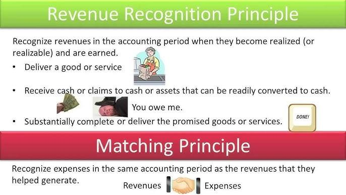

## Table of Contents

## What is revenue recognition in the context of accrual accounting?

Revenue recognition in the context of accrual accounting is the process of recording income when it is earned, not necessarily when the money is received. This means that if a company provides a service or delivers a product, it records the revenue at that time, even if the customer pays later. This method helps give a more accurate picture of a company's financial health because it matches the revenue with the expenses incurred to generate that revenue during the same period.

For example, if a company completes a project in December but doesn't get paid until January, under accrual accounting, the revenue is recognized in December. This approach contrasts with cash accounting, where revenue is only recorded when the payment is actually received. By recognizing revenue when it's earned, businesses can better track their performance and make more informed decisions about future operations and investments.

## How does revenue recognition differ between cash and accrual accounting?

Revenue recognition in cash accounting is simple: you record income only when you get the money. So, if you do a job in December but get paid in January, you write down the income in January. This method is easy to use and good for small businesses or people who want to keep track of their money in a straightforward way.

In accrual accounting, things are a bit different. You record income when you earn it, not when you get paid. So, if you finish a job in December but get paid in January, you still write down the income in December. This method gives a better picture of how your business is doing over time because it matches the money you earn with the costs you had to make that money, even if the payment comes later.

Both methods have their place. Cash accounting is easier to manage but might not show the full picture of your business's health. Accrual accounting is more complex but gives a clearer view of your financial performance by showing income and expenses in the same period they happen.

## What are the basic principles of revenue recognition under accrual accounting?

The basic idea of revenue recognition under accrual accounting is to record income when you earn it, not when you get the money. This means if you do a job or sell something, you write down the income right away, even if the customer pays you later. The main rule is to match the income with the costs that helped you earn that income. This way, you get a clear picture of how your business is doing during a specific time, like a month or a year.

Another important part of revenue recognition is making sure the income is real and can be measured. You need to be sure that you will get paid for the work you did or the products you sold. Also, you should be able to put a number on how much money you will get. This helps keep your financial records accurate and trustworthy. By following these principles, businesses can better understand their financial health and make smarter decisions.

## Can you explain the matching principle and its role in revenue recognition?

The matching principle is a key idea in accrual accounting. It says that you should record income and the costs that helped you earn that income in the same time period. This helps give a true picture of how your business is doing. For example, if you spend money on materials in January to make a product and sell it in February, you should record both the cost of the materials and the income from the sale in February. This way, you can see if you made a profit or a loss from that sale in the same month.

By using the matching principle, businesses can better understand their financial health. It helps you see if you're making money or losing money over time. If you only looked at when you got paid, you might think you're doing better than you really are because you wouldn't see the costs right away. The matching principle makes sure that your financial reports show the real story of your business's performance, helping you make smarter decisions about how to run your business.

## What are the criteria for recognizing revenue in accrual accounting?

In accrual accounting, you recognize revenue when you earn it, not when you get paid. This means if you finish a job or deliver a product, you record the income right away, even if the customer pays you later. The key is to make sure the income is real and you can measure it. You need to be sure you will get paid for the work you did or the products you sold, and you should be able to put a number on how much money you will get.

Another important rule is the matching principle, which says you should record the income and the costs that helped you earn that income in the same time period. This gives a clear picture of how your business is doing. For example, if you buy materials in January to make a product and sell it in February, you should record both the cost of the materials and the income from the sale in February. This way, you can see if you made a profit or a loss from that sale in the same month. By following these criteria, businesses can better understand their financial health and make smarter decisions.

## How do businesses record revenue under the accrual method?

Under the accrual method, businesses record revenue when they earn it, not when they get paid. This means if a business finishes a job or sells a product, they write down the income right away, even if the customer pays them later. For example, if a company does a job in December but gets paid in January, they still record the income in December. This helps show a true picture of how the business is doing during that time.

The key to recording revenue under the accrual method is making sure the income is real and can be measured. The business needs to be sure they will get paid for the work they did or the products they sold, and they should be able to put a number on how much money they will get. Another important rule is the matching principle, which says to record the income and the costs that helped earn that income in the same time period. This way, if a business buys materials in January to make a product and sells it in February, they record both the cost of the materials and the income from the sale in February. This helps the business see if they made a profit or a loss from that sale in the same month.

## What are some common challenges businesses face with revenue recognition in accrual accounting?

One common challenge businesses face with revenue recognition in accrual accounting is the complexity of tracking when revenue is earned. Unlike cash accounting, where you record income when you get paid, accrual accounting requires you to record income when you finish a job or deliver a product, even if the payment comes later. This can be hard to keep track of, especially for businesses with lots of ongoing projects or long-term contracts. It takes careful record-keeping and sometimes special software to make sure you're recording income at the right time.

Another challenge is making sure the income is real and can be measured accurately. In accrual accounting, you need to be sure you will get paid for the work you did or the products you sold, and you should be able to put a number on how much money you will get. This can be tricky if there are uncertainties about payment or if the value of the goods or services is hard to measure. Businesses need to use good judgment and sometimes make estimates, which can add to the complexity and risk of errors in their financial records.

The matching principle also adds to the challenges. This principle says you should record the income and the costs that helped you earn that income in the same time period. This means if you buy materials in one month to make a product and sell it in another month, you need to record both the cost of the materials and the income from the sale in the same month. Keeping track of all these costs and matching them with the right income can be difficult and requires a lot of attention to detail. If not done correctly, it can lead to an unclear picture of the business's financial health.

## How does the timing of revenue recognition affect financial statements?

The timing of revenue recognition in accrual accounting can really change how a business's financial statements look. If a company finishes a job in December but gets paid in January, they record the income in December. This makes the income statement for December look better because it shows more money coming in, even though the cash hasn't arrived yet. It can also make the balance sheet look different because the company might show more income as accounts receivable, which is money they expect to get later.

This can affect how people see the business's financial health. If someone looks at the financial statements, they might think the business is doing better in December than it really is, just because the income is recorded earlier. It's important for businesses to explain these timing differences clearly in their financial reports so people understand what's going on. This way, everyone gets a true picture of the company's performance over time.

## What are the implications of early or delayed revenue recognition on a company's financial health?

Early revenue recognition can make a company's financial statements look better than they really are. If a company records income before they actually get the money, it can show higher profits and more income on their income statement for that period. This might make investors and lenders think the company is doing well, which could help the company get more money or better deals. But, it can also lead to problems if the money doesn't come in as expected. The company might have to change their financial statements later, which can hurt their reputation and make people less trusting.

On the other hand, delayed revenue recognition can make a company's financial statements look worse than they really are. If a company waits to record income until they get the money, it can show lower profits and less income for that period. This might make investors and lenders think the company is not doing as well, which could make it harder for the company to get money or good deals. But, it can also be more accurate if the company is unsure about getting paid. This way, the company doesn't have to change their financial statements later, which can keep their reputation strong and build trust with others.

## How do accounting standards like GAAP and IFRS influence revenue recognition practices?

Accounting standards like GAAP (Generally Accepted Accounting Principles) and IFRS (International Financial Reporting Standards) set the rules for how companies should record their income. These rules make sure that companies all over the world follow the same methods, so their financial statements are fair and easy to compare. GAAP is used mainly in the United States, while IFRS is used in many other countries. Both sets of rules say that companies should record income when they earn it, not when they get paid. This is important because it helps show a true picture of how the business is doing over time.

GAAP and IFRS also have specific rules about when and how to recognize revenue. For example, they say that a company can only record income if they are sure they will get paid and they can measure how much money they will get. They also talk about the matching principle, which means recording income and the costs that helped earn that income in the same time period. By following these rules, companies can make sure their financial reports are clear and honest. This helps everyone, like investors and lenders, understand the company's financial health better and make smarter decisions.

## What are some advanced techniques or adjustments used in revenue recognition for complex transactions?

For complex transactions, businesses sometimes need to use advanced techniques or adjustments to recognize revenue correctly. One common technique is the percentage-of-completion method, which is used for long-term projects like construction. Instead of waiting until the whole project is done, the company records revenue as they finish parts of the project. They figure out how much of the project is complete and record that part of the income. This helps show a more accurate picture of the company's progress and financial health over time.

Another technique is the installment method, which is used when payments are spread out over time. If a company sells something and the customer pays in installments, the company records the income as they get each payment. This method is helpful when there's a risk that the customer might not pay everything they owe. It makes sure the company only records income that they are sure about. Both of these methods help businesses handle complex situations and keep their financial reports honest and clear.

## How can a company ensure compliance with revenue recognition standards and avoid financial misstatements?

A company can ensure compliance with revenue recognition standards by setting up strong internal controls and training their staff well. This means having clear rules and checks in place to make sure everyone follows the right methods for recording income. Companies should use good accounting software that helps them track when they earn money and match it with the costs they had to make that money. Regular training sessions can help the team understand the rules like GAAP or IFRS and how to apply them correctly. It's also important to have someone in charge of reviewing the financial reports to catch any mistakes early.

Another way to avoid financial misstatements is by having regular audits. Audits are like check-ups where an outside expert looks at the company's financial records to make sure everything is right. These experts can spot any problems and help the company fix them before they become big issues. It's also helpful for companies to be open about their accounting methods and any changes they make. By being clear and honest in their financial reports, companies can build trust with investors and lenders, which is important for their success.

## References & Further Reading

To gain deeper insights into revenue recognition, accrual accounting, and algorithmic trading, explore resources such as Deloitte's "Revenue from Contracts with Customers" and "Algorithmic Trading: Winning Strategies" by Ernie Chan. These resources provide comprehensive frameworks for understanding the principles of financial reporting and integrating them with advanced trading strategies.

Deloitte's "Revenue from Contracts with Customers" presents a detailed analysis of ASC 606 and IFRS 15 guidelines. It provides a thorough understanding of the five-step model for revenue recognition which includes identifying contracts with customers, delineating performance obligations, determining transaction prices, allocating prices to performance obligations, and recognizing revenue as obligations are satisfied. This structured approach supports transparent and consistent revenue recognition practices crucial for reliable financial reporting.

In "Algorithmic Trading: Winning Strategies," Ernie Chan provides an insightful guide to developing and implementing algorithmic trading strategies. This resource explores various trading models, including quantitative and technical analysis, offering practical insights into creating algorithms using programming languages like Python. The book also emphasizes [backtesting](/wiki/backtesting) and risk management as vital components in formulating successful trading strategies, which can be enhanced by integrating accurate financial data derived from sound accounting practices.

Both resources serve as essential reading for professionals aiming to bridge the gap between accurate financial reporting and sophisticated trading technologies, ensuring compliance, operational efficiency, and strategic alignment in dynamic financial markets.

