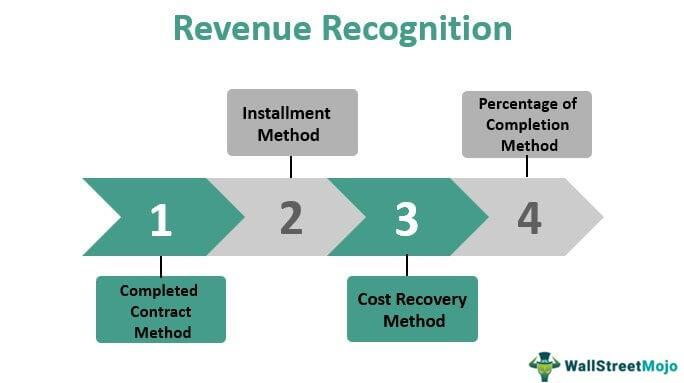

In the intricate world of finance, understanding revenue recognition and accounting principles is crucial for businesses. These accounting tenets form the backbone of financial reporting, ensuring that companies accurately reflect their income statements and maintain integrity in their financial disclosures. At the same time, algorithmic trading has revolutionized the way trades are executed in financial markets, leveraging technology to enhance efficiency and precision.

Algorithmic trading employs sophisticated computer programs to automate trading decisions, reducing human error and optimizing transaction execution. This advancement has reshaped financial markets by increasing liquidity, reducing transaction costs, and facilitating the implementation of complex trading strategies at incredible speeds. Consequently, it has become an essential tool for modern financial institutions aiming to maintain a competitive edge.



The convergence of revenue recognition principles and algorithmic trading offers immense potential for finance professionals. This integration bridges the gap between accurate financial reporting and innovative market strategies, enhancing both transparency and strategic decision-making. By aligning rigorous accounting standards with cutting-edge trading technologies, businesses can achieve a more holistic view of their operations, ensuring regulatory compliance while optimizing their market activities.

This article explores how revenue recognition and financial reporting principles integrate with algorithmic trading, detailing how these domains collaborate to elevate financial strategy and operational efficacy in today's dynamic markets.

## Table of Contents

## Understanding Revenue Recognition

Revenue recognition is a foundational concept in accounting that determines when a company can record income as earned. This principle is critical as it directly influences financial statements, ensuring that income is recognized in the appropriate accounting period, which can significantly impact a company's reported financial performance.

The key criteria for revenue recognition include the occurrence of a critical event and the ability to measure the transaction reliably. Generally, a critical event is one that delivers a product or service, thus fulfilling the main performance obligations of a contract. For instance, in a sales contract, revenue is typically recognized when control of the goods or services transfers to the customer. The precise moment when this occurs depends on the specific terms of the contract and the nature of the product or service offered.

Public companies adhere to established frameworks such as the Generally Accepted Accounting Principles (GAAP) or the International Financial Reporting Standards (IFRS) to ensure consistency and comparability in their financial statements.

Under GAAP, the principle of revenue recognition is guided by two primary elements: the "revenue recognition principle" and specific guidance found in the Accounting Standards Codification (ASC), particularly ASC 606, which outlines a five-step process for revenue recognition:

1. **Identify the contract(s) with a customer**: A contract is an agreement between two or more parties that creates enforceable rights and obligations.
2. **Identify the performance obligations**: These are the distinct goods or services promised in a contract.
3. **Determine the transaction price**: This is the amount of consideration the entity expects to be entitled in exchange for transferring goods or services.
4. **Allocate the transaction price to the performance obligations**: If a contract involves multiple performance obligations, the transaction price must be assigned to each obligation in proportion to its stand-alone selling price.
5. **Recognize revenue when or as the entity satisfies a performance obligation**: Revenue is recognized when control of the goods or services is transferred to the customer.

Similarly, IFRS follows the principle detailed in IFRS 15, which closely aligns with the five-step model of ASC 606 to improve consistency and comparability globally. This alignment between GAAP and IFRS reflects a significant collaboration to standardize financial reporting and enhance clarity and understanding for stakeholders.

In summary, revenue recognition is a critical accounting principle that ensures proper timing and measurement of income for businesses. Compliance with either GAAP or IFRS principles ensures that financial statements present a true and fair view of a company's revenue-generating activities, fostering transparency and comparability across industries and regions.

## Key Principles of Financial Reporting

Financial reporting is crucial for the integrity and transparency of corporate financial statements, resting on a foundation of key accounting principles. These principles, including matching, full disclosure, and cost principles, ensure that financial data presented by companies is both accurate and reliable, thereby fostering confidence among investors, regulators, and other stakeholders.

The matching principle requires that expenses be matched with the revenues they help to generate. This principle is essential for accurately reflecting a company’s profitability during a given accounting period. For example, when a company sells a product, the revenue from the sale and the cost of the goods sold are reported in the same accounting period, even if payment is not received immediately. This principle helps in portraying a clear picture of an organization’s operational efficiency.

Full disclosure involves providing all relevant financial information necessary for stakeholders to make informed decisions. This principle mandates that financial reports should include everything material to a firm's performance and financial health. This ranges from financial statements and notes to the accounting policies applied. The aim is to avoid misleading users of financial reports and to present an accurate representation of the company’s financial position.

The cost principle states that assets should be recorded at their historical cost, the actual amount paid for them, rather than their current fair market value. This approach provides a straightforward and objective method for reporting assets, although it may not always reflect the true value of an asset over time. For example, land purchased decades ago may have appreciated significantly, but it will still be listed at the purchase price on a company’s balance sheet, according to this principle.

These principles collectively contribute to the transparency, consistency, and comparability of financial statements, key traits for effective financial reporting. Consistency ensures that companies use the same accounting methods from period to period, a crucial [factor](/wiki/factor-investing) for accurate trend analysis. Comparability allows investors and other users of financial statements to perform meaningful analyses across different companies or periods.

Adherence to these principles aids stakeholders in making informed decisions by building a framework of trust and reliability. When companies consistently apply these principles, it reassures stakeholders that the management is committed to transparency and regulatory compliance, thus enhancing their confidence in the organization’s reported financial performance.

## Algorithmic Trading: A Modern Approach

Algorithmic trading, an innovative method of executing trades in financial markets, leverages computer programs to automate key aspects of trading. This approach significantly enhances market efficiency by executing large orders without human intervention. It minimizes human errors and enables traders to exploit market conditions swiftly, thereby reducing transaction costs.

One of the defining advantages of [algorithmic trading](/wiki/algorithmic-trading) is its ability to execute complex trading strategies at unprecedented speeds. Trading algorithms can be designed to identify [arbitrage](/wiki/arbitrage) opportunities, execute market-making strategies, or implement trend-following tactics, often within milliseconds. These algorithms analyze vast datasets, assessing metrics like price, [volume](/wiki/volume-trading-strategy), and [volatility](/wiki/volatility-trading-strategies) to make informed decisions rapidly. The strategies can be broadly categorized into market-making, [statistical arbitrage](/wiki/statistical-arbitrage), and [momentum](/wiki/momentum) strategies, among others.

Python has become a preferred language for developing trading algorithms due to its flexibility and the availability of powerful libraries such as pandas for data analysis, NumPy for numerical computing, and scikit-learn for [machine learning](/wiki/machine-learning) applications. Here is a simple example of a moving average crossover strategy in Python:

```python
import pandas as pd
import numpy as np

# Sample stock price data
data = pd.DataFrame({
    'Price': [100, 101, 102, 101, 102, 105, 107, 106, 105, 104]
})

# Calculate moving averages
short_window = 3
long_window = 5
data['Short_MA'] = data['Price'].rolling(window=short_window, min_periods=1).mean()
data['Long_MA'] = data['Price'].rolling(window=long_window, min_periods=1).mean()

# Generate signals
data['Signal'] = np.where(data['Short_MA'] > data['Long_MA'], 1, -1)

# Display signals
print(data[['Price', 'Short_MA', 'Long_MA', 'Signal']])
```

Understanding the framework of algorithmic trading is essential for optimizing trading operations as it aids traders in aligning their strategies with the overarching objectives of their portfolios or firms. Implementing robust algorithms ensures that trades are executed at the best possible prices, orders are placed instantaneously, and there's optimum asset allocation while maintaining risk control. The intersection of technology and trading not only supports market integrity but also elevates the ability of market participants to respond to ever-evolving financial landscapes. As financial markets continue to grow more complex, the reliance on algorithmic trading demonstrates a commitment to innovation and efficiency in trading practices.

## Integrating Revenue Recognition in Algorithmic Trading

Incorporating revenue recognition principles into algorithmic trading enables businesses to enhance their trading strategies through improved decision-making and compliance. By ensuring that financial data is both accurate and timely, companies can align their trading activities with their broader business goals, ensuring they meet both business objectives and regulatory requirements.

The application of robust revenue recognition frameworks within algorithmic trading systems allows for the seamless integration of financial and trading data. This alignment is critical as trading decisions increasingly depend on real-time financial performance metrics. An algorithm can only be as effective as the data it processes; therefore, ensuring the accuracy and reliability of financial data is paramount.

Technology plays a pivotal role in this integration process. Advanced analytics platforms and trading algorithms are engineered to utilize comprehensive datasets, including financial statements processed under consistent accounting principles such as GAAP or IFRS. This ensures that the output of algorithmic strategies not only meets trading objectives but also adheres to financial reporting standards.

To practically illustrate this integration, consider a Python-based algorithmic trading model that incorporates financial data:

```python
import pandas as pd
from trading_platform import TradingModel

# Load financial data
financial_data = pd.read_csv('financial_data.csv')

# Preprocess data
financial_data['Revenue'] = financial_data['Revenue'].apply(lambda x: x if x >= 0 else 0)

# Initialize trading model
model = TradingModel()

# Set trading objectives based on revenue recognition
model.set_objectives(revenue_target=financial_data['Revenue'].mean())

# Execute trading strategy
model.execute_strategy()
```

In this Python snippet, a trading model processes revenue data to set objectives and execute trades. This integration ensures that revenue recognition criteria directly influence trading decisions, thereby aligning with financial reporting standards.

Moreover, leveraging technology ensures transparency, as stakeholders can trace how financial inputs translate into trading outputs. This transparency builds trust not only within the company but also with investors and regulators, enhancing the overall credibility of financial operations. The convergence of accurate revenue recognition and algorithmic trading strategies thus becomes a cornerstone for informed decision-making, compliance, and sustainable business growth.

## Challenges and Best Practices

Incorporating accounting principles in algorithmic trading presents a unique set of challenges, particularly regarding real-time data handling. The dynamic nature of trading and the strict requirements of accounting standards necessitate sophisticated solutions to ensure data is captured, processed, and reported accurately.

### Real-Time Data Handling

The primary challenge lies in managing and processing large volumes of data in real-time. Algorithmic trading systems must continuously analyze market data and make swift decisions, often trading thousands of times in a second. This speed and volume make it difficult to adhere to traditional accounting principles designed for periodic reporting.

Advanced software solutions are essential to tackle this challenge. These systems must integrate seamlessly with trading platforms to capture real-time transaction data and translate it into accounting entries. Machine learning algorithms can be employed to predict and adjust accounting entries based on historical and predictive data, enhancing the accuracy of financial reports. 

For example, a simple Python script could be employed to fetch and log transactions into an accounting database:

```python
import pandas as pd
from datetime import datetime

def log_transaction(trade_id, time, amount, price):
    transaction = {
        'Trade ID': trade_id,
        'Time': time,
        'Amount': amount,
        'Price': price
    }
    df = pd.DataFrame([transaction])
    df.to_csv('transactions_log.csv', mode='a', header=False, index=False)

# Example usage
log_transaction(trade_id=12345, time=datetime.now(), amount=1000, price=150.0)
```

### Continuous Education

Maintaining expertise in both accounting standards and technological advancements is crucial. As the landscape of algorithmic trading and financial reporting evolves, continuous education for professionals is needed to stay updated with the latest regulatory changes and technological innovations. Workshops, webinars, and further education programs can help personnel remain adept in managing the intricacies involved in integrating these domains.

### Internal Controls and Collaboration

Establishing strong internal controls is vital to ensuring compliance and efficiency. These controls may include automated checks for transaction validity, reconciliation processes, and regular audits. Collaboration across departments—such as finance, IT, and operations—is necessary to foster an environment of transparency and mutual understanding.

Inter-departmental teams can create policies and procedures that guide the integration of algorithmic trading data into financial reports, ensuring that all teams are aligned with organizational objectives and regulatory requirements. Regular cross-functional meetings can facilitate the continuous improvement of these processes, enhancing both compliance and efficiency.

## Conclusion

The integration of accounting principles with algorithmic trading is critical for the efficient functioning of modern financial systems. Accounting guidelines such as revenue recognition, governed by standards like GAAP and IFRS, provide a structured framework for identifying, measuring, and reporting income consistently. When these principles intersect with algorithmic trading, the resulting synergy can significantly enhance the accuracy and transparency of financial operations.

Algorithmic trading, reliant on precision and speed, benefits profoundly from structured financial reporting, which ensures that the trading strategies align with business objectives while adhering to regulatory standards. The combination of accurate financial data and algorithm-driven analysis facilitates more informed decision-making processes. This integration allows traders and financial analysts to monitor performance metrics and adjust strategies in real-time, fostering adaptive compliance and enhancing financial predictability.

Moreover, this fusion advances the cause of sustainable financial success by promoting systemic integrity. By incorporating robust accounting frameworks into algorithmic operations, businesses are better equipped to mitigate financial risks, optimize resource allocation, and implement effective internal controls. This enhances stakeholder trust, ensuring that businesses not only meet regulatory requirements but exceed them, thus fortifying their position in a competitive marketplace.

Embracing these two domains synergistically results in a comprehensive financial strategy that is both accountable and resilient, ultimately supporting long-term growth and organizational sustainability.

## References & Further Reading

To gain a thorough understanding of revenue recognition frameworks, it is essential to explore resources that explain Generally Accepted Accounting Principles (GAAP) and International Financial Reporting Standards (IFRS). These comprehensive standards offer guidance on how and when revenue is recognized in financial statements, ensuring consistency and transparency. Websites such as the Financial Accounting Standards Board (FASB) and the International Accounting Standards Board (IASB) provide valuable materials and updates on these frameworks.

For insights into algorithmic trading, various [books](/wiki/algo-trading-books) and academic articles discuss its theoretical and practical implications. Titles such as "Algorithmic Trading: Winning Strategies and Their Rationale" by Ernest P. Chan provide strategic viewpoints, while academic journals offer empirical analyses. Online platforms like SSRN or JSTOR may have a repository of research papers exploring advanced algorithmic trading strategies and outcomes.

Professional guidelines from leading financial institutions and industry analysis from entities such as Bloomberg or Reuters support a more comprehensive understanding of the topics at hand. These resources offer industry insights, market analysis, and best practices essential for bridging accounting and financial strategy.

Together, these resources support a holistic view, aiding professionals in enhancing their knowledge of accounting principles and algorithmic trading.

