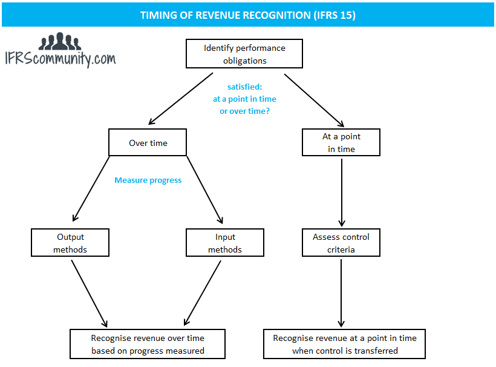

## Table of Contents

## What is revenue recognition in accounting?

Revenue recognition in accounting is the process of recording income when it is earned, not necessarily when the money is received. This principle is important because it helps businesses accurately report their financial performance over time. For example, if a company sells a product in December but doesn't get paid until January, the revenue from that sale should be recognized in December's financial statements.

The rules for revenue recognition can vary depending on the type of business and the specific transactions involved. Generally, revenue is recognized when it is both earned and realizable. This means the company has completed what it needs to do to be entitled to the payment, and there is a reasonable certainty that the payment will be received. These rules help ensure that financial statements are consistent and reliable, which is crucial for investors, creditors, and other stakeholders who rely on this information to make decisions.

## Why is the timing of revenue recognition important?

The timing of revenue recognition is important because it helps businesses show their financial performance accurately. If a company waits until it gets paid to record revenue, its financial statements might not reflect what's really happening. For example, if a company does a lot of work in one month but gets paid the next month, its financial statements for the first month would look bad, even though the company was busy and productive.

Accurate timing also helps everyone who looks at the financial statements, like investors and banks, make better decisions. If revenue is recognized at the wrong time, it can make a company look more or less successful than it really is. This can lead to bad decisions, like investing in a company that isn't doing as well as it seems, or not investing in a company that's actually doing great. So, getting the timing right is key for clear and honest financial reporting.

## What are the basic principles of revenue recognition?

The basic principles of revenue recognition are all about making sure a business records its income at the right time. The main idea is that a company should record revenue when it earns it, not just when it gets the money. This means if a company finishes a job or delivers a product, it should record the revenue right then, even if the payment comes later. This helps everyone see a true picture of how the business is doing.

Another important principle is that the revenue should be realizable and earned. Realizable means there's a good chance the company will actually get paid. Earned means the company has done everything it needs to do to get the money. For example, if a company sells something but still needs to deliver it, the revenue shouldn't be recorded until the delivery is done. These principles help keep financial statements honest and clear, so people can trust them.

## How does the accrual accounting method affect revenue recognition timing?

The accrual accounting method changes when a business records its revenue. Instead of waiting for the money to come in, a business using accrual accounting records revenue when it earns it. This means if a company finishes a job or delivers a product, it records the revenue right away, even if the customer pays later. This method gives a more accurate picture of how the business is doing because it shows the revenue when the work is done, not just when the money arrives.

Using accrual accounting can make a big difference in how a business's financial health looks. For example, if a company does a lot of work in December but doesn't get paid until January, with accrual accounting, the revenue would show up in December's financial statements. This helps everyone see that the company was busy and productive in December, even if the money came in later. It's important for making sure the financial statements reflect the real activity of the business, not just the timing of cash flow.

## What is the difference between recognizing revenue at a point in time versus over time?

Recognizing revenue at a point in time means a business records the income the moment it finishes its part of the deal. This usually happens when a product is delivered or a service is completed. For example, if a store sells a bike, it records the revenue when the customer takes the bike home. This method is simple and works well when the business has a clear moment when it earns the money.

Recognizing revenue over time is different because the business records the income gradually as it works on a project or provides a service. This is common in long projects, like building a house or a software development contract. For example, if a company is building a house, it might record some revenue each month as it completes different parts of the project. This method helps show the ongoing progress of the work and can give a more accurate picture of the business's performance over time.

## What are the five steps of the revenue recognition process according to ASC 606?

The revenue recognition process according to ASC 606 involves five steps that help businesses figure out when and how much revenue to record. The first step is to identify the contract with the customer. This means making sure there's a clear agreement about what the business will do and what the customer will pay. The second step is to identify the performance obligations in the contract. These are the specific things the business has to do, like delivering a product or providing a service. The third step is to determine the transaction price, which is how much the customer will pay.

The fourth step is to allocate the transaction price to the performance obligations. This means figuring out how much of the total price belongs to each part of the work the business will do. The last step is to recognize the revenue when or as the business satisfies each performance obligation. This means recording the revenue at the right time, either when the work is done or as it's being done, depending on the type of obligation. These steps help make sure businesses record their revenue correctly and fairly.

## How do different industries apply revenue recognition principles differently?

Different industries apply revenue recognition principles in ways that fit their unique business models. For example, in the software industry, companies often sell licenses or subscriptions. If a company sells a software license for a year, it might recognize the revenue evenly over that year, because the customer is getting value from the software the whole time. On the other hand, if a software company provides a service like cloud storage, it might recognize revenue each month as it provides the service. This shows how the timing of revenue recognition can change based on what the company is selling.

In the construction industry, things work differently because projects can take a long time. A construction company building a house might recognize revenue over time as it completes different parts of the project. This is called the percentage-of-completion method. It helps show the ongoing progress of the work. In contrast, a retail store selling clothes would recognize revenue at the point of sale, when the customer buys the clothes and takes them home. Each industry has its own way of figuring out when to record revenue, based on what makes the most sense for their business.

## What are common challenges businesses face in determining the correct timing for revenue recognition?

One common challenge businesses face in determining the correct timing for revenue recognition is figuring out when they have actually earned the money. This can be tricky, especially if the business is working on a long project or providing a service over time. For example, if a company is building a house, it needs to decide if it should record some revenue each month as it builds, or wait until the house is finished. This decision can affect how the company's financial health looks on paper, and it's not always clear what the right choice is.

Another challenge is dealing with contracts that have multiple parts. If a business sells a product and also offers a service, like a warranty, it needs to split the total price between these different parts. This can be complicated because the business has to figure out how much each part is worth and when to record the revenue for each. Mistakes here can make the financial statements look wrong, which can confuse investors and other people who rely on them. So, getting the timing right is important but can be really hard to do.

## How does revenue recognition impact financial statements and ratios?

Revenue recognition impacts financial statements by changing how much income a business shows at different times. If a company recognizes revenue too early or too late, it can make its financial statements look different than they should. For example, if a company records revenue before it's earned, its income statement might show higher profits than it really has. This can make the company look more successful than it is. On the other hand, if a company waits too long to record revenue, its financial statements might show less income than it has earned, making the business look less successful.

These changes in revenue recognition also affect financial ratios that people use to understand a company's health. For instance, the profit margin, which shows how much profit a company makes from its sales, can be higher or lower depending on when revenue is recorded. The same goes for the current ratio, which shows if a company can pay its short-term bills. If revenue is recognized too early, it might make the current ratio look better than it really is. So, getting the timing of revenue recognition right is important for showing a true picture of the business's performance and helping people make good decisions based on the financial statements.

## What are the implications of early or delayed revenue recognition on a company's financial health?

Recognizing revenue too early can make a company look more profitable than it really is. When a company records income before it's actually earned, its financial statements might show higher profits. This can make investors and creditors think the company is doing better than it is, which might lead to more investment or loans. But if the company can't actually collect the money it recorded, it could run into trouble later. It might not have enough cash to pay its bills, even though its financial statements look good. So, early revenue recognition can create a false sense of financial health and lead to problems down the road.

On the other hand, delaying revenue recognition can make a company look less successful than it is. If a company waits too long to record income that it has already earned, its financial statements will show lower profits. This can make investors and creditors think the company is struggling, even if it's actually doing well. It might miss out on investment or have trouble getting loans because its financial statements don't show its true performance. So, both early and delayed revenue recognition can distort a company's financial health and affect its ability to get the resources it needs to grow.

## How do international standards like IFRS 15 compare to U.S. GAAP in terms of revenue recognition timing?

International Financial Reporting Standards (IFRS) 15 and U.S. Generally Accepted Accounting Principles (GAAP) both aim to make sure businesses record their revenue at the right time. IFRS 15 and the U.S. GAAP standard, ASC 606, are actually pretty similar because they were developed together. Both standards say that businesses should recognize revenue when they transfer goods or services to customers, and the amount should be what the business expects to get paid. This means a company should record the money when it's earned, not just when it gets the cash.

The main difference between IFRS 15 and U.S. GAAP is how they handle certain details. For example, IFRS 15 can be a bit more flexible about how businesses figure out the price of what they're selling, especially if the price changes over time. U.S. GAAP has stricter rules about this. But overall, both standards want to make sure that businesses show their income in a clear and honest way, so people can trust the financial statements. This helps everyone understand how the business is really doing, no matter where it's located.

## What advanced techniques can be used to forecast and manage revenue recognition timing for strategic planning?

Advanced techniques for forecasting and managing revenue recognition timing can help businesses plan better. One technique is using software that predicts when revenue will be earned based on past data and current contracts. This software can look at how long similar projects took in the past and how much money was made from them. It can then guess when future projects will be finished and when the money will come in. This helps businesses see if they'll have enough money to pay their bills and plan for growth.

Another technique is setting up clear performance milestones in contracts. This means businesses and their customers agree on specific points in a project where some of the money will be paid. For example, in a construction project, the business might get paid a certain amount when the foundation is done, another amount when the walls are up, and so on. This helps the business know exactly when to record the revenue and makes it easier to plan for the future. By using these techniques, businesses can manage their money better and make smarter decisions about where to invest and how to grow.

## References & Further Reading

To gain a thorough understanding of revenue recognition frameworks, it is essential to explore resources that explain Generally Accepted Accounting Principles (GAAP) and International Financial Reporting Standards (IFRS). These comprehensive standards offer guidance on how and when revenue is recognized in financial statements, ensuring consistency and transparency. Websites such as the Financial Accounting Standards Board (FASB) and the International Accounting Standards Board (IASB) provide valuable materials and updates on these frameworks.

For insights into [algorithmic trading](/wiki/algorithmic-trading), various [books](/wiki/algo-trading-books) and academic articles discuss its theoretical and practical implications. Titles such as "Algorithmic Trading: Winning Strategies and Their Rationale" by Ernest P. Chan provide strategic viewpoints, while academic journals offer empirical analyses. Online platforms like SSRN or JSTOR may have a repository of research papers exploring advanced algorithmic trading strategies and outcomes.

Professional guidelines from leading financial institutions and industry analysis from entities such as Bloomberg or Reuters support a more comprehensive understanding of the topics at hand. These resources offer industry insights, market analysis, and best practices essential for bridging accounting and financial strategy.

Together, these resources support a holistic view, aiding professionals in enhancing their knowledge of accounting principles and algorithmic trading.

