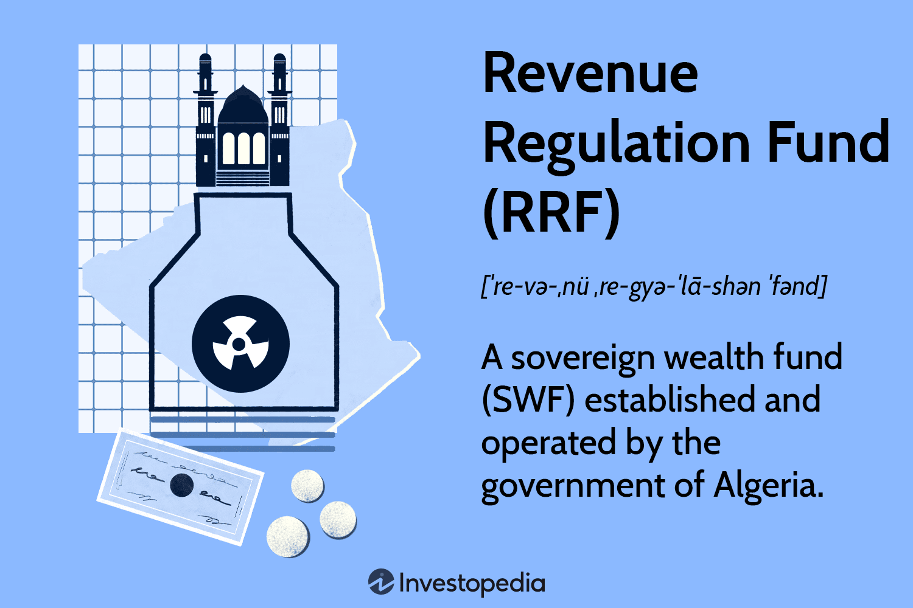

In today's dynamic financial landscape, the interplay between regulation and innovation has become paramount in shaping the fund management and trading industries. Financial regulation serves as a cornerstone in ensuring the stability and integrity of financial markets. This is particularly relevant as we observe the increasing adoption of sophisticated strategies such as algorithmic trading, which has introduced novel complexities and potential risks to market stability. 

The role of financial regulation is multifaceted, involving oversight in fund management to protect investors and ensure market transparency. Regulations are designed to provide a framework within which financial entities, such as fund managers and trading firms, can operate safely and effectively. These rules mitigate risks associated with market volatility, prevent fraudulent activities, and foster investor confidence by mandating disclosures and compliance protocols.

In the context of trading, algorithmic systems have transformed the market by enabling high-speed and high-volume transactions. While these innovations offer efficiencies, they also necessitate robust regulatory frameworks to address risks such as market manipulation and systemic disruptions. The goal is to create an environment that promotes transparent and efficient market practices without stifling technological advancement.

This article focuses on critical aspects of financial regulation concerning fund management, revenue practices, and trading technologies. Through this exploration, we highlight the complexities and challenges inherent in ensuring financial markets operate smoothly and transparently, safeguarding the interests of investors and participants alike.

## Table of Contents

## Understanding Financial Regulation in Fund Management

Financial regulation in fund management serves as a pivotal mechanism for safeguarding investors and maintaining orderly financial markets. Central to this is a series of guidelines and rules aimed at overseeing the conduct of fund managers and the management of funds. These regulations are designed to mitigate various risks and curb fraudulent activities, thereby ensuring that investors are protected and markets operate efficiently.

Fund management regulations typically require fund managers to adhere to specific standards and procedures that govern their investment strategies and operational activities. These can include restrictions on investment types, leverage limits, and requirements for diversification. By doing so, regulations aim to minimize the investment risks that the funds and their investors face. Furthermore, regulations necessitate the implementation of robust internal controls and risk management policies by fund managers to proactively address potential inefficiencies or irregularities in fund operations.

Regulatory bodies significantly contribute to maintaining market confidence by ensuring that financial markets remain transparent and efficient. They oversee compliance with established regulations and have the authority to enforce corrective measures when breaches occur. Major regulatory entities such as the Securities and Exchange Commission (SEC) in the United States, the Financial Conduct Authority (FCA) in the United Kingdom, and others globally play a critical oversight role. They set standards for fund operations, monitor compliance through regular audits and reviews, and impose sanctions when necessary to uphold legal and ethical conduct in fund management.

One notable trend in financial regulation is the increased emphasis on transparency. Recent regulatory changes have compelled fund managers to provide more detailed and regular disclosures of portfolio holdings and performance data to investors. This is done to ensure investors have access to relevant information regarding the funds they are invested in, thereby enabling informed decision-making. For instance, regulations may require periodic reporting on the performance, risk exposure, and main holdings of a fund. This transparency not only protects investors but also fosters a trust-based relationship between fund managers and their clients.

In summary, financial regulation in fund management is integral to protecting investors and ensuring smooth market operations. By establishing guidelines that dictate the behavior of fund managers and the management of funds, regulatory bodies play a vital role in mitigating risks, preventing fraud, and upholding market confidence. The recent focus on transparency highlights the ongoing efforts to adapt regulations to changing market dynamics and enhance investor protection.

## Revenue Regulation in Financial Markets

Revenue regulation in financial markets focuses on aligning profits and [earning](/wiki/earning-announcement) mechanisms with legal and ethical standards. This regulatory domain is essential for ensuring that the profits generated by financial institutions and markets do not come at the expense of market integrity or economic stability. By establishing clear guidelines and frameworks, revenue regulation attempts to prevent unethical financial practices such as market manipulation, insider trading, and excessive speculation.

One illustrative example of a revenue regulation mechanism is the Revenue Regulation Fund (RRF) in Algeria. This fund was established to stabilize the Algerian economy against the unpredictable fluctuations in global commodity prices, particularly oil and gas. These sectors are crucial for Algeria, as they constitute a significant portion of the national revenue. The RRF helps buffer the economy against volatile swings in oil prices, ensuring that revenue from these resources is consistently managed and channeled towards sustainable economic development.

Revenue regulation also involves the implementation of rules that govern the distribution and use of income derived from natural resources and other key economic sectors. The goal is to enhance fiscal stability and economic predictability, which are vital for long-term development. By mandating the transparent and accountable use of such revenues, these regulations help avoid the "resource curse," where countries richly endowed with natural resources suffer from poor economic outcomes due to mismanagement and corruption.

The principles of revenue regulation are entrenched in maintaining equilibrium within national economies. By setting frameworks for how revenue from vital sectors is utilized, these regulations underpin the financial and economic structures at both national and international levels. Compliance with these regulations not only ensures ethical and efficient financial operations but also fosters investor confidence, thus facilitating more robust capital market development.

In recent years, there has been a growing emphasis on the need for transparency in revenue generation and allocation within financial markets. This trend has been spurred by increased global awareness and demand for accountability in both public and private sectors. Ensuring that financial institutions adhere to this transparency is paramount, as it mitigates risks associated with financial improprieties and supports the overall health of the global economy.

## Algorithmic Trading: The Role of Regulation

Algorithmic trading, commonly referred to as algo trading, represents a significant evolution in financial trading, characterized by the use of computer programs and algorithms to execute trades at speeds and complexities beyond human capability. This method leverages advanced mathematical models and computational resources to enter and [exit](/wiki/exit-strategy) positions across various financial markets within milliseconds. While offering enhanced efficiency and [liquidity](/wiki/liquidity-risk-premium), [algorithmic trading](/wiki/algorithmic-trading) poses considerable regulatory challenges, necessitating robust oversight to ensure market fairness and stability.

The paradigm shift from traditional trading to high-frequency trading ([HFT](/wiki/high-frequency-trading-strategies)) systems has introduced several regulatory considerations. High-frequency trading, an area within algorithmic trading, involves executing a large number of orders at extremely rapid speeds. This rapid trade execution increases the risk of market manipulations, such as spoofing—where traders place fake orders to mislead the market about supply and demand dynamics.

To address these challenges, regulatory bodies such as the U.S. Securities and Exchange Commission (SEC) and the Commodity Futures Trading Commission (CFTC) have implemented specific frameworks. These regulations are pivotal in mitigating potential risks associated with algorithmic trading, such as systemic disruptions and manipulative practices. For instance, the SEC's Rule 15c3-5, also known as the Market Access Rule, requires brokerage firms offering market access to implement risk management controls and supervisory procedures to prevent trading errors that could disrupt the markets.

Additionally, the CFTC's Regulation AT (Automated Trading) focuses on enhancing transparency and oversight to prevent market manipulation by imposing risk control measures, requiring registration for certain proprietary traders, and mandating the preservation and accessibility of trading algorithms for regulatory scrutiny.

The global regulatory landscape also includes initiatives aimed at harmonizing the regulations of algorithmic trading across jurisdictions. In the European Union, the Markets in Financial Instruments Directive II (MiFID II) encompasses regulations that necessitate algorithmic traders to demonstrate solid risk management systems and to notify regulators of their trading strategies.

In terms of addressing systemic risks, regulators emphasize the importance of implementing kill switches—mechanisms to halt trading activity in case of anomalies—and ensuring adequate pre-trade risk assessments. These measures are essential in maintaining market integrity and protecting against potential flash crashes similar to the notable incident on May 6, 2010, when the Dow Jones Industrial Average experienced a sudden and severe drop.

As algorithmic trading continues to dominate financial markets, the role of regulation is crucial in enforcing ethical trading practices and safeguarding against technical failures. These regulatory efforts are central to preserving investor confidence and ensuring the structural soundness of global financial systems.

## Risk Management and Compliance in Algorithmic Trading

Algorithmic trading has revolutionized financial markets by utilizing sophisticated algorithms to execute trades at high speeds and volumes. However, this technological innovation has brought forth significant risks that necessitate a comprehensive approach to risk management and compliance. 

Pre-trade risk controls serve as a first line of defense in managing the risks associated with algorithmic trading. These controls include the implementation of systems that monitor market conditions and the algorithm's behavior before executing trades. Key aspects of pre-trade risk controls include order limits to prevent erroneous trades, checks for parameter configurations, and the calibration of algorithms to ensure they align with prevailing market conditions.

Post-trade surveillance is crucial for identifying and mitigating potential issues that arise after trades are executed. This aspect of risk management involves analyzing trade data to detect patterns that may indicate market manipulation or other irregular activities. Systems are designed to flag violations of regulatory rules and to provide alerts when activities deviate from established benchmarks.

Regulatory bodies such as the U.S. Securities and Exchange Commission (SEC) and the Commodity Futures Trading Commission (CFTC) mandate robust safeguards to protect financial markets from systemic risks. These include stress testing, which assesses how trading systems perform under extreme market conditions, and disaster recovery plans that ensure continuity of operations in cases of significant disruptions. Stress testing evaluates algorithm resilience against simulated market events, while disaster recovery plans outline procedures to restore trading operations post-crisis.

Compliance frameworks are established to ensure adherence to these regulatory requirements, maintaining market integrity and investor trust. Firms are obligated to develop and implement compliance programs that include regular audits, employee training programs, and documented processes for responding to regulatory inquiries. Compliance officers play a pivotal role in overseeing these processes, ensuring that all algorithmic trading activities conform to legal standards.

Implementing a holistic approach to risk management and compliance helps firms effectively navigate the complexities of algorithmic trading. While technology continues to advance, regulatory frameworks and industry best practices evolve to mitigate potential threats, safeguarding both the market and its participants.

## Conclusion

Regulation is instrumental in shaping the landscapes of fund management, revenue practices, and trading mechanisms. These frameworks ensure stability and integrity in financial markets, crucial elements as advancements like algorithmic trading continue to reshape industries. As these innovations introduce new complexities and risks, robust regulatory measures are essential to preventing potential market disruptions.

Algorithmic trading, characterized by its high-frequency and automated nature, necessitates specific regulatory oversight to mitigate risks associated with market manipulation and systemic disruptions. Regulatory frameworks established by bodies such as the SEC and CFTC aim to manage these challenges, contributing to a more secure financial environment.

For stakeholders in the financial industry, understanding and adapting to these evolving regulatory landscapes is paramount. As markets face potential upheavals from rapid technological advancements, compliance with regulatory standards ensures that market practices remain transparent and efficient. It is imperative for industry participants to not only stay informed about these regulations but also to integrate compliance measures into their operations. This allows them to thrive amidst change and uncertainty, fostering sustainable growth and market confidence.

## References & Further Reading

[1]: Groß-Klußmann, A., & Hautsch, N. (2011). ["When Machines Read the News: Using Automated Text Analytics to Quantify High Frequency News-implied Market Reactions."](https://www.sciencedirect.com/science/article/abs/pii/S0927539810000873) Journal of Empirical Finance, 18(2), 321-340.

[2]: Hendershott, T., Jones, C. M., & Menkveld, A. J. (2011). ["Does Algorithmic Trading Improve Liquidity?"](https://onlinelibrary.wiley.com/doi/full/10.1111/j.1540-6261.2010.01624.x) The Review of Financial Studies, 24(5), 1465-1489.

[3]: Zhang, J., & Riordan, R. (2011). ["Technology and Market Quality: The Case of High-Frequency Trading."](https://aisel.aisnet.org/ecis2011/95/) Journal of Financial Markets, 14(4), 528-545.

[4]: Cartea, Á., Jaimungal, S., & Penalva, J. (2015). ["Algorithmic and High-Frequency Trading."](https://assets.cambridge.org/97811070/91146/frontmatter/9781107091146_frontmatter.pdf) Cambridge University Press.

[5]: Aldridge, I. (2013). ["High-Frequency Trading: A Practical Guide to Algorithmic Strategies and Trading Systems."](https://www.amazon.com/High-Frequency-Trading-Practical-Algorithmic-Strategies/dp/1118343506) Wiley.