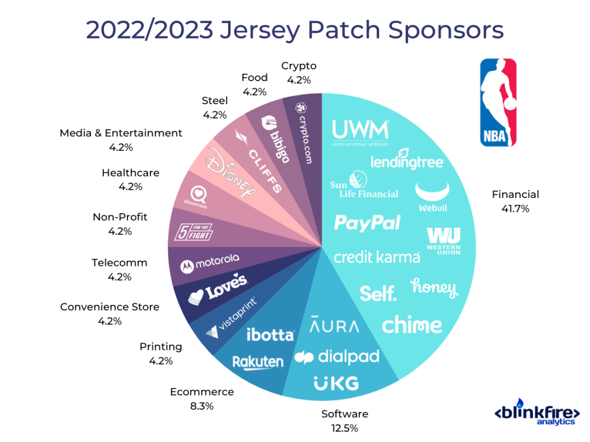

## Table of Contents

## What are the primary revenue sources for the NBA?

The NBA makes most of its money from selling TV rights and sponsorships. TV rights mean that TV channels pay the NBA a lot of money to show their games. This is a big part of their income because lots of people watch NBA games on TV. Sponsorships are when companies pay to have their names or logos shown during games or on jerseys. This helps the companies get more attention, and it helps the NBA earn more money.

Another big way the NBA earns money is through ticket sales and merchandise. When fans buy tickets to watch games in person, it adds up to a lot of money for the NBA. Merchandise includes things like jerseys, hats, and other NBA branded items that fans buy. The more popular the NBA is, the more people want to buy these items, which means more money for the league.

Overall, the NBA's main sources of revenue are TV rights, sponsorships, ticket sales, and merchandise. Each of these helps the NBA make money and keep growing as a popular sports league.

## How does the NBA generate income from media rights?

The NBA makes money from media rights by selling the rights to broadcast their games to TV channels and streaming services. These companies pay the NBA a lot of money because they know a lot of people want to watch NBA games. This deal is good for both sides. The TV channels and streaming services get to show exciting basketball games, which brings in viewers and advertisers. The NBA gets a big chunk of money that helps them run the league and pay the players.

These media rights deals are usually for many years and can be worth billions of dollars. For example, the NBA might sign a contract with a TV network that lasts for several seasons. During this time, the network pays the NBA a set amount each year. This steady income helps the NBA plan for the future and make sure they have enough money to keep the league running smoothly. It's a big part of how the NBA makes money and stays popular.

## What role do ticket sales play in the NBA's revenue?

Ticket sales are an important way for the NBA to make money. When fans buy tickets to watch games live at the arena, it adds up to a lot of money for the league. Each game can bring in thousands of dollars from ticket sales, and with so many games happening throughout the season, this adds up to a big part of the NBA's income. The money from ticket sales helps the NBA pay for things like running the arenas, paying the players, and keeping the league going strong.

The NBA also makes more money from ticket sales when they have special events like the playoffs or the All-Star game. These events are really popular, so fans are willing to pay more for tickets. This extra money from high-demand games helps boost the NBA's overall earnings. So, while TV rights and sponsorships are big sources of money, ticket sales are still a key part of how the NBA makes its revenue.

## How does merchandise sales contribute to the NBA's earnings?

Merchandise sales are a big way the NBA makes money. When fans buy things like jerseys, hats, and other NBA branded items, it adds up to a lot of money for the league. The more popular the NBA and its players are, the more people want to buy these items. This means that merchandise sales can grow a lot when the NBA is doing well and fans are excited about the teams and players.

The money from merchandise sales helps the NBA in many ways. It helps pay for running the league, like paying the players and keeping the arenas in good shape. It also helps the NBA grow and become more popular around the world. When fans wear NBA gear, it shows other people how much they love the game, which can make even more people want to watch and buy things. So, merchandise sales are a key part of how the NBA makes money and stays successful.

## What is the impact of sponsorships and partnerships on NBA revenue?

Sponsorships and partnerships are a big deal for the NBA's money. When companies pay to have their names or logos shown during games or on jerseys, it's called a sponsorship. This helps the NBA make a lot of money because big companies want to be seen by all the people who watch NBA games. These deals can be worth millions of dollars, and they help the NBA pay for running the league and making it even better.

Partnerships are also important. Sometimes the NBA works with companies on special projects, like making new kinds of merchandise or hosting events. These partnerships can bring in extra money and help the NBA reach more fans. For example, if a company helps the NBA make a cool new jersey, more fans might want to buy it. So, sponsorships and partnerships are key ways the NBA makes money and keeps growing.

## How does the NBA benefit financially from its global games and international outreach?

The NBA makes money from its global games and international outreach by playing games in other countries. When the NBA goes to places like China or Europe to play, they sell tickets to fans there. These games are really popular, so fans are willing to pay a lot for tickets. This helps the NBA make extra money that they wouldn't get if they only played in the United States. Also, when the NBA plays in different countries, it gets more people around the world interested in basketball, which can lead to more fans buying NBA merchandise and watching games on TV.

Another way the NBA makes money from going global is through sponsorships and partnerships in other countries. When the NBA plays games in different places, companies there want to be part of the excitement. They pay the NBA to show their logos or names during the games. This brings in more money for the NBA. Plus, by being in different countries, the NBA can make deals with TV channels and streaming services there, which means more money from media rights. So, going global helps the NBA make money in many different ways.

## What are the revenue implications of the NBA's digital and streaming platforms?

The NBA makes money from its digital and streaming platforms by letting fans watch games on the internet. Instead of just watching on TV, fans can use services like NBA League Pass to see games live or on-demand. These services cost money, and when lots of fans pay to watch, it adds up to a big part of the NBA's income. The more people who use these digital platforms, the more money the NBA makes.

Streaming also helps the NBA make money from ads. When fans watch games online, they see ads from companies that want to reach those fans. These companies pay the NBA to show their ads, which brings in more money. Plus, by having games on digital platforms, the NBA can reach fans all over the world, which means even more people can watch and help the NBA make money. So, digital and streaming platforms are really important for the NBA's earnings.

## How does the NBA's licensing and branding deals affect its income?

The NBA makes money from licensing and branding deals by letting companies use its logos and names on their products. When a company wants to make things like shoes, video games, or toys with the NBA's logo on them, they have to pay the NBA for the right to do that. This money from licensing helps the NBA a lot because it adds up to a big part of their income. The more popular the NBA is, the more companies want to use its logos, which means more money for the league.

Branding deals also help the NBA make money. When the NBA works with companies to put their logos on jerseys or in arenas, those companies pay the NBA a lot of money. This helps the NBA because it's another way to make money from being popular. Plus, when fans see these logos, it makes the NBA even more well-known, which can lead to more people watching games and buying NBA stuff. So, licensing and branding deals are really important for the NBA's earnings.

## What is the financial significance of the NBA's All-Star Weekend and other special events?

The NBA's All-Star Weekend and other special events are really important for making money. These events bring in a lot of fans who want to see the best players play and have fun. When fans buy tickets to these events, it adds up to a lot of money for the NBA. The All-Star Weekend, for example, is so popular that fans are willing to pay a lot for tickets. This helps the NBA make extra money that they wouldn't get from regular games.

These special events also help the NBA make money in other ways. Companies want to be part of the excitement, so they pay the NBA to show their logos or names during the events. This brings in more money from sponsorships. Plus, when the NBA has these special events, more people watch on TV or online, which can lead to more money from media rights. So, the All-Star Weekend and other special events are a big deal for the NBA's earnings.

## How do NBA teams share revenue and what is the impact on the league's overall financial health?

The NBA has a system where all the teams share some of the money they make. This is called revenue sharing. It means that teams in big cities that make a lot of money from tickets and sponsorships help out teams in smaller cities that might not make as much money. This sharing helps make sure that all teams can pay their players well and keep their arenas running smoothly. It also makes the league more competitive because smaller teams can spend more on good players.

This revenue sharing is good for the NBA's overall financial health. When all teams are doing well, it makes the league more exciting to watch. More fans want to come to games and buy NBA stuff, which means more money for everyone. The NBA also makes sure that the money is shared fairly, so no team gets too much or too little. This helps keep the league strong and balanced, which is important for making sure the NBA keeps growing and making money in the future.

## What are the emerging revenue streams the NBA is exploring, such as esports and betting?

The NBA is looking into new ways to make money, like esports and betting. Esports means video game competitions, and the NBA has its own league called the NBA 2K League. Teams in this league pay to be part of it, and fans can watch and even bet on the games. This brings in new money for the NBA because it reaches a different group of fans who love video games. It's a growing part of the sports world, and the NBA wants to be a big player in it.

Betting is another new way the NBA is making money. More places are allowing people to bet on sports, and the NBA wants to be part of that. They work with betting companies to let fans bet on games, and the NBA gets a share of the money from these bets. This can bring in a lot of extra money because a lot of people like to bet on sports. It's a new way for the NBA to make money and keep fans excited about the games.

## How does the NBA's salary cap and luxury tax system influence its revenue distribution and team finances?

The NBA uses a salary cap and a luxury tax system to make sure teams spend money fairly and to help share money around the league. The salary cap is a limit on how much money teams can spend on player salaries each year. This helps keep the league competitive because teams can't just spend a lot more money than others to get the best players. The luxury tax is a fine that teams have to pay if they spend more than the salary cap. The money from these fines goes into a pool that is shared with all the teams, which helps smaller teams pay their players better.

This system affects how money is shared in the NBA. Teams that spend a lot and pay the luxury tax help other teams by putting money into the shared pool. This makes the league more balanced because even teams in smaller cities can spend more on good players. It also helps the NBA's overall money health because it keeps fans interested in watching games from all teams, not just the ones with the most money. By making sure money is shared fairly, the NBA stays strong and keeps growing.

## References & Further Reading

[1]: Fort, R. (2006). "The National Basketball Association: Business, Organization and Strategy of Professional Sports." In Handbook on the Economics of Sport, edited by Wladimir Andreff and Stefan Szymanski, Edward Elgar Publishing.

[2]: Turner, M. (2016). ["The NBA's Strategy to Win Fans Globally."](http://www2.mitre.org/public/jsmo/pdfs/03-01-nba-business-outcomes.pdf) Forbes.

[3]: Fatsis, L. (2021). ["Building Global Brands: Understanding the Strategies of the NBA."](https://www.researchgate.net/publication/338493614_Global_Brand_Building_and_Management_in_the_Digital_Age) Financial Times.

[4]: Branvold, S. E., & Bowers, M. T. (2006). "The Revenue Maximizing Club: The NBA, Franchise Values, and Attendance." Journal of Sport Management, 20(1), 123-137.

[5]: Silver, D. (2019). ["NBA 2K League: The Growth and Future of Esports."](https://www.sciencedirect.com/science/article/pii/S014829632100312X) The Wall Street Journal.

[6]: Willoughby, I. (2019). ["Sports Broadcast Rights and the Economic Impact on Leagues: The Case of the NBA."](https://www.academia.edu/86196870/Sports_Rights_and_the_Broadcast_Industry) Journal of Sport and Social Issues. 