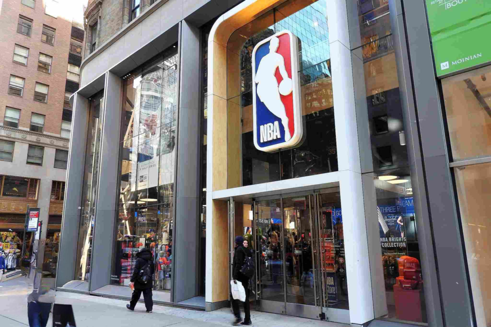

The National Basketball Association (NBA) operates as a dominant force in the global sports industry, transcending the conventional boundaries of basketball games and athletes. Renowned for its thrilling matches and iconic players, the NBA is equally significant for its sophisticated business model, marked by a complex web of financial operations. At its core, the NBA's financial engine is powered by lucrative television rights, thriving merchandising endeavors, extensive sponsorship deals, and robust ticket sales.

Television rights constitute a major revenue stream for the NBA, with landmark agreements that enhance its global reach and audience engagement. Coupled with merchandise sales that leverage the popularity of teams and players, these financial strategies underscore the NBA's economic prowess. Sponsorships from leading global brands further bolster the league's income, while ticket sales remain an essential source of revenue, driven by the league's capacity to attract and retain audiences worldwide.

This article explores the multifaceted revenue streams of the NBA, highlighting the strategic business components that underpin its financial success. In addition to traditional revenue sources, the article examines the integration of algorithmic trading into the NBA's business framework. This new frontier in financial strategy reflects the league's ongoing commitment to innovation and efficiency, positioning it to capitalize on evolving economic trends and technological advancements.

## Table of Contents

## Understanding the NBA Business Model

The National Basketball Association (NBA) operates under a distinctive business model characterized by both centralized and decentralized structures that promote the financial success of the league while allowing individual teams to maintain significant autonomy. At the league level, the NBA oversees the collective interests of all its member teams, coordinating activities such as broadcasting rights negotiations, merchandising, and global marketing campaigns. This centralized approach ensures a unified brand and maximizes collective bargaining power, which benefits all teams.

Individual team management operates more autonomously within this framework. Each team is responsible for its day-to-day operations, such as player recruitment, coaching decisions, and local marketing strategies. The league and the teams work closely to maintain a balance that ensures the overall success and competitiveness of the league. For instance, revenue-sharing agreements are in place to level financial disparities between teams, thereby enhancing competitive balance and keeping the league engaging for fans.

Key players in the NBA ecosystem include team owners, players, coaches, fans, and corporate sponsors. Team owners, usually comprising affluent individuals or investment groups, provide the capital necessary for teams to operate at a high level. They make strategic decisions that can impact a team's direction and financial health. Players are the central figures of the NBA, attracting fans and driving merchandise sales. Their salaries are typically the largest expense for teams, governed by collective bargaining agreements that aim to balance player compensation with financial viability of the teams.

Coaches and other staff play critical roles in shaping team performance and strategic direction. Their expertise and leadership are vital to a team's success and can directly influence attendance and viewership. Fans represent the lifeblood of the NBA, driving ticket sales, merchandise purchases, and viewership ratings. The NBA's business model actively engages with fans through various channels, including live games, digital content, and interactive experiences.

Corporate sponsors are essential partners, providing significant revenue through sponsorship deals that range from jersey advertisements to arena naming rights. These collaborations offer brands a platform to reach a highly engaged audience while providing financial support that is critical for both league-wide initiatives and individual team enhancements. The NBA's model ensures collective success by fostering a symbiotic relationship among these key stakeholders.

## NBA Revenue Sources

The NBA generates revenue from multiple sources, underpinning its status as a financial powerhouse in the sports industry. Chief among these are broadcast rights, merchandise sales, and sponsorships.

Broadcast rights remain a pivotal component of the NBA's income. The league's agreements with major networks like ESPN and TNT are central to its financial success. These contracts are worth billions and underline the NBA's widespread appeal. During the 2016-2025 period, the NBA's deal with ESPN and TNT is valued at approximately $24 billion. These partnerships not only ensure extensive television coverage of games but also provide the NBA with a steady revenue stream that supports its operations and growth.

Merchandise sales and licensing deals represent another lucrative revenue stream for the NBA. The league capitalizes on its global brand through partnerships with prominent companies, most notably Nike. Nike's collaboration with the NBA involves official on-court apparel and popularizes player-centric products globally. These merchandise sales are bolstered by strategic endorsements, where high-profile athletes further enhance the league's global market presence. The league's merchandise strategy effectively combines brand loyalty and international fan engagement to maximize revenue.

Overall, the NBA's diversified revenue sources reflect the league's sophisticated business strategies and its ability to leverage media partnerships and global brand appeal. These elements collectively contribute to the NBA's economic strength in the sports sector.

## International Expansion and Revenue

The National Basketball Association (NBA) has strategically expanded its presence into international markets such as China and Europe, recognizing the potential for considerable revenue growth. This expansion is a crucial component of the NBA's broader business strategy aimed at establishing a global brand.

One of the most significant markets for the NBA is China, where basketball enjoys immense popularity. The NBA's relationship with China dates back to the early 1990s and has grown substantially since then. A landmark moment occurred in 2008 when the NBA signed a multi-year partnership agreement with China Central Television (CCTV), which significantly broadened its viewership base in China. The NBA further strengthened its foothold by partnering with Chinese digital platforms like Tencent, providing streaming services for NBA games. This partnership allows the NBA to tap into a vast audience, as Tencent is one of China's largest online platforms.

The league has also taken steps to solidify its presence in Europe. Regular-season games have been held in major European cities like London and Paris, which have generated local interest and support for the NBA. These games serve not only as a marketing tool but also as an opportunity to reach European fans more directly. Additionally, the NBA has formed collaborations with various European broadcasters and digital platforms to enhance its reach on the continent.

International growth is a significant revenue source for the NBA, as it opens up new markets for broadcasting rights, sponsorships, and merchandise sales. The broadcasting deals in China, for example, contribute significantly to the NBA's total revenue and provide valuable exposure for the league's sponsors. Similarly, merchandise sales in international markets are bolstered by the increased visibility and fan engagement facilitated by these strategic moves.

In terms of media partnerships, the NBA has been proactive in working with global digital platforms to ensure accessibility and engagement. Their agreement with Tencent in China alone is valued at $1.5 billion, highlighting the immense financial benefits of international broadcasting rights. Likewise, partnerships with European broadcasters ensure that NBA games reach a wider audience, further boosting the league's international profile.

The advent of digital platforms has revolutionized the NBA's international strategy, enabling the league to connect with fans worldwide in unprecedented ways. These platforms not only broaden the reach of the NBA but also allow for interactive and engaging fan experiences, ultimately driving revenue growth. As the NBA continues to leverage these opportunities, international markets will play an increasingly vital role in the league's financial success and ongoing global expansion.

## The Role of Digital Innovation

The National Basketball Association (NBA) has leveraged digital innovation to significantly increase its revenue and extend its global reach. The integration of digital platforms and social media has become pivotal in how the NBA engages with its audience and generates income.

Digital platforms such as NBA League Pass have transformed how fans consume basketball content. By providing live-streaming services for viewers worldwide, the NBA has made its games accessible beyond the constraints of traditional broadcasting. These services allow fans to watch games on-demand and stay connected, increasing viewership and, thus, revenue. According to Forbes, the global sports streaming market is projected to grow substantially, with leagues like the NBA taking full advantage of this trend.

Social media platforms such as Twitter, Facebook, and Instagram have been instrumental in the NBA's strategy to boost revenue and fan engagement. These platforms allow for real-time interaction with fans, promoting a continuous discussion about games, players, and events. The NBA uses these channels for targeted marketing, expanding its global fan base, and driving merchandise sales. The league's digital presence not only enhances fan experience but also offers lucrative opportunities for advertisers and sponsors looking to reach a vast, engaged audience.

The NBA has also invested in the growing field of esports, particularly through NBA 2K League, a professional esports league featuring the video game NBA 2K. This venture not only attracts a younger audience but also opens new revenue streams through sponsorships, advertising, and media rights. As the esports industry continues to grow, the NBA is well-positioned to benefit from this burgeoning market.

Virtual reality (VR) is another frontier the NBA is exploring to enhance fan engagement. By offering immersive experiences where fans can watch games as if they were in the arena, VR provides a novel way for fans to interact with the sport. Although still in its infancy, VR technology holds the potential to revolutionize how fans experience basketball, offering an intimate and engaging viewing experience that could drive future revenue growth.

Overall, digital innovation, through streaming services, social media engagement, esports, and virtual reality, plays a crucial role in the NBA's strategy to increase its global presence and generate revenue. By embracing these technologies, the NBA continues to adapt to the shifting landscape of media consumption and fan interaction.

## Algorithmic Trading in NBA Finances

Algorithmic trading, traditionally associated with financial markets, involves the use of computer algorithms to execute trading decisions at speeds and frequencies far surpassing human capabilities. This technology has made its way into various industries, including sports finance. In the context of the National Basketball Association (NBA), [algorithmic trading](/wiki/algorithmic-trading) can offer new avenues for optimizing financial operations.

The application of algorithmic trading in the NBA could revolutionize how the league and individual teams manage their financial strategies. By leveraging complex algorithms, the NBA could analyze vast amounts of financial data to make more informed decisions regarding investments, budgeting, and revenue projections. For example, algorithms can optimize ticket pricing strategies by analyzing historical sales data and current market conditions, allowing the NBA and its teams to maximize revenue while maintaining fan engagement.

Financial technologies such as blockchain could also facilitate more efficient contract management and secure transactions within the NBA ecosystem. Automated systems can help streamline payroll operations by predicting cash flow requirements and optimizing payment schedules to ensure financial stability for teams and players alike. Moreover, algorithms could be employed to forecast merchandise sales trends, enabling more strategic inventory management and marketing efforts.

Despite the potential benefits, integrating algorithmic trading into sports finance comes with its challenges. One of the primary concerns is the transparency of algorithmic processes. Stakeholders may be wary of relying solely on algorithmic decisions due to a lack of understanding of how these algorithms function. Additionally, the sophisticated nature of these technologies requires significant investment in infrastructure and expertise, which may pose a barrier to widespread adoption in the sports industry.

Another challenge lies in the potential market [volatility](/wiki/volatility-trading-strategies) that algorithmic trading can introduce. As seen in traditional financial markets, algorithmic systems can exacerbate fluctuations, which could translate into financial instability for the NBA if not properly managed. Thus, regulatory oversight and robust risk management frameworks are essential to mitigating such risks.

In contrast, the advantages of algorithmic trading include enhanced accuracy and efficiency in financial operations. Algorithms are capable of processing real-time data and executing complex calculations with precision, reducing human error and expediting decision-making processes. This can be particularly beneficial in dynamic sectors like sports finance, where quick adaptation to market changes is crucial.

In summary, algorithmic trading holds significant promise for enhancing the NBA's financial operations, offering opportunities for more strategic decision-making and efficient resource management. However, careful consideration of the associated challenges is necessary to ensure successful integration into the NBA's business model.

## Future Challenges and Opportunities

The National Basketball Association (NBA) faces several challenges that could impact its revenue streams and operational strategies. One key challenge is the shift in media consumption habits. Traditional television viewership is declining, especially among younger audiences who prefer digital streaming platforms and social media for content consumption. To address this, the NBA is investing in its own digital platforms and forging partnerships with streaming services to reach a broader global audience. This shift not only ensures engagement with fans worldwide but also opens new advertising and sponsorship opportunities within digital environments.

Economic downturns present another challenge for the league. Fluctuations in the global economy can influence consumer spending, affecting ticket sales, merchandise, and subscription services. The NBA adopts a flexible business strategy to mitigate these impacts, including dynamic pricing models for tickets and merchandise, ensuring offers remain attractive to consumers even during economic instability.

Future revenue opportunities for the NBA are notably present in the areas of sports betting and fantasy leagues. The legalization of sports betting in various jurisdictions offers a significant potential revenue stream. The NBA is exploring partnerships with betting companies to offer officially sanctioned betting experiences, providing fans with more interactive and engaging ways to enjoy the game. This not only diversifies revenue streams but also enhances fan engagement by integrating betting experiences with live-game dynamics.

Fantasy leagues provide another avenue for revenue growth and fan engagement. The NBA can capitalize on this by offering official fantasy league platforms, allowing for increased control over user engagement and data. Additionally, these platforms open opportunities for direct-to-consumer marketing and personalized fan experiences, supporting the NBA’s goal of enhanced fan interaction.

In summary, the NBA's approach to future challenges and opportunities involves strategic innovation and adaptation to the changing landscape of media and consumer behavior. By embracing digital advancements and exploring new revenue channels such as sports betting and fantasy leagues, the NBA aims to sustain its prominence and profitability in the ever-evolving global sports industry.

## Conclusion

The National Basketball Association (NBA) has solidified its position as a financial powerhouse within the global sports industry. Its influence expands far beyond the traditional confines of sports, driven by a diverse array of revenue streams that ensure robust and sustained growth. The NBA's intricate business model encompasses not only television rights and ticket sales but also emerging markets, merchandise, and digital innovations, providing essential avenues for revenue.

Broadcast rights, a cornerstone of the NBA's financial success, have cemented lucrative partnerships with major networks such as ESPN and TNT. These agreements significantly contribute to the league's revenue, underscoring the high value of live sports content in today's media landscape. Similarly, lucrative merchandise sales and licensing deals with major brands like Nike amplify the NBA's financial footprint, capitalizing on the global popularity of basketball and its players.

The NBA's strategic international expansion remains a vital aspect of its revenue strategy. By penetrating markets in China, Europe, and beyond, the NBA leverages a global fanbase and establishes partnerships with international media platforms. This not only broadens the league's reach but also taps into new streams of revenue, exemplifying its commitment to growth on an international scale.

In the digital age, the NBA has adeptly harnessed the power of online platforms and social media to enhance fan engagement and broaden its reach. Through digital streaming and innovative technologies such as virtual reality, the NBA captures audiences worldwide, creating new opportunities for monetization and fan interaction. The integration of financial technologies, like algorithmic trading, further showcases the NBA's dedication to evolving with the times, optimizing financial operations, and ensuring decision-making is driven by data.

As the NBA navigates future challenges, including shifts in media consumption and potential economic fluctuations, its resilience and adaptability will be key. Committed to innovation, the NBA continues to explore new opportunities, such as sports betting and fantasy leagues, that promise to enhance the fan experience and provide additional revenue streams.

In conclusion, the NBA stands as a testament to the power of diverse revenue streams and innovative strategies in sustaining growth in an ever-evolving economic landscape. Its commitment to adaptability not only secures its position as a leader in the sports industry but also inspires continuous evolution and growth in a dynamic global market.

## References & Further Reading

[1]: Fort, R. (2006). "The National Basketball Association: Business, Organization and Strategy of Professional Sports." In Handbook on the Economics of Sport, edited by Wladimir Andreff and Stefan Szymanski, Edward Elgar Publishing.

[2]: Turner, M. (2016). ["The NBA's Strategy to Win Fans Globally."](http://www2.mitre.org/public/jsmo/pdfs/03-01-nba-business-outcomes.pdf) Forbes.

[3]: Fatsis, L. (2021). ["Building Global Brands: Understanding the Strategies of the NBA."](https://www.researchgate.net/publication/338493614_Global_Brand_Building_and_Management_in_the_Digital_Age) Financial Times.

[4]: Branvold, S. E., & Bowers, M. T. (2006). "The Revenue Maximizing Club: The NBA, Franchise Values, and Attendance." Journal of Sport Management, 20(1), 123-137.

[5]: Silver, D. (2019). ["NBA 2K League: The Growth and Future of Esports."](https://www.sciencedirect.com/science/article/pii/S014829632100312X) The Wall Street Journal.

[6]: Willoughby, I. (2019). ["Sports Broadcast Rights and the Economic Impact on Leagues: The Case of the NBA."](https://www.academia.edu/86196870/Sports_Rights_and_the_Broadcast_Industry) Journal of Sport and Social Issues. 