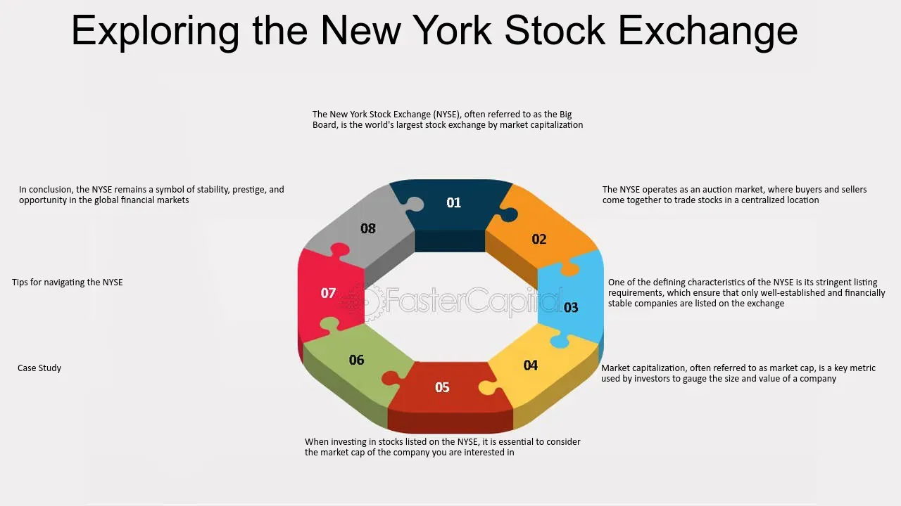

## Table of Contents

## What is the New York Stock Exchange (NYSE)?

The New York Stock Exchange (NYSE) is a place where people buy and sell stocks. It is located in New York City and is one of the biggest stock exchanges in the world. When people talk about the stock market, they often mean the NYSE. Companies list their stocks on the NYSE so that people can invest in them. When you buy a stock, you own a small part of that company.

The NYSE started a long time ago, in 1792. Back then, traders would meet under a buttonwood tree to trade stocks. Now, the NYSE has a big building with a trading floor where people work. But most trading happens on computers. The NYSE is important because it helps companies get money to grow and helps people invest their money to maybe make more money.

## What are the primary sources of revenue for the NYSE?

The main way the New York Stock Exchange makes money is by charging fees. When a company wants to list its stocks on the NYSE, it has to pay a listing fee. This fee helps the NYSE make money. Also, every time someone buys or sells a stock on the NYSE, the exchange takes a small amount of money as a transaction fee. These fees add up because there are a lot of trades happening every day.

Another source of revenue for the NYSE comes from selling market data. People and companies who want to know what is happening in the stock market pay for this information. The NYSE collects and sells this data, which includes things like stock prices and trading volumes. This data is useful for investors and financial companies, so they are willing to pay for it. Together, these fees and data sales help the NYSE earn a lot of money.

## How does the NYSE generate income from trading activities?

The NYSE makes money from trading activities mainly through transaction fees. Every time someone buys or sells a stock on the NYSE, the exchange charges a small fee for that trade. Since there are millions of trades happening every day, these small fees add up to a big amount of money for the NYSE. This is one of the main ways the exchange earns revenue from its trading activities.

Another way the NYSE generates income from trading is by selling market data. This data includes information about stock prices, trading volumes, and other details that investors and financial companies find useful. People and companies pay the NYSE for access to this real-time data, which helps them make better investment decisions. By selling this data, the NYSE creates another stream of income from its trading activities.

## What role do listing fees play in the NYSE's revenue?

Listing fees are an important way for the NYSE to make money. When a company wants to have its stocks traded on the NYSE, it has to pay a fee to be listed there. This fee helps the NYSE earn money because many companies want to be on the exchange. It's like a membership fee for companies to join the NYSE.

These listing fees are a big part of the NYSE's income. The money from listing fees helps the NYSE keep running and offering its services. While the NYSE also makes money from other things like trading fees and selling data, the listing fees are a key part of how the exchange stays profitable.

## How does the NYSE earn money from market data services?

The NYSE makes money from market data services by selling information about what is happening in the stock market. This data includes things like stock prices, how many stocks are being traded, and other details that investors find useful. People and companies pay the NYSE for this real-time information because it helps them make better decisions about buying and selling stocks.

By selling this data, the NYSE earns a lot of money. Many investors and financial companies need up-to-date information to do their jobs well, so they are willing to pay for it. This creates a steady stream of income for the NYSE, which helps the exchange keep running and offering its services to more people.

## What are the technology services offered by the NYSE and how do they contribute to its revenue?

The NYSE offers technology services that help people trade stocks more easily. They have a system called the NYSE Pillar, which is a platform that makes trading faster and more reliable. This system helps traders do their jobs better because it can handle a lot of trades quickly. The NYSE also offers other technology services like data analytics tools, which help people understand what is happening in the market. These services make it easier for companies and investors to use the NYSE.

These technology services help the NYSE make money. When people use the NYSE Pillar or other technology services, they have to pay fees. These fees add up and bring in a lot of money for the NYSE. The more people use these services, the more money the NYSE makes. This is important because it helps the NYSE stay a leading place for trading stocks.

## How significant are the revenues from the NYSE's proprietary data products?

The NYSE makes a lot of money from its proprietary data products. These are special pieces of information about the stock market that the NYSE collects and sells. Investors and financial companies pay for this data because it helps them make better decisions about buying and selling stocks. The data includes things like stock prices, how many stocks are being traded, and other important details.

This revenue is very important for the NYSE. It helps the exchange keep running and offering its services. While the NYSE also makes money from other things like trading fees and listing fees, the money from proprietary data products is a big part of its income. This steady stream of money from data sales helps the NYSE stay a leading place for trading stocks.

## What impact do regulatory fees have on the NYSE's overall revenue?

Regulatory fees are charges that the NYSE has to pay to government agencies to make sure they follow the rules. These fees can affect the NYSE's overall revenue because they are costs that the exchange has to cover. While the NYSE makes money from things like trading fees, listing fees, and selling data, the regulatory fees take away some of that money. So, the more regulatory fees the NYSE has to pay, the less profit it makes.

Even though regulatory fees are a cost, they are important for keeping the stock market fair and safe for everyone. The NYSE has to pay these fees to keep its license to operate and to make sure it follows all the rules. While these fees do reduce the NYSE's revenue, they are a necessary part of running a stock exchange. The NYSE tries to balance these costs with its income from other sources to stay profitable.

## How does the NYSE's revenue model compare to other major stock exchanges globally?

The New York Stock Exchange (NYSE) makes money in ways that are similar to other big stock exchanges around the world. Like the NYSE, other exchanges like the NASDAQ in the United States, the London Stock Exchange (LSE) in the UK, and the Tokyo Stock Exchange (TSE) in Japan earn money from trading fees, listing fees, and selling market data. When someone buys or sells a stock, the exchange takes a small fee. Companies pay to list their stocks on these exchanges, and investors pay for real-time data about what's happening in the market.

However, there are some differences in how these exchanges make money. For example, the NASDAQ is known for its focus on technology and electronic trading, which can lead to different kinds of fees and services compared to the NYSE. The LSE has a strong focus on international listings and data services, which can affect its revenue model. The TSE, on the other hand, might have different regulatory fees and costs due to Japan's unique market rules. Despite these differences, the core ways of making money—through trading, listing, and data—are common across these major exchanges.

## What strategies has the NYSE implemented to diversify its revenue streams?

The NYSE has worked hard to find new ways to make money so it doesn't just depend on trading and listing fees. One big thing they did was to start offering technology services. They made a system called the NYSE Pillar, which helps people trade stocks faster and more easily. This system brings in money because people have to pay to use it. The NYSE also offers other tech services like tools that help people understand the market better. By doing this, the NYSE can make money from technology, not just from trading stocks.

Another way the NYSE has tried to make more money is by selling more types of data. They have special information about the stock market that people and companies want to buy. This data helps investors make better choices about buying and selling stocks. The NYSE makes money every time someone pays for this information. By selling more data products, the NYSE can earn more money in different ways. This helps them keep making money even if trading fees go down.

## How have recent technological advancements influenced the NYSE's revenue sources?

Recent technological advancements have had a big impact on how the NYSE makes money. One big change is the NYSE Pillar system, which is a new way to trade stocks that is faster and more reliable. This system helps the NYSE make money because people have to pay to use it. Also, the NYSE now offers other tech services like tools that help people understand the market better. These services bring in more money because they help traders do their jobs better.

Another way technology has changed the NYSE's revenue is by making it easier to sell more types of data. The NYSE collects a lot of information about what is happening in the stock market, and people and companies want to buy this data to make better investment choices. By using technology to gather and sell this data, the NYSE can make more money. This is important because it helps the NYSE keep earning money even if the amount of money from trading fees goes down.

## What are the future projections for the NYSE's revenue growth and what factors are expected to drive this growth?

The future looks bright for the NYSE's revenue growth. Experts think that the NYSE will keep making more money in the coming years. One big reason is that more and more people around the world are interested in investing in stocks. As more people trade, the NYSE will make more money from trading fees. Also, more companies want to list their stocks on the NYSE, which means more listing fees for the exchange.

Another factor driving the NYSE's revenue growth is technology. The NYSE has been using new technology to make trading faster and easier. This means more people will use the NYSE's trading platform, which will bring in more money from technology services. The NYSE is also selling more types of data to investors. As technology keeps getting better, the NYSE can sell even more data, which will help increase its revenue. Overall, the combination of more trading, more listings, and better technology services is expected to help the NYSE grow its revenue in the future.

## References & Further Reading

[1]: Lopez de Prado, M. (2018). ["Advances in Financial Machine Learning."](https://www.amazon.com/Advances-Financial-Machine-Learning-Marcos/dp/1119482089) Wiley.

[2]: Aronson, D. R. (2006). ["Evidence-Based Technical Analysis: Applying the Scientific Method and Statistical Inference to Trading Signals."](https://www.amazon.com/Evidence-Based-Technical-Analysis-Scientific-Statistical/dp/0470008741) Wiley.

[3]: Jansen, S. (2020). ["Machine Learning for Algorithmic Trading."](https://github.com/stefan-jansen/machine-learning-for-trading) Packt Publishing.

[4]: Chan, E. P. (2008). ["Quantitative Trading: How to Build Your Own Algorithmic Trading Business."](https://github.com/egorpe/EPChan-QuantitativeTrading/blob/master/example7_6.m) Wiley.

[5]: Bergstra, J., Bardenet, R., Bengio, Y., & Kégl, B. (2011). ["Algorithms for Hyper-Parameter Optimization."](https://dl.acm.org/doi/10.5555/2986459.2986743) Advances in Neural Information Processing Systems 24.