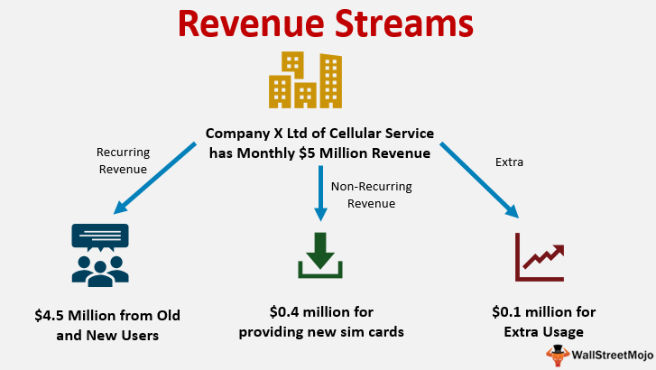

## Table of Contents

## What is Nasdaq and its role in the financial market?

Nasdaq is a stock exchange where people can buy and sell shares of different companies. It started in 1971 and was the first electronic stock market in the world. This means that instead of trading on a physical floor, all the buying and selling happens through computers. Nasdaq is based in New York City and is home to many technology and internet companies, like Apple and Amazon.

Nasdaq plays a big role in the financial market because it helps companies raise money. When a company wants to grow, it can sell shares of its business on Nasdaq. People can buy these shares, which gives the company money to use for things like building new factories or hiring more workers. At the same time, people who buy the shares hope that the company will do well and that the value of their shares will go up. This way, Nasdaq helps connect companies that need money with people who want to invest.

## What are the primary sources of revenue for Nasdaq?

Nasdaq makes money in several ways. The main way is by charging companies to list their shares on the exchange. When a company wants to sell its shares on Nasdaq, it has to pay a fee. This fee helps Nasdaq make money and is one of its biggest sources of revenue. Nasdaq also earns money from trading. Every time someone buys or sells a share on Nasdaq, the exchange takes a small fee. These trading fees add up and are another important way Nasdaq makes money.

Another source of revenue for Nasdaq comes from providing data and technology services. Many companies and investors need information about stock prices and market trends. Nasdaq sells this data to them, which helps the exchange earn more money. Additionally, Nasdaq offers technology solutions to other stock exchanges and financial firms. These services include software and systems that help these organizations manage their trading activities. By selling these technology services, Nasdaq adds to its revenue streams.

## How does Nasdaq generate income from trading activities?

Nasdaq makes money from trading by charging a small fee every time someone buys or sells a share on its platform. This fee is called a transaction fee, and it's taken from both the buyer and the seller. Because there are so many trades happening all the time, these small fees add up to a lot of money for Nasdaq.

In addition to transaction fees, Nasdaq also earns money from something called market data fees. When traders and investors use Nasdaq's platform, they need real-time information about stock prices and trading volumes. Nasdaq charges for access to this data, which helps the exchange make even more money from its trading activities.

## What are listing fees and how do they contribute to Nasdaq's revenue?

Listing fees are the money that companies have to pay to Nasdaq when they want to sell their shares on the exchange. When a company decides to go public and list its shares on Nasdaq, it has to pay an initial fee to get started. After that, the company also pays yearly fees to keep its shares listed on the exchange. These fees are important for Nasdaq because they help the exchange make a lot of money.

The listing fees are a big part of Nasdaq's revenue. Every time a new company lists its shares, Nasdaq gets money from the initial fee. And because there are many companies listed on Nasdaq, the yearly fees from all these companies add up to a lot of money. This steady income from listing fees helps Nasdaq stay financially strong and continue to grow.

## Can you explain the revenue model of Nasdaq's market data services?

Nasdaq makes money from its market data services by selling important information to people who need it. This information includes things like stock prices, trading volumes, and other details about what's happening in the market. People like traders, investors, and financial firms use this data to make smart decisions about buying and selling shares. Nasdaq charges a fee for access to this real-time data, which helps the exchange earn a lot of money.

The revenue from market data services is important for Nasdaq because it adds to the money the exchange makes from other sources like listing fees and trading fees. By selling this valuable information, Nasdaq can earn steady income. This helps the exchange stay strong and continue to offer good services to companies and investors.

## How does Nasdaq earn money from its technology and licensing agreements?

Nasdaq makes money from its technology and licensing agreements by selling software and systems to other stock exchanges and financial firms. These technology solutions help these organizations manage their trading activities more efficiently. For example, Nasdaq might provide a software platform that helps another exchange handle its trading operations smoothly. When Nasdaq licenses these technologies, it charges a fee, which adds to its revenue.

These technology and licensing agreements are important for Nasdaq because they bring in extra money on top of what the exchange earns from listing fees, trading fees, and market data services. By offering these technology solutions, Nasdaq can help other businesses improve their operations while also making more money for itself. This steady income from technology and licensing helps Nasdaq stay financially strong and continue to grow.

## What role do financial products and services play in Nasdaq's revenue streams?

Financial products and services are a key part of how Nasdaq makes money. Nasdaq offers things like indexes, which are lists of stocks that help investors understand how certain parts of the market are doing. For example, the Nasdaq-100 is a famous index that tracks the performance of the top 100 non-financial companies listed on Nasdaq. People can invest in these indexes through funds, and Nasdaq charges fees for using these indexes. This adds to Nasdaq's income and helps the exchange make more money.

Another way Nasdaq earns money from financial products and services is by offering trading and clearing services. These services help make trading easier and safer for investors. When someone buys or sells a share on Nasdaq, the exchange takes care of making sure the trade happens correctly. Nasdaq charges fees for these services, which adds to its revenue. By offering these financial products and services, Nasdaq can bring in more money and help investors and companies in the market.

## How has Nasdaq diversified its revenue sources over the years?

Over the years, Nasdaq has grown its business in many ways to make more money. At first, Nasdaq mostly made money from listing fees and trading fees. Listing fees are what companies pay to sell their shares on Nasdaq, and trading fees are what Nasdaq charges every time someone buys or sells a share. But as time went on, Nasdaq started to offer more things to make money. They began selling important market data to traders and investors. This data helps people make smart choices about buying and selling shares, and Nasdaq charges a fee for it.

Nasdaq also started making money from technology and licensing agreements. They sell software and systems to other stock exchanges and financial firms. This helps these businesses run their trading operations better, and Nasdaq gets paid for providing these technology solutions. Another way Nasdaq has made more money is by offering financial products and services, like indexes and trading and clearing services. Indexes help investors understand how parts of the market are doing, and Nasdaq charges fees for using these indexes. By offering all these different things, Nasdaq has been able to make money from many places, not just from listing and trading fees.

## What impact do regulatory changes have on Nasdaq's revenue streams?

Regulatory changes can have a big impact on Nasdaq's revenue streams. When the government makes new rules about how stock markets should work, Nasdaq has to follow them. Sometimes these rules can make it harder for Nasdaq to make money. For example, if new rules make it more expensive for companies to list their shares on Nasdaq, fewer companies might want to do it. This would mean less money from listing fees for Nasdaq. Also, if new rules change how trading works, it could affect the fees Nasdaq charges for each trade, which is another big part of their income.

On the other hand, some regulatory changes can help Nasdaq make more money. If the government makes rules that make the market safer and more trustworthy, more people might want to invest in stocks. This could mean more trading on Nasdaq, which would bring in more money from trading fees. Also, if new rules help Nasdaq offer new services or products, like better data or technology solutions, they could make money from these new things. So, regulatory changes can both help and hurt Nasdaq's revenue, depending on what the new rules are and how Nasdaq responds to them.

## How does Nasdaq's global expansion influence its revenue?

Nasdaq's global expansion helps it make more money by reaching more people and businesses around the world. When Nasdaq opens new offices or starts working in new countries, it can get more companies to list their shares on its exchange. This means more listing fees for Nasdaq. Also, more people from different countries can trade on Nasdaq, which means more trading fees. By being in more places, Nasdaq can sell its market data and technology services to more customers, which adds to its income.

However, expanding to new countries can also be tricky. It costs money to open new offices and follow different rules in each country. Sometimes, these costs can be high, and it might take time before Nasdaq starts making more money from these new places. But if Nasdaq does it right, the extra money from more listings, trading, and services can be worth it. Overall, going global can help Nasdaq grow its business and make more money, but it needs to be careful and plan well.

## What are the emerging revenue opportunities for Nasdaq in the fintech sector?

Nasdaq sees a lot of new ways to make money in the fintech sector. Fintech is all about using technology to make financial services better and easier. One big opportunity for Nasdaq is in blockchain and [cryptocurrency](/wiki/cryptocurrency). Blockchain is a special way to keep track of information that's very safe and hard to change. Nasdaq can use blockchain to offer new services like trading digital currencies or helping companies issue their own digital tokens. This could bring in new customers and more money for Nasdaq.

Another way Nasdaq can make money in fintech is by offering more technology solutions to banks and other financial firms. These solutions can help these businesses do things like manage their money better or make trading easier. Nasdaq can also help with things like cybersecurity, which is very important in the world of finance. By selling these technology services, Nasdaq can earn more money and help its customers at the same time. As fintech keeps growing, Nasdaq has a lot of chances to make more money and stay a big player in the financial world.

## How do economic cycles affect the different revenue streams of Nasdaq?

Economic cycles can change how much money Nasdaq makes from different parts of its business. When the economy is doing well, more people want to buy and sell stocks. This means more trading on Nasdaq, which brings in more money from trading fees. Also, when the economy is good, more companies want to list their shares on Nasdaq to raise money for growing their business. This means more listing fees for Nasdaq. So, during good economic times, Nasdaq can make more money from trading and listing fees.

But when the economy is not doing well, people might be more careful about buying and selling stocks. This can mean less trading on Nasdaq, which means less money from trading fees. Companies might also wait to list their shares on Nasdaq if they think it's a bad time to raise money. This would mean fewer listing fees for Nasdaq. During tough economic times, Nasdaq might still make money from selling market data and technology services, but overall, its revenue could go down. Economic cycles can really affect how much money Nasdaq makes from different parts of its business.

## References & Further Reading

[1]: Marcos Lopez de Prado. ["Advances in Financial Machine Learning."](https://www.amazon.com/Advances-Financial-Machine-Learning-Marcos/dp/1119482089) Wiley, 2018.

[2]: David Aronson. ["Evidence-Based Technical Analysis: Applying the Scientific Method and Statistical Inference to Trading Signals."](https://www.amazon.com/Evidence-Based-Technical-Analysis-Scientific-Statistical/dp/0470008741) Wiley, 2006.

[3]: Stefan Jansen. ["Machine Learning for Algorithmic Trading."](https://github.com/stefan-jansen/machine-learning-for-trading) Packt Publishing, 2020.

[4]: Ernest P. Chan. ["Quantitative Trading: How to Build Your Own Algorithmic Trading Business."](https://www.amazon.com/Quantitative-Trading-Build-Algorithmic-Business/dp/0470284889) Wiley, 2008.

[5]: Joel Hasbrouck. ["High-Frequency Trading."](https://pages.stern.nyu.edu/~jhasbrou/Miscellaneous/hfq05.pdf) Annual Review of Financial Economics, 2014.

[6]: Joseph Saluzzi, Sal Arnuk. ["Broken Markets: How High Frequency Trading and Predatory Practices on Wall Street are Destroying Investor Confidence and Your Portfolio."](https://ptgmedia.pearsoncmg.com/images/9780132875240/samplepages/0132875241.pdf) FT Press, 2012.

[7]: Robert Kissell. ["The Science of Algorithmic Trading and Portfolio Management."](https://www.sciencedirect.com/book/9780124016897/the-science-of-algorithmic-trading-and-portfolio-management) Academic Press, 2013.