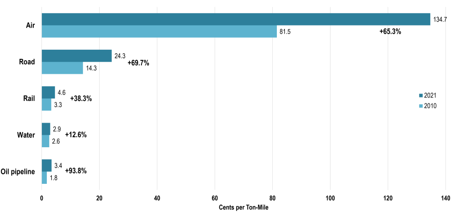

## Table of Contents

## What is a Revenue Ton Mile?

A Revenue Ton Mile is a way to measure how much money a transportation company makes from moving goods. It is calculated by multiplying the weight of the goods in tons by the distance they are transported in miles. This measurement helps companies understand how efficient their transport operations are and how much revenue they are generating from each ton of cargo they move.

For example, if a company transports 10 tons of goods over a distance of 50 miles, they would have generated 500 Revenue Ton Miles. This simple calculation allows transportation businesses to track their performance and make decisions about pricing, routes, and capacity. By keeping an eye on Revenue Ton Miles, companies can see if they are making good use of their resources and if they need to make any changes to improve their profits.

## How is Revenue Ton Mile calculated?

Revenue Ton Mile is a way to figure out how much money a transportation company makes from moving goods. To calculate it, you take the weight of the goods in tons and multiply it by the distance those goods travel in miles. So, if you have 10 tons of goods and you move them 50 miles, you would have 500 Revenue Ton Miles.

This measurement helps companies see how well they are doing at making money from their transport work. By keeping track of Revenue Ton Miles, a company can tell if they are using their trucks, trains, or ships efficiently. It also helps them decide if they need to change their prices or choose different routes to make more money.

## Why is Revenue Ton Mile important in the transportation industry?

Revenue Ton Mile is really important in the transportation industry because it helps companies see how much money they are making from moving stuff. When a company knows its Revenue Ton Miles, it can figure out if it's doing a good job at making money from each load it carries. This is super helpful because it shows if the company is using its trucks, trains, or ships in the best way possible.

By keeping an eye on Revenue Ton Miles, companies can also decide if they need to change their prices or pick different routes to make more money. If they see that their Revenue Ton Miles are low, they might need to find ways to carry more stuff or move it farther. This simple measure helps companies run better and make smarter choices about their business.

## Can you provide an example of how Revenue Ton Mile is used in a business context?

Imagine a trucking company that moves goods across the country. They want to know how much money they're making from each trip. So, they use Revenue Ton Mile to figure this out. Let's say they have a truck that carries 20 tons of goods from New York to Los Angeles, which is about 2,800 miles away. They calculate the Revenue Ton Miles by multiplying 20 tons by 2,800 miles, which gives them 56,000 Revenue Ton Miles. This number helps them see how much revenue they're getting from that one trip.

By looking at their Revenue Ton Miles over time, the company can see if they're making good use of their trucks. If they notice that their Revenue Ton Miles are going down, they might decide to change their routes or start carrying different kinds of goods that are more profitable. This way, they can keep their business running smoothly and make sure they're making as much money as possible from each trip.

## How does Revenue Ton Mile differ from other metrics like Ton Mile or Passenger Mile?

Revenue Ton Mile is different from Ton Mile because it takes into account the money made from moving goods. A Ton Mile just measures the weight of goods in tons times the distance they travel in miles, without thinking about the revenue. So, if a truck moves 10 tons of goods 50 miles, that's 500 Ton Miles. But Revenue Ton Mile adds the money part, so if the company made $1,000 from that trip, they would have 500 Revenue Ton Miles that helped them earn that money.

Passenger Mile is another different metric. It measures how many passengers are moved and how far they go. For example, if a bus carries 40 people for 100 miles, that's 4,000 Passenger Miles. Unlike Revenue Ton Mile, Passenger Mile doesn't care about the money made from moving people, just the number of people and the distance. So, Revenue Ton Mile is special because it combines the weight of goods, the distance, and the money earned, giving a fuller picture of how well a transportation business is doing.

## What are the common units of measurement for Revenue Ton Mile?

Revenue Ton Mile is a way to see how much money a company makes from moving stuff. The units used are tons for the weight of the goods and miles for the distance they travel. So, if you move 10 tons of goods 50 miles, that's 500 Revenue Ton Miles.

This measurement helps companies know if they're making good money from their trips. By using tons and miles, they can easily see how much revenue they get from each load they carry. It's a simple way to check if they're using their trucks, trains, or ships well.

## How has the use of Revenue Ton Mile evolved over time in the transportation sector?

Revenue Ton Mile has been used for a long time in the transportation industry to help companies see how much money they make from moving goods. In the past, it was mostly used by big companies like railroads and shipping lines to figure out if they were making good use of their trains and ships. They would look at how many tons of stuff they moved and how far it went, then see how much money they made from it. This helped them decide if they needed to change their prices or routes to make more money.

Over time, the use of Revenue Ton Mile has grown and changed. Now, it's not just big companies that use it; smaller trucking and logistics firms also find it helpful. With computers and better data tracking, companies can now look at Revenue Ton Miles in real-time and make quick decisions. They can see if they're making enough money from each trip and adjust their business plans to be more efficient. This has made Revenue Ton Mile an even more important tool for all kinds of transportation businesses today.

## What are the challenges in accurately measuring Revenue Ton Mile?

Measuring Revenue Ton Mile can be tricky because it needs good data about the weight of the goods, how far they travel, and how much money is made from moving them. Sometimes, the weight of the goods might not be exactly known, or the distance might be guessed wrong. If a truck takes a different route than planned, it can mess up the distance part of the calculation. Also, figuring out the exact revenue from a trip can be hard if the goods are part of a bigger shipment or if there are different rates for different parts of the trip.

Another challenge is keeping track of all this information in a way that is correct and up-to-date. Companies need good systems to record and check their data. If the data is wrong or out of date, the Revenue Ton Mile numbers will be off too. Plus, different parts of a company might use different ways to measure things, which can make it hard to compare numbers across the whole business. So, having a clear and consistent way to gather and check data is really important for getting accurate Revenue Ton Mile measurements.

## How do different modes of transportation (e.g., rail, air, sea) impact the calculation of Revenue Ton Mile?

Different modes of transportation like rail, air, and sea can affect how Revenue Ton Mile is calculated because each mode has its own way of moving goods and making money. For example, rail can carry a lot of heavy stuff over long distances, so the weight and distance parts of the calculation might be bigger than for other modes. But the revenue part can change based on what kind of goods are being moved and how much people are willing to pay for rail transport. Air transport moves lighter goods faster but over shorter distances, so the weight and distance in the Revenue Ton Mile calculation might be smaller. However, air transport often charges more per ton, which can make the revenue part bigger.

Sea transport, on the other hand, can move huge amounts of goods across very long distances, which makes the weight and distance parts of the calculation really big. But the revenue might be lower per ton because sea transport is usually cheaper than air or rail. Each mode has its own costs and benefits, so companies need to think about all these things when they calculate Revenue Ton Mile. By understanding how each mode impacts the calculation, businesses can make better choices about which mode to use for different kinds of goods and routes.

## What role does Revenue Ton Mile play in regulatory and economic policy?

Revenue Ton Mile is important for people who make rules and decide on economic policies. It helps them see how well the transportation industry is doing. When they know how much money companies are making from moving stuff, they can make better rules about things like how much to charge for using roads or how to help the industry grow. This can make sure that companies can keep moving goods in a way that's good for the economy.

Also, Revenue Ton Mile can show if the transportation industry is doing its job well. If the numbers are going up, it might mean that the economy is doing better because more goods are being moved and more money is being made. If the numbers are going down, it could mean there are problems that need to be fixed. By looking at Revenue Ton Mile, people who make rules can help the transportation industry stay strong and keep helping the economy grow.

## How can data analytics improve the application of Revenue Ton Mile in logistics management?

Data analytics can make Revenue Ton Mile more useful for logistics management by helping companies see patterns and make better decisions. With data analytics, a company can look at a lot of information about their trips, like how much stuff they move, how far it goes, and how much money they make. By using special computer programs, they can find out which routes or types of goods make them the most money. This helps them plan their trips better and choose the best ways to move their stuff.

Also, data analytics can help companies see if they are doing things the best way. They can check if they are using their trucks, trains, or ships in the smartest way possible. If they find that some trips are not making enough money, they can change things like the price they charge or the routes they take. This way, they can keep making more money from each trip and run their business better.

## What are the future trends and potential innovations related to Revenue Ton Mile in the industry?

In the future, Revenue Ton Mile could see big changes because of new technology and ways of doing things. One trend might be using more smart computers and data to keep track of Revenue Ton Mile in real-time. This would help companies see how much money they're making from each trip right away and make quick changes to do better. Also, new kinds of transport like self-driving trucks or drones might change how Revenue Ton Mile is figured out. These new ways of moving stuff could carry different amounts of goods and go different distances, so companies would need to think about how to use Revenue Ton Mile with these new technologies.

Another big change could be using Revenue Ton Mile to help the environment. Companies might start looking at how much carbon they put into the air when they move stuff and try to make that less while still making money. They could use Revenue Ton Mile to find the best ways to move goods that are good for the planet and their wallets. This would mean thinking about more than just money when they plan their trips. Overall, as the world changes, Revenue Ton Mile will keep being important but will need to change too to stay useful for companies.

## What is Understanding Revenue Ton Mile (RTM)?

Revenue Ton Mile (RTM) is a fundamental metric within transportation sectors, with particular relevance to railroads. RTM quantifies the income generated from moving one ton of freight over a mile, serving as a vital profitability measure. The formula for calculating RTM is:

$$
\text{RTM} = \frac{\text{Revenue (\$)}}{\text{Ton-Miles}}
$$

where "Revenue" denotes the total income from freight transportation, and "Ton-Miles" represents the product of the weight in tons and the distance in miles.

RTM acts as a robust indicator of economic performance, shedding light on the demand for transportation services. It aids companies in pinpointing revenue efficiency by correlating total revenue against the freight [volume](/wiki/volume-trading-strategy) and mileage. For railroads, positive trends in RTM often align with increased demand and optimized pricing strategies, suggesting efficient asset utilization.

Firms such as Union Pacific utilize RTM as a lens through which to assess both financial health and operational efficacy. A high RTM often correlates with successful strategies in cost management and revenue optimization, while a declining RTM might indicate challenges such as increased competition or inefficiencies.

Furthermore, constant monitoring of RTM equips businesses to align their strategies with market trajectories. By interpreting RTM trends, railroad companies can make strategic adjustments to pricing, capacity, and service offerings to ensure sustained profitability. Thus, RTM not only reflects current market conditions but also enables proactive management, guiding enterprises towards long-term stability and efficiency in a dynamic industry landscape.

## References & Further Reading

[1]: Zumer, M., & Starc, J. (2019). ["Revenue Ton-Miles and Transport Demand Forecasting."](https://www.researchgate.net/publication/285066868_Demand_Forecasting_in_Transport_Overview_and_Modeling_Advances) Procedia Computer Science, Volume 151, Pages 304-309.

[2]: Chopra, S., & Meindl, P. (2016). ["Supply Chain Management: Strategy, Planning, and Operation."](https://books.google.com/books/about/Supply_Chain_Management_Strategy_Plannin.html?id=gPDQCQAAQBAJ) Pearson.

[3]: ["Logistics Management and Strategy: Competing Through the Supply Chain"](https://www.amazon.com/Logistics-Management-Strategy-Competing-Through/dp/0273712764) by Alan Harrison and Remko van Hoek

[4]: ["FreightWaves SONAR Application"](https://gosonar.com/), a real-time data analytics and predictive pricing tool for logistics.

[5]: Silver, N. (2012). ["The Signal and the Noise: Why So Many Predictions Fail – but Some Don’t."](https://www.amazon.com/Signal-Noise-Many-Predictions-Fail-but/dp/0143125087) Penguin Press.

[6]: Ross, D. F. (2015). ["Distribution Planning and Control: Managing in the Era of Supply Chain Management."](https://link.springer.com/book/10.1007/978-1-4899-7578-2) Springer.