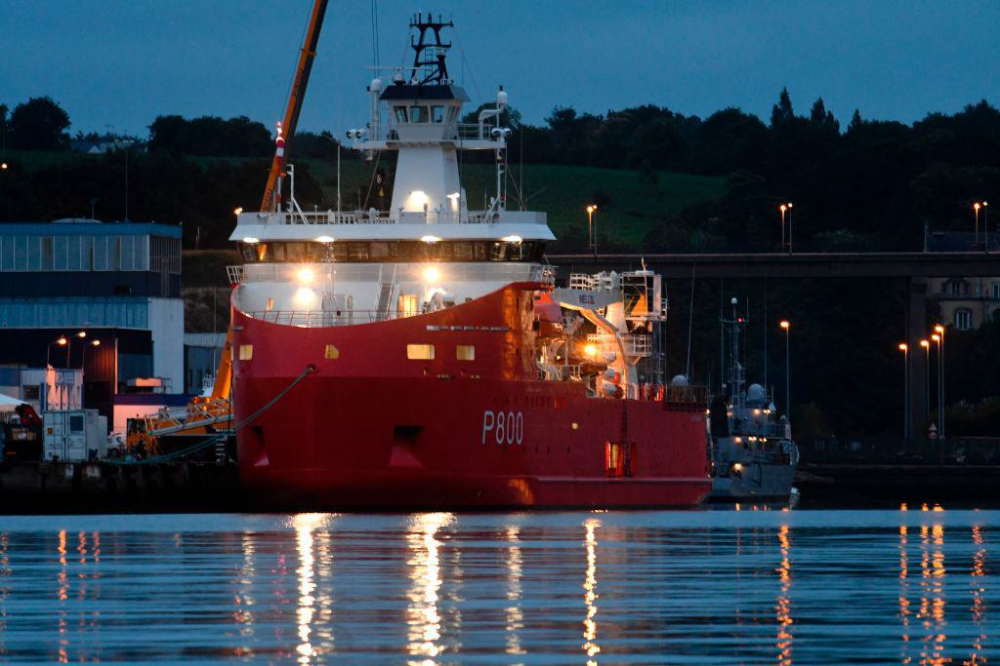

The modern logistics landscape is increasingly competitive, with businesses striving to optimize supply chains to meet growing demand and maintain their market position. Critical components such as Revenue Ton Mile (RTM) and logistic costs are at the forefront of efficient operations, providing insights into economic performance and profitability. By integrating data-driven strategies, including algorithmic trading, logistics operations can be streamlined, thereby maximizing both profit and efficiency.

Revenue Ton Mile (RTM) is a vital transportation metric used primarily by industries such as railroads to assess performance and operational efficiency. It measures the revenue generated for transporting one ton of freight over one mile, offering insights into the demand for transportation services. This metric plays a pivotal role in determining the profitability and market health, guiding strategic decision-making processes.

Equally important is the analysis of logistic costs, which involves dissecting various expenses associated with transportation services, such as fuel costs, maintenance, labor, and administrative expenses. Accurately understanding these costs helps businesses establish clear budgeting strategies and respond effectively to market changes.

To augment these traditional metrics, the logistics sector increasingly turns to technological advancements, leveraging algorithmic trading once restricted to financial markets. These algorithms facilitate demand prediction, inventory management, and automated route planning, contributing to reduced delivery times and optimized load capacities. The integration of these technologies enhances market responsiveness and reduces operational costs, providing firms a competitive edge.

Understanding these transportation metrics and technologies enables companies to craft more adaptive and efficient supply chains. Through tools like FreightWaves SONAR, which offers actionable insights and data analytics, businesses can optimize pricing strategies, improve negotiation processes, and enhance decision-making through predictive analytics and real-time data. This comprehensive integration of transportation metrics with advanced technology is crucial for businesses aiming to stay ahead in the ever-evolving logistics industry, ensuring sustained growth and profitability.

## Table of Contents

## Understanding Revenue Ton Mile (RTM)

Revenue Ton Mile (RTM) is a fundamental metric within transportation sectors, with particular relevance to railroads. RTM quantifies the income generated from moving one ton of freight over a mile, serving as a vital profitability measure. The formula for calculating RTM is:

$$
\text{RTM} = \frac{\text{Revenue (\$)}}{\text{Ton-Miles}}
$$

where "Revenue" denotes the total income from freight transportation, and "Ton-Miles" represents the product of the weight in tons and the distance in miles.

RTM acts as a robust indicator of economic performance, shedding light on the demand for transportation services. It aids companies in pinpointing revenue efficiency by correlating total revenue against the freight [volume](/wiki/volume-trading-strategy) and mileage. For railroads, positive trends in RTM often align with increased demand and optimized pricing strategies, suggesting efficient asset utilization.

Firms such as Union Pacific utilize RTM as a lens through which to assess both financial health and operational efficacy. A high RTM often correlates with successful strategies in cost management and revenue optimization, while a declining RTM might indicate challenges such as increased competition or inefficiencies.

Furthermore, constant monitoring of RTM equips businesses to align their strategies with market trajectories. By interpreting RTM trends, railroad companies can make strategic adjustments to pricing, capacity, and service offerings to ensure sustained profitability. Thus, RTM not only reflects current market conditions but also enables proactive management, guiding enterprises towards long-term stability and efficiency in a dynamic industry landscape.

## Logistics Cost Analysis

Cost analysis in logistics is a fundamental practice that entails a detailed examination of all expenses associated with transportation services. This analysis is crucial for enabling businesses to design efficient and cost-effective supply chains. It encompasses both direct and indirect costs.

Direct costs are straightforward and include fuel, maintenance, and labor. Fuel costs are often the most significant, subject to fluctuations in global oil markets. Labor costs encompass salaries, wages, and benefits for personnel involved in transportation services. Maintenance expenses arise from the routine upkeep and repair of vehicles and equipment, ensuring operational reliability and safety.

Indirect costs, although less apparent, are equally important. These include administrative expenses associated with planning and managing transportation logistics. Unforeseen disruptions such as delays due to weather or strikes can also incur additional costs, impacting the overall budget.

Conducting a comprehensive cost analysis allows businesses to establish clear budgeting and cost prediction measures. By identifying and evaluating each cost component, companies can develop strategies to mitigate potential financial risks and allocate resources effectively. This foresight is especially beneficial for forecasting future expenses and adapting to market fluctuations.

Accurate transportation cost analysis is essential for companies to respond effectively to market changes. With a precise understanding of cost structures, businesses can adjust pricing strategies, optimize routes, and implement cost-saving measures to maintain profitability. Moreover, data-driven insights derived from cost analysis enable more agile and informed decision-making processes.

Effective cost management is critical to securing profitable loads and managing the supply chain efficiently. By continually monitoring and optimizing costs, logistics companies can enhance their competitive edge. This involves not only reducing unnecessary expenditures but also investing in technologies and practices that drive operational efficiency.

In summary, logistics cost analysis is a decisive [factor](/wiki/factor-investing) in ensuring the sustainability and competitiveness of transportation services. It enables businesses to achieve financial stability, enhance operational efficiency, and maximize profitability in today's dynamic logistics landscape.

## Algorithmic Trading in Logistics

Algorithmic trading, originally rooted in financial markets, has found a significant application in the logistics sector. By leveraging advanced data algorithms, logistics companies can substantially enhance their operational efficiency and market responsiveness.

One primary application of [algorithmic trading](/wiki/algorithmic-trading) in logistics is demand prediction. By analyzing historical shipping data, seasonal trends, and external market factors, algorithms can provide precise demand forecasts, allowing companies to manage inventory effectively. This predictive capability ensures that inventory levels are optimized, reducing excess stock and minimizing storage costs.

In addition to demand forecasting, algorithmic trading can automate route planning. This involves using real-time data and sophisticated algorithms to determine the most efficient delivery routes, thereby reducing delivery times and fuel consumption. Route optimization not only ensures timely deliveries but also enhances load capacities, ensuring that transportation resources are utilized to their fullest potential.

Moreover, algorithmic strategies assist logistics firms in making informed procurement decisions. By analyzing supplier performance, market prices, and demand cycles, companies can negotiate better terms and make timely procurement choices. This strategic decision-making is crucial for maintaining a seamless supply chain with minimized operational costs.

Integrating algorithmic trading within logistics operations significantly boosts overall supply chain efficiency. Companies not only reduce costs but also improve their ability to quickly respond to market fluctuations. Embracing these strategies provides firms with a competitive edge, ensuring they maintain a dynamic and efficient supply chain. The use of advanced algorithms transforms logistics from a traditionally reactive domain to a proactive and predictive field capable of adapting to the rapidly evolving market demands.

## Integrating Transportation Metrics and Technology

To gain a competitive advantage in the logistics sector, integrating technology with transportation metrics such as Revenue Ton Mile (RTM) is essential. This integration allows businesses to not only analyze but also optimize various aspects of their supply chain operations.

Tools like FreightWaves SONAR play a pivotal role by offering actionable insights and robust data analytics that are crucial for strategic planning. By leveraging such platforms, companies can efficiently monitor freight movements, thus enabling them to make informed decisions regarding route optimization and scheduling. These tools enhance visibility across the supply chain, which is vital for improving overall operational efficiency.

One of the key benefits of integrating technology with transportation metrics is the ability to optimize pricing strategies and improve negotiation outcomes. Advanced analytics platforms can analyze market trends, track pricing fluctuations, and evaluate competitor actions. By adhering to data-driven pricing models, companies can enhance their margin strategies and establish more competitive pricing without sacrificing profitability.

Predictive analytics and real-time data integration support superior decision-making in logistics management. For example, predictive algorithms can anticipate demand surges or declines based on historical data, seasonal trends, and macroeconomic factors. This form of insight allows companies to adjust their inventory levels proactively, minimizing the risk of overstock or stockouts. Moreover, real-time data feeds help logistics managers react to unexpected disruptions promptly, such as delays or adverse weather conditions, by rerouting shipments or adjusting delivery schedules to maintain service levels.

The implementation of these technologies transforms supply chains into more adaptive and efficient systems, capable of responding swiftly to changing market dynamics. This dynamic approach to logistics not only streamlines operations but also bolsters a company's competitive position by reducing costs and improving service reliability. In conclusion, the successful integration of transportation metrics and technology is indispensable for logistics enterprises aiming to thrive in an increasingly competitive market landscape.

## Conclusion

Transportation metrics such as Revenue Ton Mile (RTM) and logistics cost analysis play a crucial role in determining the financial health and operational effectiveness of logistics operations. RTM provides valuable insight into revenue efficiency, highlighting the relationship between distance traveled and freight weight, which is essential for pricing strategies and capacity management. Meanwhile, a comprehensive logistics cost analysis enables businesses to scrutinize both direct and indirect expenses, allowing for precise budgeting and cost mitigation strategies.

Integrating algorithmic trading and technology into logistics processes enhances the ability to effectively manage supply chains and optimize costs. By leveraging sophisticated algorithms, companies can predict demand fluctuations, automate decision-making, and streamline operations, resulting in substantial cost reductions and improved service levels. Such technologies also permit real-time data processing and predictive analytics, providing a competitive advantage through enhanced decision-making capabilities.

Staying updated with industry trends and advancements in data analytics is imperative in today's competitive logistics industry. The rapid pace of technological evolution demands that businesses remain agile and responsive to market changes. Leveraging data-driven insights allows companies to anticipate market demands, adapt to shifts in customer expectations, and improve responsiveness to disruptions.

To sustain growth and profitability, businesses must continuously adapt to changing market dynamics. Embracing innovation and fostering a culture of continuous improvement ensures that companies not only remain competitive but also secure their position as industry leaders. A comprehensive approach that combines transportation metrics, cost analysis, technology integration, and market adaptability ensures that enterprises maximize operational efficiency while maintaining a strong market position. This strategic alignment is vital for sustained success and growth in the logistics sector.

## References & Further Reading

[1]: Zumer, M., & Starc, J. (2019). ["Revenue Ton-Miles and Transport Demand Forecasting."](https://www.researchgate.net/publication/285066868_Demand_Forecasting_in_Transport_Overview_and_Modeling_Advances) Procedia Computer Science, Volume 151, Pages 304-309.

[2]: Chopra, S., & Meindl, P. (2016). ["Supply Chain Management: Strategy, Planning, and Operation."](https://books.google.com/books/about/Supply_Chain_Management_Strategy_Plannin.html?id=gPDQCQAAQBAJ) Pearson.

[3]: ["Logistics Management and Strategy: Competing Through the Supply Chain"](https://www.amazon.com/Logistics-Management-Strategy-Competing-Through/dp/0273712764) by Alan Harrison and Remko van Hoek

[4]: ["FreightWaves SONAR Application"](https://gosonar.com/), a real-time data analytics and predictive pricing tool for logistics.

[5]: Silver, N. (2012). ["The Signal and the Noise: Why So Many Predictions Fail – but Some Don’t."](https://www.amazon.com/Signal-Noise-Many-Predictions-Fail-but/dp/0143125087) Penguin Press.

[6]: Ross, D. F. (2015). ["Distribution Planning and Control: Managing in the Era of Supply Chain Management."](https://link.springer.com/book/10.1007/978-1-4899-7578-2) Springer.