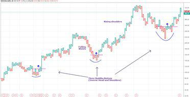

In the ever-evolving landscape of financial markets, understanding the mechanisms behind financial reversals, accounting methods, and algorithmic trading is crucial for investors and traders. The dynamic nature of market environments necessitates a comprehensive appreciation of these concepts, as they form the backbone of modern trading strategies. This article focuses on key elements such as reversal amounts, accounting mechanisms for financial reversals, and the crucial role they play in algorithmic trading.

Reversal amounts in trading refer to specific price points that signal potential changes in market direction. These are essential for traders aiming to execute profitable buy-low-sell-high strategies. The financial reversal accounting mechanisms are vital in ensuring that financial records accurately reflect a company's financial status, thereby maintaining transparency and regulatory compliance.



Algorithmic trading, which automates trades using sophisticated software based on pre-set criteria, becomes a critical tool in leveraging these concepts. Algorithms analyze market trends and reversals, optimizing trading decisions with speed and precision. This article will explore the interplay between these elements to provide a holistic understanding of contemporary trading strategies.

Additionally, the challenges faced in optimizing these mechanisms, such as market volatility and false signals, require innovative solutions and adaptations. The article concludes by anticipating future trends and technological advancements that promise to further revolutionize these areas, such as the incorporation of artificial intelligence and quantum computing in financial markets.

By exploring these mechanisms, this article aims to empower traders and investors with insights necessary for navigating the complexities of modern financial markets, ultimately enhancing trading success and financial reporting accuracy.

## Table of Contents

## Understanding Reversal Amounts in Trading

Reversal amounts in trading are critical price thresholds that, when reached, prompt a repositioning of data points on a technical chart, often moving it horizontally to signal potential changes in market direction. Understanding these reversal amounts is essential for traders aiming to anticipate and capitalize on market reversals, where the prices of financial securities move contrary to their prevailing trend. 

Spotting these reversals can be quite challenging due to the inherent complexity and noise within market data. However, it remains crucial for implementing the classic investment strategy of buying low and selling high. Successful identification of market reversals can significantly enhance a trader's ability to make profitable decisions. This task often involves monitoring price patterns and analyzing historical data to predict future price movements.

Point-and-figure charts are a notable methodology that employs reversal amounts to track long-term trends. These charts differ from traditional time-based charts, focusing instead on price movements. A predetermined reversal amount is set, and the chart only registers price movements that exceed this threshold, thereby filtering out insignificant price fluctuations and providing a clearer picture of significant market trends. This method effectively aids in the identification of support and resistance levels, trend reversals, and potential [breakout](/wiki/breakout-trading) points.

Understanding reversal amounts enables traders to adopt more strategic decision-making processes and execute trades with increased precision. By integrating this knowledge with technical analysis tools, traders can develop robust strategies that better respond to dynamic market conditions. This approach can involve using computational techniques such as Python to automate the identification of reversal points.

The following Python snippet demonstrates a basic approach to identifying reversal amounts using historical price data:

```python
def identify_reversals(prices, reversal_amount):
    reversals = []
    current_trend = None
    for i in range(1, len(prices)):
        if current_trend == "up" and prices[i] <= prices[i-1] - reversal_amount:
            current_trend = "down"
            reversals.append((i, prices[i]))
        elif current_trend == "down" and prices[i] >= prices[i-1] + reversal_amount:
            current_trend = "up"
            reversals.append((i, prices[i]))
        elif current_trend is None:
            current_trend = "up" if prices[i] > prices[i-1] else "down"
    return reversals

historical_prices = [100, 102, 105, 98, 97, 101, 110, 108, 107]
reversal_amount = 5
reversal_points = identify_reversals(historical_prices, reversal_amount)
print("Reversal points:", reversal_points)
```

In this example, the function `identify_reversals` scans through historical price data and logs points where the price movement exceeds the specified `reversal_amount`, signaling potential market reversals. Using such quantitative approaches allows traders to automate and refine their strategies, improving their ability to spot and act upon profitable trading opportunities.

## Financial Reversal Accounting Mechanisms

Financial reversal accounting mechanisms are pivotal for ensuring the accuracy of financial statements. These adjustments are necessary to correct previous entries that may have been inaccurately recorded, reflecting the true financial position of a company.

One of the primary mechanisms in this process is the use of reversal journal entries. A reversal journal entry is a method used to cancel or reverse a previously recorded transaction, providing clarity and ensuring that company's financial records accurately portray its economic activities. For instance, when an error is identified or an estimate needs revision, a reversal entry is made to negate the effect of the original entry.

Another significant adjustment within financial reversal accounting involves accrual reversals. In typical accrual accounting, revenues and expenses are recorded when they are earned or incurred, regardless of when the cash transactions occur. Accrual reversals function to adjust entries for expenses or revenues that have been overestimated or underestimated. For example, if a company initially overestimated its revenue for a specific period, an accrual reversal is made to correct this overestimation, thus improving financial accuracy.

Mathematically, if a company recorded an accrued revenue of $10,000 but later determined the actual figure to be $8,000, the reversal entry would be:

$$
\text{Reversal Amount} = \text{Recorded Amount} - \text{Actual Amount}
$$
$$
\text{Reversal Amount} = 10,000 - 8,000 = 2,000
$$

This $2,000 difference is then reversed to correctly reflect the actual revenue in the financial statements.

Accurate financial reversal accounts are essential for maintaining regulatory compliance. Financial statements that faithfully represent a company's financial health are crucial for stakeholders, including investors. Transparent and precise financial data build trust and enable informed decision-making.

In summary, financial reversal accounting mechanisms, through the use of reversal journal entries and accrual reversals, significantly contribute to the reliability and transparency of financial reporting. They ensure that the financial statements convey the actual financial status of a company, bolstering investor confidence and maintaining compliance with accounting standards.

## Algorithmic Trading Overview

Algorithmic trading, commonly known as algo trading, involves the use of computer systems to automate the process of trading financial securities based on predefined instructions. These instructions are typically set by sophisticated mathematical models and algorithms that can process vast amounts of data at remarkable speeds. The primary objective is to capitalize on even minute price fluctuations to generate profit, often trading within microseconds.

Algo trading systems analyze numerous market variables and indicators to execute trades efficiently. These include price, timing, [volume](/wiki/volume-trading-strategy), and cost of transactions. The algorithms detect patterns and trends that might not be immediately apparent to human traders. By operating at high speed and with precision, they can address inefficiencies within the market, such as [arbitrage](/wiki/arbitrage) opportunities, which arise from price differentials across different exchanges or securities.

Mathematically, [algorithmic trading](/wiki/algorithmic-trading) can be described using various formulas that help predict future market behaviors. For example, one commonly used model is the Moving Average Crossover, which uses the crossover of short-term and long-term moving averages to signal a change in trend direction. This model is often represented as:

$$
\text{Crossover Signal} = \text{MA}_{\text{short-term}} - \text{MA}_{\text{long-term}}
$$

When $\text{Crossover Signal}$ moves from negative to positive, it indicates a potential buy signal, suggesting the short-term market sentiment is improving against long-term averages.

Another significant aspect of algo trading is the execution of high-frequency trading ([HFT](/wiki/high-frequency-trading-strategies)). HFT exploits small time windows and executes a large number of orders in fractions of a second. This type of trading accounts for a substantial portion of the trading volume on major stock exchanges. A report by Thomson Reuters indicated that algo trading accounted for around 60%-73% of the equity market in the United States in recent years.

Moreover, algorithmic trading facilitates the implementation of complex strategies that might involve a wide range of transactions, such as [statistical arbitrage](/wiki/statistical-arbitrage), [trend following](/wiki/trend-following), and [market making](/wiki/market-making). These strategies leverage market inefficiencies across large datasets and implement them without human intervention.

The pervasive integration of algorithmic trading in financial markets underscores its critical role in enhancing [liquidity](/wiki/liquidity-risk-premium) and reducing transaction costs. However, it also presents certain risks and challenges related to market [volatility](/wiki/volatility-trading-strategies) and flash crashes, where incorrect algorithms or systems errors could lead to severe market impacts.

Some of the major algorithmic trading platforms include Bloomberg Terminal, MetaTrader, and QuantConnect, each offering a spectrum of functionalities tailored to both beginners and advanced users in the financial sector. As algorithmic trading continues to evolve with technological advancements, particularly in [artificial intelligence](/wiki/ai-artificial-intelligence) and [machine learning](/wiki/machine-learning), its influence on trading strategies and market dynamics is expected to deepen further.

## Role of Algorithms in Market Trend Reversals

Algorithms are pivotal in identifying market trend reversals by processing and analyzing substantial amounts of historical data. The employment of technical indicators such as moving averages, Relative Strength Index (RSI), and Moving Average Convergence Divergence (MACD) forms the backbone of algorithmic strategies to spot reversal signals. Moving averages, for instance, smooth out price data to identify the direction of the trend over a specific period. This helps in pinpointing potential reversal points when intersecting with current price trends.

The sophistication of algorithms is significantly enhanced by advanced AI and machine learning models. Machine learning algorithms are adept at uncovering patterns not immediately discernible to human analysts. They can learn from historical market data, recognize complex patterns, and adjust models to improve predictive accuracy. Neural networks, a subset of machine learning, mimic the human brain's structure and can process vast datasets to detect nuanced changes in market conditions, thereby enabling better reversal predictions.

This automation facilitates traders in executing timely and informed responses to market changes, thus bolstering profitability and reducing associated risks. By leveraging these systems, traders can analyze massive datasets with precision and speed, making decisions based on data trends rather than instinct. This capability not only enhances market participation decisions but also aids in optimizing entry and [exit](/wiki/exit-strategy) points in trades, which is crucial for managing risk and capitalizing on market movements.

The implementation of code snippets or algorithms can further illustrate how computational tools are employed in this domain. A basic example of how moving averages might be calculated in Python is as follows:

```python
import numpy as np

def calculate_moving_average(data, period):
    return np.convolve(data, np.ones(period)/period, mode='valid')

# Example usage
prices = [100, 102, 101, 104, 107, 106, 105]
moving_average = calculate_moving_average(prices, 3)

print(moving_average)
```

This code computes simple moving averages, which can be utilized within larger algorithmic frameworks to help discern trends and potential reversals. Through these methodologies, algorithmic trading continuously evolves, equipping traders with enhanced tools to adapt to and anticipate the intricacies of market dynamics.

## Challenges and Risks in Reversal Algo Trading

Reversal trading within an algorithmic framework, while promising in its potential to amplify gains by capturing market reversals, is fraught with several challenges that traders must navigate.

Market volatility stands as a primary challenge. High volatility conditions often lead to erratic price movements, complicating the identification of genuine reversals. In such environments, price fluctuations can produce numerous false signals, leading algorithms to execute trades based on misleading or transient market conditions. To address this, traders often employ adaptive algorithms capable of dynamically adjusting their parameters in response to real-time market data. These algorithms can incorporate volatility measures, such as the Average True Range (ATR), to modulate their sensitivity to price movements and filter out false signals. 

```python
def calculate_ATR(data, period=14): 
    data['TR'] = data['High'] - data['Low'] 
    data['ATR'] = data['TR'].rolling(window=period).mean() 
    return data['ATR']
```

In addition to market volatility, unforeseen global events can also disrupt patterns previously relied upon by algorithms. These events, ranging from geopolitical tensions to sudden economic announcements, can invalidate algorithms' assumptions, necessitating real-time strategy adjustments. Algorithmic systems need robust risk management protocols and the ability to halt trading under pre-defined conditions to mitigate potential losses during such events.

Another layer of complexity is introduced by the concept of overfitting, where an algorithm becomes excessively tailored to historical data, losing its ability to perform well in out-of-sample data. This problem can lead to poor performance when the algorithm faces new market conditions. Techniques like cross-validation and regularization are essential in the algorithm development process to ensure models generalize well to unseen data.

Finally, continuous strategy refinement is crucial, mandating traders to be vigilant in updating and testing their algorithms. This involves a systematic review process that scrutinizes past performance, market conditions, and algorithmic decision-making processes. 

In summary, effective reversal algo trading demands a profound understanding of current market dynamics coupled with sophisticated algorithm design. Traders must employ adaptive strategies, rigorous testing, and real-time data integration to manage risks and enhance accuracy in executing trades.

## Future Trends in Reversal and Algo Trading

The future of algorithmic trading is closely tied to the advancements in artificial intelligence (AI) and machine learning technologies. These innovations are enhancing the ability to better detect and predict market reversals, allowing traders to preemptively react to potential price changes. By employing sophisticated algorithms capable of learning from vast sets of historical and real-time data, machine learning models can identify reversal patterns with increasing precision.

Moreover, the rise of quantum computing presents a transformative potential in data processing capabilities. Quantum computers leverage the principles of quantum mechanics to process information at unprecedented speeds compared to classical computers. This capability can significantly reduce the time required for complex calculations inherent in reversal algorithms, thereby increasing the agility and responsiveness of trading strategies.

Another promising technological development is the integration of natural language processing (NLP) in algorithmic trading. NLP enables algorithms to analyze unstructured data from news sources, social media, and financial reports to gauge market sentiment. This analysis can refine reversal predictions by incorporating qualitative insights into quantitative models, offering traders a more holistic view of market dynamics.

Regulatory changes also play a critical role in shaping the future landscape of algorithmic and reversal trading. As financial markets adjust to enhanced oversight and compliance requirements, traders must adapt their algorithms to meet these standards without compromising on performance. These evolving regulations necessitate the continuous updating of trading frameworks to ensure adherence to legal obligations while taking full advantage of technological advancements.

In summary, the convergence of AI, machine learning, quantum computing, and NLP is poised to revolutionize algorithmic trading by enhancing predictive capabilities and execution efficiency. Coupled with regulatory adaptations, these technological innovations will continue to shape the strategies and operations within financial markets. Traders equipped to leverage these tools and navigate the regulatory environment effectively will be better positioned to capitalize on market opportunities.

## Conclusion

Reversal amounts, financial reversal accounting, and algorithmic trading form a crucial intersection in modern financial analysis and trading. These components are pivotal in identifying profitable trading opportunities and ensuring the precision of financial reporting. As financial markets continue to evolve, the necessity for continuous adaptation and innovation in these areas is evident. Traders and investors who understand and leverage these mechanisms are better equipped to achieve success and manage risks efficiently.

Reversal amounts, used in technical analysis, enable traders to discern market reversals and optimize trading strategies, fostering the potential for buying low and selling high. Meanwhile, financial reversal accounting mechanisms ensure the integrity of financial statements, reflecting the true financial position of a company. Accurate accounting fosters trust among investors, providing transparent and compliant financial data.

Algorithmic trading transforms the landscape by automating trading strategies, utilizing algorithms to identify market trends and reversals rapidly. These automated systems reduce human error and capitalize on market inefficiencies, contributing significantly to trading volumes in major markets.

The integration of these components facilitates a comprehensive approach to modern trading strategies, where the synergy between identifying price reversals and maintaining accurate financial records enhances overall market efficiency. In the dynamic financial markets, the ability to adapt and innovate in response to new challenges and opportunities remains a competitive advantage. Understanding and effectively applying these mechanisms can significantly enhance trading success and optimize risk management.

## References & Further Reading

[1]: Bergstra, J., Bardenet, R., Bengio, Y., & Kégl, B. (2011). ["Algorithms for Hyper-Parameter Optimization."](https://dl.acm.org/doi/10.5555/2986459.2986743) Advances in Neural Information Processing Systems 24.

[2]: ["Advances in Financial Machine Learning"](https://www.amazon.com/Advances-Financial-Machine-Learning-Marcos/dp/1119482089) by Marcos Lopez de Prado

[3]: ["Evidence-Based Technical Analysis: Applying the Scientific Method and Statistical Inference to Trading Signals"](https://www.amazon.com/Evidence-Based-Technical-Analysis-Scientific-Statistical/dp/0470008741) by David Aronson

[4]: ["Machine Learning for Algorithmic Trading"](https://github.com/stefan-jansen/machine-learning-for-trading) by Stefan Jansen

[5]: ["Quantitative Trading: How to Build Your Own Algorithmic Trading Business"](https://www.amazon.com/Quantitative-Trading-Build-Algorithmic-Business/dp/1119800064) by Ernest P. Chan