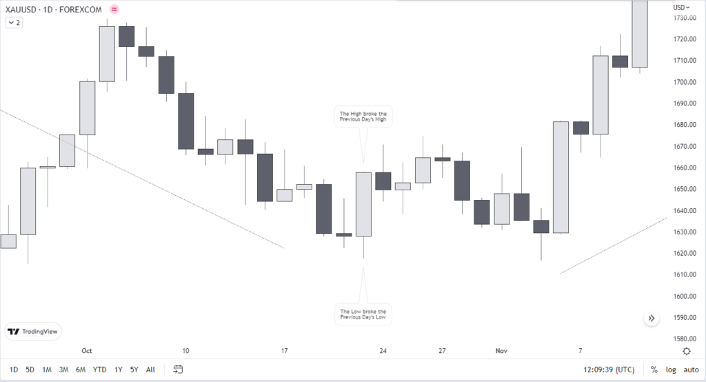

## Table of Contents

## What is reversal day trading?

Reversal day trading is a strategy where traders look for days when the price of a stock or other financial asset might change direction. They try to predict when a stock that has been going up will start to go down, or when a stock that has been going down will start to go up. Traders use different tools and signs, like looking at charts and studying past price movements, to guess when these changes might happen.

The key to reversal day trading is spotting these turning points early. Traders often look for certain patterns in the price movements or special signals from technical indicators. If they think a reversal is coming, they might buy or sell the stock quickly to make a profit from the change in direction. This type of trading can be risky because it's hard to predict the market perfectly, but it can also be rewarding if the trader gets it right.

## How does a reversal day trading strategy work?

Reversal day trading is a way traders try to make money by guessing when a stock's price will start moving in the opposite direction. They look at charts and use special tools to find signs that a stock that's been going up might start going down, or a stock that's been going down might start going up. These signs could be certain patterns in how the price has been moving, or signals from tools like moving averages or the Relative Strength Index (RSI). When traders see these signs, they make a quick decision to buy or sell the stock, hoping to profit from the change in direction.

This kind of trading can be tricky because it's hard to predict exactly when a stock will turn around. Sometimes, traders might think a reversal is coming, but the stock keeps moving in the same direction. That's why it's important for traders to have a plan for what to do if their guess is wrong. They might set a limit on how much they're willing to lose, or they might decide to get out of the trade if the stock doesn't move the way they expected. Even though it's risky, reversal [day trading](/wiki/day-trading-spy) can be rewarding if a trader can spot the right moments to buy or sell.

## What are the key indicators used in identifying potential reversal days?

Traders use several key indicators to spot potential reversal days. One common indicator is the price pattern on a chart. They look for patterns like the "head and shoulders" or "double top" which can signal that a stock's price might be about to change direction. Another important tool is the moving average, which helps traders see the overall trend of a stock's price. If the price crosses over a moving average, it might mean a reversal is coming. The Relative Strength Index (RSI) is also useful. If the RSI shows that a stock is overbought or oversold, it could be a sign that the price will soon reverse.

Another indicator traders watch is volume. A sudden increase in trading volume can suggest that a reversal is happening, especially if it comes with a price change in the opposite direction of the current trend. Candlestick patterns are also important. Patterns like "doji" or "hammer" can indicate that buyers and sellers are fighting for control, which might lead to a reversal. By combining these indicators, traders try to make better guesses about when a stock's price might turn around.

## Can you explain the difference between a bullish and bearish reversal?

A bullish reversal happens when a stock's price has been going down, but then it starts to go up. Traders look for signs that the downward trend is about to change direction. They might see a special pattern on a chart or notice that the price has crossed over a moving average. When they see these signs, they might decide to buy the stock, hoping to make money as the price goes up. A bullish reversal is good news for people who think the stock's price will keep going up.

A bearish reversal is the opposite. It happens when a stock's price has been going up, but then it starts to go down. Traders look for clues that the upward trend is about to reverse. They might see a pattern like a "head and shoulders" on the chart or notice that the price has become overbought according to the RSI. When they see these signs, they might decide to sell the stock, hoping to make money as the price goes down. A bearish reversal is good news for people who think the stock's price will keep going down.

## What are the common chart patterns associated with reversal days?

Chart patterns are important for traders who want to spot reversal days. One common pattern is the "head and shoulders." It looks like three peaks, with the middle peak being the highest. This pattern can show up when a stock's price has been going up but might start to go down. Another pattern is the "double top," which looks like two peaks at about the same height. This can also mean that a stock's price might reverse from going up to going down. On the other hand, the "inverse head and shoulders" and "double bottom" patterns can signal that a stock's price might start going up after going down.

Candlestick patterns are also used to find reversal days. A "doji" candlestick has a very small body and can show that buyers and sellers are unsure about the price. This can mean a reversal might be coming. A "hammer" candlestick has a small body and a long lower shadow, which can signal that a stock's price might start going up after going down. A "shooting star" candlestick has a small body and a long upper shadow, which can mean that a stock's price might start going down after going up. By watching these patterns, traders try to guess when a stock's price will change direction.

## How can volume be used to confirm a reversal day?

Volume can help traders figure out if a reversal day is real. When a stock's price starts to change direction, traders look at the number of shares being traded. If the volume goes up a lot on the day the price changes, it can mean that more people believe the new direction is right. For example, if a stock has been going down but then starts to go up, and the volume is much higher than usual, it's a good sign that the price might keep going up. Traders see this as a confirmation that the reversal is strong.

On the other hand, if the volume doesn't change much when the price starts to move in a new direction, traders might not trust the reversal as much. They might think it's just a short break in the old trend and not a real change. So, volume is like a check to see if other people agree with the new direction of the stock's price. It helps traders feel more sure about their decisions to buy or sell on a reversal day.

## What are the risks involved in trading reversal days?

Trading reversal days can be risky because it's hard to predict when a stock's price will change direction. Traders might think they see signs of a reversal, but the stock could keep moving the same way. This can lead to losses if they buy or sell too early. Also, the market can be affected by news or events that traders can't predict, which can make their guesses about reversals wrong.

Another risk is that traders might get too excited and not follow their plans. They might not set limits on how much they're willing to lose, or they might hold onto a trade too long, hoping the price will reverse. This can lead to bigger losses. It's important for traders to have a clear plan and stick to it, even when trading reversal days.

## How do you set stop-losses and take-profit levels when trading reversals?

When trading reversals, setting stop-losses and take-profit levels is important to manage risk. A stop-loss is like a safety net that helps you limit how much money you could lose. You set it at a price level where, if the stock goes there, you'll automatically sell it to avoid losing more money. For example, if you think a stock's price will start going up after going down, you might set your stop-loss just below the lowest recent price. This way, if the stock keeps going down instead of reversing, you won't lose too much.

Take-profit levels are the opposite. They help you lock in your profits when the stock moves in the direction you expected. If you're betting on a reversal, you might set your take-profit at a price where you think the stock will stop going up or down. For instance, if you're hoping for a bullish reversal, you could set your take-profit at a resistance level, which is a price where the stock might have trouble going higher. By setting these levels, you can make sure you don't miss out on profits if the reversal happens as you expected.

## What time frames are most effective for trading reversal days?

The best time frames for trading reversal days depend on what kind of trader you are. If you like to trade a lot during the day, you might look at short time frames like 5-minute or 15-minute charts. These short time frames can help you spot quick changes in a stock's price. But remember, trading on short time frames can be more risky because the market can move fast and in ways you don't expect.

If you prefer to trade less often, you might use longer time frames like daily or weekly charts. These longer time frames can show you bigger trends and help you see clearer signs of a reversal. Trading on longer time frames might be less stressful because you have more time to make decisions, but you still need to be careful and watch for any big news or events that could change the market.

## How can a trader use technical analysis to improve the success rate of reversal trades?

Traders can use technical analysis to improve the success rate of reversal trades by looking at different tools and patterns on charts. One important tool is the moving average, which helps show the overall trend of a stock's price. If the price crosses over a moving average, it might be a sign that a reversal is coming. Another tool is the Relative Strength Index (RSI), which can tell if a stock is overbought or oversold. If the RSI shows these conditions, it could mean the price will soon reverse. Traders also look for special patterns like "head and shoulders" or "double top" on the charts. These patterns can give clues about when a stock's price might change direction.

Volume is another important part of technical analysis. When a stock's price starts to reverse, traders watch to see if the volume goes up. If more people are trading the stock on the day it changes direction, it can mean that the reversal is strong and more likely to last. By combining these tools and watching for patterns, traders can make better guesses about when a stock's price will turn around. This can help them decide when to buy or sell to make a profit from the reversal.

## What are some advanced techniques for predicting reversal days?

Advanced traders use some special tools and methods to guess when a stock's price might reverse. One way is to use something called the Fibonacci retracement levels. This tool helps traders find points where a stock's price might stop going down and start going up, or stop going up and start going down. Traders draw lines on the chart based on how much the price has moved before, and these lines can show where a reversal might happen. Another method is to look at the Elliott Wave Theory, which says that stock prices move in certain patterns called waves. By studying these waves, traders can try to predict when a big change in direction might be coming.

Another advanced technique is to use multiple time frame analysis. This means looking at the same stock on different time frames, like a 5-minute chart, a daily chart, and a weekly chart. If the signs of a reversal show up on all these time frames, it can make traders more sure that a real reversal is coming. Traders also use something called divergence, where the price of a stock and an indicator like the RSI start to move in opposite directions. If the price is going up but the RSI is going down, it might mean a bearish reversal is coming. By using these advanced techniques, traders can try to make better guesses about when a stock's price will turn around.

## How do macroeconomic events influence reversal day trading strategies?

Macroeconomic events can have a big impact on reversal day trading strategies. These events, like changes in interest rates, employment reports, or big news about the economy, can make stock prices move a lot. When traders are looking for signs of a reversal, they need to pay attention to these events because they can change the direction of the market. For example, if a country's central bank raises interest rates, it might make stocks go down, which could lead to a bearish reversal. Traders who are watching for reversals need to be ready to change their plans if a big economic event happens.

Traders use macroeconomic events to help them guess when a reversal might happen. They look at economic calendars to know when important reports or announcements are coming out. If they think an event will affect the market a lot, they might decide to wait and see what happens before making a trade. Or, they might use the event to confirm a reversal they already think is coming. For example, if a trader sees signs of a bullish reversal and then a good employment report comes out, it could make them more sure about their trade. By keeping an eye on these big events, traders can make better decisions about when to buy or sell on reversal days.

## What is Reversal Trading?

Reversal trading involves pinpointing significant shifts in the direction of asset prices to capitalize on new market trends as they emerge. This strategy stands in contrast to trend-following strategies, which aim to profit from sustained movements in the market by adhering to the predominant direction. Instead, reversal trading adopts a contrarian approach, seeking opportunities when market sentiment reverses direction. 

Identifying potential reversals involves utilizing various technical indicators. Moving averages, a popular tool, help highlight changes in trend direction. For instance, a crossover of a shorter-term moving average above a longer-term moving average might suggest an impending reversal from a downward to an upward trend. Mathematically, given a price series $P(t)$, a simple moving average (SMA) over $n$ periods is calculated as:

$$
\text{SMA}_n(t) = \frac{1}{n} \sum_{i=0}^{n-1} P(t-i)
$$

The Relative Strength Index (RSI) is another key indicator used to identify reversals by measuring the magnitude of recent price changes to evaluate overbought or oversold conditions. RSI values are plotted on a scale from 0 to 100, with readings above 70 often indicating an overbought condition and potential for a reversal downward, while readings below 30 suggest oversold conditions and a possible upward reversal.

Volume patterns also play a crucial role. Increases in trading [volume](/wiki/volume-trading-strategy) can signal the strength of a reversal move, as shifts in market sentiment often accompany changes in volume. A reversal is considered more robust if accompanied by a significant increase in volume.

Market sentiment indicators provide insights into the collective mood of market participants. These indicators analyze data such as news sentiment, social media trends, and other macroeconomic data that might precede or confirm a reversal in market direction.

Employing these indicators, traders aim to detect early signs of reversals, allowing them to enter positions at advantageous price points and capitalize on the ensuing market corrections.

## References & Further Reading

[1]: Bergstra, J., Bardenet, R., Bengio, Y., & Kégl, B. (2011). ["Algorithms for Hyper-Parameter Optimization."](https://papers.nips.cc/paper/4443-algorithms-for-hyper-parameter-optimization) Advances in Neural Information Processing Systems 24.

[2]: ["Advances in Financial Machine Learning"](https://www.amazon.com/Advances-Financial-Machine-Learning-Marcos/dp/1119482089) by Marcos Lopez de Prado

[3]: ["Evidence-Based Technical Analysis: Applying the Scientific Method and Statistical Inference to Trading Signals"](https://www.amazon.com/Evidence-Based-Technical-Analysis-Scientific-Statistical/dp/0470008741) by David Aronson

[4]: ["Machine Learning for Algorithmic Trading"](https://github.com/stefan-jansen/machine-learning-for-trading) by Stefan Jansen

[5]: ["Quantitative Trading: How to Build Your Own Algorithmic Trading Business"](https://www.amazon.com/Quantitative-Trading-Build-Algorithmic-Business/dp/1119800064) by Ernest P. Chan