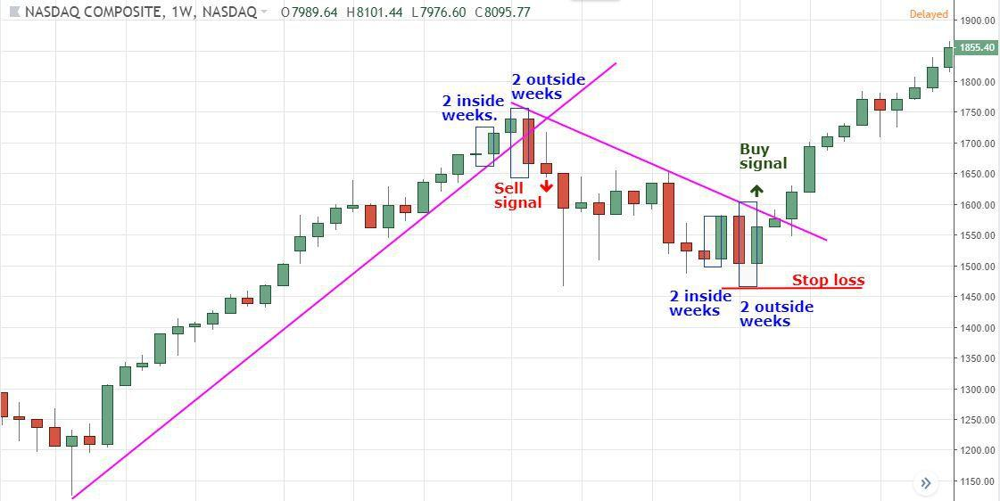

Algorithmic trading has revolutionized the financial markets by using computer algorithms to automate trading decisions. This approach involves the use of complex mathematical models and formulas that identify profitable trading opportunities at speeds and frequencies impossible for human traders. The automation provided by algorithmic trading minimizes human intervention, allowing for efficient execution and reduced costs. It's estimated that more than 70% of all trading volume in the United States equity markets is now generated through algorithmic trading.

Central to the success of algorithmic trading is the ability to analyze market trends and reversals. Market trends refer to the general direction in which financial markets move, ranging from bullish (upward) to bearish (downward). Reversals occur when the market shits direction, shifting from a trend to its opposite. These reversals are pivotal moments in trading, potentially offering significant profit if identified and acted upon correctly. Accurately pinpointing these reversals is crucial, as they inform traders' buying and selling decisions and heavily influence market strategy.



Finance algorithms play a critical role in detecting trend reversals. These algorithms analyze patterns and trends within market data, leveraging indicators like moving averages, oscillators, and momentum indicators to predict potential reversals. The automation of this detection process enables traders to respond instantly to market changes, optimizing their strategies for maximum profitability.

Technological advancements, particularly in artificial intelligence and machine learning, have further enhanced the capability of financial algorithms to predict market trends and reversals. AI-based systems can process massive amounts of data and learn from previous patterns, improving their predictive accuracy over time. As a result, these systems are increasingly being relied upon to not only detect but also anticipate market changes, giving traders a competitive edge in the fast-paced world of financial markets.

## Table of Contents

## Understanding Market Trends and Reversals

Market trends refer to the general direction in which a market is moving over a certain period. These trends can be classified into three primary types: upward (bullish), downward (bearish), and sideways (consolidation or range-bound). An upward trend is characterized by consistently higher highs and higher lows, indicating growing market strength or investor confidence. Conversely, a downward trend features lower highs and lower lows, reflecting diminishing confidence or deteriorating market conditions. A sideways trend occurs when there is no significant upward or downward movement, with prices typically oscillating within a horizontal range.

Trend reversals occur when a market changes direction, shifting from one type of trend to another. This can take place due to various reasons, including economic news, changes in market sentiment, or shifts in investor expectations. Reversals can be temporary, signaling a short-term correction, or more permanent, indicating a longer-term change in market direction. The impact of a trend reversal can be significant, often resulting in altered investment strategies and adjustments in asset allocations. A sudden shift from a bullish to a bearish trend might induce selling pressure, while a change from bearish to bullish can trigger buying interest.

Accurately identifying trend reversals is crucial in financial markets, as these shifts can offer opportunities for profit or signal a need to hedge existing positions. Investors and traders employ various methods to detect reversals, including technical analysis, which looks for patterns and indicators such as moving averages, trendlines, and [momentum](/wiki/momentum) oscillators. For example, the Moving Average Convergence Divergence (MACD) indicator is widely used to identify potential reversals by reflecting changes in the strength, direction, momentum, and duration of a trend using two moving averages.

In Python, a basic implementation to detect a crossover, a common signal for a potential trend reversal, using the MACD can be as follows:

```python
import numpy as np
import pandas as pd

def calculate_macd(prices):
    short_ema = prices.ewm(span=12, adjust=False).mean()
    long_ema = prices.ewm(span=26, adjust=False).mean()
    macd = short_ema - long_ema
    signal = macd.ewm(span=9, adjust=False).mean()
    macd_crossover = macd - signal
    return macd, signal, macd_crossover

# Example usage
prices = pd.Series([random_price_data]) # replace with actual price data
macd, signal, macd_crossover = calculate_macd(prices)
potential_reversals = macd_crossover.apply(lambda x: True if x > 0 else False)

print(potential_reversals)
```

Understanding market trends and being able to identify reversals with accuracy can give traders a strategic advantage, allowing them to capitalize on new opportunities or mitigate risks from unfavorable market movements. By integrating algorithms and statistical models, traders aim to enhance their reversal detection capabilities, thereby optimizing their decision-making processes in financial markets.

## Algorithmic Trading Overview

Algorithmic trading, often termed as algo trading, refers to the use of computer algorithms to automate the process of buying and selling securities in financial markets. This form of trading leverages advanced mathematical models and computational techniques to execute trades at speeds and frequencies that a human trader cannot achieve.

### What is Algorithmic Trading?

Algorithmic trading involves the utilization of predefined sets of rules—algorithms—that process market data to execute trades. These algorithms analyze a vast array of conditions, from price, timing, and [volume](/wiki/volume-trading-strategy), to complex quantitative models that [factor](/wiki/factor-investing) in trends and patterns, making trading decisions based on predefined criteria. The primary goal of [algorithmic trading](/wiki/algorithmic-trading) is to exploit market conditions and extract profits efficiently while minimizing human intervention.

### Key Characteristics of Algorithmic Trading Systems

1. **Speed and Efficiency**: Algorithmic systems are capable of executing orders within milliseconds, thereby capitalizing on fleeting trading opportunities. This speed is crucial in modern financial markets, where conditions can change rapidly.

2. **Accuracy and Precision**: By minimizing human involvement, algorithms reduce the room for error that can arise from manual trading. They can precisely enter the size of orders and execute them at the best possible prices.

3. **Complex Strategy Implementation**: Algorithms can manage sophisticated strategies that account for multiple variables, which would be complex and time-consuming for human traders to handle manually. For example, statistical arbitrage involves algorithms recognizing patterns and differences between correlated securities.

4. **Backtesting**: A significant feature of algorithmic trading systems is their capability to test trading strategies using historical data. This allows traders to evaluate the effectiveness of strategies before deploying them in live markets.

### Benefits of Using Algorithms to Trade in Financial Markets

1. **Increased Liquidity**: Algorithmic trading enhances market liquidity as it can quickly absorb buy and sell orders, reducing bid-ask spreads and facilitating smoother price discovery.

2. **Reduced Transaction Costs**: By automating trading processes, algo systems can decrease transaction costs compared to manual trading. They optimize execution by scheduling trades over time based on predetermined strategies, avoiding market impact caused by large orders.

3. **24/7 Trading**: Unlike humans, algorithms can operate continuously without fatigue, making them ideal for markets that operate round the clock, such as forex or cryptocurrency markets.

4. **Emotional Detachment**: Algorithms trade based on logic and data, free from human emotions such as fear or greed. This detachment allows for more rational trading decisions.

5. **Enhanced Strategy Deployment**: Complex trading strategies such as market making, arbitrage, and trend following can be more easily deployed using algorithms, as they can handle multiple variables and large datasets simultaneously.

Overall, algorithmic trading represents a strategic evolution in the financial markets, empowering traders to harness technology for greater efficiency, accuracy, and profitability. As markets become increasingly complex and data-driven, the reliance on algorithmic systems continues to grow, further transforming how trading is conducted in global financial arenas.

## Role of Algorithms in Identifying Market Trend Reversals

Algorithms play a crucial role in identifying market trend reversals, a key component in algorithmic trading. These algorithms utilize a variety of technical indicators and patterns to detect potential reversals in market trends, helping traders make informed decisions. 

One of the primary methods by which algorithms identify market reversals is through the analysis of technical indicators. Common technical indicators include moving averages, relative strength index (RSI), and MACD (moving average convergence divergence). For instance, moving averages help identify trend directions, and when a shorter-term moving average crosses a longer-term moving average, this may signify a reversal. The RSI indicates overbought or oversold conditions in a market; a typical strategy involves looking for reversals when the RSI crosses certain thresholds (e.g., below 30 or above 70).

Additionally, patterns such as head and shoulders, double tops, and double bottoms are often incorporated into algorithms to signal potential reversals. These patterns are identified through historical price data analysis and recognized by algorithms programmed to execute trades based on predefined criteria.

Artificial intelligence (AI) significantly enhances the detection of market reversals by adding layers of pattern recognition and predictive analytics that go beyond traditional methods. Machine learning models, for example, can be trained on vast datasets to uncover complex market patterns and detect subtle signals indicative of an impending reversal. These models can continuously learn and adapt to new market conditions, becoming more accurate over time.

The integration of [deep learning](/wiki/deep-learning) techniques has further advanced market reversal detection. Neural networks, especially recurrent neural networks (RNNs) and [long short](/wiki/equity-long-short)-term memory (LSTM) networks, are particularly adept at processing sequential data and recognizing temporal patterns, making them invaluable in predicting market trends and reversals.

In summary, algorithms detect market reversals by employing a combination of technical indicators, pattern recognition, and sophisticated AI techniques. This multifaceted approach enhances traders' ability to identify true reversal signals, adjusting their strategies accordingly to capitalize on market changes.

## Key Algorithms and Strategies for Trading Reversals

Algorithmic trading has revolutionized financial markets, and utilizing algorithms to detect trend reversals is a critical aspect for traders aiming to capitalize on market changes. Notable algorithms in this domain include Reversal Algo and Trend Tracking, which employ sophisticated strategies and techniques to identify and execute trades at potential reversal points.

Reversal algorithms typically rely on technical analysis to discern market movements. These algorithms are programmed to recognize patterns that historically precede reversals, employing a variety of technical indicators such as moving averages, Relative Strength Index (RSI), and MACD (Moving Average Convergence Divergence). The primary objective is to differentiate between a temporary pause in a trend and an actual reversal, allowing traders to position themselves advantageously.

### Reversal Algo

Reversal Algo is often predicated on identifying key chart patterns and pivot points. Examples of chart patterns used include head and shoulders, double tops and bottoms, and rising or falling wedges. Reversal Algo integrates the detection of these patterns with other indicators to assess the likelihood of a trend reversal. For instance, a typical strategy might be to initiate a trade when the price crosses a critical moving average after a confirmed chart pattern:

```python
def detect_reversal(prices, short_window=40, long_window=100):
    short_mavg = prices.rolling(window=short_window, min_periods=1).mean()
    long_mavg = prices.rolling(window=long_window, min_periods=1).mean()

    signals = pd.DataFrame(index=prices.index)
    signals['signal'] = 0.0
    signals['short_mavg'] = short_mavg
    signals['long_mavg'] = long_mavg

    signals['signal'][short_window:] = np.where(signals['short_mavg'][short_window:] 
                                                > signals['long_mavg'][short_window:], 1.0, 0.0)   

    signals['positions'] = signals['signal'].diff()
    return signals
```

### Trend Tracking

Trend Tracking algorithms focus on more dynamic patterns by continuously monitoring price momentum and volume to detect reversals. One method is to analyze the divergence between price trends and momentum indicators, as divergences often signal upcoming reversals.

The successful implementation of these algorithms requires adapting strategies based on market conditions. Traders might adjust parameters such as the length of moving averages or the thresholds for indicators to enhance detection accuracy. Machine learning models, particularly those based on neural networks, are increasingly used to refine these processes by learning from historical data to predict future reversals with greater precision.

### Examples of Reversal Signals

1. **Bullish Reversal Signal**: Occurs when a downward trend shows signs of shifting upwards. A common indicator would be when the RSI moves from below 30 (indicating an oversold condition) back upward.

2. **Bearish Reversal Signal**: Characterized by an upward trend reversing downwards. This may be indicated by the RSI moving from above 70 (indicating overbought conditions) downward.

In practice, trading algorithms generate such signals and automatically execute buy or sell orders when these conditions are met, sometimes combining multiple signals to reduce false positives. For instance, a bullish reversal might only trigger a buy order if both RSI and MACD confirm the transition, minimizing the risk associated with false breakouts.

Ultimately, the effectiveness of reversal algorithms hinges on the sophistication of the strategies they employ and the trader's ability to adapt these strategies in response to evolving market dynamics.

## Challenges in Algorithmic Trading of Market Reversals

Algorithmic trading, particularly in identifying market trend reversals, presents several challenges. One of the primary challenges is identifying and mitigating false signals. False signals occur when an algorithm indicates a reversal that does not materialize, potentially resulting in losses. These incorrect signals are often generated due to the inherent noise present in financial markets. Market noise refers to random price fluctuations that do not correspond to actual market trends. Mitigating false signals requires sophisticated algorithms that can distinguish between genuine signals and noise.

Another challenge is dealing with market noise and sudden [volatility](/wiki/volatility-trading-strategies). Financial markets are subject to abrupt changes due to unforeseen events such as economic reports, political events, or natural disasters. These events can create spikes in volatility, making it difficult for algorithms to accurately predict reversals. High volatility can lead to rapid price changes that are not indicative of longer-term trends, potentially causing algorithmic systems to misinterpret these as reversal signals.

To adapt to changing market conditions, strategies are implemented to enhance the robustness of trading algorithms. One approach is the incorporation of adaptive algorithms that continuously learn from market data. These algorithms adjust their parameters in real-time based on historical and current market conditions, thus improving their prediction accuracy. Machine learning techniques, such as [reinforcement learning](/wiki/reinforcement-learning) and deep learning, can be particularly effective in enabling algorithms to adapt to new patterns in data.

Moreover, algorithms can be designed to incorporate multiple technical indicators and patterns, reducing reliance on a single source of information and thereby minimizing the risk of false signals. By using a combination of indicators, algorithms can cross-verify potential reversal signals, providing a more comprehensive view of the market situation.

In a Python-based environment, for example, one might use libraries such as TensorFlow or PyTorch to implement neural networks that can learn from a stream of market data. These neural networks can be trained to recognize patterns that historically precede market reversals.

```python
import numpy as np
import pandas as pd
from sklearn.model_selection import train_test_split
from sklearn.ensemble import RandomForestClassifier

# Sample code to illustrate a basic machine learning model for trend reversal prediction
# Generate dummy market data
np.random.seed(42)
data = pd.DataFrame({
    'feature1': np.random.randn(1000),
    'feature2': np.random.randn(1000),
    'feature3': np.random.randn(1000),
    'label': np.random.choice([0, 1], size=(1000,))  # 0: No reversal, 1: Reversal
})

# Splitting the data into train and test sets
X_train, X_test, y_train, y_test = train_test_split(data[['feature1', 'feature2', 'feature3']], data['label'], test_size=0.2, random_state=42)

# Initialize and train a simple Random Forest classifier
model = RandomForestClassifier(n_estimators=100, random_state=42)
model.fit(X_train, y_train)

# Evaluate the model
accuracy = model.score(X_test, y_test)
print(f'Model accuracy: {accuracy}')

```

The precision and adaptability of algorithms can be further enhanced by utilizing high-frequency trading data, which offers granular insights into market movements. Advanced data analytics and robust back-testing frameworks are essential to test algorithm performance against historical data, thereby refining algorithms to better handle future market inconsistencies.

Ultimately, success in algorithmic trading of market reversals depends on the continuous refinement of algorithms and the use of advanced technologies that can process and analyze large volumes of data quickly and efficiently.

## Case Studies and Examples

Algorithmic trading has significantly evolved over recent decades, with a pivotal focus on detecting and capitalizing on market trend reversals. Real-world case studies provide valuable insights into the practical applications and challenges faced when implementing reversal trading strategies.

### Successful Reversal Trades

One notable example of a successful reversal trade occurred in the early 2010s when a [hedge fund](/wiki/hedge-fund-trading-strategies) utilized a combination of moving average convergence divergence (MACD) and Relative Strength Index (RSI) indicators. By using these indicators, the algorithm detected an oversold condition and a pending bullish reversal in a major stock index. The fund's algorithm entered a long position just before the market's upward trend, resulting in significant profits as the market rebounded over the following months.

The success of this trade was attributed to:
- The precise calibration of the algorithm to respond to specific MACD crossovers and RSI thresholds.
- Backtesting the strategy on historical market data to ensure robustness in various market conditions.
- Fine-tuning the entry and exit signals to minimize false positives.

### Unsuccessful Reversal Trades

Conversely, not all reversal trades yield the desired outcome. An instance of an unsuccessful trade involved an algorithm designed to detect bearish reversals using the Head and Shoulders pattern. This algorithm prematurely identified the pattern on a popular technology stock, leading to a short-selling position. However, market conditions shifted unexpectedly due to a positive earnings report, invalidating the pattern and resulting in substantial losses.

In this case, the primary causes of failure included:
- Over-reliance on a single pattern that is susceptible to false positives without additional confirmation.
- Insufficient integration of external data, such as macroeconomic indicators or company-specific news, which could have contextualized the reversal signal.
- Lack of adaptive mechanisms in the algorithm to quickly modify or exit positions based on new information.

### Learning from Past Trading Signals and Market Behavior

Analyzing past trading signals and market behavior plays a crucial role in refining algorithmic strategies. For instance, examining the time-lag between signal generation and actual market movement can highlight opportunities to adjust algorithmic responsiveness. Additionally, incorporating a diverse set of indicators, such as momentum oscillators or volume analysis, improves the robustness of reversal detection.

Traders have learned to enhance their algorithms by:
- Implementing machine learning techniques to identify non-linear relations in historical price data, allowing for more nuanced pattern recognition.
- Utilizing ensemble methods that combine multiple models or indicators, thus providing a more comprehensive assessment of potential reversals.
- Developing automated feedback loops where algorithms learn from past trades, adjusting their parameters to avoid repeat mistakes and optimize performance over time.

### Adaptation and Improvement of Algorithms

The continuous evolution of market conditions necessitates ongoing adaptation of trading algorithms. For example, distinct market regimes, such as high volatility environments, require different algorithmic responses. Traders have adopted strategies to enhance their algorithms' adaptability by:

- Incorporating dynamic threshold adjustment mechanisms that alter entry and exit criteria based on prevailing volatility or market sentiment.
- Using reinforcement learning models that simulate trading scenarios and evolve algorithm parameters by trial and error, optimizing decision-making processes.
- Maintaining an extensive database of market events and corresponding algorithm behaviors, enabling quick recalibration in post-analysis sessions.

In conclusion, case studies of both successful and unsuccessful reversal trades underscore the multifaceted nature of algorithmic trading. By learning from past experiences, traders can continuously refine their strategies, bolstering their ability to predict market reversals accurately and efficiently.

## Future Trends in Reversal Finance Algo Trading

The future of algorithmic trading, particularly concerning market reversal detection, is poised for significant transformation with the growing incorporation of [artificial intelligence](/wiki/ai-artificial-intelligence) (AI) and other cutting-edge technologies. AI's impact on trading algorithms is becoming increasingly profound, driven by advancements in [machine learning](/wiki/machine-learning) and data processing capabilities. One notable prediction is that AI will enhance the capacity of algorithms to process and interpret vast datasets, allowing for more accurate predictions of market reversals.

Machine learning models, specifically deep learning techniques, can analyze patterns within market data that are too complex for traditional algorithms to decipher. These models can adapt and learn from past trading data, improving their predictive capabilities over time. For instance, convolutional neural networks (CNNs) and recurrent neural networks (RNNs) are being explored to recognize intricate patterns in historical price data, thereby improving the detection of potential trend reversals.

Emerging technologies such as quantum computing also have the potential to revolutionize algorithmic trading. Quantum computers could enable the processing of extraordinarily large and complex datasets at speeds unattainable by classical computers. This capability could greatly enhance the precision of market predictions, including the identification of subtle signals indicative of market reversals.

Additionally, the integration of natural language processing (NLP) into trading algorithms is another trend on the horizon. By analyzing news articles, social media sentiment, and other textual data, algorithms can obtain a more comprehensive understanding of market sentiment, providing a more holistic approach to predicting reversals.

The potential for increased precision in predicting market reversals lies not only in these technological advancements but also in the collaboration between human intelligence and advanced algorithms. Traders can leverage AI to process and analyze data, while human intuition and expertise can provide oversight and strategic direction, ensuring that algorithmic predictions align with broader market insights.

In conclusion, the future of reversal finance algorithmic trading points toward a more integrated and precise approach, driven by AI and revolutionary technologies. These advancements are expected to bring about more nuanced and reliable trading strategies, potentially yielding better outcomes for traders who adeptly incorporate these tools into their decision-making processes.

## Conclusion

Algorithm-based reversal trading represents a significant advancement in the field of finance, providing traders with tools to more accurately identify and act upon market trend reversals. The automation of detecting these reversals not only increases efficiency but also enhances the potential for higher returns, as algorithms can process vast amounts of data at speeds unattainable by human traders. By leveraging advanced techniques such as machine learning and pattern recognition, these algorithms can discern subtle market signals and adapt to evolving market conditions.

For traders interested in utilizing reversal algorithms, it is essential to focus on a few key areas. Firstly, a deep understanding of the algorithmic models being employed is crucial. Traders should familiarize themselves with technical indicators and set clear parameters to fine-tune the algorithm's performance according to their risk appetite and market conditions. Backtesting over historical data is vital to validating the effectiveness of strategies before applying them with real capital.

Traders should also remain vigilant to the challenges posed by false signals and market noise, which can lead to erroneous trades. Continuous monitoring and adjustment of algorithms are necessary to mitigate these risks. Investing in computational resources and having robust real-time data feeds will also enhance the performance and reliability of trading systems.

Finally, the rapidly evolving nature of algorithmic trading means that staying informed on the latest technologies and strategies is paramount. Traders are encouraged to continually learn and adapt, cultivating a mindset of continuous improvement. Participating in professional forums, attending workshops, and engaging with academic research can provide valuable insights and keep traders at the forefront of new developments. By doing so, traders can harness the full potential of algorithm-based reversal trading to achieve sustained success in the dynamic financial markets.

## References & Further Reading

[1]: Bergstra, J., Bardenet, R., Bengio, Y., & Kégl, B. (2011). ["Algorithms for Hyper-Parameter Optimization."](https://papers.nips.cc/paper/4443-algorithms-for-hyper-parameter-optimization) Advances in Neural Information Processing Systems 24.

[2]: ["Advances in Financial Machine Learning"](https://www.amazon.com/Advances-Financial-Machine-Learning-Marcos/dp/1119482089) by Marcos Lopez de Prado

[3]: ["Evidence-Based Technical Analysis: Applying the Scientific Method and Statistical Inference to Trading Signals"](https://www.amazon.com/Evidence-Based-Technical-Analysis-Scientific-Statistical/dp/0470008741) by David Aronson

[4]: ["Machine Learning for Algorithmic Trading, Second Edition: Predictive models to extract signals from market and alternative data for systematic trading strategies with Python"](https://www.oreilly.com/library/view/machine-learning-for/9781839217715/Text/Front_Matter.xhtml) by Stefan Jansen

[5]: ["Quantitative Trading: How to Build Your Own Algorithmic Trading Business"](https://www.amazon.com/Quantitative-Trading-Build-Algorithmic-Business/dp/1119800064) by Ernest P. Chan