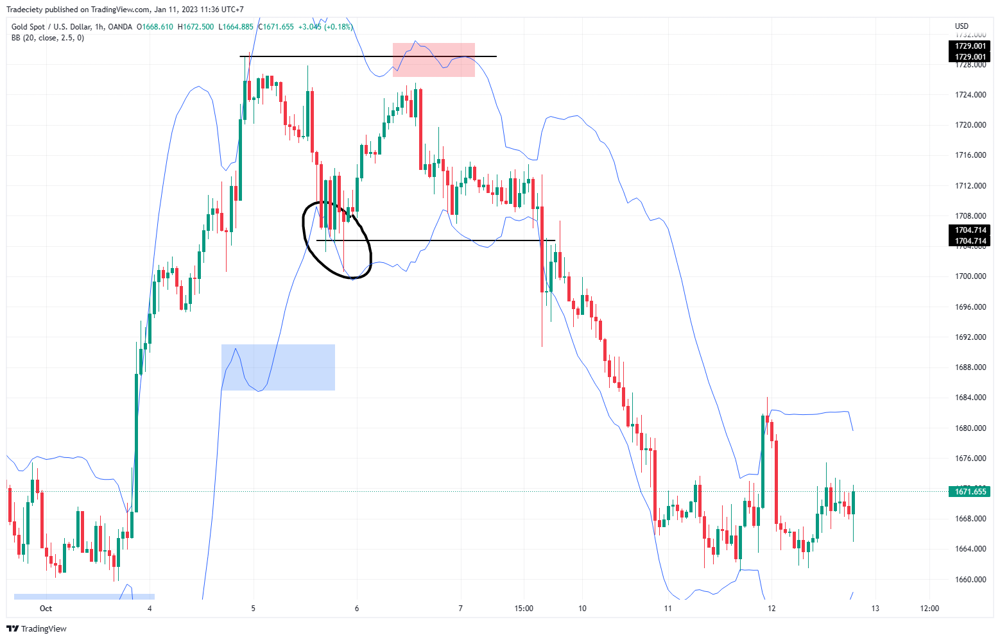

## Table of Contents

## What is a reversal in trading?

A reversal in trading is when the price of a stock or other financial asset changes direction. It means that if the price was going up before, it starts to go down, or if it was going down, it starts to go up. Traders watch for reversals because they can signal good times to buy or sell.

Reversals can happen for many reasons. Sometimes, news about a company or the economy can cause a reversal. Other times, it might be because many traders are buying or selling at the same time. Knowing why a reversal happens can help traders make better decisions.

## How can beginners identify potential reversals on a chart?

Beginners can identify potential reversals by looking at certain patterns on a chart. One common pattern is called a "double top" or "double bottom." A double top happens when the price goes up to a high point, drops down, then goes up again to around the same high point before falling again. This might mean the price is about to start going down. A double bottom is the opposite: the price drops to a low point, goes up, drops again to around the same low point, and then starts going up. This might mean the price is about to start going up.

Another way to spot a potential reversal is by watching for what's called a "head and shoulders" pattern. This pattern has three peaks: the middle peak (the head) is higher than the other two (the shoulders), which are about the same height. If you see this pattern and the price starts to drop after the second shoulder, it might mean a reversal is coming, and the price could start going down. On the flip side, an "inverse head and shoulders" pattern, where the middle peak is lower than the other two, might signal that the price is about to start going up.

It's also helpful to pay attention to something called support and resistance levels. Support is a price level where the price tends to stop falling and might start going up again. Resistance is a price level where the price tends to stop rising and might start going down again. If the price breaks through these levels, it could be a sign of a reversal. For example, if the price breaks below a support level, it might mean the price is about to keep going down. If it breaks above a resistance level, it might mean the price is about to keep going up.

## What are the most common chart patterns indicating a reversal?

The most common chart patterns that indicate a reversal are the double top and double bottom. A double top looks like the letter "M" on a chart. It happens when the price goes up to a high point, drops down, and then goes up again to about the same high point before falling again. This might mean the price is about to start going down. A double bottom is the opposite and looks like the letter "W." The price drops to a low point, goes up, drops again to about the same low point, and then starts going up. This might mean the price is about to start going up.

Another common pattern is the head and shoulders pattern. This pattern has three peaks: the middle peak (the head) is higher than the other two (the shoulders), which are about the same height. If you see this pattern and the price starts to drop after the second shoulder, it might mean a reversal is coming, and the price could start going down. The inverse head and shoulders pattern is the opposite. It has three troughs: the middle trough (the head) is lower than the other two (the shoulders), which are about the same height. If the price starts to rise after the second shoulder, it might mean the price is about to start going up.

Lastly, watching support and resistance levels can help identify reversals. Support is a price level where the price tends to stop falling and might start going up again. Resistance is a price level where the price tends to stop rising and might start going down again. If the price breaks through these levels, it could be a sign of a reversal. For example, if the price breaks below a support level, it might mean the price is about to keep going down. If it breaks above a resistance level, it might mean the price is about to keep going up.

## Can you explain the difference between a trend reversal and a correction?

A trend reversal is when the overall direction of a stock's price changes. If a stock has been going up for a long time and then starts going down, that's a trend reversal. It means the trend, or the main direction the price was moving, has switched from up to down. Trend reversals are important because they can signal big changes in how people feel about a stock or the market.

A correction, on the other hand, is a smaller, temporary move in the opposite direction of the main trend. If a stock has been going up and then drops a bit before continuing to go up, that drop is a correction. Corrections are normal and happen as part of the bigger trend. They don't mean the main trend has changed, just that the price is taking a little break before continuing in the same direction.

So, the key difference is that a trend reversal means the main direction of the price has changed, while a correction is just a small move against the main trend that doesn't change the overall direction.

## What technical indicators are used to confirm a reversal?

Traders use several technical indicators to confirm a reversal. One popular indicator is the Moving Average Convergence Divergence (MACD). When the MACD line crosses above the signal line, it can suggest that the price might start going up. If the MACD line crosses below the signal line, it might mean the price is about to go down. Another useful indicator is the Relative Strength Index (RSI). If the RSI goes above 70, it might mean the price is too high and could start to fall. If it drops below 30, it might mean the price is too low and could start to rise.

Another indicator traders look at is the [volume](/wiki/volume-trading-strategy). If the price starts to reverse and the trading volume is high, it can make the reversal seem more likely to happen. For example, if the price goes up and the volume is high, it might mean more people believe the price will keep going up. On the other hand, if the price goes down with high volume, it might mean more people think the price will keep going down. By watching these indicators, traders can feel more confident about whether a reversal is really happening.

## How does volume play a role in confirming reversals?

Volume is how many shares of a stock are being bought and sold. When a reversal happens and the volume is high, it can make the reversal seem more real. High volume means more people are trading the stock, so if the price goes up with high volume, it might mean more people believe the price will keep going up. If the price goes down with high volume, it might mean more people think the price will keep going down. So, seeing high volume during a reversal can make traders feel more sure that the price is really changing direction.

But, volume can also be tricky. Sometimes, the volume might be high because of news or events that don't have much to do with the stock's long-term direction. For example, if a company announces a new product and the stock price goes up with high volume, it might just be a short-term reaction. Traders need to look at volume along with other indicators like the Moving Average Convergence Divergence (MACD) or the Relative Strength Index (RSI) to really feel sure about a reversal. By putting all these pieces together, traders can make better guesses about whether the price will keep going in the new direction.

## What are some common mistakes traders make when trying to trade reversals?

One common mistake traders make when trying to trade reversals is jumping into a trade too early. They see a price start to go the other way and think it's a reversal, but it might just be a small correction. If the price goes back to its old direction, these traders can lose money. It's important to wait for more signs, like high volume or other indicators, before deciding it's a real reversal.

Another mistake is not using stop-loss orders. A stop-loss order helps traders limit their losses if the price doesn't go the way they thought. Without one, if the price keeps moving against them, they could lose a lot more money than they planned. Using a stop-loss can help traders manage their risk better and protect their money.

Lastly, traders sometimes focus too much on one pattern or indicator. They might see a double top or a head and shoulders pattern and think it's a sure sign of a reversal. But trading is never that simple. It's better to look at many different signs and patterns together. This way, traders can make more informed decisions and avoid being fooled by false signals.

## How can fundamental analysis complement technical analysis in predicting reversals?

Fundamental analysis looks at things like a company's earnings, how much it's growing, and what's happening in the economy. This can help traders understand why a stock's price might change. For example, if a company's earnings are better than expected, the stock price might go up. If the economy is doing badly, stock prices might go down. By using [fundamental analysis](/wiki/fundamental-analysis), traders can see if there are good reasons for a reversal that they spot in the charts. This makes their predictions more reliable because they're not just looking at price patterns, but also at what's really happening with the company and the economy.

Technical analysis, on the other hand, focuses on price patterns and indicators on charts. It's great for spotting when a reversal might happen, but it doesn't tell you why. That's where fundamental analysis can help. If a trader sees a reversal pattern on a chart and also knows that the company just got a big new contract or that interest rates are going down, they can feel more confident that the reversal is real. By combining both types of analysis, traders get a fuller picture of what's going on. This can help them make better decisions and avoid being tricked by false signals on the chart.

## What are advanced strategies for trading reversals, including risk management?

Advanced traders use several strategies to trade reversals while also managing their risks. One strategy is to use multiple time frames to confirm a reversal. For example, if a trader sees a reversal pattern on a daily chart, they might look at a weekly chart to see if the same pattern is there. This helps them feel more sure that the reversal is real. Another strategy is to use a combination of technical indicators like MACD, RSI, and volume. If all these indicators show a reversal at the same time, it's a stronger signal. Traders also use advanced chart patterns like the "cup and handle" or "rounded bottom," which can signal a reversal more clearly than simple patterns like the double top or bottom.

Risk management is very important when trading reversals. One way to manage risk is by using stop-loss orders. A stop-loss order tells the broker to sell the stock if it drops to a certain price, which helps limit how much money a trader can lose. Another way is to only risk a small part of their trading money on each trade. For example, if a trader only risks 1% of their money on each trade, they can still make money even if some trades don't work out. Finally, traders can use position sizing to manage risk. This means they decide how many shares to buy based on how much they're willing to lose. By using these strategies and managing their risks carefully, advanced traders can trade reversals more safely and successfully.

## Can you discuss the psychological aspects of trading reversals and how to manage them?

Trading reversals can be tough on a trader's mind. When you see a price start to go the other way, it's easy to feel excited or scared. You might think you've found a great chance to make money, but you could also worry that you're wrong and the price will go back to where it was. These feelings can make you do things you wouldn't normally do, like jumping into a trade too fast or holding onto a losing trade for too long. It's important to know that these feelings are normal, but they can mess up your trading if you let them.

To manage these feelings, traders need to have a good plan and stick to it. This means deciding ahead of time when to buy, when to sell, and how much money you're willing to lose. Using tools like stop-loss orders can help you follow your plan even when you're feeling nervous. It's also a good idea to take breaks and not trade all the time. This can help you stay calm and make better decisions. Remember, trading is not just about making money; it's also about keeping your mind healthy and not letting your feelings control your trades.

## How do different time frames affect the identification and trading of reversals?

Different time frames can change how you see and trade reversals. A short time frame, like a 5-minute chart, shows quick ups and downs in the price. On a short time frame, you might see a lot of small reversals that don't last long. These can be good for quick trades but can also trick you into thinking a big change is happening when it's not. On the other hand, a longer time frame, like a daily or weekly chart, shows bigger trends and reversals that last longer. These are good for making decisions about where the price might go over days or weeks, but they might not help you catch quick price moves.

Using different time frames together can help you make better trading choices. For example, if you see a reversal on a short time frame and it's also happening on a longer time frame, it might be a stronger signal. This can give you more confidence that the price is really changing direction. Also, if you're planning to hold a trade for a long time, looking at longer time frames can help you see the bigger picture and avoid being fooled by short-term price moves. By checking different time frames, you can get a clearer idea of when a real reversal is happening and make smarter trading decisions.

## What are some real-world examples of successful and unsuccessful reversal trades?

One successful reversal trade happened in early 2020 with Tesla. The stock had been going up for a while, but then it started to drop in February. Many traders saw a double top pattern on the daily chart and thought it was a sign of a reversal. They sold their shares or even shorted the stock, betting the price would keep going down. But then, Tesla announced better-than-expected earnings in April, and the stock price started to go up again. Traders who used fundamental analysis along with the technical pattern and waited for more signs, like high volume and positive news, made money by buying the stock at the lower price and selling it when it went back up.

An unsuccessful reversal trade example is from the [cryptocurrency](/wiki/cryptocurrency) market with Bitcoin in 2018. After a big run-up in price, Bitcoin started to fall in late 2017. Some traders saw what looked like a head and shoulders pattern on the weekly chart and thought it was a sure sign of a reversal. They sold their Bitcoin or shorted it, expecting the price to keep dropping. But the price didn't keep going down as expected. Instead, it stayed in a range for a while before starting to go up again in 2020. Traders who didn't use other indicators or consider the broader market trends lost money because they acted on the pattern alone without waiting for more confirmation.

## References & Further Reading

[1]: Bergstra, J., Bardenet, R., Bengio, Y., & Kégl, B. (2011). ["Algorithms for Hyper-Parameter Optimization."](https://dl.acm.org/doi/10.5555/2986459.2986743) Advances in Neural Information Processing Systems 24.

[2]: ["Advances in Financial Machine Learning"](https://www.amazon.com/Advances-Financial-Machine-Learning-Marcos/dp/1119482089) by Marcos Lopez de Prado

[3]: ["Evidence-Based Technical Analysis: Applying the Scientific Method and Statistical Inference to Trading Signals"](https://www.amazon.com/Evidence-Based-Technical-Analysis-Scientific-Statistical/dp/0470008741) by David Aronson

[4]: ["Machine Learning for Algorithmic Trading"](https://github.com/stefan-jansen/machine-learning-for-trading) by Stefan Jansen

[5]: ["Quantitative Trading: How to Build Your Own Algorithmic Trading Business"](https://www.amazon.com/Quantitative-Trading-Build-Algorithmic-Business/dp/1119800064) by Ernest P. Chan