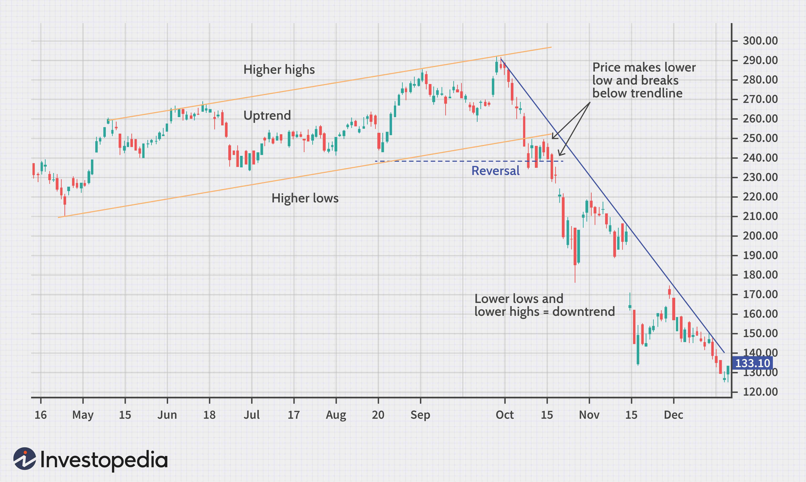

Understanding market reversals holds immense significance in the trading sector as it forms the basis for developing effective trading strategies. A market reversal refers to the point where a market trend changes its direction, either moving upward or downward, marking the culmination of the prevailing trend and the onset of a new one. Identifying these turning points is essential, as they offer potential opportunities for increased profitability and risk management.

Reversal strategies are particularly valuable in algorithmic trading. Algorithmic trading utilizes computer programs to automate trading decisions and executions based on predefined criteria. In this context, reversal strategies enable traders to capitalize on shifts in market direction by automating the identification and execution of trades when a potential reversal is detected. This capability is crucial for achieving higher returns over short timeframes while minimizing emotional biases that can afflict human traders.



This article delves into various aspects of market reversals crucial for effective trading. It examines technical indicators, pattern recognition, and sentiment analysis, tools that aid traders in recognizing potential reversal points. Technical indicators, such as Moving Averages and the Relative Strength Index (RSI), provide quantifiable measures that highlight potential changes in price direction. Pattern recognition involves the identification of distinct chart patterns, like head and shoulders or double tops and bottoms, that often signal trend reversals. Sentiment analysis, on the other hand, gauges market sentiment by analyzing factors like news headlines and social media, providing insights into potential market movements.

Moreover, we will explore the technologies and tools that enhance reversal trading, especially in algorithmic contexts. These include trading platforms, software libraries, and backtesting tools. Platforms like MetaTrader or QuantConnect offer resources for developing and refining reversal strategies. By leveraging these tools, traders can optimize real-time trading performance and achieve better market outcomes.

In summary, market reversals present substantial opportunities for traders. The ability to accurately identify and act on these trend changes is vital for success, particularly in algorithmic trading, where systematic approaches can significantly enhance trading outcomes.

## Table of Contents

## What is a Market Reversal?

A market reversal refers to a significant change in the direction of an asset's price movement, marking the transition from an existing trend to a new one. This transition can occur upward, known as a bullish reversal, or downward, termed a bearish reversal.

Identifying market reversals is crucial for traders as it provides opportunities to enter or [exit](/wiki/exit-strategy) positions efficiently. Technical analysis plays a pivotal role in detecting these reversals, utilizing a variety of indicators and tools. Reversal strategies are developed based on this analysis, aiming to predict the potential turning points in price trends.

The distinction between reversals and pullbacks is essential for traders. While reversals indicate a fundamental change in the market trend, pullbacks are temporary price retracements within a broader trend. Accurately identifying these phenomena can lead to strategic decision-making and improve trading outcomes. For example, a trader might employ the Moving Average Convergence Divergence (MACD) or the Relative Strength Index (RSI) to differentiate between a reversal and a minor pullback. Understanding these nuances ensures effective application of trading strategies and enhances the potential for profitability.

## Reversal Strategies in Trading

Traders use reversal strategies to predict and profit from potential changes in price direction. These techniques are particularly important in [algorithmic trading](/wiki/algorithmic-trading) due to their potential to generate higher returns over shorter periods. Reversal strategies involve various technical indicators and patterns that help in forecasting changes in trends. Among the most commonly used indicators are Moving Averages, Moving Average Convergence Divergence (MACD), and Relative Strength Index (RSI). 

Moving Averages are used to smooth out price data to identify the direction of a trend. This indicator calculates the average price of an asset over a specified number of periods, generating a line on a chart. The crossing of moving average lines, such as a short-term average crossing above a longer-term average, often signals a potential reversal.

The MACD is a [momentum](/wiki/momentum) indicator that shows the relationship between two moving averages of a security's price. It is calculated by subtracting the 26-period Exponential Moving Average (EMA) from the 12-period EMA. A nine-day EMA of the MACD, called the "signal line," is then plotted on top to trigger buy and sell signals. When the MACD crosses above the signal line, it can indicate a potential upward reversal; conversely, when it crosses below, a downward reversal might be expected.

RSI measures the speed and change of price movements, oscillating between zero and 100. Typically, an asset is considered overbought when RSI is above 70 and oversold when it is below 30. These thresholds can suggest a potential reversal in market direction.

Pattern recognition also plays a crucial role in reversal strategies. Traders often look for specific chart patterns such as head and shoulders, double tops, and double bottoms. The head and shoulders pattern, for example, consists of three peaks: a higher peak (head) between two lower peaks (shoulders). A break below the neckline of this pattern can suggest a bearish reversal. Similarly, double tops and bottoms highlight likely reversal points after the price tests support or resistance levels twice without breaking through.

By integrating these indicators and patterns, traders can develop robust reversal strategies that enhance decision-making in dynamic market conditions. Utilizing code to backtest these strategies can further increase their effectiveness. Below is an example of utilizing Python to calculate the MACD for a given data set:

```python
import pandas as pd

def calculate_macd(data, short_window=12, long_window=26, signal_window=9):
    data['EMA_12'] = data['Close'].ewm(span=short_window, adjust=False).mean()
    data['EMA_26'] = data['Close'].ewm(span=long_window, adjust=False).mean()
    data['MACD'] = data['EMA_12'] - data['EMA_26']
    data['Signal Line'] = data['MACD'].ewm(span=signal_window, adjust=False).mean()
    return data[['MACD', 'Signal Line']]

# Sample data loading
data = pd.read_csv('historical_stock_data.csv')  # Replace with your data source
macd_data = calculate_macd(data)
print(macd_data.tail())
```

This algorithm uses pandas to compute the MACD and its signal line, allowing traders to visually analyze crossover points for potential reversals. Such technical analysis tools are essential for implementing effective reversal strategies.

## Popular Indicators and Patterns for Reversals

Technical indicators are instrumental in detecting market reversals, offering quantitative methods to anticipate changes in the direction of asset prices. Among the most widely used indicators are the Relative Strength Index (RSI), Moving Average Convergence Divergence (MACD), and Bollinger Bands.

The Relative Strength Index (RSI) is a momentum oscillator that measures the speed and change of price movements. It ranges from 0 to 100, with traditional interpretations asserting that a reading above 70 suggests an asset might be overbought, while a reading below 30 reflects it could be oversold. When RSI moves out of these zones, it typically signals a potential reversal.

MACD, or Moving Average Convergence Divergence, is another popular tool, combining moving averages to provide insights into momentum changes. The MACD line is obtained by subtracting the 26-period Exponential Moving Average (EMA) from the 12-period EMA. A 9-day EMA of the MACD serves as a signal line and crossing of these lines can indicate potential market reversals.

Bollinger Bands consist of a middle band, being a simple moving average, and two outer bands at a set number of standard deviations from the middle band. Price movements outside these bands can signal a reversal. When prices hit the upper band, it may suggest overbought conditions, while hitting the lower band may imply oversold conditions.

Chart patterns provide additional methods for identifying reversals. The Head and Shoulders pattern, characterized by three peaks, with the middle peak (the "head") being the highest, frequently indicates a bullish-to-bearish trend reversal. Conversely, an inverted Head and Shoulders indicates the opposite. Double tops and bottoms are patterns that illustrate a peak or trough reached twice, suggesting a potential reversal of the preceding trend.

Triple tops and bottoms, similar to their double counterparts but with an additional peak or trough, can also signal reversal movements in markets. Recognizing and accurately interpreting these patterns can significantly enhance trading strategies.

Effectively using these indicators and patterns requires a solid understanding of their applications and limitations. Traders often incorporate them into algorithmic trading models to enhance decision-making processes. The integration of technical indicators and pattern recognition into algorithmic systems facilitates the automation of trading strategies, allowing timely execution of trades by identifying reversal signals.

Understanding the signals provided by these indicators and patterns ensures more effective implementation of reversal strategies, thereby enhancing trading performance and profitability.

## Algorithmic Trading and Reversal Strategies

Algorithmic trading, also known as algo-trading, employs specific set rules to execute trades at a speed and frequency impossible for a human trader. One of the most beneficial applications of this approach is in reversal strategies, which focus on identifying trend changes in the market. By automating the identification and execution of trades based on technical analysis, algorithmic trading leverages computational power to make quick, informed decisions.

### Automation and Execution

Automation in algo-trading involves the use of pre-programmed instructions to evaluate market data and recognize reversal signals. The execution of trades is based on technical indicators that suggest a potential change in the direction of an asset's price. Algorithms can instantly identify these signals, allowing for precise entry and exit points, which are critical for reversal strategies. This automated process enhances efficiency and reduces the emotional bias human traders may face.

### Backtesting

Backtesting is a fundamental step in developing robust reversal strategies. It involves testing a trading strategy against historical market data to evaluate its effectiveness before applying it in real-time trading. This process helps in understanding the potential performance of the strategy under various market conditions and adjusts the algorithm accordingly. Using data-driven insights from [backtesting](/wiki/backtesting), traders can refine their algorithms to optimize for risk and return.

For example, in Python, one could backtest a simple moving average crossover strategy—a common reversal method—using libraries such as Pandas and Backtrader. The pseudo-code for such backtesting might look like the following:

```python
import backtrader as bt
import pandas as pd

class MovingAverageCrossStrategy(bt.SignalStrategy):
    def __init__(self):
        self.short_mavg = bt.indicators.SimpleMovingAverage(self.data.close, period=10)
        self.long_mavg = bt.indicators.SimpleMovingAverage(self.data.close, period=50)
        self.signal_add(bt.SIGNAL_LONG, self.short_mavg > self.long_mavg)

# Load data
data = bt.feeds.PandasData(dataname=pd.read_csv('historical_data.csv'))

# Set up the backtesting environment
cerebro = bt.Cerebro()
cerebro.addstrategy(MovingAverageCrossStrategy)
cerebro.adddata(data)
cerebro.run()
```

### Trading Platforms

Platforms like MetaTrader and QuantConnect provide robust environments that enhance real-time trading performance when applying reversal strategies. These platforms offer advanced analytical tools, extensive historical data for backtesting, and the ability to simulate market conditions accurately. MetaTrader, primarily used for [forex](/wiki/forex-system) trading, allows users to implement Expert Advisors (EAs) for automated trading.

QuantConnect, on the other hand, offers a cloud-based algorithmic trading platform that supports multiple asset classes. It provides users with extensive libraries, datasets, and a community-driven environment to develop and test their trading strategies.

### Conclusion

Algorithmic trading significantly enhances the efficacy of reversal strategies through automation, backtesting, and utilizing sophisticated trading platforms. By implementing these automated systems, traders can achieve a competitive edge, capitalize on market inefficiencies swiftly, and potentially realize higher returns. Continuous advancements in computing power and data analytics are likely to further refine these strategies, providing even more opportunities in the financial markets.

## Case Studies and Real-world Examples

Reviewing successful examples of reversal trading algorithms provides valuable insights into their real-world applications. Renaissance Technologies, a renowned quantitative [hedge fund](/wiki/hedge-fund-trading-strategies), exemplifies effective use of reversal strategies. Founded by Jim Simons, the firm employs complex mathematical models and algorithmic strategies to exploit market inefficiencies. Renaissance Technologies' Medallion Fund, in particular, has demonstrated remarkable performance by employing a variety of strategies, including market reversals. The fund's success is largely attributed to its ability to accurately predict changes in market direction, leveraging statistical analysis and pattern recognition. By identifying subtle signals in the data, the firm's algorithms consistently capitalize on market reversals, leading to its sustained success.

The effectiveness of reversal strategies is further exemplified during market crises, such as the 2008 financial crisis. During periods of extreme [volatility](/wiki/volatility-trading-strategies), traditional trading strategies often fail due to rapid and unpredictable price movements. However, reversal strategies can flourish by capturing abrupt changes in trend. For instance, traders who utilized reversal strategies during the 2008 crisis successfully navigated the market turmoil. By applying technical indicators and pattern recognition techniques, such as the Moving Average Convergence Divergence (MACD) and head and shoulders patterns, these traders effectively predicted reversals in asset prices. As a result, they were able to gain from both the downward and subsequent upward market movements, highlighting the versatility of reversal strategies.

The application of reversal strategies during market crises is not without challenges. High volatility and rapid shifts require algorithms to be highly adaptive and quick to execute. Therefore, specialized tools and technologies, such as real-time data feeds and advanced computational capabilities, are essential in effectively applying these strategies. Furthermore, backtesting simulations on historical data are crucial in refining and optimizing reversal algorithms. By iteratively testing and tweaking strategies, traders can improve their predictive accuracy and performance during real market conditions.

In conclusion, successful implementation of reversal trading algorithms, as demonstrated by Renaissance Technologies and during market crises like the 2008 financial meltdown, underscores their practical importance. The ability to identify and act upon reversal points offers a strategic advantage, particularly in volatile markets. As technology continues to advance, the role of algorithmic reversal strategies in trading is likely to become even more pronounced, providing opportunities for traders to efficiently navigate complex market environments.

## Conclusion

Reversal strategies offer substantial opportunities for traders by identifying significant trend changes in the market, which can lead to profitable trading opportunities. In the context of algorithmic trading, these strategies provide a structured approach to exploit market volatility and shifts. This allows traders to systematically capitalize on the directional changes in asset prices through the use of automated systems that can execute trades at optimal moments.

The success of reversal strategies hinges on continuous improvement and monitoring. Market conditions are dynamic, evolving with various economic signals and geopolitical developments, necessitating that these strategies adapt to remain effective. Continuous backtesting and optimization of the algorithmic parameters ensure that the trading models remain aligned with current market behavior. Rigorous statistical analysis and [machine learning](/wiki/machine-learning) techniques can be employed to refine these strategies, enhancing precision in predicting market reversals.

Moreover, the proper application of reversal strategies requires a thorough understanding of market indicators and patterns. Technical indicators such as Moving Averages, MACD (Moving Average Convergence Divergence), and RSI (Relative Strength Index) are foundational tools that help in identifying potential reversal points. Chart patterns such as head and shoulders, double tops, and triple bottoms are equally essential in this process. Advanced technological tools and platforms, such as MetaTrader or QuantConnect, support this by offering real-time data analysis and sophisticated backtesting environments that improve the strategy’s applicability and effectiveness.

In conclusion, mastering reversal strategies demands not only a deep understanding of these technical indicators and patterns but also the ability to leverage modern technological tools. This combination is fundamental to successfully capturing the shifts in market trends, thus unlocking substantial trading opportunities. As markets continually evolve, traders must be vigilant in adjusting their strategies, ensuring they are both innovative and resilient in the face of changing conditions.

## References & Further Reading

[1]: Bergstra, J., Bardenet, R., Bengio, Y., & Kégl, B. (2011). ["Algorithms for Hyper-Parameter Optimization."](https://dl.acm.org/doi/10.5555/2986459.2986743) Advances in Neural Information Processing Systems 24.

[2]: ["Advances in Financial Machine Learning"](https://www.amazon.com/Advances-Financial-Machine-Learning-Marcos/dp/1119482089) by Marcos Lopez de Prado

[3]: ["Evidence-Based Technical Analysis: Applying the Scientific Method and Statistical Inference to Trading Signals"](https://www.amazon.com/Evidence-Based-Technical-Analysis-Scientific-Statistical/dp/0470008741) by David Aronson

[4]: ["Machine Learning for Algorithmic Trading"](https://github.com/stefan-jansen/machine-learning-for-trading) by Stefan Jansen

[5]: ["Quantitative Trading: How to Build Your Own Algorithmic Trading Business"](https://www.amazon.com/Quantitative-Trading-Build-Algorithmic-Business/dp/1119800064) by Ernest P. Chan