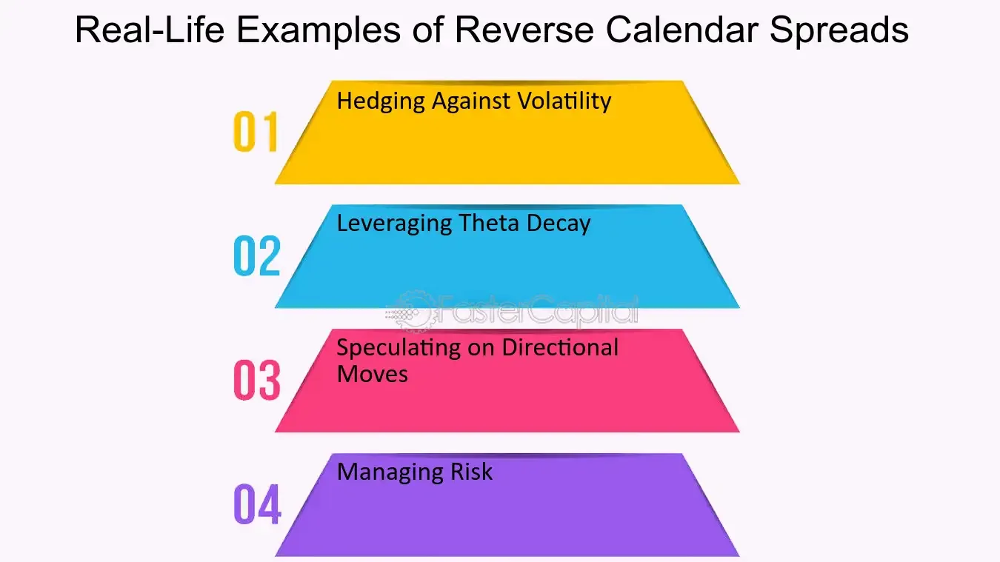

## Table of Contents

## What is a reverse calendar spread in options trading?

A reverse calendar spread in options trading is a strategy where you buy a short-term option and sell a longer-term option, both with the same strike price. This is the opposite of a regular calendar spread, where you would buy the longer-term option and sell the short-term one. The idea behind a reverse calendar spread is to take advantage of a big move in the stock price that happens quickly. If the stock price moves a lot in a short time, the short-term option you bought will gain more value than the long-term option you sold, leading to a profit.

This strategy can be risky because if the stock price doesn't move much, or if it moves slowly, the short-term option you bought will lose value faster than the long-term option you sold. This could result in a loss. It's important to understand that reverse calendar spreads are best used when you expect a significant and quick change in the stock's price. They are not for everyone and should be used carefully, as they can lead to big losses if the market doesn't move as expected.

## How does a reverse calendar spread differ from a regular calendar spread?

A reverse calendar spread and a regular calendar spread are two different options trading strategies that work in opposite ways. In a regular calendar spread, you buy a longer-term option and sell a shorter-term option, both at the same strike price. The goal is to make money from the difference in how quickly the options lose their value over time. This strategy works best when you expect the stock price to stay about the same or move slowly.

On the other hand, a reverse calendar spread involves buying a shorter-term option and selling a longer-term option at the same strike price. This strategy is used when you think the stock price will move a lot and quickly. If the stock price does move significantly in a short time, the short-term option you bought will gain more value than the long-term option you sold, leading to a profit. However, if the stock price doesn't move much or moves slowly, you could lose money because the short-term option will lose value faster than the long-term option.

## What are the basic components needed to set up a reverse calendar spread?

To set up a reverse calendar spread, you need to buy a short-term option and sell a long-term option. Both options should have the same strike price. For example, if you think a stock will move a lot in the next month, you might buy a one-month call option and sell a three-month call option, both at a strike price of $50.

The key is to choose the right expiration dates and strike price. The short-term option you buy should expire soon, like in a few weeks or a month. The long-term option you sell should expire later, like in two or three months. The strike price should be one that you think the stock will reach or pass quickly. This setup lets you make money if the stock price moves a lot in a short time.

## What are the key steps to execute a reverse calendar spread?

To execute a reverse calendar spread, you first need to choose the right options. Pick a short-term option that will expire soon, like in a few weeks or a month. Then, choose a long-term option that will expire later, like in two or three months. Both options should have the same strike price. This strike price should be one that you think the stock will reach or pass quickly. For example, if you think a stock will move a lot in the next month, you might buy a one-month call option and sell a three-month call option, both at a strike price of $50.

Next, you need to place your trades. Buy the short-term option and sell the long-term option at the same time. This can be done through your brokerage account. Make sure you have enough money in your account to cover the cost of buying the short-term option. The money you get from selling the long-term option can help pay for the short-term option. Keep an eye on the stock price and be ready to close out your positions if the stock moves as you expected. If the stock price moves a lot in a short time, the short-term option you bought will gain more value than the long-term option you sold, leading to a profit.

## What are the potential risks associated with reverse calendar spreads?

Reverse calendar spreads can be risky. If the stock price doesn't move much or moves slowly, you could lose money. The short-term option you bought will lose value faster than the long-term option you sold. This means the cost of the short-term option might be more than the money you got from selling the long-term option. If the stock price stays the same or moves too slowly, you could end up losing the difference between what you paid and what you received.

Another risk is that the stock might move in the wrong direction. If the stock price moves a lot but goes the opposite way of what you expected, the short-term option you bought will lose value quickly. This can lead to big losses because the long-term option you sold won't lose value as fast. It's important to be ready to close out your positions quickly if the stock moves against you to limit your losses.

## What are the potential benefits of using a reverse calendar spread?

Using a reverse calendar spread can be a good choice if you think a stock will move a lot and fast. When you buy a short-term option and sell a long-term option at the same strike price, you can make money if the stock price changes quickly. If the stock moves a lot in a short time, the short-term option you bought will gain more value than the long-term option you sold. This can lead to a profit because the short-term option will be worth more than what you paid for it, and the long-term option you sold will be worth less than what you got for it.

Another benefit is that reverse calendar spreads can help you take advantage of big market moves without spending a lot of money upfront. The money you get from selling the long-term option can help pay for the short-term option you buy. This means you can use the strategy even if you don't have a lot of cash to start with. It's a way to bet on quick, big changes in the stock price without needing a big investment.

## How does volatility affect the performance of a reverse calendar spread?

Volatility is really important when you're using a reverse calendar spread. If the stock price moves a lot and quickly, that's called high volatility. This is good for a reverse calendar spread because the short-term option you bought will gain a lot of value. If the stock price moves a lot in a short time, the short-term option will be worth more than what you paid for it. At the same time, the long-term option you sold won't lose as much value because it has more time before it expires. So, high volatility can help you make money with a reverse calendar spread.

On the other hand, if the stock price doesn't move much or moves slowly, that's called low volatility. This can be bad for a reverse calendar spread. When there's low volatility, the short-term option you bought will lose value quickly because it's running out of time. The long-term option you sold won't lose value as fast because it has more time left. So, if the stock price doesn't move a lot and fast, you could lose money with a reverse calendar spread. It's important to think about how volatile the stock might be before you use this strategy.

## Can you explain the impact of time decay on a reverse calendar spread?

Time decay, or how options lose value as time goes on, is really important when you're using a reverse calendar spread. In this strategy, you buy a short-term option and sell a long-term option. The short-term option you buy will lose value faster because it has less time left before it expires. This is bad for you because the option you paid for is getting less valuable every day. On the other hand, the long-term option you sold loses value more slowly because it has more time left. This means you might not get as much money back from the long-term option as you hoped if the stock price doesn't move quickly.

The key to making money with a reverse calendar spread is to have the stock price move a lot and fast before the short-term option loses too much value. If the stock price does move a lot in a short time, the short-term option you bought will gain value faster than it loses value from time decay. This can help you make a profit because the short-term option will be worth more than what you paid for it. But if the stock price doesn't move much or moves slowly, the short-term option will lose value quickly from time decay, and you could lose money. So, time decay can make or break your reverse calendar spread depending on how the stock price moves.

## What are some common strategies for managing a reverse calendar spread?

Managing a reverse calendar spread means watching the stock price and being ready to make changes if things don't go as planned. If the stock price moves a lot and fast like you hoped, you might want to sell the short-term option you bought to lock in your profit. At the same time, you could buy back the long-term option you sold to close out that part of the trade. This way, you keep the money you made from the short-term option and don't lose more on the long-term option.

If the stock price doesn't move much or moves too slowly, you might need to cut your losses. You can do this by selling the short-term option you bought, even if it's worth less than what you paid for it. Then, buy back the long-term option you sold to close out that part of the trade. This stops you from losing more money if the stock price keeps not moving. It's all about being ready to act quickly to either take your profit or stop your losses.

## How can one assess the suitability of a reverse calendar spread for their investment goals?

To figure out if a reverse calendar spread is right for your investment goals, you need to think about what you want to achieve and how much risk you're willing to take. A reverse calendar spread is good if you think a stock will move a lot and fast. If you're looking to make money from big, quick changes in a stock's price, this strategy might be for you. But it's important to know that it can be risky. If the stock doesn't move much or moves slowly, you could lose money. So, if you're okay with taking on more risk for the chance of a bigger reward, a reverse calendar spread could fit your goals.

You also need to look at how much money you have to invest and how much you can afford to lose. Reverse calendar spreads can be set up without needing a lot of money upfront because the money you get from selling the long-term option can help pay for the short-term option you buy. But, if things go wrong, you could lose more than you put in. So, it's really important to think about your financial situation and how much risk you can handle before deciding if a reverse calendar spread is a good fit for your investment goals.

## What are some advanced techniques for optimizing a reverse calendar spread?

To make a reverse calendar spread work better, you can adjust the strike prices of the options you use. Instead of using the same strike price for both the short-term and long-term options, you can choose different strike prices. For example, if you think the stock will go up a lot, you could buy a short-term call option with a lower strike price and sell a long-term call option with a higher strike price. This can help you make more money if the stock moves a lot in the right direction. But it also means you might lose more if the stock doesn't move as expected.

Another way to optimize a reverse calendar spread is to use different expiration dates that are closer together. Instead of buying a one-month option and selling a three-month option, you could buy a two-week option and sell a one-month option. This can help you take advantage of quick, big moves in the stock price even faster. But remember, using options with shorter expiration dates means time decay will affect your short-term option more quickly, so you need to be even more sure that the stock will move a lot and fast.

You can also keep an eye on the stock's implied volatility and adjust your strategy based on it. If the implied volatility is high, it might be a good time to set up a reverse calendar spread because the options will be more expensive, and a big move in the stock price could lead to bigger profits. If the implied volatility is low, you might want to wait for it to go up before setting up your spread. This way, you can get a better price for the options you're buying and selling, which can help you make more money if the stock moves as you expect.

## Can you provide real-world examples of successful reverse calendar spread trades?

Let's say you thought a tech company's stock was going to jump a lot after they announced a new product. You bought a one-month call option at a $100 strike price and sold a three-month call option at the same $100 strike price. A week later, the company announced their new product, and the stock price shot up to $120. The short-term option you bought became much more valuable because it was about to expire and was now deep in the money. You sold it for a big profit. The long-term option you sold didn't lose as much value because it had more time left, so you made money overall.

Another example could be with a pharmaceutical company expecting a big announcement about a new drug. You bought a two-week call option at a $50 strike price and sold a one-month call option at the same $50 strike price. The company announced that their drug got approved by the FDA, and the stock price jumped from $50 to $65 in just a few days. The short-term option you bought became very valuable quickly, and you sold it for a profit. The long-term option you sold didn't lose as much value because it still had time left, so you ended up making money on the trade.

## What is a Reverse Calendar Spread?

A reverse calendar spread is an advanced options strategy utilized by traders aiming to capitalize on short-term market volatility. This strategy involves purchasing a short-term option while simultaneously selling a long-term option on the same underlying asset, with both options featuring identical strike prices. Essentially, it is the converse of a traditional calendar spread, where the investor sells a short-term option and buys a long-term option.

In the construct of a reverse calendar spread, traders focus on the temporal differences in option prices, particularly how the shorter expiry can be beneficial in volatile market environments. By buying a short-term option, traders position themselves to gain from potential rapid movements in the underlying asset’s price. Meanwhile, the sold long-term option serves to offset some of the premium costs incurred, providing a hedge for the position.

The strategic rationale behind this approach hinges on the different rates of time decay (theta) experienced by options. Typically, short-term options experience more rapid time decay compared to their long-term counterparts. In the context of a reverse calendar spread, this decay can work in the trader's favor if managed correctly amidst expected volatility, as the decrease in value of the short-term option can potentially be outweighed by market price movements favorable to the trader’s position.

It is also pertinent to note that while the setup of a reverse calendar spread involves options with the same strike prices, selecting the appropriate strike and expiry dates is crucial to align with market forecasts and risk appetite. Mathematically, the total cost or credit of establishing a reverse calendar spread can be expressed as:

$$
\text{Cost of Reverse Calendar Spread} = (P_s - P_l)
$$

where $P_s$ represents the premium of the short-term option purchased, and $P_l$ denotes the premium received from selling the long-term option. Success with this strategy relies heavily on precise timing and the ability to anticipate or respond to short-term market fluctuations effectively.

## How does the Reverse Calendar Spread work?

A reverse calendar spread involves the strategic use of options to take advantage of significant market movements. This strategy entails buying a short-term option while simultaneously selling a long-term option on the same underlying asset, both with the same strike price. The primary objective is to capitalize on short-term market [volatility](/wiki/volatility-trading-strategies), which can lead to substantial profits if the expected movement occurs before the short-term option's expiration.

The crux of the strategy lies in its dual focus: capturing immediate profit opportunities presented by the short-term option while employing the long-term option as a hedge. This approach benefits from the tendency for short-term options to exhibit greater sensitivity to volatility changes due to their approaching expiration dates. If the market experiences substantial movement before the short-term option expires, the price of this option can increase significantly, yielding profits for the trader. Meanwhile, the long-term option acts as a protective measure, mitigating risks if the market does not move as anticipated. 

Selecting appropriate strike prices and expiration dates is crucial for optimizing the potential profitability of a reverse calendar spread. Traders need to consider several factors, such as the anticipated direction of the market movement, the degree of volatility, and the time decay characteristics of the options involved. By carefully analyzing these elements, a trader can increase the probability of a successful outcome.

In mathematical terms, if we define $C_t(S, K, T, \sigma, r)$ as the price of a call option with underlying asset price $S$, strike price $K$, time to expiration $T$, volatility $\sigma$, and risk-free [interest rate](/wiki/interest-rate-trading-strategies) $r$, a reverse calendar spread can be expressed as:

$$
\text{Reverse Calendar Spread} = C_t(S, K, T_{\text{short}}, \sigma_{\text{short}}, r) - C_t(S, K, T_{\text{long}}, \sigma_{\text{long}}, r)
$$

where $T_{\text{short}}$ and $T_{\text{long}}$ denote the expiration times for the short-term and long-term options, respectively.

In practice, traders may use algorithmic tools to model potential outcomes and automate the execution of trades to promptly react to market changes. These systems can be designed to monitor volatility indices and adjust positions based on real-time data. Additionally, simulation environments can be employed to back-test the strategy under different market scenarios, providing insights into its performance and aiding in fine-tuning the selection of strike prices and expiration dates.

## References & Further Reading

[1]: Hull, J. C. (2018). ["Options, Futures, and Other Derivatives."](https://www.semanticscholar.org/paper/Options%2C-Futures%2C-and-Other-Derivatives-Hull/89bdee500c8623864fc9eb7a471546aa713acc44) Pearson.

[2]: Natenberg, S. (1994). ["Option Volatility and Pricing: Advanced Trading Strategies and Techniques."](https://archive.org/details/optionvolatility00shel) McGraw-Hill Education.

[3]: McMillan, L. G. (2012). ["Options as a Strategic Investment."](https://archive.org/details/optionsasstrateg0000mcmi) Prentice Hall Press.

[4]: Euan Sinclair (2010). ["Option Trading: Pricing and Volatility Strategies and Techniques."](https://www.amazon.com/Option-Trading-Volatility-Strategies-Techniques/dp/0470497106) Wiley.

[5]: Taleb, N. N. (1997). ["Dynamic Hedging: Managing Vanilla and Exotic Options."](https://archive.org/details/dynamichedgingma0000tale) Wiley.