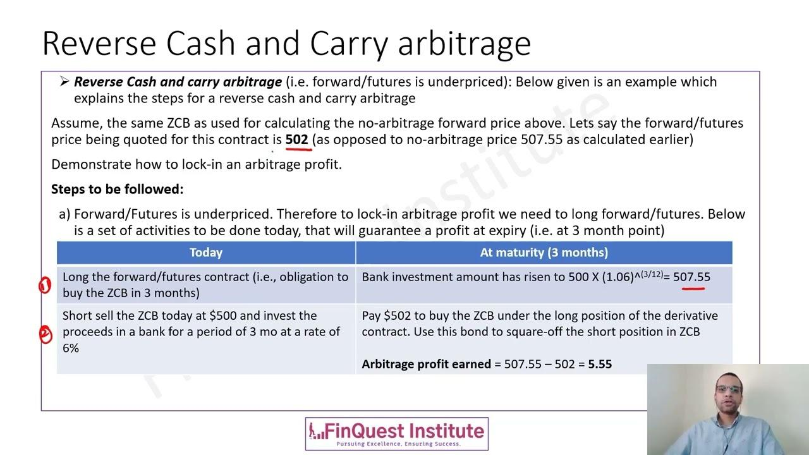

The world of financial investments offers a plethora of strategies aimed at optimizing returns and minimizing risks. Among these, arbitrage strategies have gained prominence for their potential to exploit pricing inefficiencies. Arbitrage involves the simultaneous purchase and sale of an asset to profit from a difference in its price across markets. This approach is often considered low risk since it capitalizes on market imbalances, ensuring a profit if executed correctly.

This article focuses on the financial arbitrage investment strategy known as reverse cash-and-carry, integrated with algorithmic trading. The reverse cash-and-carry strategy is specifically designed to take advantage of pricing discrepancies between spot and futures markets. By implementing this strategy with the aid of algorithmic trading, traders can enhance the precision and speed of their transactions, enabling rapid responses to fleeting market conditions. 



Algorithmic trading utilizes complex mathematical models and algorithms to facilitate high-frequency trading. This technology introduces efficiencies by automating processes that would otherwise require significant manual intervention, thus allowing traders to manage large volumes of trades with reduced risk exposure. The integration of reverse cash-and-carry with algorithmic trading leverages advanced computational techniques to maximize potential earnings while mitigating inherent risks.

Understanding this approach could be beneficial for traders seeking to leverage market inefficiencies to their advantage. It requires a sophisticated comprehension of both market dynamics and technological resources, underscoring the importance of specialty knowledge in financial strategies. Prospective investors and traders need to critically evaluate the mechanics, benefits, and possible downsides associated with using such strategies, ensuring that they align with their overall investment goals and risk profiles.

## Table of Contents

## What is Reverse Cash-and-Carry Arbitrage?

Reverse cash-and-carry arbitrage is a sophisticated financial strategy designed to exploit pricing inefficiencies between an asset's cash price and its futures price. This market-neutral approach is characterized by simultaneously holding a short position in the asset itself while maintaining a long position in the futures contract of the same asset. The strategy is rooted in the expectation that the futures prices are lower than the spot prices, a market condition known as backwardation.

The primary goal of reverse cash-and-carry is to generate profit from the price discrepancy between these two financial instruments. Here's how it works: suppose an investor identifies an asset that is currently trading at a spot price higher than its corresponding futures price. In such a scenario, the investor can short sell the asset at the prevailing spot rate and purchase the futures contract at a lower price. This setup enables the trader to benefit from the price differential.

Mathematically, the potential profit from a reverse cash-and-[carry](/wiki/carry-trading) [arbitrage](/wiki/arbitrage) can be expressed as:

$$
\text{Profit} = (\text{Spot Price} - \text{Futures Price}) - \text{Carrying Costs}
$$

where carrying costs include the cost of maintaining the short position over the lifetime of the futures contract.

This arbitrage scenario is optimal in backwardation markets, where futures are discounted compared to the spot prices. It is crucial for traders to accurately monitor the costs associated with holding the short position, as these can significantly affect the overall profitability of the strategy. By capitalizing on the reverse cash-and-carry method, traders can potentially gain from fleeting market inefficiencies, provided the associated costs and market conditions are favorably aligned.

## Mechanics of Reverse Cash-and-Carry

The reverse cash-and-carry strategy serves as a strategic approach in the trading arena, particularly when futures markets experience backwardation—a situation where futures prices are below the current spot prices. This strategy functions as the reverse counterpart to the traditional cash-and-carry arbitrage.

To implement the reverse cash-and-carry strategy, traders start by selling the asset short at its current spot price, ideally higher due to backwardation. Concurrently, they buy a futures contract for the asset at a lower price. This ensures that all positions are covered upon contract maturity, setting the stage for an arbitrage opportunity.

The mechanics of this strategy unfold as follows:

1. **Short Selling the Asset**: The trader identifies an asset exhibiting backwardated futures prices. For example, if the spot price of an asset is $104, the trader shorts the asset at this price. This involves borrowing the asset and selling it at the current market price.

2. **Purchasing the Futures Contract**: Simultaneously, the trader enters into a long position on a futures contract for the same asset. The futures contract allows the trader to purchase the asset at the futures price, say $100, at the contract's expiration.

3. **Covering the Short Position**: At the expiration of the futures contract, the trader delivers the asset obtained via the futures contract to settle the initial short sale. By buying the asset at the lower futures price and delivering it to cover the short sale, the arbitrageur is able to close the trade.

4. **Calculating Arbitrage Profit**: The profit is derived from the difference between the initial price at which the asset was shorted and the lower futures price, minus any associated costs, such as interest or transaction fees. The formula can be expressed as:
$$
   \text{Profit} = (\text{Spot Price} - \text{Futures Price}) - \text{Carrying Costs}

$$

This strategy ensures a profit if the spot price remains constant or decreases below the costs incurred for maintaining the short position. The reverse cash-and-carry arbitrage, by mirroring its traditional counterpart, capitalizes on market conditions that would otherwise go unnoticed, consolidating the trader's ability to benefit from temporal price discrepancies.

## Algorithmic Trading Integration

Algorithmic trading enhances the efficiency of reverse cash-and-carry arbitrage by automating trade executions and enabling rapid responses to market conditions. By utilizing sophisticated algorithms, traders can seamlessly implement complex strategies at scale, significantly reducing the time required to exploit price discrepancies between spot and futures markets. This capability is particularly advantageous, given the narrow windows of opportunity presented by market inefficiencies.

The core advantage of algorithmic systems lies in their ability to continuously monitor market conditions and execute trades based on predefined criteria. Trading bots are programmed to analyze a plethora of data points and indicators that humans may struggle to process swiftly. These systems can identify pricing inefficiencies instantaneously and act upon them, ensuring minimal delay between detection and execution.

For instance, the integration of [machine learning](/wiki/machine-learning) techniques can enhance an algorithm's adaptability by automatically refining trading rules based on historical performance and real-time data. This process can be executed using Python libraries like TensorFlow or PyTorch, facilitating the development of models that predict market movements and optimize trade decisions. The following Python snippet demonstrates a simple implementation of a decision-rule mechanism for executing trades based on observed conditions:

```python
import numpy as np

# Define predetermined criteria or decision-rule function
def should_execute_trade(spot_price, future_price, carrying_cost):
    threshold = spot_price - future_price - carrying_cost
    return threshold > 0

# Simulate prices
spot_price = np.random.rand() * 100 + 100  # Simulate spot price
future_price = np.random.rand() * 100 + 95  # Simulate future price
carrying_cost = 2  # Assume a fixed carrying cost

# Check trading condition
if should_execute_trade(spot_price, future_price, carrying_cost):
    print("Execute trade: Arbitrage opportunity identified.")
else:
    print("No trade: No arbitrage opportunity.")

```

Furthermore, these algorithms can be tailored to respond to specific market signals or trade only during optimal market conditions, thus maximizing profitability. They are particularly useful in capturing fleeting pricing inefficiencies that may be missed during manual trading due to human limitations in processing speed and accuracy. As market [volatility](/wiki/volatility-trading-strategies) and complexities increase, the benefits of algorithmic integration in executing reverse cash-and-carry arbitrage become more pronounced.

## Example of Reverse Cash-and-Carry Arbitrage

In a scenario where reverse cash-and-carry arbitrage is applied, consider an asset that is currently priced at $104 in the spot market. Meanwhile, the futures contract for the same asset is available at a price of $100, and the cost associated with carrying the asset until the expiration of the contract amounts to $2.

To execute the reverse cash-and-carry arbitrage:

1. An arbitrageur initiates by short selling the asset at its spot price of $104. This action involves borrowing the asset and selling it immediately, with the obligation to return it at a later date.

2. Simultaneously, the arbitrageur purchases a futures contract for the same asset at the lower price of $100. The futures contract obligates the seller to deliver the asset at the agreed-upon price when the contract matures.

Upon expiration of the futures contract, the arbitrageur fulfills the futures obligation by accepting delivery of the asset at the pre-agreed futures price of $100. The short position, initially created by selling the asset at $104, is then closed using the asset acquired at the expiration of the futures contract.

The key aspect of this strategy is achieving a profit from the price discrepancies by ensuring that the total costs, including carrying costs ($2), do not exceed the difference between the spot price and the futures price. In this example, the arbitrageur effectively realizes a profit of:

Profit = Spot Price - Futures Price - Carrying Costs  
Profit = $104 - $100 - $2 = $2

This operation is successful because the futures market exhibits backwardation, implying that the futures price is lower than the spot price. Consequently, executing this strategy under such conditions ensures a guaranteed profit of $2, provided the market conditions and costs remain stable throughout the period.

## Risks and Considerations

While reverse cash-and-carry arbitrage is often termed "riskless," it does entail certain risks and considerations that traders must be aware of to mitigate potential pitfalls. 

Firstly, market conditions are dynamic and may lead to increased carrying costs or necessitate adjustments in margins. For example, changes in interest rates or storage costs can influence the overall cost of holding a short position in the underlying asset. An unexpected rise in these costs can erode the anticipated arbitrage profits. Additionally, variations in the cost of borrowing the asset to maintain the short position could influence the net return. 

Another critical aspect to consider is latency in executing trades, particularly in the absence of algorithmic assistance, which can significantly impact profitability. Reverse cash-and-carry arbitrage opportunities often arise due to fleeting mispricings between spot and futures markets. Without the speed and efficiency offered by algorithms, manual trading may result in missed opportunities or diminished profits. A delay in execution could allow market prices to readjust, thereby negating the price discrepancy originally intended to exploit.

Furthermore, traders must constantly evaluate market signals and adjust strategies accordingly. Financial markets are influenced by a myriad of factors, including macroeconomic announcements, geopolitical events, and changes in market sentiment. These elements can swiftly alter the pricing landscape, affecting both the spot and futures markets. Thus, maintaining a flexible and adaptive strategy is crucial for ensuring the expected gains from arbitrage are realized.

In summary, while reverse cash-and-carry arbitrage offers the potential for profit through market inefficiencies, traders should remain vigilant against the backdrop of changing market conditions, execution latency, and the necessity for adaptive strategy formulation. These considerations are essential for successfully navigating the complexities inherent in such arbitrage practices.

## Conclusion

Reverse cash-and-carry arbitrage is a nuanced method for exploiting market inefficiencies, focusing primarily on discrepancies between spot prices and futures prices. This strategy essentially thrives under market conditions known as backwardation, where futures are cheaper than current asset prices, allowing for strategic profit generation through timing and cost management.

When augmented with [algorithmic trading](/wiki/algorithmic-trading), reverse cash-and-carry arbitrage gains enhanced potential, leveraging technology to react swiftly to market movements. Algorithms can autonomously execute trades based on pre-configured conditions, minimizing human error and latency issues, which are critical for capitalizing on fleeting pricing opportunities. This integration not only increases the speed of execution but also provides the ability to scale operations across a wider array of assets and markets, optimizing returns.

However, the successful application of reverse cash-and-carry arbitrage necessitates a solid grasp of market dynamics and an acute awareness of associated costs such as transaction fees, taxes, and potential interest costs on leveraged positions. Moreover, timely execution is crucial, as any delay can wipe out anticipated profits, especially if market conditions shift unexpectedly. 

Investors must consider these variables carefully, weighing potential profits against the backdrop of inherent risks such as changes in market [liquidity](/wiki/liquidity-risk-premium), unexpected shifts in carrying costs, or volatility impacting futures contracts. As with any sophisticated financial strategy, due diligence in strategy formulation and continuous monitoring of markets is essential for success. 

Therefore, while reverse cash-and-carry arbitrage offers a strategic avenue for profit, particularly when synchronized with algorithmic trading technologies, it remains a complex endeavor necessitating thorough preparation and constant vigilance. Investors should proceed with a well-rounded understanding of the risks and an actionable plan to address market uncertainties.

## Additional Resources

For those interested in deepening their understanding of financial arbitrage strategies, there are several educational paths and resources available:

1. **Courses and Certifications in Market Analysis**: To gain a formal understanding of financial markets and arbitrage strategies, enrolling in courses from reputable finance institutions can be highly beneficial. These courses often cover the mechanics of arbitrage, risk management, and market trends. Certifications such as the Chartered Financial Analyst (CFA) or Financial Risk Manager (FRM) provide comprehensive knowledge and are well-regarded in the industry.

2. **Resource Books on Futures Trading and Algorithmic Trading Systems**: A solid theoretical foundation can be expanded with specialized literature. Books such as "Option, Futures, and Other Derivatives" by John C. Hull offer an in-depth analysis of derivatives markets and trading strategies. For algorithmic trading, books like "Algorithmic Trading: Winning Strategies and Their Rationale" by Ernie Chan provide insights into data-driven trading strategies.

3. **Financial News Platforms and Market Analysis Websites**: Keeping abreast of the latest developments in financial markets is crucial for successful arbitrage. Platforms like Bloomberg, Reuters, and the Financial Times offer updates on market trends, economic indicators, and expert analyses that are invaluable for traders. Websites such as Investopedia and Seeking Alpha can also provide educational content and community discussions focused on trading strategies.

These resources, combined with practical experience, can help traders enhance their strategy execution and adapt to ever-changing market conditions.

## References & Further Reading

[1]: Hull, J. C. (2018). ["Options, Futures, and Other Derivatives"](https://www.semanticscholar.org/paper/Options%2C-Futures%2C-and-Other-Derivatives-Hull/89bdee500c8623864fc9eb7a471546aa713acc44). Pearson. 

[2]: Chan, E. (2013). ["Algorithmic Trading: Winning Strategies and Their Rationale"](https://github.com/ftvision/quant_trading_echan_book). Wiley.

[3]: Aronson, D. R. (2006). ["Evidence-Based Technical Analysis: Applying the Scientific Method and Statistical Inference to Trading Signals"](https://www.amazon.com/Evidence-Based-Technical-Analysis-Scientific-Statistical/dp/0470008741). Wiley.

[4]: Jansen, S. (2018). ["Machine Learning for Algorithmic Trading: Predictive models to extract signals from market and alternative data for systematic trading strategies with Python"](https://github.com/stefan-jansen/machine-learning-for-trading). Packt Publishing.

[5]: Lopez de Prado, M. (2018). ["Advances in Financial Machine Learning"](https://www.amazon.com/Advances-Financial-Machine-Learning-Marcos/dp/1119482089). Wiley.