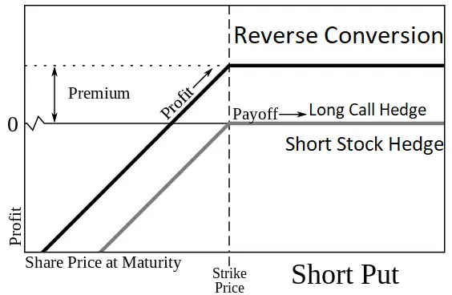

## Table of Contents

## What is reverse conversion in financial terms?

Reverse conversion, also known as a reverse repo, is a financial transaction where someone who owns securities like stocks or bonds agrees to sell them to another party with a promise to buy them back later at a higher price. This is essentially a short-term loan where the securities act as collateral. The difference between the selling and buying back price is the interest on the loan.

This type of transaction is commonly used by financial institutions to manage their short-term cash needs. For example, a bank might use reverse conversion to borrow money overnight to meet reserve requirements. It's a way for the seller to get quick cash while the buyer earns a small return on the money they lend out.

## Why would someone consider using reverse conversion?

Someone might consider using reverse conversion if they need quick cash but don't want to sell their investments permanently. Imagine you own some stocks or bonds, and you need money for a short time. Instead of selling your investments and losing them forever, you can use reverse conversion. You sell your securities to someone else, but you agree to buy them back later. This way, you get the cash you need now and still keep your investments in the long run.

Reverse conversion can also be useful if you want to earn a little extra money on cash you have sitting around. If you have some extra money and you're looking for a safe way to make a small profit, you can buy securities from someone through reverse conversion. You agree to sell the securities back to them later at a higher price. The difference between what you paid and what you get back is your profit, kind of like interest on a loan. It's a simple way to make your money work for you without taking big risks.

## What are the basic components involved in a reverse conversion?

In a reverse conversion, there are two main people involved: the one who owns the securities and the one who wants to buy them. The owner of the securities needs some quick cash but doesn't want to sell their stocks or bonds forever. So, they sell these securities to the buyer, but they make a deal to buy them back later at a higher price. This higher price is like paying interest on a loan. The owner gets the cash they need right away, and they know they will get their securities back in the future.

The buyer in a reverse conversion is usually someone who has extra cash and wants to make a little money on it. They buy the securities from the owner and agree to sell them back later at a higher price. The difference between the price they pay and the price they get back is their profit. It's a safe way for the buyer to earn some interest on their money without taking big risks. Both the owner and the buyer benefit from this deal, making it a useful tool in the world of finance.

## How does the mechanism of reverse conversion work?

Reverse conversion is like borrowing money using your stocks or bonds as a promise. Imagine you own some securities, but you need cash quickly. Instead of selling them for good, you can sell them to someone else and agree to buy them back later at a higher price. That higher price is like paying interest on a loan. You get the cash you need now, and you know you'll get your securities back later. It's a handy way to get money without losing your investments forever.

On the other side, the person who buys your securities is like a lender. They have some extra cash and want to make a little money on it. They buy your securities and agree to sell them back to you at a higher price later. The difference between what they paid and what they get back is their profit. It's a safe way for them to earn some interest on their money without taking big risks. Both you and the buyer benefit from this deal, making reverse conversion a useful tool in finance.

## Can you provide a simple example of a reverse conversion?

Imagine you own some stocks worth $10,000, but you need $10,000 in cash for a short time. Instead of selling your stocks and losing them forever, you can do a reverse conversion. You find someone who agrees to buy your stocks for $10,000 right now, but you both agree that you will buy them back in one month for $10,100. This way, you get the $10,000 you need now, and you know you'll get your stocks back in a month.

The person who buys your stocks is happy too. They had $10,000 sitting around and wanted to make a little money on it. By buying your stocks and agreeing to sell them back to you for $10,100 in a month, they earn $100. That's like getting interest on a loan. It's a safe way for them to make some money without taking big risks. Both of you benefit from this deal, making reverse conversion a useful tool in finance.

## What are the potential risks associated with reverse conversion?

Reverse conversion can be a handy way to get cash quickly without selling your investments forever, but it comes with some risks. One big risk is that the value of your securities might go down while someone else is holding them. If your stocks or bonds lose value, you still have to buy them back at the higher price you agreed on. This means you could end up paying more for securities that are now worth less, which can be a big loss.

Another risk is that the person who bought your securities might not be able to sell them back to you when the time comes. If they run into financial trouble, they might not have the securities anymore, or they might not be able to return them. This can leave you without your investments and still out the cash you paid to get them back. It's important to trust the person you're dealing with and understand that there's always a chance things could go wrong.

## How does reverse conversion differ from a regular conversion?

Reverse conversion and regular conversion are two different ways to use your stocks or bonds to get money. In a regular conversion, you own securities and you want to turn them into cash permanently. You sell your stocks or bonds to someone else, and they become the new owner. You get the money you need, but you lose your investments forever. This is like selling something you own and not getting it back.

In a reverse conversion, you also sell your securities to someone else, but you agree to buy them back later at a higher price. This is like borrowing money with your stocks or bonds as a promise. You get the cash you need right away, but you know you'll get your investments back in the future. The higher price you pay to get them back is like paying interest on a loan. This way, you can use your investments to get money without losing them forever.

## What are the tax implications of using reverse conversion?

Using reverse conversion can have tax implications, but they can be a bit tricky. When you do a reverse conversion, you're not really selling your investments for good. You're just borrowing money with them as a promise. Because of this, you usually don't have to pay taxes on the money you get right away. But, the interest you pay when you buy your securities back might be treated as a cost of borrowing, which might not be taxable.

However, if things go wrong and you can't get your securities back, the tax situation could change. If you end up losing your investments, it might be seen as a sale, and you could owe taxes on any profit you made from the original sale price. It's important to talk to a tax professional to understand how reverse conversion might affect your taxes, as rules can be different depending on where you live and your specific situation.

## In what market conditions is reverse conversion most beneficial?

Reverse conversion is most beneficial when the market is stable and the value of your securities isn't changing a lot. If you need quick cash but don't want to sell your investments forever, reverse conversion can be a good choice. In a stable market, you can be pretty sure that the value of your stocks or bonds won't drop too much while someone else is holding them. This means you can borrow money with your securities and feel confident that you'll get them back at the same value.

It's also helpful when interest rates are low. If the cost of borrowing money through reverse conversion is lower than other ways to get cash, it can save you money. For example, if banks are charging high interest rates on loans, using reverse conversion to borrow money with your securities can be cheaper. This way, you can get the cash you need without paying a lot in interest, making it a smart move in the right market conditions.

## How can reverse conversion be used as part of a larger investment strategy?

Reverse conversion can be a useful tool in a bigger investment plan. If you need quick cash but want to keep your investments for the long term, you can use reverse conversion to borrow money without selling your stocks or bonds for good. This means you can use your investments to get the cash you need now, and still have them for later. It's like taking a short-term loan with your securities as a promise, which can help you manage your money better and keep your investment goals on track.

In a larger investment strategy, reverse conversion can also help you take advantage of different market conditions. If the market is stable and interest rates are low, using reverse conversion can be a smart way to borrow money cheaply. You can use this cash to invest in other opportunities that might come up, without having to sell your current investments. This way, you can keep your long-term investments safe while still being able to act quickly on new chances to grow your money.

## What are the advanced techniques for optimizing reverse conversion?

To make reverse conversion work better, you can use a few smart tricks. One way is to pick the right securities to use in the deal. Choose stocks or bonds that don't change value a lot, so you don't lose money if their price goes down while someone else is holding them. Another trick is to look at the interest rates. If banks are charging a lot for loans, using reverse conversion can be cheaper. This way, you can borrow money at a lower cost and save money in the long run.

Another advanced technique is to use reverse conversion as part of a bigger plan. You can use the cash you get from reverse conversion to invest in other opportunities that come up. This way, you can keep your long-term investments safe while still being able to make money from new chances. It's like borrowing money to grow your investments without selling what you already have. By thinking ahead and using reverse conversion wisely, you can make your money work harder for you.

## Can you discuss a case study where reverse conversion had a significant impact on an investment portfolio?

Imagine a person named Sarah who had a big investment in some stable stocks. She needed $50,000 quickly to buy a house, but she didn't want to sell her stocks and lose them forever. So, she decided to use reverse conversion. Sarah found someone who agreed to buy her stocks for $50,000 and promised to sell them back to her in six months for $51,000. This way, Sarah got the money she needed to buy her house, and she knew she would get her stocks back later. The $1,000 difference was like paying interest on a loan.

Six months later, the market was still stable, and Sarah's stocks hadn't lost much value. She bought her stocks back for $51,000, just as planned. Because the market was stable, Sarah didn't lose money on her stocks. She was happy because she got to keep her investments and still bought her house. Using reverse conversion helped Sarah manage her money better and keep her long-term investment goals on track. It showed her that reverse conversion can be a smart way to get cash quickly without messing up her investment plans.

## What is Understanding Reverse Conversion?

Reverse conversion is an arbitrage strategy specifically designed to exploit the mispricing of put options in the options market. This strategy is built on the principle of put-call parity, a fundamental concept in options pricing that defines the relationship between the prices of European call options, put options, and the underlying asset.

At its core, reverse conversion involves three key steps: selling a put option, buying a call option with the same strike price and expiration date, and shorting the underlying stock. These actions collectively create a synthetic long position, which mimics the financial outcomes of actually owning the stock but is hedged to capitalize on pricing inefficiencies.

The mechanics of the strategy can be broken down as follows:

1. **Selling a Put Option:** The trader begins by selling a put option, which obligates them to buy the underlying stock at the strike price if the option is exercised by the option holder. The proceeds from this sale provide an initial inflow of capital.

2. **Buying a Call Option:** Simultaneously, the trader purchases a call option with an identical strike price and expiration date. This entitles the trader to buy the underlying stock at the strike price if the option is exercised. Buying the call option provides rights equivalent to those lost by shorting the stock.

3. **Shorting the Underlying Stock:** The trader then shorts the underlying stock, selling it in the market with the intention of buying it back later at a lower price. Shorting the stock offsets the potential obligation of the put option, balancing the position.

The synthetic long position constructed through reverse conversion is designed to yield profits from discrepancies in the premium of the options, rather than price movements of the stock. This is because the combined position of the put, call, and shorted stock effectively isolates the strategy from market direction, making it a neutral position regarding the underlying asset's fluctuations.

The financial neutrality of reverse conversion can be demonstrated mathematically using the put-call parity equation:

$$
C - P = S - K \cdot e^{-rT}
$$

Where:
- $C$ is the price of the call option.
- $P$ is the price of the put option.
- $S$ is the current price of the underlying stock.
- $K$ is the strike price of the options.
- $r$ is the risk-free interest rate.
- $T$ is the time to expiration.

This relationship ensures that, under efficient market conditions, the synthetic long position (comprised of the call, the put, and the underlying stock) mirrors the risk/return profile of holding the actual stock.

By adhering to these principles of put-call parity, reverse conversion offers traders a method to benefit from overpriced puts, effectively capturing risk-free profits through option mispricing when executed correctly.

## What is an example of reverse conversion?

Consider a situation where a trader identifies an opportunity for reverse conversion due to an overpriced put option on a stock such as Apple. The trader would implement the strategy by executing three simultaneous actions:

1. **Selling the Overpriced Put Option**: The trader sells a put option that they identify as overpriced. This step ensures that they collect a premium that is higher than the market-efficient price predicted by models such as Black-Scholes.

2. **Buying a Call Option**: Alongside selling the put, the trader buys a call option with the same strike price and expiration date. By doing so, a synthetic long position is created, which mimics long stock ownership through options.

3. **Shorting the Underlying Stock**: Finally, the trader shorts the underlying stock, which in this example is Apple. The short position offsets the synthetic long position created by the options, making the overall portfolio delta-neutral and hedged against price movements of the underlying asset.

The profit from this setup arises from the premium difference between the put and call options rather than the actual movements in the stock's price. The trader is exploiting a mispricing, where the theoretical prices inferred from derivatives don't align with those observed in the options market.

### Mathematical Consideration

The profit calculation in reverse conversion assumes that the underlying stock price $S$, the strike price $K$, the risk-free rate $r$, the time to maturity $T$, and the current stock price are known. The relationship stems from the principle of put-call parity expressed by the formula:

$$
C - P = S - \frac{K}{(1 + r)^T}
$$

Where:
- $C$ is the call option premium.
- $P$ is the put option premium.
- $S$ is the stock price.
- $K$ is the strike price.
- $r$ is the risk-free interest rate.
- $T$ is the time until expiration.

The [arbitrage](/wiki/arbitrage) profit emerges when:

$$
C_{\text{market}} - P_{\text{market}} \neq S - \frac{K}{(1 + r)^T}
$$

These opportunities, however, are rare and fleeting due to the efficiency of modern financial markets, where such discrepancies are quickly corrected by market forces. While the strategy offers theoretical risk-free profit, practitioners must be quick to identify and capitalize on these windows using precise calculations and high-speed trading systems.

## References & Further Reading

[1]: Chance, D. M., & Brooks, R. (2015). ["An Introduction to Derivatives and Risk Management."](https://books.google.com/books/about/Introduction_to_Derivatives_and_Risk_Man.html?id=b8PgBQAAQBAJ) Cengage Learning.

[2]: Hull, J. C. (2021). ["Options, Futures, and Other Derivatives."](https://elibrary.pearson.de/book/99.150005/9781292410623) Pearson.

[3]: Natenberg, S. (1994). ["Option Volatility and Pricing: Advanced Trading Strategies and Techniques."](https://www.amazon.com/Option-Volatility-Pricing-Strategies-Techniques/dp/0071818774) McGraw-Hill Education.

[4]: Black, F., & Scholes, M. (1973). ["The Pricing of Options and Corporate Liabilities."](https://www.cs.princeton.edu/courses/archive/fall09/cos323/papers/black_scholes73.pdf) Journal of Political Economy, 81(3), 637-654.

[5]: Harris, L. (2003). ["Trading & Exchanges: Market Microstructure for Practitioners."](https://www.amazon.com/Trading-Exchanges-Market-Microstructure-Practitioners/dp/0195144708) Oxford University Press.

[6]: Aldridge, I. (2013). ["High-Frequency Trading: A Practical Guide to Algorithmic Strategies and Trading Systems."](https://books.google.com/books/about/High_Frequency_Trading.html?id=6l0DDQAAQBAJ) Wiley.

[7]: Wilmott, P., Howison, S., & Dewynne, J. (1995). ["The Mathematics of Financial Derivatives: A Student Introduction."](https://www.cambridge.org/core/books/mathematics-of-financial-derivatives/7121345D07C5BCE4FBEC91A8A7E6F267) Cambridge University Press.