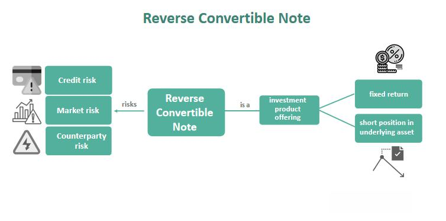

Investment is a multifaceted field characterized by a wide range of instruments tailored to diverse investor preferences and varying risk profiles. Among these instruments, bonds, especially reverse convertible bonds (RCBs), have garnered interest due to their unique structural features and potential investment returns. Bonds are fixed-income securities known for providing predictable returns through interest, which aligns well with conservative investment strategies seeking stable income streams.

Reverse convertible bonds introduce an additional layer of complexity. These bonds grant issuers the flexibility to convert the bond into different forms—cash, debt, or equity—under specific conditions. This ability adds an element of risk but also offers high coupon rates, making them attractive yet challenging for investors.



Parallel to the development of innovative bond structures is the rise of algorithmic trading. This approach leverages computer algorithms to execute trades at remarkable speed and efficiency, significantly impacting the dynamics of bond investment strategies. By enhancing market liquidity and optimizing trade execution, algorithmic trading presents both opportunities and challenges for investors navigating modern financial markets.

This article aims to provide an in-depth exploration of the benefits and criticisms associated with bonds, particularly reverse convertible bonds, and the transformative role of algorithmic trading in shaping bond investment strategies. Through this exploration, investors can gain insights into diversified investment approaches, enabling strategic decision-making in a rapidly evolving financial landscape.

## Table of Contents

## Understanding Bonds and Reverse Convertible Bonds

Bonds are a fundamental component of the financial markets, representing fixed-income securities through which issuers promise to pay bondholders scheduled interest payments, known as coupons, and return the principal amount at maturity. This predictability in returns and reduced risk makes bonds a preferred choice for many investors seeking stable income amidst market uncertainties.

Reverse Convertible Bonds (RCBs) introduce an additional layer of complexity into the traditional bond framework. These hybrid securities provide the issuer with flexibility by allowing conversion of the bond into different forms: cash, debt, or equity. This flexibility, however, transfers potential risk to the investor, particularly if the performance of the underlying asset dictates unfavorable conversion.

RCBs are often characterized by higher coupon rates compared to conventional bonds, making them initially attractive to investors searching for substantial yields. The issuer-friendly terms embedded in RCBs, however, must be scrutinized. For instance, while the high coupon presents lucrative returns if certain conditions are met, it is accompanied by the risk that if the underlying asset depreciates beyond a set threshold, investors could be forced to accept equity or cash whose value may be significantly below the bond's face value.

The design of Reverse Convertible Bonds caters to issuers by allowing them to manage their liabilities strategically, potentially shifting the downside risk to investors. Consequently, when participating in RCBs, investors must assess the terms thoroughly, considering scenarios where the bond might convert into less valuable equity, to ensure alignment with their risk appetite and investment goals.

## Investment Benefits of Bonds

Bonds offer a dependable income stream, distinguishing them as fundamental components of conservative investment strategies. As fixed-income securities, bonds provide interest payments at regular intervals, allowing investors to predict cash flows with relative certainty. This stability contrasts with the [volatility](/wiki/volatility-trading-strategies) of equities, making bonds less risky and suitable for risk-averse investors or those seeking to balance a portfolio otherwise tilted towards stocks.

Reverse convertible bonds (RCBs) stand out for their notably high yields compared to standard bonds. These higher returns are contingent on the performance of the underlying asset or equity index. If the underlying asset maintains its value above a predetermined level at maturity, the investor receives the bond's full principal, along with the high interest. This structure offers potentially lucrative returns under favorable market conditions, combining elements of both bond and equity investments.

Investors inclined towards regular income and risk mitigation frequently include bonds in their portfolios. Bonds act as a cushion during market downturns, safeguarding against severe losses that equity holders may experience. The predictability of cash flows from bond investments ensures that investors can plan for future financial needs, such as retirement income, more securely. Therefore, bonds are a pivotal component for diversified portfolios aiming to achieve long-term growth while managing risk effectively.

## Criticisms of Bonds and Reverse Convertible Bonds

Bonds, though often heralded for their stability and predictable income streams, are not without criticisms. One of the principal criticisms of bonds, particularly in periods of low interest rates, is their comparatively lower returns versus equities. This differential occurs because equities offer the potential for capital appreciation, which can significantly enhance returns beyond the stable but limited coupons provided by bonds.

Reverse convertible bonds (RCBs) add an additional layer of complexity and potential risk. RCBs are unique as they allow the issuer to convert the bond into a predetermined number of shares or return the principal in cash, depending on certain conditions during the bond's tenure. This feature, while offering high coupon yields, comes with significant downside risk. If the market conditions cause the issuer to opt for conversion into shares, and those shares' value falls below the initial investment, an investor may end up with equity worth less than their initial principal. This undesirable outcome highlights a critical risk of investing in RCBs.

The complexity of RCBs can obfuscate the evaluation of their true risk-return profile. The embedded options in RCBs require investors to understand the intricacies of both the bond and equity markets, as well as the potential scenarios in which conversions might be triggered. Calculating these potential outcomes necessitates careful analysis, often involving stochastic models or scenario analysis, to estimate the likelihood and impact of conversion events.

For informed investment in RCBs, thorough due diligence is paramount. Investors need to assess issuer creditworthiness, volatility of the underlying equity, and the structure of the conversion conditions. Tools such as Monte Carlo simulations or the Black-Scholes model can be employed to evaluate possible future states and determine the expected returns and risks associated with RCBs.

```python
from scipy.stats import norm
import numpy as np

# Example of using Black-Scholes model for option pricing
def black_scholes(S, K, T, r, sigma, option_type='call'):
    d1 = (np.log(S / K) + (r + 0.5 * sigma ** 2) * T) / (sigma * np.sqrt(T))
    d2 = d1 - sigma * np.sqrt(T)

    if option_type == 'call':
        return S * norm.cdf(d1) - K * np.exp(-r * T) * norm.cdf(d2)
    elif option_type == 'put':
        return K * np.exp(-r * T) * norm.cdf(-d2) - S * norm.cdf(-d1)

# Example Use
# S = current stock price, K = strike price, T = time to expiration, r = risk-free rate, sigma = volatility
option_price = black_scholes(S=100, K=110, T=1, r=0.05, sigma=0.2, option_type='put')
print("Option Price:", option_price)
```

Prospective investors in RCBs should leverage such analytical tools to quantify potential risks and returns, ensuring an informed decision-making process. Understanding these complexities is essential to balance the allure of high yields with the inherent conversion risks.

## How Algorithmic Trading Enhances Bond Investments

Algorithmic trading has transformed the landscape of bond investments by utilizing advanced computer systems to execute trades with unprecedented speed and precision. This approach has significantly enhanced market efficiency and [liquidity](/wiki/liquidity-risk-premium), vital components for any active trading environment. By rapidly processing vast quantities of data, algorithms can identify and act on market opportunities that would be challenging for human traders to discern due to the speed and scale necessary to [carry](/wiki/carry-trading) out such evaluations.

For bonds, especially those with inherent complexities such as reverse convertible bonds (RCBs), [algorithmic trading](/wiki/algorithmic-trading) offers a distinct competitive advantage. RCBs are complex instruments with features that can convert investment into another form depending on specific conditions. Algorithms adeptly handle such complexities by optimizing pricing models through the integration of multiple market variables and historical data patterns. This capability leads to more accurate and competitive bond pricing, which, in turn, facilitates better trade execution.

The role of algorithmic trading extends beyond mere transaction execution. It involves sophisticated strategies such as statistical [arbitrage](/wiki/arbitrage), [trend following](/wiki/trend-following), and mean reversion, tailored to bond market dynamics. These strategies employ mathematical models and predictions derived through statistical analysis and [machine learning](/wiki/machine-learning). For instance, [statistical arbitrage](/wiki/statistical-arbitrage) involves exploiting price discrepancies between related bond securities, using algorithms to quickly identify and seize these arbitrage opportunities before they vanish.

Despite its advantages, algorithmic trading presents challenges, notably for traditional investors accustomed to conventional trading methods. The complexity and technical expertise required to develop and maintain advanced trading algorithms can be significant barriers. Nonetheless, the opportunities for enhanced returns that this method offers are compelling. Investors utilizing algorithmic trading can potentially achieve higher return rates by leveraging algorithm-driven insights into bond pricing and market trends, often unattainable through manual trading efforts.

As a result, algorithmic trading has redefined strategies within the bonds market, necessitating an adaptation to modern technologies to remain competitive. This shift underscores the growing importance of technology in investment strategies, urging investors to stay informed about technological advancements and their implications for bond trading.

## Conclusion

Incorporating bonds, particularly reverse convertible bonds (RCBs), into an investment portfolio demands a thorough evaluation of both their advantages and inherent risks. RCBs appeal to investors due to their high yield potential, as these instruments often offer significantly higher coupon rates than traditional bonds. However, the promise of high returns comes with increased risk, particularly when the market behaves unfavorably. If the underlying assets of an RCB perform poorly, investors might face losses if the bond converts into equity that is worth less than the initial investment. Thus, understanding the specific terms and conditional risks associated with RCBs is essential.

Moreover, the introduction of algorithmic trading has considerably transformed the bonds market landscape. Algorithmic trading systems execute trades at speeds and efficiencies unattainable by human traders, improving market liquidity and pricing transparency. These systems utilize complex algorithms that take into account a myriad of data points, adapting to real-time market conditions to optimize trade execution. Consequently, investors who incorporate these technologies can potentially achieve a competitive edge.

However, the shift towards algorithmic trading also demands a readiness to embrace technological advancements. As these systems gain prominence, traditional investors may find themselves at a disadvantage unless they adapt their strategies to include these innovations. Such evolution in the trading environment calls for continuous learning and adaptation, ensuring investors remain competitive as financial technologies advance. Therefore, while the evolution of the bonds market through algorithmic trading offers significant opportunities, it also presents new challenges that require attention and strategic planning.

## Further Reading and Resources

For those seeking comprehensive information on the complexities and opportunities within bond markets and algorithmic trading, a number of reputable financial platforms and academic resources can be highly beneficial. Investopedia provides accessible and detailed articles on various financial instruments, including bonds and algorithmic trading strategies. The platform's thorough explanations and relatable examples can help deepen understanding of these complex topics.

For more advanced insights, finance textbooks and scholarly articles, such as those found on databases like JSTOR and Google Scholar, offer empirical research and theoretical frameworks that explore the nuanced dynamics of bond markets and the impact of algorithmic trading. These resources provide empirical data, case studies, and advanced analysis, valuable for both academic and professional purposes.

Additionally, financial news websites such as Bloomberg and The Financial Times regularly update investors on current market trends, regulatory changes, and technological advancements, which are crucial for staying informed and making strategic investment decisions. Online courses offered by platforms like Coursera and edX can also provide structured learning paths to enhance understanding of financial markets and algorithmic strategies.

Staying abreast of developments in these areas is vital for investors looking to refine their strategies and optimize their portfolios. By leveraging these resources, investors can cultivate a robust knowledge base that enables them to navigate the complexities of bond investment and algorithmic trading with confidence and foresight.

## References & Further Reading

[1]: Choudhry, M. (2010). ["The Bond & Money Markets: Strategy, Trading, Analysis"](https://www.sciencedirect.com/book/9780750646772/the-bond-and-money-markets). Butterworth-Heinemann.

[2]: Johnson, T. C. (2002). ["Rational Trading and the Optimal Price of a Security"](https://onlinelibrary.wiley.com/doi/abs/10.1111/1540-6261.00435), The Journal of Financial and Quantitative Analysis.

[3]: Pichler, P., & Wydler, R. (2004). ["Reverse Convertibles and the Perception of their Risks: Return Evaluation of Reverse Convertibles on the Swiss Market"](https://artistbooks.de/suchen/suche-volltext.php?VOLLTEXT=V2-Schneider). Financial Markets and Portfolio Management, 18, 143–154.

[4]: Narang, R. (2009). ["Inside the Black Box: The Simple Truth About Quantitative Trading"](https://onlinelibrary.wiley.com/doi/book/10.1002/9781118267738). John Wiley & Sons.

[5]: Aldridge, I. (2013). ["High-Frequency Trading: A Practical Guide to Algorithmic Strategies and Trading Systems"](https://books.google.com/books/about/High_Frequency_Trading.html?id=6l0DDQAAQBAJ). John Wiley & Sons.