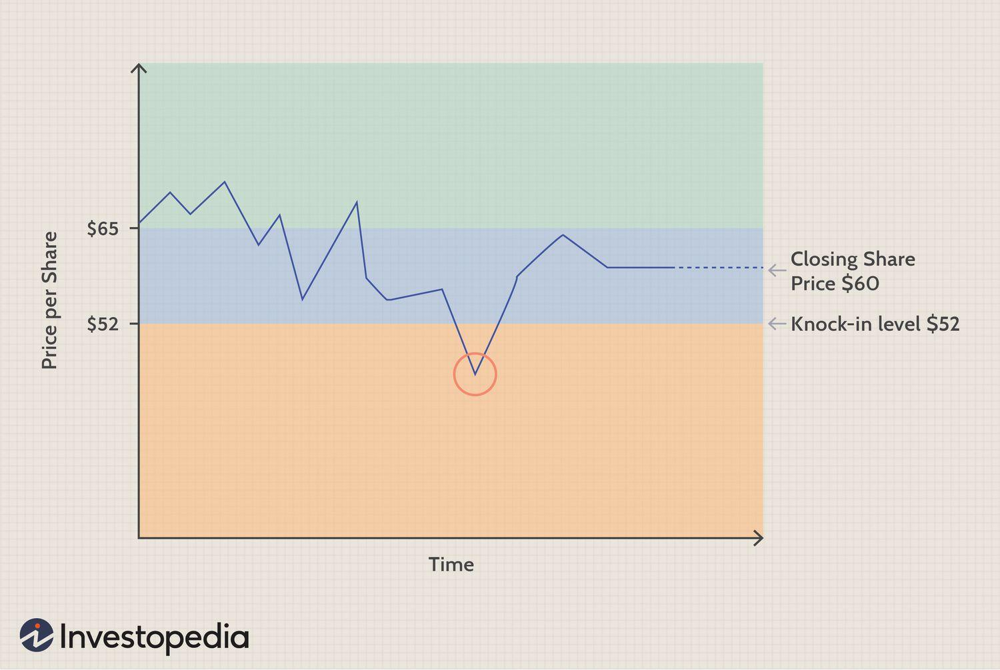

## Table of Contents

## What is a Reverse Convertible Note?

A Reverse Convertible Note is a type of investment product that combines a bond with an option. When you invest in a reverse convertible note, you are essentially lending money to a company, and in return, you get regular interest payments. But there's a twist: at the end of the note's term, you might get your money back in the form of the company's stock instead of cash. This happens if the stock's price has fallen below a certain level.

The interest rate on a reverse convertible note is usually higher than what you would get from a regular bond. This higher rate is meant to compensate for the risk that you might end up with stock instead of cash at the end. If the stock price stays above the set level, you get your money back in cash, just like a regular bond. But if the stock price drops, you could end up with shares that are worth less than what you originally invested. So, it's important to understand the risks before investing in a reverse convertible note.

## How does a Reverse Convertible Note differ from a traditional bond?

A Reverse Convertible Note is different from a traditional bond mainly because it has a risk that you might not get your money back in cash. With a traditional bond, you lend money to a company or government, and they promise to pay you back the full amount you lent them at the end, plus interest along the way. But with a Reverse Convertible Note, there's a chance that instead of getting your money back in cash, you could get shares of the company's stock. This happens if the stock price falls below a certain level by the end of the note's term.

The other big difference is that Reverse Convertible Notes usually offer higher interest rates than traditional bonds. This higher rate is meant to make up for the risk that you might end up with stock instead of cash. So, while traditional bonds are seen as safer investments because you know you'll get your money back in cash, Reverse Convertible Notes can be riskier but might offer a chance for higher returns. It's important to think about these differences and understand the risks before deciding to invest in a Reverse Convertible Note.

## What are the key components of a Reverse Convertible Note?

A Reverse Convertible Note has several important parts that make it work. One key part is the bond part, where you lend money to a company and they promise to pay you interest regularly. This interest is usually higher than what you would get from a normal bond. The other key part is the option part. This part means that at the end of the note's term, instead of getting your money back in cash, you might get shares of the company's stock. This happens if the stock's price falls below a certain level that is set at the beginning.

Another important component is the strike price, which is the stock price level that decides whether you get cash or stock at the end. If the stock price is above this strike price, you get your money back in cash. But if it's below, you get stock. The term of the note is also important, which is how long you have to wait before you find out if you're getting cash or stock. These parts all work together to make a Reverse Convertible Note different from a regular bond, and it's important to understand them before investing.

## What are the potential benefits of investing in Reverse Convertible Notes?

One benefit of investing in Reverse Convertible Notes is the higher [interest rate](/wiki/interest-rate-trading-strategies) you can get. Compared to normal bonds, Reverse Convertible Notes usually offer a bigger regular payment. This can be good if you want to earn more money from your investment over time. The higher interest rate is there to make up for the risk that you might not get your money back in cash, but for some people, the chance to earn more interest is worth it.

Another potential benefit is that if you believe the stock of the company will do well, you might end up with stock that could be worth more than what you invested. If the stock price stays above the strike price, you get your money back in cash, but if it goes down, you get stock. If you think the stock will go back up later, you could make a profit. So, if you are okay with the risk and think the stock will do well, a Reverse Convertible Note might be a good choice.

## What are the risks associated with Reverse Convertible Notes?

One big risk of Reverse Convertible Notes is that you might not get your money back in cash. At the end of the term, if the stock price falls below the set level, you get shares instead of cash. If the stock price keeps going down, those shares could be worth less than what you originally invested. This means you could lose money, which is a risk you don't have with a regular bond where you always get your money back in cash.

Another risk is that the interest you get, even though it's higher than a normal bond, might not be enough to make up for the risk of getting stock instead of cash. If the stock price drops a lot, the value of the shares you get could be much less than the cash you would have gotten. So, you need to think about whether the higher interest is worth the chance of losing money on the stock.

Also, Reverse Convertible Notes can be hard to understand because they mix a bond and an option. If you don't fully understand how they work, you might not know how much risk you're taking. It's important to really know what you're getting into before you invest in them.

## How is the coupon payment calculated in a Reverse Convertible Note?

The coupon payment in a Reverse Convertible Note is the interest you get for lending money to the company. This payment is usually higher than what you would get from a normal bond. The coupon rate is set at the beginning and is a percentage of the money you invested. For example, if you invested $1,000 and the coupon rate is 8%, you would get $80 in interest payments over the term of the note.

These coupon payments are made regularly, often every month or every three months. The company pays this interest to you no matter what happens to the stock price during the term of the note. So, even if the stock price goes down and you end up getting stock instead of cash at the end, you still get these regular interest payments. The higher coupon rate is meant to make up for the risk that you might not get your money back in cash.

## Can you explain the process of conversion in a Reverse Convertible Note?

The process of conversion in a Reverse Convertible Note happens at the end of the note's term. When you invest in a Reverse Convertible Note, you lend money to a company and get regular interest payments. At the end of the term, you might get your money back in cash or in the form of the company's stock. This depends on where the stock price is compared to a certain level called the strike price.

If the stock price is above the strike price at the end of the term, you get your money back in cash, just like with a regular bond. But if the stock price is below the strike price, you get shares of the company's stock instead of cash. The number of shares you get is based on how much money you invested and what the strike price is. So, if the stock price has gone down a lot, the shares you get might be worth less than the money you originally invested.

## What factors should an investor consider before investing in Reverse Convertible Notes?

Before investing in Reverse Convertible Notes, an investor should think about the risks involved. One big risk is that you might not get your money back in cash at the end of the term. If the stock price falls below a certain level, you get shares instead of cash. If the stock keeps going down, those shares could be worth less than what you put in. So, you need to be okay with the chance of losing money. It's also important to understand how these notes work because they can be complicated, mixing a bond with an option. If you don't fully get it, you might not know how much risk you're taking.

Another thing to consider is the potential benefits. Reverse Convertible Notes usually offer a higher interest rate than normal bonds. This means you get more money in regular payments, which can be good if you want to earn more over time. Also, if you think the company's stock will do well, you might end up with shares that could be worth more than what you invested. But you need to decide if the higher interest and the chance of getting stock is worth the risk of losing money if the stock price goes down. It's a good idea to think about these things and maybe talk to a financial advisor before deciding to invest in Reverse Convertible Notes.

## How do market conditions affect the performance of Reverse Convertible Notes?

Market conditions can really change how well Reverse Convertible Notes do. If the stock market is doing well and the price of the stock linked to the note goes up, you're more likely to get your money back in cash at the end. This is because the stock price would be above the strike price, so you get your investment back without having to take the stock. But if the market is doing badly and the stock price goes down a lot, you might end up with shares instead of cash. If the stock keeps falling, those shares could be worth less than what you put in, which means you could lose money.

Also, the interest rates in the market can affect Reverse Convertible Notes. When interest rates go up, the value of the note might go down because new bonds with higher interest rates become more attractive. But the higher coupon rate on Reverse Convertible Notes can still be a good thing if you're looking for more income. It's important to keep an eye on what's happening in the market and think about how it might change the risks and rewards of investing in these notes.

## What are some real-world examples of Reverse Convertible Notes?

One example of a Reverse Convertible Note is when a big bank like Bank of America issues these notes tied to a company's stock, like Apple. Let's say you invest $1,000 in a Reverse Convertible Note from Bank of America that's linked to Apple's stock. You get a higher interest rate, maybe 8%, so you get $80 in interest payments over the term of the note. At the end of the term, if Apple's stock price is above a certain level, you get your $1,000 back in cash. But if Apple's stock price is below that level, you get shares of Apple instead of cash. If Apple's stock has gone down a lot, those shares might be worth less than $1,000.

Another example is when an investment firm like Goldman Sachs offers Reverse Convertible Notes linked to a different stock, like Tesla. You might invest $1,000 in a note from Goldman Sachs that's tied to Tesla's stock. You get a higher interest rate, maybe 7%, so you get $70 in interest payments over the term. At the end, if Tesla's stock price is above the set level, you get your $1,000 back in cash. But if Tesla's stock price is below that level, you get Tesla shares instead. If Tesla's stock has dropped a lot, those shares could be worth less than your original investment.

## How can issuers benefit from issuing Reverse Convertible Notes?

Issuers of Reverse Convertible Notes, like big banks or investment firms, can benefit in a few ways. One way is that they can raise money by selling these notes to investors. This money can be used for different things, like funding new projects or paying off other debts. The interest rate they pay on these notes is often lower than what they would have to pay on regular bonds, which means they can save money on interest costs.

Another benefit for issuers is that they can use these notes to manage risk. When they issue Reverse Convertible Notes, they can hedge against the stock price going down. If the stock price falls and investors get shares instead of cash, the issuer can use the money they got from selling the notes to buy the stock at a lower price. This can help them make money or at least not lose as much if the stock price drops. So, by issuing Reverse Convertible Notes, issuers can both raise money and manage their risks better.

## What are the regulatory considerations for Reverse Convertible Notes?

When it comes to Reverse Convertible Notes, there are some rules and regulations that issuers and investors need to follow. These rules are there to make sure everyone knows what they're getting into and to protect investors. In the United States, the Securities and Exchange Commission (SEC) keeps an eye on these notes. They make sure that all the important information about the notes is shared with investors, like how they work, the risks involved, and what could happen at the end of the term. This is called disclosure, and it's a big part of the rules.

Also, because Reverse Convertible Notes can be complicated, some countries have extra rules to make sure investors understand them. For example, some places might say that only certain kinds of investors, like those with a lot of experience or money, can buy these notes. This is to help make sure that people who invest in them know what they're doing and can handle the risks. So, both issuers and investors need to pay attention to these rules to stay on the right side of the law and to make smart investment choices.

## What are the market trends and developments in RCN Finance?

The market for reverse convertible notes (RCNs) is significantly shaped by prevailing economic conditions, fluctuations in interest rates, and overall investor sentiment. These factors collectively determine the demand and attractiveness of RCNs as investment instruments. 

Economic conditions play a crucial role, as they directly influence both corporate performance and the broader financial landscape. During periods of economic growth, investor confidence increases, potentially boosting interest in RCNs as a high-yield investment option. Conversely, in times of economic downturn, the perceived risk of RCNs can lead to reduced investor interest due to concerns over issuer solvency and market [volatility](/wiki/volatility-trading-strategies).

Interest rates are another key determinant, affecting the pricing and yields of fixed-income products, including RCNs. When interest rates are low, the appeal of RCNs tends to increase because they typically offer higher yields compared to traditional debt securities. Conversely, rising interest rates can lead to a decline in interest for RCNs as alternative investments become more competitive. The relationship between RCN yields ($Y$) and prevailing interest rates ($r$) can be generally described by the equation:

$$
Y \approx r + \text{Credit Spread} + \text{Equity Option Premium}
$$

where the credit spread accounts for the risk of the issuer defaulting and the equity option premium represents the additional compensation investors require for the embedded equity conversion feature of the RCN.

Investor sentiment is influenced by broader market dynamics and geopolitical factors, which can either bolster or diminish the attractiveness of RCNs. Positive sentiment can lead to increased customization of RCN structures to meet specific investor preferences, such as adjusting the underlying assets or modifying conversion conditions to better match anticipated market movements. This trend towards customization reflects a broader movement in the financial markets towards bespoke investment solutions to cater to diverse risk appetites and investment goals. 

Technological advancements, particularly those associated with financial technology (fintech), are also reshaping the RCN market. The integration of fintech has led to more efficient RCN issuance and trading processes. Platforms utilizing blockchain technology, for instance, can enhance transparency and reduce transaction costs, while [artificial intelligence](/wiki/ai-artificial-intelligence) and [machine learning](/wiki/machine-learning) algorithms assist in analyzing market trends and optimizing RCN portfolio management. These innovations not only improve operational efficiencies but also deepen market participation by lowering entry barriers and providing sophisticated tools for risk assessment and strategy formulation.

In summary, the evolving landscape of RCN finance is characterized by market-responsive adjustments, driven by economic, interest rate, and sentiment variables, as well as burgeoning technological innovations that are enhancing market efficiency and customization.

## References & Further Reading

[1]: ["Advances in Financial Machine Learning"](https://www.amazon.com/Advances-Financial-Machine-Learning-Marcos/dp/1119482089) by Marcos Lopez de Prado

[2]: ["Convertible Securities: Market Investment and Reporting"](https://www.investopedia.com/terms/c/convertibles.asp) by Thomas C. Noddings, Susan C. Christoph, and John G. Noddings

[3]: ["Evidence-Based Technical Analysis: Applying the Scientific Method and Statistical Inference to Trading Signals"](https://www.amazon.com/Evidence-Based-Technical-Analysis-Scientific-Statistical/dp/0470008741) by David Aronson

[4]: ["Quantitative Trading: How to Build Your Own Algorithmic Trading Business"](https://www.amazon.com/Quantitative-Trading-Build-Algorithmic-Business/dp/1119800064) by Ernest P. Chan

[5]: ["The Handbook of Convertible Bonds: Pricing, Strategies and Risk Management"](https://onlinelibrary.wiley.com/doi/book/10.1002/9781118374696) by Jan De Spiegeleer and Wim Schoutens

[6]: ["Algorithmic and High-Frequency Trading"](https://assets.cambridge.org/97811070/91146/frontmatter/9781107091146_frontmatter.pdf) by Álvaro Cartea, Sebastian Jaimungal, and José Penalva