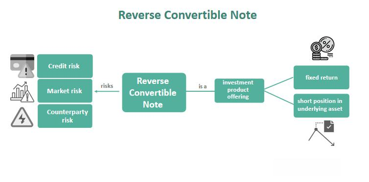

In financial markets, convertible securities and reverse convertible notes (RCNs) are increasingly recognized for their distinctive characteristics that blend features of both debt and equity. Convertible securities, such as convertible bonds and debentures, provide investors with the opportunity to participate in the equity upside of a company while offering some protection against downside risk. This balanced approach has made them a valuable tool in corporate finance, facilitating both fundraising and risk management.

Reverse convertible notes, a specialized type of convertible security, further enhance this interplay by combining debt components with equity-like conversion options. RCNs are characterized by their coupon-bearing feature and the ability to convert into predetermined shares of the underlying stock if certain conditions are met. Investors are drawn to these instruments for their potential high yield returns, although this comes with a greater exposure to market volatility and credit risk.



In recent years, the landscape of RCN finance has been shaped by advancements in technology, particularly in the domain of algorithmic trading. These innovations enable more efficient trading processes and dynamic portfolio management, which are crucial for navigating the complexities inherent in RCN investments. The confluence of these factors underscores the need for investors to have a comprehensive understanding of both the opportunities and risks associated with these hybrid financial instruments. Engaging in thorough research and consulting with financial advisors are essential steps for investors aiming to successfully maneuver through this intricate landscape.

## Table of Contents

## Understanding Convertible Securities

Convertible securities are hybrid financial instruments that offer a unique investment opportunity by combining features of both debt and equity. Primarily including convertible bonds and debentures, these securities provide investors the potential to capitalize on the appreciation of a company’s stock, while also offering downside risk protection through fixed income characteristics.

### Mechanisms of Convertible Securities

At their core, convertible securities are issued as bonds or debentures that can be exchanged for a specified number of the issuing company's shares. This conversion feature is typically exercised at the discretion of the investor, allowing them to switch from bondholder to shareholder. The conversion ratio, which dictates the number of shares received per unit of convertible security, is pre-determined at issuance.

The value of a convertible security is thus influenced by both its bond value and the market price of the underlying equity. Investors assess the conversion premium, which is the excess of the security's market price over its conversion value. 

### Benefits for Investors and Issuers

For investors, convertible securities offer a balanced return profile. The fixed income component provides regular interest payments with priority over dividends, comparable to traditional bonds. This is advantageous during periods of market [volatility](/wiki/volatility-trading-strategies), where the debt protection acts as a cushion against falling stock prices. At the same time, if the company's stock performs well, investors can convert their securities to shares and participate in the equity upside. 

From the issuer's perspective, convertible securities serve as a flexible financing tool. They often [carry](/wiki/carry-trading) lower interest rates than conventional debt, as the conversion option is a value-added feature for investors. Furthermore, issuance of convertibles can potentially delay equity dilution until conversion, thus maintaining existing shareholder control in the short term.

### Potential Drawbacks

Despite their advantages, convertible securities are not without risks. The fixed income element, though comparatively secure, is exposed to credit risk associated with the issuer's ability to meet interest and principal repayments. Additionally, the conversion option dilutes equity upon exercise, potentially impacting existing shareholders' value.

Furthermore, the market for convertibles can be influenced by [interest rate](/wiki/interest-rate-trading-strategies) changes and equity market volatility, affecting the bond and equity components respectively. Investors need to consider these factors, alongside the conversion terms and associated premiums.

In summary, convertible securities offer a strategic avenue for both investment and corporate financing, balancing the need for yield with potential for capital gains. Understanding these dynamics sets the groundwork for engaging with more complex instruments like reverse convertible notes, as they too navigate the duality of debt and equity characteristics.

## The Mechanics of Reverse Convertible Notes (RCNs)

Reverse Convertible Notes (RCNs) are distinctive hybrid financial instruments that interlace debt and equity characteristics, offering a complex investment option. RCNs provide investors with a fixed coupon rate while exposing them to the potential upside or downside of an underlying asset, typically an equity security. Understanding their payout structure and the performance of underlying assets is critical for investors evaluating RCNs.

At their core, RCNs begin as debt instruments where the issuer pays the investor a predefined interest rate, known as the coupon. This coupon payment is one of the distinguishing features of RCNs, often structured to be higher than traditional bonds, reflecting the additional risk assumed by the investor. The enhanced yield compensates for potential exposure to equity market risk. 

The distinctive feature of RCNs is the equity-like conversion option they offer. Unlike standard convertible bonds that allow investors to convert bonds into equity at their discretion, RCNs automatically convert when the underlying asset falls below a certain threshold, known as the "knock-in" level, during the investment term. If the asset remains above this level, the investor receives the full principal in cash at maturity. Conversely, if the barrier is breached, the principal could be returned in the form of stock, potentially at a loss if the equity value is lower than the original investment amount.

To illustrate, consider an RCN tied to a stock with a “knock-in” barrier set at 75% of the stock’s initial value. If during the RCN's tenure the stock remains above this level, the investor will receive coupon payments and the full return of their principal in cash upon maturity. However, if the stock drops below this threshold, the investor might receive an equivalent amount of shares instead, at potentially reduced value, transforming part of the investor's debt into an equity stake and hence transferring some risk from the issuer to the investor.

Market strategies involving RCNs often hinge on the precise assessment of the underlying asset's volatility and price direction. Investors may employ strategies involving protective puts or call spreads to hedge against potential downside risk owing to this volatility. Additionally, the selection of underlying securities is pivotal, as it influences both the yield of the RCN and the probability of conversion to equity.

In summary, the mechanics of RCNs require a nuanced understanding of both the fixed income attributes - characterized by regular coupon payments - and the equity conversion contingencies. This dual nature necessitates a balanced approach to risk, with thorough analysis and strategic implementation key to optimizing return and managing potential downsides.

## Advantages and Risks of RCN Investments

Reverse Convertible Notes (RCNs) present a compelling investment proposition due to their high yield potential. However, these financial instruments are not without significant risks. Investors must pay careful attention to market volatility and credit risk, especially considering the complex nature of RCNs.

One of the primary advantages of RCNs is the attractive coupon payments they offer, which often exceed the interest rates of traditional bonds. This high yield is typically facilitated by the risk assumed by the investor that, upon maturity, they might receive shares of the underlying asset rather than the principal cash amount. The conversion into shares may occur if the asset's price falls below a pre-specified barrier during the term of the RCN.

However, the elevated yields are accompanied by substantial risks:

1. **Market Volatility**: RCNs are deeply intertwined with the equities of the underlying asset. Significant market movements can trigger the conversion option, leaving investors holding potentially devalued stock instead of their principal cash investment. This risk is particularly pronounced in volatile markets where stock prices may fluctuate unpredictably.

2. **Credit Risk**: As debt instruments, RCNs expose investors to the creditworthiness of the issuer. A deteriorating financial position of the issuer can lead to defaults on interest payments or principal, impacting the investor's returns negatively.

3. **Issuer’s Call Option**: Depending on the terms, some RCNs include issuer call provisions that allow the issuer to redeem the notes before maturity. This can occur under favorable conditions, limiting investors' gains from appreciating markets.

To manage these risks effectively, due diligence is crucial. Investors should scrutinize the credit ratings of issuers, understand the specific terms of conversion, and comprehend the historical price volatility of the underlying asset linked to the RCN. 

From a regulatory perspective, RCNs are subject to both national and international financial regulations, which aim to safeguard investors. Regulatory bodies often require full disclosure of risks associated with RCN investments, although the complexity might still lead to misunderstandings about their safety. Historically, RCNs have been perceived as toxic by some market commentators due to their aggressive risk-return profile. However, with proper risk assessment and robust market analysis, misconceptions about their inherent risk can be mitigated.

In conclusion, while RCNs indeed offer rewarding high yields, they demand careful evaluation of associated risks. A well-informed strategy, focused on issuer creditworthiness and market conditions, can balance the scales between risk and potential reward—making RCNs a daring yet potentially profitable component of a diversified investment portfolio.

## RCN Finance: Market Trends and Developments

The market for reverse convertible notes (RCNs) is significantly shaped by prevailing economic conditions, fluctuations in interest rates, and overall investor sentiment. These factors collectively determine the demand and attractiveness of RCNs as investment instruments. 

Economic conditions play a crucial role, as they directly influence both corporate performance and the broader financial landscape. During periods of economic growth, investor confidence increases, potentially boosting interest in RCNs as a high-yield investment option. Conversely, in times of economic downturn, the perceived risk of RCNs can lead to reduced investor interest due to concerns over issuer solvency and market volatility.

Interest rates are another key determinant, affecting the pricing and yields of fixed-income products, including RCNs. When interest rates are low, the appeal of RCNs tends to increase because they typically offer higher yields compared to traditional debt securities. Conversely, rising interest rates can lead to a decline in interest for RCNs as alternative investments become more competitive. The relationship between RCN yields ($Y$) and prevailing interest rates ($r$) can be generally described by the equation:

$$
Y \approx r + \text{Credit Spread} + \text{Equity Option Premium}
$$

where the credit spread accounts for the risk of the issuer defaulting and the equity option premium represents the additional compensation investors require for the embedded equity conversion feature of the RCN.

Investor sentiment is influenced by broader market dynamics and geopolitical factors, which can either bolster or diminish the attractiveness of RCNs. Positive sentiment can lead to increased customization of RCN structures to meet specific investor preferences, such as adjusting the underlying assets or modifying conversion conditions to better match anticipated market movements. This trend towards customization reflects a broader movement in the financial markets towards bespoke investment solutions to cater to diverse risk appetites and investment goals. 

Technological advancements, particularly those associated with financial technology (fintech), are also reshaping the RCN market. The integration of fintech has led to more efficient RCN issuance and trading processes. Platforms utilizing blockchain technology, for instance, can enhance transparency and reduce transaction costs, while [artificial intelligence](/wiki/ai-artificial-intelligence) and [machine learning](/wiki/machine-learning) algorithms assist in analyzing market trends and optimizing RCN portfolio management. These innovations not only improve operational efficiencies but also deepen market participation by lowering entry barriers and providing sophisticated tools for risk assessment and strategy formulation.

In summary, the evolving landscape of RCN finance is characterized by market-responsive adjustments, driven by economic, interest rate, and sentiment variables, as well as burgeoning technological innovations that are enhancing market efficiency and customization.

## Algorithmic Trading in the RCN Landscape

Algorithmic trading plays a critical role in the management of Reverse Convertible Note (RCN) portfolios, enhancing both trading efficiency and market [liquidity](/wiki/liquidity-risk-premium). This automation involves the use of sophisticated computer algorithms to execute trades at optimal prices, often leveraging high-frequency trading ([HFT](/wiki/high-frequency-trading-strategies)) tactics to capitalize on small price movements. In the context of RCNs, [algorithmic trading](/wiki/algorithmic-trading) facilitates rapid execution of buy and sell orders, helping to manage the inherent risks and complex nature of these hybrid securities.

Common trading strategies for RCN portfolios include statistical [arbitrage](/wiki/arbitrage), [momentum](/wiki/momentum) trading, and mean reversion. Statistical arbitrage exploits price discrepancies between related securities, utilizing advanced statistical models to identify and act on perceived anomalies. For RCNs, this could involve comparing the note's market price with those of its underlying assets, executing trades when disparities exceed predetermined thresholds.

Momentum trading capitalizes on existing trends, purchasing securities experiencing upward price movements and selling those on a decline. Algorithms analyze historical data to identify such trends, enabling timely decisions. For RCNs linked to volatile underlying stocks, momentum algorithms can adapt quickly to market dynamics, optimizing the timing of conversions or reflecting coupon conditions.

Mean reversion, on the other hand, is based on the assumption that prices will revert to their historical averages over time. When applied to RCNs, trading algorithms assess historical volatility and price levels, executing trades when the note's price diverges significantly from its average. This approach necessitates robust risk management, ensuring that positions are closed or adjusted before adverse price movements amplify risks.

Technology significantly enhances decision-making and risk management in RCN investments. Machine learning algorithms, for instance, can predict price movements by analyzing large datasets, identifying patterns that may not be apparent to human traders. These algorithms continually adapt to new information, improving accuracy over time and providing a competitive edge in fast-moving markets.

Risk management algorithms are equally important, particularly given the potential volatility and credit risk associated with RCNs. These algorithms employ techniques such as Monte Carlo simulations to model a wide range of potential future scenarios, helping traders quantify and account for risks. By simulating various market conditions and their impact on RCN portfolios, traders can devise strategies to hedge against losses, ensuring that trading activities remain within predefined risk parameters.

Python is often the language of choice for implementing algorithmic trading strategies due to its extensive libraries and ease of integration with real-time data feeds. For instance, the `pandas` and `numpy` libraries facilitate data manipulation and statistical analysis, while `scikit-learn` supports machine learning applications. Below is a simple Python example illustrating the setup of a momentum trading strategy:

```python
import pandas as pd
import numpy as np

# Sample data: RCN price and momentum indicator
data = {'RCN_Price': [100, 101, 99, 102, 101],
        'Momentum_Indicator': [0, 1, -1, 1, -1]}

df = pd.DataFrame(data)

# Define a simple momentum trading strategy
buy_signal = df['Momentum_Indicator'] > 0
sell_signal = df['Momentum_Indicator'] < 0

positions = np.where(buy_signal, 'Buy', 'Sell')

df['Position'] = positions

print(df)
```

The output provides a clear indication of when the algorithm recommends buying or selling based on the momentum indicator. Such a system, though basic, can be expanded into complex models with real-time data integrations to automatically manage RCN trades, optimizing both returns and risk management.

## Conclusion

Recognizing the intricacies of reverse convertible notes (RCNs) is essential for investors navigating the financial markets. RCNs are complex financial instruments that offer the potential for attractive returns, often appealing to investors seeking higher yields than traditional fixed-income products. However, this potential comes with substantial risk. Key risks include market volatility and the possibility of receiving depreciated equities upon conversion. Therefore, a keen understanding of these risk factors is crucial when considering RCNs as part of an investment strategy.

The integration of RCNs with algorithmic trading strategies can enhance their performance within a diversified investment portfolio. Algorithmic approaches facilitate efficient trading by optimizing the timing and execution of trades, thus potentially mitigating some market risks. These strategies rely on advanced algorithms that analyze market trends and economic indicators, enabling more informed decision-making and risk management. Python, a preferred language in financial analytics, offers numerous libraries such as NumPy, pandas, and scikit-learn, which can be employed to develop and backtest trading strategies involving RCNs. A simple Python script could be structured as follows to illustrate these capabilities:

```python
import pandas as pd
import numpy as np
from sklearn.linear_model import LinearRegression

# Sample data for demonstration
data = {'market_index': [100, 102, 105, 107, 106],
        'rcn_price': [10, 10.5, 10.7, 10.8, 10.4]}

df = pd.DataFrame(data)

# Simple linear regression model
X = df[['market_index']]
y = df['rcn_price']

model = LinearRegression().fit(X, y)

# Predict RCN price based on market index
predicted_price = model.predict(np.array([[108]]))
print(f"Predicted RCN price for market index 108: {predicted_price[0]:.2f}")
```

This integration highlights the potential benefits of pairing RCNs with advanced trading strategies. However, it is imperative for investors to consult financial advisors and carry out comprehensive research before engaging in RCN investments. Financial advisors can provide insights tailored to individual risk profiles, helping investors make informed decisions aligned with their financial goals. By understanding the complex nature of RCNs and employing sophisticated trading strategies, investors can potentially leverage these instruments effectively within their portfolios.

## References & Further Reading

[1]: ["Advances in Financial Machine Learning"](https://www.amazon.com/Advances-Financial-Machine-Learning-Marcos/dp/1119482089) by Marcos Lopez de Prado

[2]: ["Convertible Securities: Market Investment and Reporting"](https://www.investopedia.com/terms/c/convertibles.asp) by Thomas C. Noddings, Susan C. Christoph, and John G. Noddings

[3]: ["Evidence-Based Technical Analysis: Applying the Scientific Method and Statistical Inference to Trading Signals"](https://www.amazon.com/Evidence-Based-Technical-Analysis-Scientific-Statistical/dp/0470008741) by David Aronson

[4]: ["Quantitative Trading: How to Build Your Own Algorithmic Trading Business"](https://www.amazon.com/Quantitative-Trading-Build-Algorithmic-Business/dp/1119800064) by Ernest P. Chan

[5]: ["The Handbook of Convertible Bonds: Pricing, Strategies and Risk Management"](https://onlinelibrary.wiley.com/doi/book/10.1002/9781118374696) by Jan De Spiegeleer and Wim Schoutens

[6]: ["Algorithmic and High-Frequency Trading"](https://assets.cambridge.org/97811070/91146/frontmatter/9781107091146_frontmatter.pdf) by Álvaro Cartea, Sebastian Jaimungal, and José Penalva