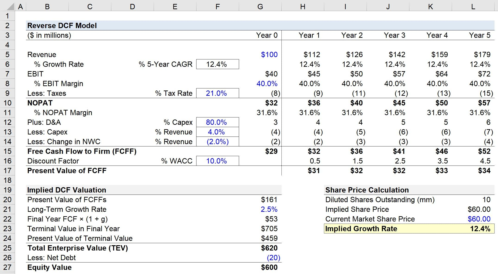

## Table of Contents

## What is reverse-engineering in the context of stock valuation?

Reverse-engineering in stock valuation is when investors try to figure out how a company's stock price was calculated. They look at the current stock price and work backward to understand what assumptions and financial data were used to reach that price. This can help investors see if the stock is priced fairly or if it's overvalued or undervalued.

By reverse-engineering, investors can check if the market's expectations about a company's future earnings and growth are realistic. They might use financial models and compare them with the company's actual performance and industry standards. This process helps investors make smarter decisions about whether to buy, sell, or hold a stock.

## How does the Discounted Cash Flow (DCF) model work?

The Discounted Cash Flow (DCF) model is a way to figure out how much a company is worth by looking at the money it will make in the future. It works by taking the company's expected future cash flows and bringing them back to today's value. This is done because money now is worth more than the same amount of money in the future. To do this, you use a discount rate, which is like an interest rate that shows how much risk there is in getting that future money.

First, you predict the company's cash flows for a certain number of years, usually 5 to 10 years. You then use the discount rate to figure out what those future cash flows are worth today. After that, you need to guess what the company will be worth after those years, called the terminal value. You add up all these discounted cash flows and the discounted terminal value to get the total value of the company. If this total value is higher than the company's current market price, the stock might be a good buy. If it's lower, the stock might be overvalued.

## What are the key components needed to reverse-engineer a DCF model?

To reverse-engineer a DCF model, you first need to know the current stock price of the company. This is the starting point that you're trying to work backward from. You also need the company's financial statements to see their past cash flows. These help you understand what the company has been making and spending. Next, you need to find out what growth rate and discount rate were used in the original DCF model. The growth rate shows how fast the company's cash flows were expected to increase, and the discount rate shows how much risk was considered in the future cash flows.

Once you have these pieces of information, you can start putting the puzzle together. You'll need to estimate the future cash flows that were used in the model. This means looking at the company's projections for sales, costs, and other financial details. You also need to figure out the terminal value, which is what the company is expected to be worth after the forecast period. By comparing your calculated value with the current stock price, you can see if the market's expectations match what you think the company is worth. If they don't match, you can decide if the stock is a good buy or if it's overvalued.

## How can you estimate future cash flows for a company?

To estimate future cash flows for a company, you start by looking at their past financial statements. You want to see how much money they made and spent in previous years. This gives you a good starting point. Then, you think about how the company might grow in the future. You can use the company's own forecasts or industry reports to guess how much their sales might increase. You also need to think about costs like rent, salaries, and supplies, and how these might change over time. By putting all this together, you can make a guess about the company's future cash flows.

Another important part is to consider any big changes that might affect the company. This could be new products they plan to launch, changes in the market, or even new laws that might impact their business. You also need to think about how much money the company will need to spend on things like new equipment or expanding their business. All these factors help you come up with a more accurate estimate of future cash flows. By carefully looking at all these details, you can get a better idea of how much money the company might make in the future.

## What discount rate should be used in a DCF model and why?

The discount rate in a DCF model is like an interest rate that shows how risky it is to get the money the company will make in the future. A higher discount rate means the future cash flows are worth less today because there's more risk. Usually, people use the Weighted Average Cost of Capital (WACC) as the discount rate. This is a mix of the cost of the company's debt and the cost of its equity. The WACC shows how much it costs the company to get money from different sources, and it's a good way to think about the risk of investing in the company.

Choosing the right discount rate is important because it can change the value of the company a lot. If you use a higher discount rate, the value of the company will be lower because the future cash flows are worth less today. If you use a lower discount rate, the value will be higher. So, you need to think carefully about how risky the company's future cash flows are. You might look at things like how stable the company's industry is, how much debt the company has, and even what's happening in the economy to help you pick the right discount rate.

## How do you calculate the terminal value in a DCF model?

Terminal value in a DCF model is like guessing what the company will be worth after you stop making detailed yearly predictions. You usually predict cash flows for about 5 to 10 years, but companies keep going after that. So, you need to figure out what all the cash flows after those years will be worth today. There are two main ways to do this: the perpetuity growth method and the exit multiple method.

The perpetuity growth method says the company's cash flows will keep growing at a steady rate forever. You take the last year's cash flow, multiply it by one plus the growth rate, and then divide by the discount rate minus the growth rate. This gives you a number that shows what all those future cash flows are worth today. The growth rate should be small, usually around the rate of inflation, because you can't expect a company to keep growing super fast forever.

The exit multiple method is another way to find terminal value. Here, you look at what similar companies are selling for and use that to guess what your company might be worth. You take the last year's cash flow or another financial measure like EBITDA and multiply it by a number (the multiple) that you think makes sense based on what other companies are worth. This gives you an idea of what your company might sell for at the end of your forecast period. Both methods help you get a complete picture of the company's value, but they each have their own way of looking at the future.

## What are common pitfalls when reverse-engineering a DCF for stock price evaluation?

One common pitfall when reverse-engineering a DCF for stock price evaluation is making wrong guesses about future cash flows. It's hard to predict what a company will earn in the future because so many things can change, like the economy, competition, or even new laws. If you guess too high, you might think the stock is a good buy when it's actually overvalued. If you guess too low, you might miss out on a good investment because you think the stock is not worth as much as it really is.

Another problem is picking the wrong discount rate. The discount rate shows how risky it is to get the money the company will make later. If you use a discount rate that's too low, you might think the stock is worth more than it really is because you're not accounting for enough risk. If the discount rate is too high, you might undervalue the stock. It's tough to get the discount rate just right because it depends on a lot of things like how stable the company's industry is and how much debt the company has.

Lastly, figuring out the terminal value can be tricky. The terminal value is what you think the company will be worth after you stop making detailed yearly predictions. If you use the perpetuity growth method, you need to guess a growth rate that's realistic but not too high. If you use the exit multiple method, you need to find a good multiple to use based on what other companies are worth. If you get the terminal value wrong, it can make a big difference in your final valuation of the stock.

## How can sensitivity analysis improve the accuracy of a reverse-engineered DCF?

Sensitivity analysis can help make a reverse-engineered DCF more accurate by showing how small changes in your guesses can affect the final value of the company. When you reverse-engineer a DCF, you're trying to figure out what assumptions were used to get the current stock price. By changing things like the growth rate, discount rate, or terminal value a little bit, you can see how much these changes make the stock price go up or down. This helps you understand which parts of your model are most important and where you need to be more careful with your guesses.

Using sensitivity analysis, you can also see how different scenarios might change the value of the company. For example, you might want to know what happens if the company's sales grow faster or slower than you expected, or if interest rates go up or down. By testing these different situations, you can get a better idea of how risky your investment might be. This can help you make smarter decisions about whether the stock is a good buy or if it's too risky.

## What are the differences between forward-looking and reverse-engineered DCF models?

A forward-looking DCF model is when you start by guessing what a company will earn in the future. You look at things like how fast the company might grow, how much it will spend, and what risks it might face. Then, you use these guesses to figure out what the company is worth today. This kind of model helps you decide if a stock is a good buy by comparing your calculated value to the current stock price. It's like looking ahead and trying to see what the company's future might be like.

A reverse-engineered DCF model works the other way around. You start with the current stock price and try to figure out what guesses were used to get that price. You look at the company's past earnings and try to guess what growth rates, discount rates, and terminal values were used in the original model. This helps you see if the market's expectations about the company's future are realistic. It's like looking back and trying to understand how the current stock price was calculated.

## How can you validate the results of a reverse-engineered DCF model against market prices?

To validate the results of a reverse-engineered DCF model against market prices, you start by comparing your calculated value of the company to its current stock price. If your value is close to the market price, it means your guesses about the company's future cash flows, growth rates, and discount rates were probably pretty good. But if your value is very different from the market price, it might mean you need to check your guesses again or think about other things that could be affecting the stock price.

Another way to check your reverse-engineered DCF model is by looking at what other people think about the company. You can look at reports from analysts who also guess what the company is worth. If their guesses are similar to yours, it gives you more confidence that your model is right. You can also look at how the stock price changes over time. If the stock price moves in a way that matches your model's predictions, it's a good sign that your reverse-engineered DCF is on the right track.

## What advanced techniques can be used to refine a reverse-engineered DCF model?

One way to make a reverse-engineered DCF model better is by using something called Monte Carlo simulations. This fancy term just means you run your model many times, each time using slightly different guesses for things like growth rates and discount rates. By doing this, you can see how likely it is that your guesses will lead to the current stock price. It helps you understand how small changes in your guesses can affect the final value of the company, and it gives you a better idea of how risky your investment might be.

Another way to refine your model is by doing a scenario analysis. This means you look at different stories about what might happen to the company in the future. For example, you can guess what would happen if the company grows really fast, or if it faces a lot of competition. By running your DCF model with these different stories, you can see how the stock price might change under different situations. This helps you understand if the current stock price makes sense based on what could happen in the future.

## How does industry-specific data impact the assumptions in a reverse-engineered DCF model?

Industry-specific data can really change the guesses you make in a reverse-engineered DCF model. For example, if you're looking at a tech company, you might guess that it will grow faster than a company in a slower industry like utilities. You can use data about how fast other tech companies are growing to help you make a better guess about the company you're looking at. Also, different industries have different risks. A company in a stable industry might have a lower discount rate because there's less risk, while a company in a fast-changing industry might have a higher discount rate because there's more risk.

Another way industry-specific data can help is by giving you a better idea of what the company's future cash flows might look like. For example, if you know that companies in the same industry usually spend a lot on research and development, you can guess that the company you're looking at will do the same. This can help you make a more accurate guess about how much money the company will make and spend in the future. By using industry-specific data, you can make your reverse-engineered DCF model more realistic and get a better idea of whether the stock is a good buy or not.

## What is the Traditional DCF Model?

The discounted cash flow (DCF) model is a fundamental technique in stock valuation, grounded in the principle of time value of money. By forecasting a company's future cash flows and discounting them back to their present value, the DCF model aims to assess the intrinsic value of a stock. The central formula used in a DCF analysis is:

$$
\text{DCF} = \sum_{t=1}^{n} \frac{C_t}{(1 + r)^t}
$$

where $C_t$ represents the expected cash flow at time $t$, $n$ is the total number of periods, and $r$ is the discount rate.

Despite its widespread adoption, the traditional DCF model has inherent challenges. Foremost among these is the reliance on predicting future cash flows, which requires assumptions about a company's future performance, market conditions, and economic variables. These predictions are susceptible to significant variability and can lead to inaccurate valuations if the forecasts deviate from actual future cash flows.

Furthermore, determining the appropriate discount rate is another area of uncertainty. The discount rate, often derived from the company's weighted average cost of capital (WACC), reflects the riskiness of the cash flows. However, accurately estimating a company's WACC involves subjective judgment about capital structure, market [volatility](/wiki/volatility-trading-strategies), and risk premiums. This subjectivity introduces further complexity and potential bias in the valuation process.

Despite these uncertainties, the DCF model offers certain advantages. It provides a structured framework that considers the time value of money, which is indispensable for long-term investment decisions. Moreover, by focusing on future cash flows, the DCF model aligns with the objective of identifying a company's intrinsic value, distinct from its market price.

However, the limitations of the traditional DCF model are crucial to note, especially in today's dynamic markets. Rapid technological changes, regulatory shifts, and global economic factors can quickly render past assumptions obsolete. As such, while the DCF model remains a [fundamental analysis](/wiki/fundamental-analysis) tool, its effectiveness relies heavily on the accuracy of input assumptions and the analyst’s ability to adjust for changing conditions. In instances where precise cash flow predictions are challenging, complementary methods or more advanced models may be necessary to enhance the robustness of the valuation.

## What is Reverse-Engineering DCF?

Reverse-engineering the Discounted Cash Flow (DCF) model is an analytical approach that begins with the observed stock price to infer the market’s expectations concerning future cash flows. Unlike the traditional DCF model that estimates future cash flows and discounts them to present value, this method starts with a known variable—the current stock price—and works backward. This approach allows analysts to deduce the growth rate and other assumptions the market has implicitly made to justify the current stock valuation.

At the core of reverse-engineering DCF is the principle of equating the discounted value of expected future cash flows to the prevailing stock price. By doing so, analysts can reverse-calculate what the market assumes as the required growth rate. This process can effectively address and mitigate the uncertainties pervasive in traditional DCF analysis, which often involve significant speculative elements concerning future business performance and appropriate discount rates.

### Mathematical Expression

The standard DCF formula is expressed as:

$$
P_0 = \sum_{t=1}^{n} \frac{CF_t}{(1 + r)^t}
$$

where $P_0$ is the current stock price, $CF_t$ represents the cash flows in year $t$, $r$ is the discount rate, and $n$ is the number of periods.

In reverse-engineering DCF, the goal is to find the growth rate $g$ that satisfies:

$$
CF_t = CF_{t-1} \times (1 + g)
$$

Given $P_0$, analysts adjust $g$ in such a way that the calculated $P_0$ from the sum of discounted future cash flows matches the observed market price.

This technique provides a direct linkage between market sentiment and fundamental financial analysis by extracting implied growth rates from stock prices, thus minimizing subjective input. It fosters a more objective evaluation of whether a stock is reasonably valued based on the inherent assumptions about its future [earning](/wiki/earning-announcement) potential. Through this clarity, reverse-engineering DCF empowers investors to make informed judgments by revealing discrepancies between market expectations and feasible financial outcomes.

## How does reverse-engineering DCF affect stock valuation?

Reverse-engineering the discounted cash flow (DCF) model for stock valuation introduces a process centered on known variables, particularly the current stock price. This method begins with the observable market price and works backwards to understand the implicit expectations for future cash flows. By doing so, it shifts the emphasis away from speculative estimates of future performance, which are often pivotal in traditional DCF analyses, toward a framework built on actual market data.

### Rethinking Valuation with Current Market Data

The reverse-engineering approach allows analysts to measure whether a stock is accurately priced by deducing the rate of growth necessary to justify its current market price. This involves calculating the growth rate that equates the present value of anticipated cash flows with the existing stock price, thus providing insights into the market's assumptions regarding a company's future performance. 

$$
P_0 = \sum_{t=1}^{n} \frac{CF_t}{(1 + r)^t} + \frac{TV}{(1 + r)^n}
$$

In the formula above, $P_0$ represents the current stock price, $CF_t$ is the cash flow at time $t$, $r$ is the discount rate, and $TV$ is the terminal value. Reverse-engineering calculates the required growth rates embedded in these terms based on $P_0$.

### Assessing Overvaluation and Undervaluation

By engaging with known data such as the current stock price, reverse-engineered DCF offers a more observable basis for determining valuation errors, such as overvaluation or undervaluation. Investors no longer need to rely solely on projected financial growth, often based on uncertain or speculative forecasts. Instead, they can compare the growth expectations derived from reverse-engineering with realistic growth scenarios, making more informed assessments of a stock's true value.

### Aligning with Market Sentiment

Reverse-engineering DCF also incorporates market sentiment through its fundamental reliance on the existing stock price, which inherently reflects collective market expectations and investor sentiment. This consideration provides a grounded perspective in evaluating stocks, directly aligning valuation with how the market perceives and prices future cash flows. By integrating such sentiments, investors gain insights that could be overlooked when focusing solely on financial projections typically used in traditional DCF approaches.

### Conclusion

Incorporating known market data and sentiments into the valuation process allows reverse-engineered DCF to provide more robust and market-aligned analyses. This innovative method not only clarifies the expectations embedded in current stock prices but also enhances investors' ability to make sound investment choices amidst market volatility.

## What are some examples of Reverse-Engineered DCF?

Without access to a PDF document to extract specific examples from, we can construct hypothetical scenarios to illustrate how reverse-engineered Discounted Cash Flow (DCF) can be applied effectively in real-world situations. These scenarios highlight the methodology's utility in uncovering discrepancies between market expectations and intrinsic stock values.

### Example 1: Tech Company Evaluation

Consider a technology company currently traded at $150 per share. By reverse-engineering the DCF model, analysts start with this stock price to infer market expectations for the company's future growth. Assuming a required rate of return of 10% and given data showing the company generates $5 per share in free cash flow, we can estimate the expected growth rate.

**Mathematical Approach:**

Using the formula for the present value of a perpetuity where $P = \frac{C}{r - g}$, where $P$ is the current stock price, $C$ is the cash flow per share, $r$ is the discount rate, and $g$ is the growth rate:

$$
150 = \frac{5}{0.10 - g}
$$

Solving for $g$:

$$
g = 0.10 - \frac{5}{150} = 0.10 - 0.0333 = 0.0667 \text{ or } 6.67\%
$$

Thus, the market reflects an expectation of approximately 6.67% growth in cash flows. If analysts, through industry research or company analysis, determine a more realistic growth rate of around 4%, this suggests the stock might be overvalued at current market prices.

### Example 2: Retail Company Assessment

Imagine a retail company with a current stock price of $80 and maintains an annual free cash flow per share of $8. The reverse-engineered DCF method provides insight into the implied growth rate with an assumed discount rate of 8%.

By utilizing:

$$
80 = \frac{8}{0.08 - g}
$$

Solving for $g$:

$$
g = 0.08 - \frac{8}{80} = 0.08 - 0.10 = -0.02 \text{ or } -2\%
$$

In this scenario, a negative growth rate indicates that the market might be expecting a decline in the company’s future cash flows. However, if analysts anticipate even modest positive growth due to potential new market expansions or improved operational efficiencies, the stock could be undervalued and present a promising investment opportunity.

### Example 3: Utility Company Analysis

A utility company, traditionally seen as stable with slower growth rates, has its shares priced at $50, producing $3 per share in free cash flow. With a conservative discount rate of 6%, reverse-engineering reveals:

$$
50 = \frac{3}{0.06 - g}
$$

Solving for $g$:

$$
g = 0.06 - \frac{3}{50} = 0.06 - 0.06 = 0\%
$$

This reflects a market assumption of zero growth, which aligns with typical expectations for utility stocks. However, if regulatory changes or technological advancements present new growth avenues for the company, analysts may find the stock underappreciated, suggesting upside potential for investors.

### Conclusion

These examples highlight reverse-engineered DCF's strength in linking market pricing to implied growth expectations. It acts as a diagnostic tool, revealing when market valuations might not align with realistic business growth prospects. Implementing this model can aid investors in identifying discrepancies that signal opportunities for advantageous investments.

## References & Further Reading

[1]: Damodaran, A. (2012). ["Investment Valuation: Tools and Techniques for Determining the Value of Any Asset."](https://books.google.com/books/about/Investment_Valuation.html?id=5SRHAAAAQBAJ) Wiley.

[2]: Fernandez, P. (2007). ["Valuation Methods and Shareholder Value Creation."](https://www.sciencedirect.com/book/9780122538414/valuation-methods-and-shareholder-value-creation) Academic Press.

[3]: "Discounted Cash Flow Valuation," [NYU Stern - Aswath Damodaran's Classes](https://pages.stern.nyu.edu/~adamodar/pdfiles/eqnotes/dcfallOld.pdf).

[4]: Mauboussin, M. J., & Johnson, D. M. (1997). ["Competitive Advantage Period: The Neglected Value Driver."](https://www.jstor.org/stable/info/3666168) Financial Management.

[5]: Copeland, T., Koller, T., & Murrin, J. (2000). ["Valuation: Measuring and Managing the Value of Companies."](https://www.amazon.com/Valuation-Measuring-Managing-Companies-Frontiers/dp/0471086274) Wiley.

[6]: ["Intraday Trading Strategies: Proven Steps to Maximize Daily Profit"](https://howtotrade.com/trading-strategies/intraday-trading-strategies/) by Markus Heitkoetter

[7]: "What is Algorithmic Trading and How It Works," [Investopedia](https://www.etnownews.com/markets/what-is-algorithmic-trading-and-how-it-works-explained-article-104317430).