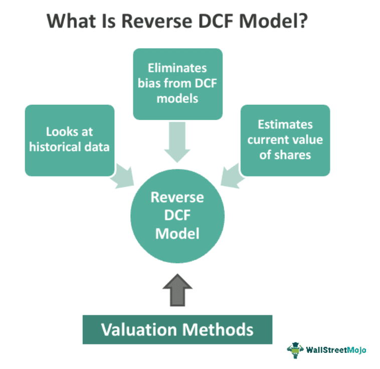

Understanding the value of a stock is crucial for making informed investment decisions. Accurate stock valuation helps investors determine whether a stock is priced appropriately, thus influencing buy, hold, or sell decisions. In this context, stock price evaluation can be approached through reverse-engineering the discounted cash flow (DCF) model, a strategy that offers an alternative to traditional valuation methods. The reverse-engineering method turns the conventional DCF on its head by starting with the observable market stock price and working backward to infer the underlying market expectations for future cash flows.

By leveraging the reverse-engineering approach, analysts and investors gain insight into the growth assumptions required to justify a stock’s current price. This perspective not only provides clarity but also mitigates the speculative nature inherent in traditional DCF analysis. Particularly in dynamic markets, where assumptions about future cash flows and discount rates are fraught with uncertainty, reverse-engineering the DCF model proves advantageous.



Moreover, this method extends beyond simple valuation and finds applications in algorithmic trading. Algorithmic trading refers to the use of computer algorithms to execute trading strategies based on predefined criteria. Here, reverse-engineered DCF insights can be integrated into automated trading systems to improve accuracy in predicting market movements and identifying mispriced stocks. 

The aim is to simplify the DCF process, offering a more grounded evaluation of stocks by considering current market data. The exploration of this model can potentially yield significant benefits, making it a valuable tool for both investors and traders in search of reliable valuation mechanisms amidst market volatility.

## Table of Contents

## The Traditional DCF Model

The discounted cash flow (DCF) model is a fundamental technique in stock valuation, grounded in the principle of time value of money. By forecasting a company's future cash flows and discounting them back to their present value, the DCF model aims to assess the intrinsic value of a stock. The central formula used in a DCF analysis is:

$$
\text{DCF} = \sum_{t=1}^{n} \frac{C_t}{(1 + r)^t}
$$

where $C_t$ represents the expected cash flow at time $t$, $n$ is the total number of periods, and $r$ is the discount rate.

Despite its widespread adoption, the traditional DCF model has inherent challenges. Foremost among these is the reliance on predicting future cash flows, which requires assumptions about a company's future performance, market conditions, and economic variables. These predictions are susceptible to significant variability and can lead to inaccurate valuations if the forecasts deviate from actual future cash flows.

Furthermore, determining the appropriate discount rate is another area of uncertainty. The discount rate, often derived from the company's weighted average cost of capital (WACC), reflects the riskiness of the cash flows. However, accurately estimating a company's WACC involves subjective judgment about capital structure, market [volatility](/wiki/volatility-trading-strategies), and risk premiums. This subjectivity introduces further complexity and potential bias in the valuation process.

Despite these uncertainties, the DCF model offers certain advantages. It provides a structured framework that considers the time value of money, which is indispensable for long-term investment decisions. Moreover, by focusing on future cash flows, the DCF model aligns with the objective of identifying a company's intrinsic value, distinct from its market price.

However, the limitations of the traditional DCF model are crucial to note, especially in today's dynamic markets. Rapid technological changes, regulatory shifts, and global economic factors can quickly render past assumptions obsolete. As such, while the DCF model remains a [fundamental analysis](/wiki/fundamental-analysis) tool, its effectiveness relies heavily on the accuracy of input assumptions and the analyst’s ability to adjust for changing conditions. In instances where precise cash flow predictions are challenging, complementary methods or more advanced models may be necessary to enhance the robustness of the valuation.

## What is Reverse-Engineering DCF?

Reverse-engineering the Discounted Cash Flow (DCF) model is an analytical approach that begins with the observed stock price to infer the market’s expectations concerning future cash flows. Unlike the traditional DCF model that estimates future cash flows and discounts them to present value, this method starts with a known variable—the current stock price—and works backward. This approach allows analysts to deduce the growth rate and other assumptions the market has implicitly made to justify the current stock valuation.

At the core of reverse-engineering DCF is the principle of equating the discounted value of expected future cash flows to the prevailing stock price. By doing so, analysts can reverse-calculate what the market assumes as the required growth rate. This process can effectively address and mitigate the uncertainties pervasive in traditional DCF analysis, which often involve significant speculative elements concerning future business performance and appropriate discount rates.

### Mathematical Expression

The standard DCF formula is expressed as:

$$
P_0 = \sum_{t=1}^{n} \frac{CF_t}{(1 + r)^t}
$$

where $P_0$ is the current stock price, $CF_t$ represents the cash flows in year $t$, $r$ is the discount rate, and $n$ is the number of periods.

In reverse-engineering DCF, the goal is to find the growth rate $g$ that satisfies:

$$
CF_t = CF_{t-1} \times (1 + g)
$$

Given $P_0$, analysts adjust $g$ in such a way that the calculated $P_0$ from the sum of discounted future cash flows matches the observed market price.

This technique provides a direct linkage between market sentiment and fundamental financial analysis by extracting implied growth rates from stock prices, thus minimizing subjective input. It fosters a more objective evaluation of whether a stock is reasonably valued based on the inherent assumptions about its future [earning](/wiki/earning-announcement) potential. Through this clarity, reverse-engineering DCF empowers investors to make informed judgments by revealing discrepancies between market expectations and feasible financial outcomes.

## How Reverse-Engineering DCF Affects Stock Valuation

Reverse-engineering the discounted cash flow (DCF) model for stock valuation introduces a process centered on known variables, particularly the current stock price. This method begins with the observable market price and works backwards to understand the implicit expectations for future cash flows. By doing so, it shifts the emphasis away from speculative estimates of future performance, which are often pivotal in traditional DCF analyses, toward a framework built on actual market data.

### Rethinking Valuation with Current Market Data

The reverse-engineering approach allows analysts to measure whether a stock is accurately priced by deducing the rate of growth necessary to justify its current market price. This involves calculating the growth rate that equates the present value of anticipated cash flows with the existing stock price, thus providing insights into the market's assumptions regarding a company's future performance. 

$$
P_0 = \sum_{t=1}^{n} \frac{CF_t}{(1 + r)^t} + \frac{TV}{(1 + r)^n}
$$

In the formula above, $P_0$ represents the current stock price, $CF_t$ is the cash flow at time $t$, $r$ is the discount rate, and $TV$ is the terminal value. Reverse-engineering calculates the required growth rates embedded in these terms based on $P_0$.

### Assessing Overvaluation and Undervaluation

By engaging with known data such as the current stock price, reverse-engineered DCF offers a more observable basis for determining valuation errors, such as overvaluation or undervaluation. Investors no longer need to rely solely on projected financial growth, often based on uncertain or speculative forecasts. Instead, they can compare the growth expectations derived from reverse-engineering with realistic growth scenarios, making more informed assessments of a stock's true value.

### Aligning with Market Sentiment

Reverse-engineering DCF also incorporates market sentiment through its fundamental reliance on the existing stock price, which inherently reflects collective market expectations and investor sentiment. This consideration provides a grounded perspective in evaluating stocks, directly aligning valuation with how the market perceives and prices future cash flows. By integrating such sentiments, investors gain insights that could be overlooked when focusing solely on financial projections typically used in traditional DCF approaches.

### Conclusion

Incorporating known market data and sentiments into the valuation process allows reverse-engineered DCF to provide more robust and market-aligned analyses. This innovative method not only clarifies the expectations embedded in current stock prices but also enhances investors' ability to make sound investment choices amidst market volatility.

## Application in Algorithmic Trading

Algorithmic trading increasingly utilizes reverse-engineered Discounted Cash Flow (DCF) analysis to enhance the accuracy of trading decisions. This approach leverages the discrepancies between current market expectations reflected in stock prices and the company's actual growth capabilities. By reverse-engineering the DCF, analysts begin with observable variables, such as the current stock price, rather than speculative forecasts, to deduce implied growth rates and expected cash flows.

Automated trading systems can integrate insights from reverse-engineered DCF with other trading signals to refine decision-making processes. Typically, these systems employ algorithms that can quickly analyze vast datasets, detecting patterns or anomalies that suggest potential trading opportunities. By incorporating reverse DCF analysis, traders can better determine whether a stock is correctly valued relative to its intrinsic value, thus allowing for more strategic trades. The integration might look as follows in a simplified Python code snippet:

```python
def reverse_engineer_dcf(stock_price, discount_rate, projected_growth):
    # Assuming a simplified perpetual growth DCF formula
    implied_cash_flows = stock_price * discount_rate / (1 + projected_growth)
    return implied_cash_flows

def trading_decision(stock_price, intrinsic_value):
    if stock_price < intrinsic_value:
        return "Buy"
    elif stock_price > intrinsic_value:
        return "Sell"
    else:
        return "Hold"

# Example usage
stock_price = 100
discount_rate = 0.05
projected_growth = 0.03
implied_cash_flows = reverse_engineer_dcf(stock_price, discount_rate, projected_growth)
decision = trading_decision(stock_price, implied_cash_flows)
```

In this example, traders can quickly assess the relationship between the current stock price and the calculated intrinsic value derived from implied cash flows. By doing so, they can make more informed decisions regarding buying, selling, or holding a stock.

Furthermore, advanced [algorithmic trading](/wiki/algorithmic-trading) systems can integrate various data sources, including historical prices, market sentiment analyses, and economic indicators, alongside the reverse-engineered DCF results. This multifaceted approach enables traders to develop strategies that are more aligned with intrinsic stock value predictions, reducing reliance on purely speculative market movements.

Ultimately, the integration of reverse DCF in algorithmic trading empowers traders to better exploit market inefficiencies. By understanding the growth assumptions the market is making, traders can position themselves advantageously in cases where their analysis suggests a disconnect between market price and intrinsic value. This methodology not only refines trading accuracy but also contributes to a more informed market where stock prices more accurately reflect underlying business fundamentals.

## Examples of Reverse-Engineered DCF

Without access to a PDF document to extract specific examples from, we can construct hypothetical scenarios to illustrate how reverse-engineered Discounted Cash Flow (DCF) can be applied effectively in real-world situations. These scenarios highlight the methodology's utility in uncovering discrepancies between market expectations and intrinsic stock values.

### Example 1: Tech Company Evaluation

Consider a technology company currently traded at $150 per share. By reverse-engineering the DCF model, analysts start with this stock price to infer market expectations for the company's future growth. Assuming a required rate of return of 10% and given data showing the company generates $5 per share in free cash flow, we can estimate the expected growth rate.

**Mathematical Approach:**

Using the formula for the present value of a perpetuity where $P = \frac{C}{r - g}$, where $P$ is the current stock price, $C$ is the cash flow per share, $r$ is the discount rate, and $g$ is the growth rate:

$$
150 = \frac{5}{0.10 - g}
$$

Solving for $g$:

$$
g = 0.10 - \frac{5}{150} = 0.10 - 0.0333 = 0.0667 \text{ or } 6.67\%
$$

Thus, the market reflects an expectation of approximately 6.67% growth in cash flows. If analysts, through industry research or company analysis, determine a more realistic growth rate of around 4%, this suggests the stock might be overvalued at current market prices.

### Example 2: Retail Company Assessment

Imagine a retail company with a current stock price of $80 and maintains an annual free cash flow per share of $8. The reverse-engineered DCF method provides insight into the implied growth rate with an assumed discount rate of 8%.

By utilizing:

$$
80 = \frac{8}{0.08 - g}
$$

Solving for $g$:

$$
g = 0.08 - \frac{8}{80} = 0.08 - 0.10 = -0.02 \text{ or } -2\%
$$

In this scenario, a negative growth rate indicates that the market might be expecting a decline in the company’s future cash flows. However, if analysts anticipate even modest positive growth due to potential new market expansions or improved operational efficiencies, the stock could be undervalued and present a promising investment opportunity.

### Example 3: Utility Company Analysis

A utility company, traditionally seen as stable with slower growth rates, has its shares priced at $50, producing $3 per share in free cash flow. With a conservative discount rate of 6%, reverse-engineering reveals:

$$
50 = \frac{3}{0.06 - g}
$$

Solving for $g$:

$$
g = 0.06 - \frac{3}{50} = 0.06 - 0.06 = 0\%
$$

This reflects a market assumption of zero growth, which aligns with typical expectations for utility stocks. However, if regulatory changes or technological advancements present new growth avenues for the company, analysts may find the stock underappreciated, suggesting upside potential for investors.

### Conclusion

These examples highlight reverse-engineered DCF's strength in linking market pricing to implied growth expectations. It acts as a diagnostic tool, revealing when market valuations might not align with realistic business growth prospects. Implementing this model can aid investors in identifying discrepancies that signal opportunities for advantageous investments.

## Challenges and Limitations

Reverse-engineering the Discounted Cash Flow (DCF) model offers a streamlined approach to stock valuation by focusing primarily on known market variables. However, despite its simplification over traditional methods, it still requires careful consideration of several critical factors to ensure an accurate evaluation.

One of the primary challenges in reverse-engineering DCF is the assumption of future growth rates. Accurate projection of these growth rates is vital as they have a significant impact on the overall valuation output. If the assumed growth rate diverges considerably from the company's actual performance, the valuation could be misleading. To mitigate this risk, it is crucial for analysts to base growth assumptions on comprehensive historical data and realistic future market scenarios. Applying statistical analysis or [machine learning](/wiki/machine-learning) models can offer data-driven insights that help refine these assumptions.

Economic changes and unexpected market events are other factors that can adversely affect the accuracy of reverse-engineered DCF analysis. Unforeseen economic downturns, geopolitical events, or industry-specific disruptions can cause substantial deviations between projected cash flows and actual performance. Therefore, incorporating sensitivity analysis in the reverse-engineering process can be beneficial. Sensitivity analysis allows analysts to examine how changes in key assumptions affect the valuation, helping to create more robust forecasts by considering different economic scenarios.

Another common pitfall is the potential bias introduced by analysts when selecting initial assumptions such as the discount rate or terminal growth rate. These assumptions can significantly sway the resulting valuation. To alleviate subjectivity, it is advisable to use industry benchmarks or averages as reference points and consider applying a range of scenarios. Monte Carlo simulations, which involve running numerous iterations with different sets of assumptions, can provide a probabilistic distribution of potential valuations, thereby reducing dependence on any single set of estimates.

Lastly, reverse-engineered DCF may also face limitations when applied to companies with volatile or non-linear cash flows, such as startups or businesses in rapidly evolving industries. In such cases, alternative valuation methods, such as relative valuation or option pricing models, may complement the insights gained from reverse-engineered DCF, thus offering a more comprehensive picture of the company's valuation landscape.

By addressing these challenges and limitations thoughtfully, investors can leverage reverse-engineered DCF effectively, making more informed and balanced investment decisions.

## Conclusion

Reverse-engineering the discounted cash flow (DCF) model offers a novel approach to stock valuation, placing a stronger emphasis on current market data and dynamics. This method transcends traditional valuation techniques by deriving future cash flow expectations from existing stock prices, thereby aligning valuation practices more closely with real market sentiments. This approach significantly enhances the accuracy and reliability of investment evaluations in a market characterized by constant flux and unpredictability.

The current financial landscape, marked by rapid changes and increased volatility, necessitates valuation methodologies that can quickly adapt and provide actionable insights. Reverse-engineering DCF fulfills this requirement by allowing investors and traders to infer realistic growth scenarios directly from observable data, thus minimizing the speculative aspects common in traditional DCF processes. This makes it a valuable tool for those seeking stable investment opportunities amid uncertain market conditions.

As financial markets continue to evolve, the adoption of reverse-engineered DCF could become integral to strategic investment decisions. Its ability to offer a rational and market-oriented valuation framework makes it a compelling option for investors aiming to refine their strategies and enhance trading outcomes. By focusing on known variables and current data, this method improves the robustness of stock valuation and opens new avenues for identifying undervalued or overvalued stocks.

In summary, reverse-engineered DCF stands as a powerful tool in modern finance, poised to play a critical role in shaping future investment strategies. Its strengths lie in its capacity to reduce reliance on speculative forecasts and provide a clearer, data-driven understanding of market expectations, thus potentially becoming a cornerstone in the field of investment valuation.

## References & Further Reading

[1]: Damodaran, A. (2012). ["Investment Valuation: Tools and Techniques for Determining the Value of Any Asset."](https://books.google.com/books/about/Investment_Valuation.html?id=5SRHAAAAQBAJ) Wiley.

[2]: Fernandez, P. (2007). ["Valuation Methods and Shareholder Value Creation."](https://www.sciencedirect.com/book/9780122538414/valuation-methods-and-shareholder-value-creation) Academic Press.

[3]: "Discounted Cash Flow Valuation," [NYU Stern - Aswath Damodaran's Classes](https://pages.stern.nyu.edu/~adamodar/pdfiles/eqnotes/dcfallOld.pdf).

[4]: Mauboussin, M. J., & Johnson, D. M. (1997). ["Competitive Advantage Period: The Neglected Value Driver."](https://www.jstor.org/stable/info/3666168) Financial Management.

[5]: Copeland, T., Koller, T., & Murrin, J. (2000). ["Valuation: Measuring and Managing the Value of Companies."](https://www.amazon.com/Valuation-Measuring-Managing-Companies-Frontiers/dp/0471086274) Wiley.

[6]: ["Intraday Trading Strategies: Proven Steps to Maximize Daily Profit"](https://howtotrade.com/trading-strategies/intraday-trading-strategies/) by Markus Heitkoetter

[7]: "What is Algorithmic Trading and How It Works," [Investopedia](https://www.etnownews.com/markets/what-is-algorithmic-trading-and-how-it-works-explained-article-104317430).