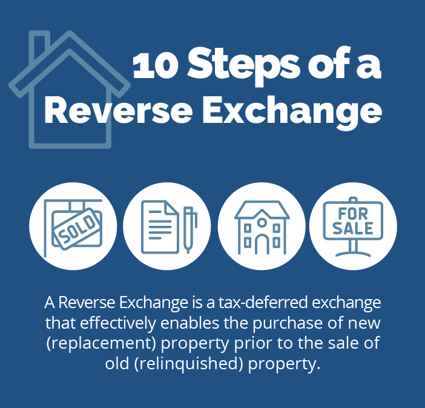

## Table of Contents

## What is a reverse exchange?

A reverse exchange is a type of real estate transaction where you buy the new property before selling your old one. This is different from a regular exchange, where you sell your old property first and then use the money to buy a new one. In a reverse exchange, you need to find someone to hold the new property for you until you can sell your old one. This person is called an exchange accommodator.

Reverse exchanges can be helpful if you find a great new property but haven't sold your old one yet. However, they are more complicated and can cost more money than regular exchanges. You need to follow strict rules set by the IRS to make sure the exchange is valid and you don't have to pay extra taxes. It's important to work with professionals who know about reverse exchanges to make sure everything goes smoothly.

## How does a reverse exchange differ from a standard exchange?

In a standard exchange, you first sell your old property and then use the money to buy a new one. This is called a 1031 exchange, and it helps you avoid paying taxes on the money you make from selling your old property. You have to follow certain rules, like finding a new property within 45 days and buying it within 180 days after selling your old one.

A reverse exchange works the other way around. You buy the new property before you sell your old one. Because of this, you need an exchange accommodator to hold the new property for you until you can sell your old one. Reverse exchanges are more complicated and can cost more money, but they can be useful if you find a great new property before you're ready to sell your old one. Both types of exchanges have strict IRS rules to follow to make sure they are valid and to avoid extra taxes.

## What are the basic steps involved in a reverse exchange?

In a reverse exchange, you start by finding a new property you want to buy. But since you haven't sold your old property yet, you need an exchange accommodator to help you. This person or company will buy and hold the new property for you until you can sell your old one. You'll need to sign agreements with the accommodator to make sure everything is done correctly.

Once the new property is bought and held by the accommodator, you can start working on selling your old property. You need to sell it within a certain time frame, usually within 180 days, to complete the exchange. After you sell your old property, the accommodator will transfer the new property to you. It's important to follow all the rules set by the IRS to make sure the exchange is valid and you don't have to pay extra taxes.

## Who are the key parties involved in a reverse exchange?

In a reverse exchange, the key parties are the person doing the exchange, called the exchanger, and the exchange accommodator. The exchanger is the one who wants to buy a new property before selling their old one. They need to find a new property they like and work with the exchange accommodator to make the purchase happen.

The exchange accommodator is a very important person in a reverse exchange. They buy and hold the new property for the exchanger until the old property is sold. The accommodator makes sure everything is done correctly and follows the rules set by the IRS. This helps the exchanger avoid paying extra taxes on the exchange.

## What are the legal requirements for conducting a reverse exchange?

To conduct a reverse exchange, you have to follow strict rules set by the IRS. One big rule is that you need to use an exchange accommodator. This person or company will buy and hold the new property for you until you sell your old one. The IRS says that the accommodator can't be someone related to you, like family or a business partner. You also have to sign special agreements with the accommodator to make sure everything is done the right way.

Another important rule is that you have to sell your old property within 180 days of the accommodator buying the new one. If you don't sell it in time, the exchange won't be valid, and you might have to pay extra taxes. You also need to make sure that the new property is used for the same purpose as the old one, like if the old property was for business, the new one should be too. Following these rules can be tricky, so it's a good idea to work with professionals who know about reverse exchanges to help you through the process.

## What are the financial implications of engaging in a reverse exchange?

A reverse exchange can help you avoid paying taxes on the money you make from selling your old property, just like a standard exchange. But reverse exchanges can cost more money because you need to pay an exchange accommodator to buy and hold your new property until you sell your old one. You might also need to pay for extra paperwork and professional help to make sure everything is done right.

If you don't follow the IRS rules, like selling your old property within 180 days, you could end up paying extra taxes. This can make a reverse exchange more expensive than it was supposed to be. So, it's important to plan carefully and maybe get help from people who know about reverse exchanges to make sure you don't end up spending more money than you planned.

## How can a reverse exchange benefit an investor or business?

A reverse exchange can help an investor or business in a big way. If they find a great new property they want to buy but haven't sold their old one yet, a reverse exchange lets them go ahead and buy it. This is really helpful because it means they don't have to miss out on a good opportunity just because their old property hasn't sold. By using a reverse exchange, they can keep their investment plans moving forward without waiting.

Also, a reverse exchange can help them save money on taxes. When they sell their old property and buy a new one using a reverse exchange, they can avoid paying taxes on the money they make from the sale. This can make a big difference in their overall costs and help them keep more money in their pockets. But, it's important to do everything the right way and follow the rules set by the IRS to make sure they get these tax benefits.

## What are the potential risks associated with reverse exchanges?

Reverse exchanges can be tricky because they are more complicated than regular exchanges. One big risk is that you have to pay for an exchange accommodator to buy and hold your new property until you sell your old one. This can add to your costs, and if you don't follow the IRS rules exactly, you might end up paying extra taxes. For example, if you don't sell your old property within 180 days, the exchange won't be valid, and you could lose the tax benefits you were hoping for.

Another risk is that you might have a hard time finding a buyer for your old property quickly enough. If the real estate market is slow or your property is hard to sell, you could be stuck with the costs of holding the new property without being able to complete the exchange. This can put a strain on your finances and make the whole process more stressful. It's important to think carefully about these risks and maybe get help from professionals who know about reverse exchanges to make sure you can handle them.

## Can you explain the role of an Exchange Accommodation Titleholder (EAT) in a reverse exchange?

In a reverse exchange, an Exchange Accommodation Titleholder (EAT) is really important. The EAT is the person or company that buys and holds the new property for you until you can sell your old one. They do this because in a reverse exchange, you need to buy the new property before selling the old one, which is different from a regular exchange. The EAT makes sure everything is done the right way and follows the rules set by the IRS. This helps you avoid paying extra taxes on the exchange.

The EAT can't be someone related to you, like family or a business partner. You have to sign special agreements with the EAT to make sure everything is done correctly. The EAT holds onto the new property until you sell your old one, which has to happen within 180 days. If you don't sell your old property in time, the exchange won't be valid, and you might have to pay extra taxes. So, the EAT plays a big role in making sure your reverse exchange goes smoothly and you get the tax benefits you're hoping for.

## What are the time limits and deadlines one must be aware of in a reverse exchange?

In a reverse exchange, you have to follow strict time limits set by the IRS. One big deadline is that you have to sell your old property within 180 days after the Exchange Accommodation Titleholder (EAT) buys the new property for you. If you don't sell your old property in time, the exchange won't be valid, and you might have to pay extra taxes.

Another important thing to remember is that the EAT can only hold the new property for you for up to 180 days. This means you need to work quickly to find a buyer for your old property. If you miss these deadlines, it can mess up your whole plan and cost you more money. So, it's really important to keep track of these time limits and make sure you can meet them.

## How do tax considerations play into the decision to use a reverse exchange?

One big reason people choose to do a reverse exchange is to save money on taxes. When you sell your old property and buy a new one using a reverse exchange, you can avoid paying taxes on the money you make from the sale. This can make a big difference in your overall costs and help you keep more money in your pocket. But, you have to follow the rules set by the IRS very carefully to make sure you get these tax benefits. If you mess up, you could end up paying extra taxes instead of saving money.

The tax savings can be a big help, but you also need to think about the extra costs of doing a reverse exchange. You have to pay an exchange accommodator to buy and hold your new property until you sell your old one. This can add to your costs, and if you don't sell your old property within 180 days, the exchange won't be valid, and you could lose the tax benefits you were hoping for. So, it's important to weigh the potential tax savings against the extra costs and risks to decide if a reverse exchange is the right choice for you.

## What advanced strategies can be employed to optimize outcomes in reverse exchanges?

To optimize outcomes in reverse exchanges, it's important to carefully time the purchase of the new property and the sale of the old one. One strategy is to work with a good real estate agent who knows the market well. They can help you find the right buyer for your old property quickly, so you can meet the 180-day deadline. Another strategy is to make sure the new property you want to buy is a good investment. Do your research and look at the potential for the property to increase in value or generate income. This way, even if the exchange doesn't go as planned, you'll still have a valuable asset.

Another key strategy is to choose a reliable exchange accommodator. They play a big role in making sure everything goes smoothly, so it's worth spending time to find someone you trust. Make sure they have experience with reverse exchanges and understand the IRS rules. Also, keep good records and work with a tax professional to make sure you're following all the rules. This can help you avoid mistakes that could cost you money in taxes. By planning carefully and getting the right help, you can make the most of a reverse exchange and achieve your investment goals.

## Is Algorithmic Trading in Real Estate a Game Changer?

Algorithmic trading is traditionally linked to financial markets, where it has transformed how trades are executed by leveraging computer algorithms to analyze large datasets. Its entry into the real estate domain represents a significant shift, offering the potential to enhance the efficiency and accuracy of property transactions. By utilizing massive datasets, these algorithms can identify profitable investment opportunities and manage portfolios with a level of precision that was previously unattainable.

### Processing Massive Datasets

The core of [algorithmic trading](/wiki/algorithmic-trading) in real estate lies in its ability to process extensive datasets. Algorithms can evaluate various market indicators such as demographic data, housing trends, and economic forecasts to assess property values and identify investment opportunities. For instance, [machine learning](/wiki/machine-learning) models can leverage datasets to predict future property values by considering variables like neighborhood crime rates, school district performance, and public transportation accessibility. An example formula that might be used in predicting property values is:

$$
\text{Predicted Value} = \beta_0 + \beta_1(\text{Crime Rate}) + \beta_2(\text{School Rating}) + \beta_3(\text{Transportation Access}) + \epsilon
$$

Where:
- $\beta$ coefficients represent weights assigned to each variable,
- $\epsilon$ is the error term,

### Reducing Transaction Times and Errors

One of the most significant impacts of algorithmic trading is the reduction in transaction times and minimization of human error. Automated systems can execute trades and manage transactions faster than humans, ensuring optimal timing for buying or selling properties. By eliminating manual processes, algorithms reduce the risk of errors caused by human oversight, thus enhancing transaction accuracy and efficiency.

### Regulatory Considerations and Technological Prerequisites

Implementing algorithmic trading in real estate requires navigating various regulatory considerations and technological prerequisites. Regulations often vary between jurisdictions, requiring compliance with local real estate laws and financial regulations. Furthermore, robust technological infrastructure is essential to support the high-speed processing power required by algorithmic systems, including servers capable of handling large computational loads and software that can process real-time data efficiently.

### Future Trends and Developments

Looking ahead, future trends in algorithmic trading within real estate could significantly reshape the market. Innovations such as [artificial intelligence](/wiki/ai-artificial-intelligence) (AI) integration are likely to enhance the predictive capabilities of trading algorithms, offering even more sophisticated and accurate analysis. Blockchain technology might also play a role, providing transparency and security to property transactions through decentralized ledger systems. As these technologies evolve, they promise to transform how real estate is bought, sold, and managed, presenting exciting opportunities for investors and developers alike.

## References & Further Reading

[1]: ["Exchange of Real Estate Under Section 1031 of the Internal Revenue Code"](https://www.forbes.com/advisor/mortgages/real-estate/1031-exchange/) by Internal Revenue Service

[2]: ["Algorithmic and High-Frequency Trading"](https://www.amazon.com/Algorithmic-High-Frequency-Trading-Mathematics-Finance/dp/1107091144) by Álvaro Cartea, Sebastian Jaimungal, and José Penalva

[3]: Sundaresan, S. (2021). ["Machine Learning Applications in Real Estate Valuation."](https://aisel.aisnet.org/cgi/viewcontent.cgi?article=1101&context=jmwais) Journal of Finance and Real Estate, 45(2), 62-80.

[4]: ["Real Estate Principles: A Value Approach"](https://www.mheducation.com/highered/product/Real-Estate-Principles-A-Value-Approach-Ling.html) by David C. Ling and Wayne R. Archer

[5]: Makridakis, S., & Gaba, A. (2017). ["How Algorithms are Transforming Real Estate Processes."](https://www.researchgate.net/publication/52008212_Forecasting_Methods_and_Applications) Journal of Forecasting, 36(6), 644-652.