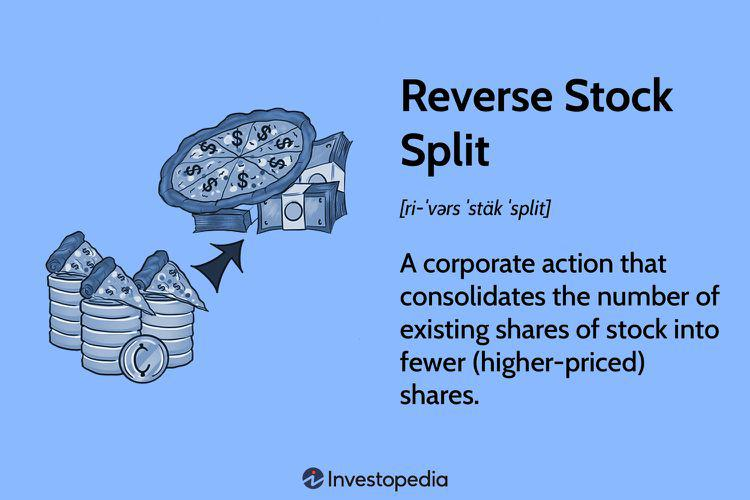

Stock splits are crucial corporate actions that significantly impact stock value and investor perception. By altering the number of shares outstanding while maintaining the market capitalization, stock splits can influence a company's accessibility to investors and its liquidity in the market. This article explores two primary types of stock splits: forward stock splits, which increase the total number of shares and are usually employed to make shares more affordable to a broader range of investors, and reverse stock splits, which consolidate shares to raise the stock price and meet listing requirements or improve market perceptions.

For individual investors and traders, understanding the mechanics and strategic intentions behind stock splits is vital. Such knowledge aids in evaluating corporate actions and optimizing investment or trading strategies. By offering insights into how stock splits work, their potential advantages, and inherent risks, this article aims to equip investors with the necessary tools to analyze these actions effectively. Furthermore, the discussion includes the interaction of stock splits with algorithmic trading, highlighting how automated systems can be programmed to exploit the resulting changes in stock prices and liquidity.



Algorithmic trading, now a significant component of modern financial markets, involves using computational algorithms to execute trades based on predetermined conditions. Traders utilizing such systems must incorporate potential stock splits into their algorithms to capitalize on resulting market fluctuations. Understanding how these processes are integrated into algos can help maximize returns, demonstrating the symbiotic relationship between corporate actions and technological trading solutions.

## Table of Contents

## Understanding Stock Splits

A stock split is a corporate action in which a company increases the number of its outstanding shares by issuing more shares to its existing shareholders. This process does not alter the company's overall market capitalization because the split proportionally reduces the price of each share. For instance, in a two-for-one split, each shareholder receives an additional share for every share they own, while the price of each share is halved. The fundamental value of the shareholder's investment remains unchanged.

There are two primary types of stock splits: forward stock splits and reverse stock splits. A forward stock split, as described, involves issuing additional shares, effectively reducing the price per share. This type of split is generally undertaken to make shares more affordable, thus increasing liquidity and potentially attracting a broader range of investors.

In contrast, a reverse stock split involves consolidating existing shares into fewer shares, which results in a higher share price. A company might initiate a reverse stock split to meet the minimum price requirements of a stock exchange or to enhance the stock's perception in the market.

Understanding how stock splits function is crucial for investors. Stock splits can influence stock [liquidity](/wiki/liquidity-risk-premium) significantly. In a forward stock split, increased share numbers can enhance trading [volume](/wiki/volume-trading-strategy) and market participation due to lower stock prices. Conversely, reverse stock splits may reduce liquidity, as fewer shares are available for trading, possibly causing investor hesitation.

To better explain stock splits using mathematical expressions, consider the formula for a simple stock split:

$$
\text{New Share Price} = \frac{\text{Old Share Price}}{\text{Split Ratio}}
$$

$$
\text{New Number of Shares} = \text{Old Number of Shares} \times \text{Split Ratio}
$$

For example, with an old share price of $100 in a two-for-one forward stock split, the new share price would be:

$$
\text{New Share Price} = \frac{100}{2} = 50
$$

And the new number of shares would be double the original count.

Investors must be aware of these mechanics, as stock splits not only affect stock accessibility and liquidity but also investor perceptions and market dynamics.

## Forward Stock Split

A forward stock split is a corporate action in which a company increases its total number of outstanding shares by issuing additional shares to existing shareholders. This process does not alter the company's market capitalization but effectively reduces the price per share, making the stock more affordable and accessible to a broader range of investors. The underlying value of the investment for a shareholder remains unchanged, as the total market value of their holdings does not change. 

To illustrate, consider a company executing a two-for-one stock split. In this scenario, for every share a shareholder holds, they receive one additional share, effectively doubling the number of shares they own. Simultaneously, the share price is halved. For example, if an investor holds 100 shares at $200 each, following a two-for-one split, they will own 200 shares priced at $100 each. The total market value of the investor's holdings remains $20,000 (200 shares x $100 per share), highlighting that the split does not change the overall value held by investors.

One primary objective of forward stock splits is to enhance market liquidity. By lowering the share price, the stock becomes more attractive to retail investors and those with limited capital, potentially broadening the investor base and increasing trading activity. Increased liquidity can lead to more efficient price discovery and reduce bid-ask spreads, benefiting both the company and its investors.

Forward stock splits can also signal positive prospects. When companies split their stock, it often suggests confidence from management in the company's future performance, as these splits are generally performed after significant price increases. This perceived confidence can further incentivize investor participation, contributing to increased demand and potentially bolstering the stock's performance post-split.

In summary, forward stock splits serve to adjust share prices, improve stock liquidity, and make shares accessible to a wider audience without altering the intrinsic value of the investment for current shareholders. These actions are largely seen as positive market signals that can widen the investor pool and enhance overall market dynamics.

## Reverse Stock Split

A reverse stock split occurs when a company consolidates its outstanding shares to increase the share price. For instance, in a 1-for-2 reverse stock split, every two existing shares are merged into one, effectively doubling the share price while the total number of shares halves. This maneuver is frequently leveraged by companies to comply with stock exchange listing requirements, which often mandate a minimum share price. Moreover, a higher stock price may create the perception of financial stability and attract institutional investors who have policies against owning low-priced stocks.

While the reverse stock split can enhance a company's image and meet regulatory criteria, it also impacts market dynamics. One significant implication is the potential reduction in market liquidity, as fewer shares become available for trading. This scarcity can lead to wider bid-ask spreads and increased [volatility](/wiki/volatility-trading-strategies). Additionally, investors might view a reverse split as a signal of underlying issues, leading to increased wariness or skepticism regarding the company's financial health.

It is crucial for investors to carefully evaluate a company's rationale for conducting a reverse stock split. While it might appear to be a technical adjustment, the broader market perceptions and consequent impacts on liquidity can significantly influence investment decisions. Therefore, understanding the strategic intentions behind such corporate actions is essential for making informed investment evaluations.

## Reverse/Forward Stock Split Strategy

A reverse/forward stock split is a sophisticated corporate strategy implemented to restructure a company's shareholding in a manner that optimizes shareholder composition and reduces administrative overheads. This process involves two sequential actions: a reverse stock split followed by a forward stock split. Initially, the company consolidates its existing shares through a reverse split, increasing the price per share by reducing the total number of shares outstanding. For example, in a 1-for-10 reverse split, 10 existing shares are consolidated into one new share. 

The subsequent forward stock split then increases the number of shares again, often at a similar or smaller consolidation ratio. Typically, the forward split might be at a ratio such as 10-for-1, meaning each shareholder receives 10 new shares for every consolidated share they hold. This dual action aims to eliminate shareholders who hold fewer than the specified number of shares post-reverse split, as their holdings would not qualify for allocation of new shares in the forward split. Such shareholders are generally compensated with cash for their fractional shares, thereby reducing the total number of shareholders to a more manageable count.

This strategic maneuver allows companies to achieve a more desirable shareholder structure by eliminating smaller, often non-institutional and inactive shareholders. It simplifies administrative processes related to shareholder communications, voting, and dividend payments. Additionally, it enhances cost efficiency by reducing the expenses associated with maintaining a large shareholder base.

For investors, a reverse/forward stock split strategy holds significant implications. It can lead to changes in ownership stakes that impact voting power and dividend entitlements. Shareholders might experience forced buyouts if their holdings fall below the required threshold, potentially influencing their investment decisions. Therefore, understanding the mechanics and objectives of a reverse/forward stock split is crucial for investors to assess how such corporate actions might affect their portfolio and investment outcomes.

## Impact on Algo Trading

Algorithmic trading, or algo trading, leverages computer algorithms to execute trades based on predefined criteria such as price, timing, and volume. Stock splits, which alter the number and price of shares, can significantly impact trading strategies employed by these algorithms. Understanding the interplay between stock splits and [algorithmic trading](/wiki/algorithmic-trading) is crucial for maximizing investment returns.

Algorithms are designed to recognize patterns and changes in market conditions. When a stock split occurs, the price of shares is usually adjusted automatically by trading platforms to reflect the split. However, this alteration in share price and quantity can create opportunities for algorithms programmed to exploit rapid changes in price and liquidity. For instance, a forward stock split reduces the price per share, potentially leading to increased trading activity and tighter bid-ask spreads as more investors can afford to buy the stock. An algorithm might be programmed to increase buy orders in anticipation of heightened market interest following a forward split.

Conversely, reverse stock splits increase the price per share, which can reduce liquidity and deter small investors. Algorithms need to account for these changes, as reduced trading volume might lead to wider bid-ask spreads and increased volatility. In such scenarios, algorithms might be programmed to reduce trading frequency or adjust parameters to mitigate risks associated with lower liquidity.

Investors and traders utilizing algorithmic trading must understand how stock splits are factored into algorithmic strategies. Algorithms can be programmed to recognize the announcement of stock splits as a prelude to changes in price action and order flow patterns. Integrating [machine learning](/wiki/machine-learning) techniques, such as natural language processing, can help in automatically identifying announcements related to stock splits, allowing traders to adjust their strategies in real-time. Furthermore, historical data analysis can offer insights into typical market behavior following stock splits, enabling algorithms to refine their trading logic based on past trends and outcomes.

In Python, a basic structure for an algorithmic trading strategy that considers stock splits could look like:

```python
def trading_strategy(stock_data, split_announcements):
    for event in split_announcements:
        if event['type'] == 'forward':
            stock_data[event['date']] *= 2  # Adjust for a 2-for-1 split
            # Implement logic to increase trading activity
        elif event['type'] == 'reverse':
            stock_data[event['date']] /= 2  # Adjust for a 1-for-2 reverse split
            # Implement logic to reduce trading activity
    return stock_data
```

This example demonstrates adjusting stock data in response to split announcements, highlighting the importance of integrating such events into algorithmic models. By recognizing and effectively incorporating the dynamics of stock splits, algos can be optimized to enhance returns while mitigating risks associated with sudden changes in stock attributes.

## Real-World Examples

Examining real-world examples of stock splits provides valuable insights into their effects on stock valuation and investor perception. A noteworthy example is NVIDIA's forward stock split, which took place on July 20, 2021. The company executed a four-for-one split, which means every existing share was divided into four shares, and its price was adjusted accordingly. This action aimed to make NVIDIA's stock more accessible to a broader range of investors by reducing the price per share.

Historical data reveal that NVIDIA's stock price had appreciated significantly before the split, driven by strong financial performance and growth prospects in the semiconductor industry. The stock split was met positively by the market, as it was perceived to signal confidence in future growth. Post-split, NVIDIA's stock continued to gain [momentum](/wiki/momentum), attracting increased retail investor interest due to the lower share price.

Real-world examples such as Apple's periodic stock splits further highlight the strategic use of these actions. Apple has implemented stock splits multiple times to enhance market liquidity and make shares more affordable. The company's 2020 four-for-one forward stock split, similar to NVIDIA's, was successful in expanding its investor base and sustaining its stock's upward trajectory.

Analyzing these examples underscores the importance of traders and investors understanding the broader context and implications of stock splits. Historical stock performance around such events often demonstrates heightened trading activity and volatility. Therefore, algorithmic trading strategies can be beneficial. Algorithms programmed to recognize split announcements can capitalize on liquidity changes and adjust trading parameters to exploit post-split market dynamics.

In conclusion, scrutinizing real-world stock splits like those of NVIDIA and Apple emphasizes the potential benefits and risks associated with these corporate actions, aiding traders and investors in making informed decisions.

## Conclusion

Stock splits, whether in the form of forward or reverse actions, serve as compelling strategic tools for companies. Forward stock splits are often utilized to decrease the price per share, effectively making them more affordable and attractive to a wider range of investors. This increased accessibility can enhance market liquidity, facilitating smoother transactions and potentially leading to a more dynamic trading environment. By contrast, reverse stock splits aim to consolidate shares, usually elevating the stock price to meet exchange listing requirements or to improve the perception of the stock's value in the market.

Despite their advantages, stock splits are not without risks, which investors must diligently assess. For forward stock splits, while market liquidity can increase and attract new investors, there is the potential for speculative trading, driven by the perception rather than the fundamental value of the company. Conversely, reverse stock splits might lead to reduced market liquidity and increased investor skepticism, as these actions can sometimes be interpreted as signs that a company is struggling financially.

Leveraging stock splits within algorithmic trading strategies provides opportunities for investors to maximize returns. Algorithms can be programmed to detect and respond to the adjustments in stock price and liquidity prompted by splits. This capability allows traders to capitalize on potential short-term volatility and liquidity changes, thus optimizing investment strategies. The capacity to automate responses to stock split events enables a more systematic approach to capturing market inefficiencies or trends.

The strategic deployment of stock splits, coupled with astute algorithmic trading strategies, can offer substantial benefits. However, it is crucial for investors to remain cognizant of the inherent risks and ensure they are aligned with broader investment goals.

## References & Further Reading

[1]: ["Financial Markets and Corporate Strategy"](https://books.google.com/books/about/Financial_Markets_Corporate_Strategy.html?id=S1cPAQAAMAAJ) by Mark Grinblatt & Sheridan Titman

[2]: ["Stock Splits and Trading Volume"](https://www.marketbeat.com/stock-splits/) by Anup Agrawal, published in the Journal of Finance

[3]: ["NVIDIA Had a 4-for-1 Stock Split"](https://finance.yahoo.com/news/nvidia-sets-4-1-stock-130714341.html), CNBC article discussing NVIDIA's stock split

[4]: ["Apple Stock Split History"](https://www.macrotrends.net/stocks/charts/AAPL/apple/stock-splits), overview on Apple's history of stock splits, Investopedia 

[5]: ["Understanding Stock Splits in Trading"](https://www.schwab.com/learn/story/stock-splits-explained), Bloomberg article providing insights into stock splits and their implications on trading strategies