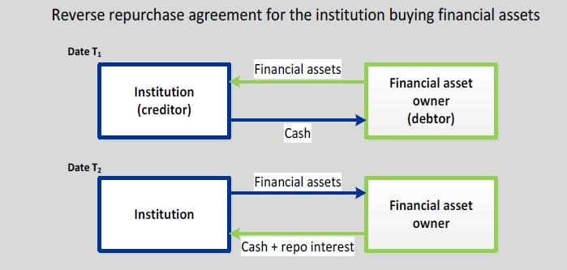

Financial agreements are foundational components of modern financial markets, facilitating the smooth operation of transactions, ensuring liquidity, and maintaining market stability. These agreements come in various forms, including loans, bonds, leases, and derivatives, all of which serve distinct purposes in the financial ecosystem. By formalizing the terms and conditions under which parties transact, financial agreements provide a structured framework that reduces uncertainty and enhances trust among market participants.

One of the specialized financial tools designed to ensure market liquidity and stability is the Reverse Repurchase Agreement (RRP) mechanism. This instrument plays a crucial role in financial markets by allowing central banks and other financial institutions to manage short-term liquidity needs. In essence, an RRP transaction involves the sale of securities with the agreement to repurchase them at a later date for a predetermined price, thereby providing temporary cash or liquidity to the buyer with the security acting as collateral. The RRP mechanism is particularly significant during periods of monetary policy adjustments or financial stress, as it supports the stabilization of interest rates and maintains the flow of capital within the market.

Understanding reverse repurchase agreements is pivotal for comprehending their impact on financial stability and liquidity. These agreements are commonly used by central banks to implement monetary policy by absorbing or injecting liquidity into the financial system. By engaging in RRAs, institutions can effectively manage their cash positions and hedge against potential market fluctuations.

In addition to traditional financial agreements, the advent of algorithmic trading has introduced a new dynamic to financial markets. Algorithmic trading involves the use of computerized systems to execute trades based on pre-set criteria and quantitative calculations. Its relationship with financial agreements lies in the ability of algorithms to analyze vast datasets, including agreement terms and market conditions, to optimize trading strategies. This technological advancement has significantly increased the speed and efficiency of transactions, but it also presents challenges related to market volatility and systemic risk.

The purpose of this article is to provide readers with an in-depth understanding of the interplay between financial agreements, specifically reverse repurchase agreements, and algorithmic trading within financial markets. Through this exploration, readers will gain insights into the mechanisms that drive market stability and the innovative strategies that are shaping the future of financial transactions.

## Table of Contents

## Understanding Financial Agreements

Financial agreements are formalized arrangements between parties to fulfill economic transactions and obligations, each with defined terms and conditions. These agreements encompass a broad range of instruments and contracts, including bonds, loans, leases, derivatives, and various forms of securities, serving as essential components in financial operations worldwide.

There are several types of financial agreements, each serving unique purposes and operating under specific conditions:

1. **Debt Agreements:** This includes loans and bonds, where borrowers receive funds with the obligation to repay over time with interest. These agreements are pivotal for individuals and corporations in obtaining necessary capital.

2. **Derivative Contracts:** These include options, futures, and swaps, contracts whose values are derived from underlying assets. They are instrumental in risk management, allowing parties to hedge against fluctuations in market prices.

3. **Purchase Agreements:** Common in business transactions, these detail the sale of goods or services. They are critical in defining terms such as delivery, payment schedules, and warranties.

The importance of financial agreements in ensuring [liquidity](/wiki/liquidity-risk-premium) and security cannot be understated. They provide frameworks that facilitate the smooth operation of financial markets by ensuring that terms of transactions are clear, predictable, and enforceable. Additionally, they offer security to investors and institutions by mitigating risks associated with credit, interest rates, and other market factors.

In everyday financial transactions, agreements such as credit contracts enable consumers to access goods and services without upfront payments. Leasing agreements allow businesses and individuals to use assets like vehicles or property without purchase, conserving capital for other uses.

Globally, financial agreements are indispensable in sustaining the economic infrastructure. They underpin the transactions in financial markets, enabling everything from simple consumer purchases to complex multinational deals. By facilitating the flow of capital and the sharing of risk, these agreements help stabilize economies, bolster investment, and foster economic growth.

Overall, financial agreements are foundational elements that support liquidity, security, and transparency in financial systems, playing a crucial role in the efficient functioning of the global economy.

## The RRP Mechanism: A Closer Look

## The RRP Mechanism: A Closer Look

Reverse Repurchase Agreements (RRP) form a crucial part of financial markets by supporting liquidity and ensuring stability. An RRP occurs when one party sells securities to another with an agreement to repurchase them at a later date for a predetermined price. Essentially, it is a short-term borrowing mechanism usually conducted overnight.

RRPs serve a significant purpose in the financial markets by providing a secure means for institutions to obtain short-term funding. They help stabilize market conditions by allowing market participants to manage their short-term cash needs efficiently. With this mechanism, entities can leverage idle securities to meet liquidity requirements while minimizing exposure to counterparty risk.

Central banks play a pivotal role in the functioning of RRPs. They utilize these agreements as a tool for implementing monetary policy, controlling the money supply, and managing interest rates. By engaging in RRPs, central banks can absorb excess reserves from the financial system, thus exerting upward pressure on interest rates and maintaining price stability. For instance, the Federal Reserve uses RRPs as part of its open market operations to influence the federal funds rate, the benchmark for short-term interest rates in the United States.

A notable example of the RRP mechanism in action took place during the financial crisis of 2008. To mitigate the severe disruption in the credit markets, the Federal Reserve introduced various liquidity facilities, including the Term Auction Facility (TAF) and Primary Dealer Credit Facility (PDCF). These facilities included RRP agreements to provide liquidity to banks and primary dealers, ensuring that credit continued to flow to households and businesses.

The RRP mechanism's design guarantees that financial markets have access to necessary capital, thereby reducing the likelihood of a liquidity crunch. It acts as a stabilizing force in times of economic uncertainty. However, while providing a safety net, central banks must carefully manage RRPs to avoid unintended consequences, such as excessive tightening of monetary conditions or encouraging over-reliance on short-term funding.

In conclusion, Reverse Repurchase Agreements play an integral role in promoting market stability and liquidity. The involvement of central banks enhances the effectiveness of monetary policy implementation, making RRPs a vital tool for ensuring the smooth operation of financial systems.

## Reverse Repurchase Agreements: Key Concepts

Reverse repurchase agreements (RRAs) are pivotal financial instruments in the money market, serving as a tool predominantly used for short-term borrowing and lending. An RRA involves a party selling a security to another party with a promise to repurchase it at a predetermined price on a specified future date. This transaction is effectively a secured loan, with the security acting as collateral. The initial sale price is equivalent to the cash loan, while the repurchase price reflects the principal plus an interest payment, known as the repo rate.

RRAs play a fundamental role in enhancing financial stability and liquidity. By providing a mechanism for cash-rich entities, like financial institutions, to lend short-term funds while [earning](/wiki/earning-announcement) an [interest rate](/wiki/interest-rate-trading-strategies), these agreements maintain liquidity in the financial system. Conversely, institutions needing short-term funds can obtain necessary liquidity without selling their securities outright. This dual ability to provide and absorb liquidity helps stabilize the financial markets.

The mechanics of a reverse repurchase transaction typically involve several steps. Initially, the security seller enters into an agreement with the buyer to sell the securities temporarily. The buyer provides cash in exchange for the securities. After the agreed period, the seller repurchases the securities at the predetermined price, including interest. This interest, or repo rate, can be calculated using the formula:

$$
\text{Repo Rate} = \frac{\text{Repurchase Price} - \text{Sale Price}}{\text{Sale Price}} \times \frac{360}{\text{Number of Days till Repurchase}}
$$

The RRA ensures that parties engaged in the transaction hold positions in liquid and secure assets, contributing to systemic liquidity and stability.

While reverse repurchase agreements offer remarkable advantages, they are not devoid of risks. The primary risk is credit risk, where the party responsible for repurchasing the securities may default. Furthermore, market risk can occur if the value of the underlying collateral depreciates significantly, potentially leaving the lender with less valuable securities. However, because these agreements are often backed by high-quality collateral, such as government securities, the risks are generally considered low. Moreover, benefits such as liquidity provision, low transaction costs, and flexibility in financial operations make RRAs attractive for market participants seeking efficient and secure ways to manage short-term funding needs.

## Algorithmic Trading and Financial Agreements

Algorithmic trading, often referred to as algo trading, involves using computer algorithms to automate trading decisions and execute orders at greater speed and accuracy than human traders. This approach has been transformative for financial markets, increasing market efficiency, liquidity, and transparency. Algorithms can process vast amounts of data and execute orders across multiple markets simultaneously, which enhances price discovery and narrowing of bid-ask spreads.

The integration of financial agreements into [algorithmic trading](/wiki/algorithmic-trading) strategies is an area of increasing importance. Financial agreements, including contracts for derivatives, repurchase agreements, and swaps, can be effectively managed and executed through algorithms. These algorithms can analyze market conditions and contractual terms, make trading decisions, and execute transactions with minimal human intervention, optimizing the value and execution efficiency. For example, an algorithm might assess a derivative’s position and determine the optimal hedge in real-time, thus managing risk more effectively.

The benefits of using algorithms for managing financial agreements are manifold. The most prominent advantage is speed. Algorithms can react to market changes in microseconds, far faster than human traders, enabling rapid repositioning and optimization of trading strategies. Additionally, algorithms enhance precision by minimizing human error, thus reducing the risk of mispricing and execution errors. They also improve consistency in trading patterns, as algorithms are not subject to the emotional influences that can affect human decision-making.

Moreover, algorithms can manage complex calculations required by financial agreements, such as those involved in fixed-income securities or derivatives pricing, much more efficiently than manual methods. For example, the calculation of the net present value (NPV) in complex derivatives can be done almost instantaneously, allowing traders to quickly assess and respond to market changes.

Despite the advantages, challenges and risks exist in the application of algorithmic trading to financial agreements. One significant challenge is the need for robust, sophisticated algorithms that can adapt to rapidly changing market conditions and complexities of various financial agreements. Developing these algorithms requires significant technical expertise and understanding of financial markets, which can be costly and resource-intensive.

Additionally, the reliance on technology introduces risks such as system failures or cyber-attacks, which can lead to substantial financial losses. The infamous "Flash Crash" of 2010, where electronic trading systems contributed to a rapid, deep decline in U.S. equity markets, highlights the potential systemic risks of algorithmic trading. 

Participants also face regulatory challenges, as financial authorities globally scrutinize algorithmic trading practices to prevent market manipulation and ensure fair trading practices. Continuous compliance with these evolving regulations is crucial for market participants utilizing algorithmic trading strategies involving financial agreements.

Overall, the intersection of algorithmic trading and financial agreements has created opportunities for greater efficiency and effectiveness in financial markets, while also presenting unique challenges that necessitate careful management and regulation.

## How RRP Mechanism and Algo Trading Interact

Algorithmic trading systems harness the power of the Reverse Repurchase (RRP) mechanism by utilizing RRP data to optimize trading strategies and enhance market efficiency. At its core, the RRP mechanism involves the temporary exchange of securities for cash, often orchestrated by central banks to regulate market liquidity and stabilize short-term interest rates. Algorithmic trading systems leverage the data generated from these transactions to make informed decisions on asset allocation and liquidity management.

### Utilization of RRP Data in Algo Trading

Algorithmic trading models integrate RRP data to assess market liquidity trends and anticipate interest rate movements. By analyzing the [volume](/wiki/volume-trading-strategy) and pricing of RRPs, these systems can predict shifts in supply and demand dynamics, enabling them to adjust trading strategies accordingly. For example, if algorithmic models identify a surge in RRP activity, indicative of increased liquidity absorption by the central bank, they may anticipate tighter liquidity conditions, prompting them to adjust their positions in interest-rate-sensitive securities.

### Impact on RRP Operations and Market Liquidity

The interaction between algorithmic trading and the RRP mechanism has profound implications for market liquidity. Algorithmic decisions based on RRP data contribute to more efficient pricing and allocation of capital, facilitating smoother functioning of financial markets. However, their rapid execution capability can also amplify market [volatility](/wiki/volatility-trading-strategies), especially during times of sudden liquidity shifts. Algorithms that misinterpret RRP signals might lead to excessive market movements or distortions.

### Case Studies

Case studies illustrate the practical integration of RRP data into algorithmic trading systems. For instance, during periods of monetary policy adjustments, algorithms monitoring RRP data have been able to accurately predict central bank intervention levels in the repo market, allowing traders to optimize their portfolio strategies in real time. In another case, a trading firm employed [machine learning](/wiki/machine-learning) algorithms trained on historical RRP data to forecast short-term interest rate fluctuations, enhancing their competitive edge in fixed-income markets.

### Future Trends and Developments

Looking ahead, advancements in machine learning and [artificial intelligence](/wiki/ai-artificial-intelligence) are poised to further refine the intersection of RRP mechanisms and algorithmic trading. The increasing availability of granular RRP data offers opportunities for developing more sophisticated models capable of dissecting complex market interactions. Additionally, regulatory frameworks around the use of RRP data in algorithmic strategies are likely to evolve, ensuring that the balance between market efficiency and systemic risk is maintained.

As financial markets continue to grow in complexity, the synergy between RRP mechanisms and algorithmic trading systems will be pivotal in shaping future trading landscapes, offering both opportunities and challenges for market participants.

## Conclusion

In concluding this exploration of financial agreements, reverse repurchase mechanisms (RRP), and algorithmic trading, several key insights emerge. Financial agreements are crucial structures that underpin the global financial system, providing essential liquidity and security that facilitate the smooth operation of markets. The importance of understanding these agreements cannot be overstated for market participants. They form the backbone of many daily financial transactions and play an integral role in maintaining economic stability.

Reverse repurchase agreements are pivotal in enhancing market stability. By allowing entities to engage in short-term borrowing with collateral, RRPs help manage liquidity effectively, which in turn supports broader financial stability. Central banks worldwide utilize RRP mechanisms as tools to regulate money supply and influence short-term interest rates, thereby safeguarding the economy against shocks.

Algorithmic trading, with its ability to process vast amounts of data and execute trades at lightning speed, represents a significant evolution in the financial markets. When integrated with financial agreements, these algorithms can manage transactions more efficiently, optimizing returns and minimizing risks. However, this integration also introduces new challenges, such as the need for robust systems to manage algorithmic risks and ensure market integrity.

The interaction between RRP mechanisms and algorithmic trading is a burgeoning area of interest. Algorithms that incorporate RRP data can enhance liquidity management strategies but require careful oversight to prevent potential pitfalls associated with automated trading systems. Looking ahead, the evolution of financial agreements and their interaction with advanced technologies like algorithmic trading will likely shape the future of financial markets. Continuous learning and adaptation are essential for market participants to leverage these tools effectively.

The financial landscape is dynamic, and as new tools and strategies emerge, keeping pace with developments is crucial. By understanding the intricacies of financial agreements, RRPs, and algorithmic trading, individuals and institutions can better navigate the complexities of modern financial markets, seizing opportunities while mitigating risks. This knowledge empowers market participants to adapt to an ever-evolving financial ecosystem and secure their roles in its future.

## References & Further Reading

[1]: Fleming, M. J., Hrung, W. B., & Keane, F. (2012). ["Repo Market Effects of the Term Securities Lending Facility."](https://www.jstor.org/stable/27805064) Federal Reserve Bank of New York Staff Reports.

[2]: Adrian, T., Begalle, B., Copeland, A., & Martin, A. (2013). ["Repo and Securities Lending."](https://papers.ssrn.com/sol3/papers.cfm?abstract_id=2178328) Federal Reserve Bank of New York Staff Reports.

[3]: Fabozzi, Frank J. (2005). ["The Handbook of Fixed Income Securities."](https://www.amazon.com/Handbook-Fixed-Income-Securities-Ninth/dp/1260473899) McGraw-Hill Education.

[4]: Gomber, P., Arndt, B., Lutat, M., & Uhle, T. (2011). ["High-Frequency Trading."](https://papers.ssrn.com/sol3/papers.cfm?abstract_id=1858626) Business & Information Systems Engineering.

[5]: Harris, L. (2003). ["Trading and Exchanges: Market Microstructure for Practitioners."](https://academic.oup.com/book/52292) Oxford University Press.