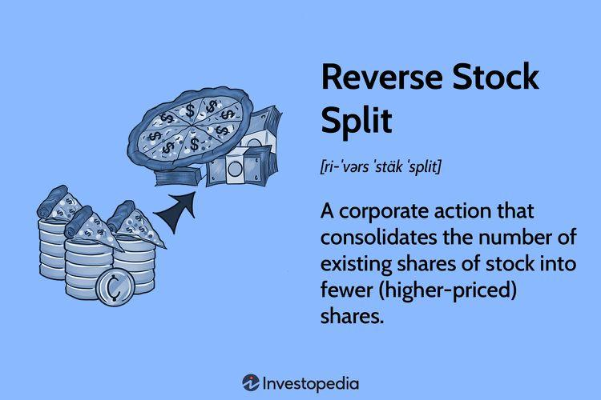

A reverse stock split is a corporate action in which a company reduces the number of its outstanding shares while proportionally increasing the share price. This process fundamentally alters the share structure without impacting the overall market capitalization of the company. For example, in a 1-for-5 reverse split, an investor holding 100 shares at $2 each would end up with 20 shares valued at $10 each. While the net value remains constant, the perception and metrics of the stock are changed significantly.

Understanding reverse splits is crucial for traders and investors, as these corporate actions can signal critical shifts in a company’s strategy or financial health. Companies often pursue reverse splits to comply with stock exchange listing requirements or to make their shares more attractive to institutional investors. For traders, these signals can indicate potential market reactions, impacting trading strategies.



In algorithmic trading, where strategies rely heavily on historical data and technical indicators, reverse stock splits present both challenges and opportunities. Algorithms that have been trained on historical data must correctly interpret these adjustments to avoid distorted backtesting results and inaccurate predictive modeling. If a reverse split is not properly accounted for, it could lead to misleading signals in trading strategies, impacting decision-making processes. By accurately adjusting for these events, traders can ensure their algorithms maintain precision and continue to derive insights from data that reflects the true value of a company's stock.

As algorithmic trading continues to evolve, the ability to adapt to corporate actions such as reverse stock splits becomes increasingly vital. Mastery of these adjustments equips traders to fine-tune their strategies, enhancing both their analytical rigor and their ability to capitalize on market movements post-split.

## Table of Contents

## Understanding Reverse Stock Splits

Reverse stock splits are corporate actions where a company reduces the number of its outstanding shares while proportionally increasing the share price. Unlike regular stock splits, which increase the number of shares and decrease the price per share, reverse splits maintain the company's overall market capitalization. In essence, the value of a shareholder's total holdings remains the same, although the number of shares in possession and the per-share price change inversely.

### Mechanics of a Reverse Stock Split

The mechanics of a reverse stock split involve consolidating a specified number of existing shares into a smaller number of shares. This is typically expressed as a ratio such as 1-for-10, where every 10 shares held by a shareholder are consolidated into 1 share. Mathematically, if $N$ represents the original number of shares and $R$ the split ratio, the new number of shares $N'$ after the reverse split can be calculated as:

$$
N' = \frac{N}{R}
$$

Concurrently, the price per share $P$ is adjusted to $P'$ to preserve the total market value:

$$
P' = P \times R
$$

Therefore, if a company has 1 million shares trading at $1 each and announces a 1-for-10 reverse split, it will have 100,000 shares trading at $10 each post-split.

### Purposes of Reverse Stock Splits

Reverse stock splits are primarily employed by companies for several strategic reasons:

1. **Maintaining Exchange Listings**: Publicly traded companies often face minimum share price requirements to stay listed on major exchanges. A reverse split can be a tactical move to elevate the share price above these minimum thresholds, thereby preventing delisting.

2. **Enhancing Share Appeal**: By increasing the share price, companies may aim to make their stock more attractive to institutional investors, who might be hesitant to invest in lower-priced stocks due to certain institutional policies or the perceived risk associated with "penny stocks."

3. **Repositioning the Company**: Reverse splits can also be psychological tools used to give the perception of higher value and financial restructuring, potentially positively influencing investor sentiment.

### Examples

Several high-profile corporations have implemented reverse stock splits to address these strategic challenges. One example is Citigroup, which executed a 1-for-10 reverse split in 2011 to help stabilize its stock price post the 2008 financial crisis. Similarly, reverse splits are frequently pursued by smaller companies to meet compliance requirements of stock exchanges like the NASDAQ or NYSE.

In summary, reverse stock splits serve as a significant mechanism for companies seeking to manage stock price levels for strategic financial objectives, thereby affecting their appeal to various investor bases. Understanding these actions is crucial for traders and investors as they navigate market dynamics.

## Impact of Reverse Splits on Algo Trading

Reverse stock splits can significantly impact the historical data used in [algorithmic trading](/wiki/algorithmic-trading), necessitating adjustments to ensure the integrity of trading strategies. A reverse stock split reduces the number of shares outstanding and increases the share price proportionately. For example, in a 1-for-10 reverse split, every ten shares are consolidated into one share, and the stock price is multiplied by ten. This change, although ostensibly value-neutral, can distort historical stock price and [volume](/wiki/volume-trading-strategy) data, which are crucial for the [backtesting](/wiki/backtesting) and execution of [quantitative trading](/wiki/quantitative-trading) strategies.

Algorithmic trading relies heavily on historical data to identify patterns, forecast future price movements, and devise strategies. Without accounting for reverse splits, data sets may inaccurately reflect past stock prices and volumes, potentially leading to erroneous signals and misleading performance metrics. This can result in poorly-performing trading algorithms as previous trading conditions may no longer align with the adjusted reality.

To maintain the accuracy of backtesting results, it is critical to adjust historical price data to account for the effects of reverse splits. This involves using adjusted closing prices, which reflect all historical price changes due to corporate actions like splits, dividends, and more. Implementing such adjustments ensures that percentage changes over any given period remain consistent and reflect true price movements.

For instance, if a particular stock underwent a reverse split, its past data should be adjusted by multiplying both historical prices and volumes by the split ratio. This can be implemented programmatically to automate the process. Consider the following Python snippet, which uses the pandas library to adjust the dataset:

```python
import pandas as pd

def adjust_for_split(df, split_ratio):
    df['Adjusted Close'] = df['Close'] * split_ratio
    df['Adjusted Volume'] = df['Volume'] / split_ratio
    return df

# Example usage
data = pd.DataFrame({
    'Date': ['2023-09-01', '2023-09-02'],
    'Close': [100, 110],
    'Volume': [1000, 1200]
})

split_ratio = 10 # For a 1-for-10 reverse split
adjusted_data = adjust_for_split(data, split_ratio)
```

If reverse splits are not reflected in an algorithm's analysis, it could falsely interpret a share price jump as a significant event or miss out on historical volumes. Misaligned strategies might improperly weigh recent data compared to historical trends, potentially leading to adverse trading decisions. Effective algorithmic strategies preemptively integrate corporate actions like reverse splits, enhancing robustness and accuracy in automated trading systems. Recognizing and adjusting for these factors is vital for developing and maintaining reliable trading models.

## Adjusting Algorithms for Corporate Actions

Adjusting algorithms to account for reverse stock splits involves a systematic approach to ensure data integrity and the accuracy of trading strategies. Reverse splits result in changes in share price and count, which, if unaccounted for, can significantly alter backtesting results and predictive models in algorithmic trading.

### Steps to Adjust Algorithms for Reverse Splits

#### 1. Data Adjustment

The first step is to adjust historical price and volume data to reflect the effects of a reverse split. This ensures continuity in historical analysis and prevents discrepancies caused by abrupt changes in data points. The common practice is to adjust the historical prices and volume prior to the date of the reverse split.

**Adjustment Formula:**

For a reverse split ratio of $N:1$, you need to adjust the stock price and volume as follows:

- **Price Adjustment:**  
$$
  \text{Adjusted Price} = \frac{\text{Original Price}}{N}

$$

- **Volume Adjustment:**  
$$
  \text{Adjusted Volume} = \text{Original Volume} \times N

$$

These adjustments ensure that the apparent jumps or drops in prices due to a split are leveled out, providing a true reflection of actual price movements over time for algorithmic models.

#### 2. Backtesting Considerations

When backtesting trading algorithms, it is crucial to include the adjusted closing prices. This practice prevents overestimations of risk and potential profits. Algorithms should be designed to incorporate these adjustments automatically.

- **Data Integrity:** Verify that all historical data has been adjusted correctly before running backtests.

- **Accuracy in Testing:** Ensure backtested results reflect realistic trading scenarios by accounting for past reverse splits consistently.

#### 3. Tools and Services for Data Adjustments

Various tools and services are available to handle data adjustments:

- **Data Providers:** Platforms like Bloomberg, Reuters, and Yahoo Finance automatically adjust historical data for corporate actions like reverse splits.

- **Algorithm Libraries:** Libraries such as Pandas in Python offer capabilities to adjust stock data. Example code snippet to adjust historical data:

  ```python
  import pandas as pd

  def adjust_for_reverse_split(df, split_ratio):
      df['Adj Close'] = df['Close'] / split_ratio
      df['Adj Volume'] = df['Volume'] * split_ratio
      return df

  # Sample DataFrame containing historical data
  historical_data = {
      'Date': ['2023-01-01', '2023-01-02'],
      'Close': [100, 102],
      'Volume': [1000, 1100]
  }

  df = pd.DataFrame(historical_data)
  adjusted_df = adjust_for_reverse_split(df, 10)  # example for 1:10 reverse split
  ```

By utilizing these resources and techniques, traders and developers can seamlessly adapt their algorithms to consider corporate actions like reverse stock splits, ensuring that their strategies remain accurate and robust.

## Developing Strategies for Trading Post-Split Stocks

Traders can profit from reverse stock splits through strategic planning by leveraging the unique market conditions often associated with these corporate actions. One key area where opportunities may be present is in trading low float stocks post-split. Reverse splits reduce the number of shares outstanding, effectively decreasing the stock's float. This lower float can lead to increased [volatility](/wiki/volatility-trading-strategies), as reduced [liquidity](/wiki/liquidity-risk-premium) might amplify price movements. Traders who strategically plan trades can capitalize on this volatility, often resulting in substantial profit opportunities.

### Identifying Opportunities in Low Float Stocks Post-Split

To identify potential trading opportunities in low float stocks following a reverse split, traders should focus on analyzing the stock's price patterns and market behavior before and after the split. A systematic approach involves examining historical price data, liquidity, and trading volumes. Stocks that have undergone reverse splits often enter a new trading range, and astute traders can benefit by carefully timing their entries and exits. 

Technical analysis tools, such as Relative Strength Index (RSI), Moving Averages (MA), and Bollinger Bands, can offer insights into overbought or oversold conditions, which are more pronounced in low float stocks due to enhanced volatility. Monitoring these indicators can help in identifying optimal buy or sell points post-split. For example, an RSI value below 30 may indicate an oversold condition, signaling a potential buying opportunity.

### Timing Trades Around Reverse Splits

Timing is crucial when trading stocks post-reverse split. The immediate days following a reverse split often exhibit heightened speculative activity, providing short-term trading opportunities. Traders should be prepared to act quickly during this period. However, the window of opportunity can vary; some stocks may experience a sharp initial reaction, while others might take several days or weeks to stabilize.

A critical consideration in timing trades involves understanding the market sentiment and how it may impact the stock's volatility. Tools like sentiment analysis can be valuable for gauging whether the mood among market participants is overly optimistic or pessimistic. This understanding can help traders predict potential price trajectories and plan their trades accordingly.

Also, it is beneficial to incorporate algorithmic strategies to identify and execute trades based on predefined criteria quickly. For instance, traders can deploy algorithms to automatically execute trades when certain technical conditions are met, thus capitalizing on the rapid movements typically observed post-split.

In sum, by conducting thorough research and analysis, traders can develop strategies that address the specific dynamics of reverse-split stocks. With strategic planning, traders can identify opportunities for profit in the volatile environment that often follows a reverse stock split.

## Risk Management in Reverse Split Scenarios

Analyzing market sentiment post-reverse split plays a crucial role in determining trading strategies. Reverse splits often result in a psychological reaction among investors, which can influence stock prices. Traders need to assess whether sentiment is bullish or bearish, as this will dictate market movements and, subsequently, trading decisions. Sentiment analysis can be performed using various indicators such as trading volume, news sentiment, and social media buzz. For instance, an increase in positive sentiment, measured by algorithms that analyze news articles, can signal potential bullish behavior, while negative sentiment may indicate further declines.

Setting stop-loss orders is essential to limit potential losses from unexpected price movements after a reverse split. A stop-loss order is a pre-set level at which shares will automatically be sold to prevent further losses. Position sizing should be adjusted accordingly, taking into account the volatility and liquidity of the post-split stock. Implementing these protective measures ensures that traders minimize downside risk while maintaining the ability to capitalize on favorable price movements.

Historical data reveals that reverse splits often result in temporary volatility and uncertainty. By studying past reverse split scenarios, traders can identify patterns and predict future outcomes. For example, empirical evidence suggests that stocks undergoing reverse splits can initially underperform the broad market. This insight allows traders to develop strategies that either mitigate risk during initial post-split fluctuations or exploit these movements for potential gains.

Combining market sentiment analysis with disciplined risk management strategies, such as thoughtful stop-loss positioning, empowers traders to navigate the complex dynamics of reverse split scenarios effectively. By learning from historical trends and applying strategic foresight, traders can better manage the inherent risks and enhance their overall trading performance.

## Conclusion

Understanding reverse stock splits in algorithmic trading is essential for any trader aiming to optimize their strategies and avoid costly mistakes. Reverse stock splits can significantly affect historical data, which is a critical component of developing and refining trading algorithms. Ignoring these corporate actions can lead to inaccurate backtesting results and flawed trading decisions. Therefore, a comprehensive approach that integrates the effects of reverse splits is crucial to maintaining the integrity of trading algorithms.

Traders must remain vigilant and informed about corporate actions, including reverse splits. As companies often undertake reverse splits to adjust their market position or meet regulatory requirements, being aware of these events can provide insights into market sentiment and potential trading opportunities. By staying informed, traders can better anticipate market movements and adjust their strategies accordingly.

Incorporating reverse split analysis into trading strategies involves more than merely adjusting for changes in share price. It requires a deep understanding of market dynamics and how reverse splits influence stock liquidity, investor perception, and volatility. Traders should use these insights to identify potential opportunities, such as price discrepancies or increased volatility, which can be advantageous in algorithmic trading.

By integrating reverse split analysis, traders can enhance their risk management practices. This involves not only setting appropriate stop-loss orders but also managing trade positions in line with changes in stock behavior post-split. Historical market reactions to reverse splits can offer valuable lessons, helping traders anticipate future outcomes and adjust their strategies proactively.

In summary, understanding and integrating the effects of reverse stock splits into algorithmic trading strategies is essential. By doing so, traders can navigate the complexities of corporate actions more effectively, ultimately leading to more informed and profitable trading outcomes. This proactive approach ensures that traders are well-equipped to handle the dynamic nature of financial markets, leveraging reverse splits as a strategic element in their trading toolkit.

## References & Further Reading

[1]: ["Reverse Stock Split Definition"](https://www.investopedia.com/terms/r/reversesplit.asp) by Adam Hayes. Investopedia.

[2]: Chan, Ernest P. ["Quantitative Trading: How to Build Your Own Algorithmic Trading Business."](https://github.com/ftvision/quant_trading_echan_book) John Wiley & Sons, 2009.

[3]: Jansen, Stefan. ["Machine Learning for Algorithmic Trading."](https://github.com/stefan-jansen/machine-learning-for-trading) Packt Publishing.

[4]: de Prado, Marcos Lopez. ["Advances in Financial Machine Learning."](https://www.amazon.com/Advances-Financial-Machine-Learning-Marcos/dp/1119482089) John Wiley & Sons, 2018.

[5]: Azzopardi, Jason. ["The Effects of Reverse Stock Splits: Evidence from the US Capital Market."](https://en.wikipedia.org/wiki/Jason_Azzopardi) Semantic Scholar.