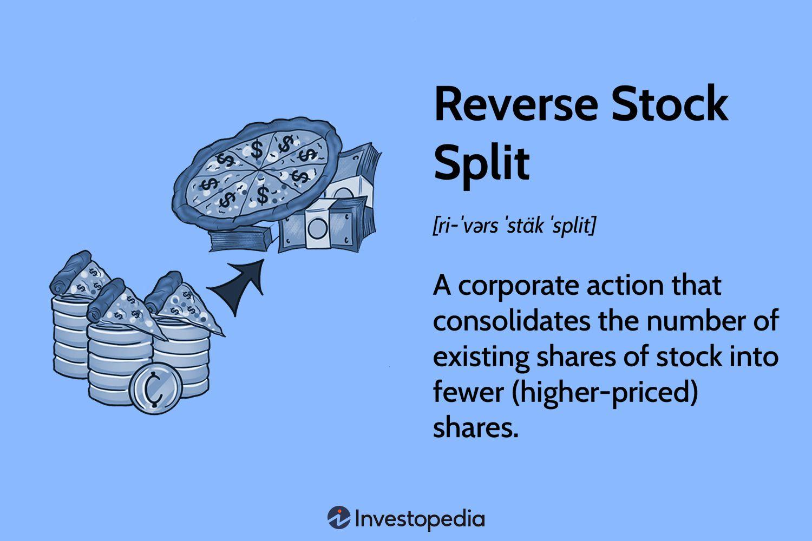

## Table of Contents

## What is a reverse stock split?

A reverse stock split is when a company decides to reduce the number of its shares that are available to the public. Instead of having many small shares, the company combines them into fewer, but larger, shares. For example, in a 1-for-10 reverse stock split, every 10 shares you own would turn into 1 share. The value of your investment stays the same because the price of each new share is higher.

Companies might do a reverse stock split for different reasons. One common reason is to make their stock price look higher. If a stock's price is very low, it might be seen as less valuable or less trustworthy. By increasing the price through a reverse split, the company hopes to attract more investors. Another reason could be to meet the minimum price requirements to stay listed on a stock exchange. If a company's stock price falls below a certain level, it might be removed from the exchange, so a reverse split can help avoid this.

## Why do companies perform reverse stock splits?

Companies do reverse stock splits to make their stock price higher. When a stock's price is very low, some people might think the company is not doing well. By doing a reverse split, the company can make the price of each share go up. This can make the stock look more valuable and attract more investors who might not want to buy stocks with very low prices.

Another reason for a reverse stock split is to stay listed on a stock exchange. Some exchanges have rules that say a company's stock must stay above a certain price. If the price falls too low, the company might get kicked off the exchange. By doing a reverse split, the company can raise the price of its shares and keep its listing, which is important for being seen by investors.

## How does a reverse stock split affect the number of shares I own?

When a company does a reverse stock split, it changes the number of shares you own. Let's say a company does a 1-for-10 reverse split. If you had 100 shares before, after the split, you would have 10 shares. The company takes your shares and combines them into fewer, bigger shares. So, the total number of shares you own goes down, but each share is worth more money.

Even though you have fewer shares after a reverse split, the value of your investment stays the same right after the split. This is because the price of each share goes up by the same amount that the number of shares goes down. If you had 100 shares at $1 each before, that's $100 total. After a 1-for-10 reverse split, you would have 10 shares at $10 each, which is still $100 total. So, your investment's worth doesn't change right away, but the way it's divided into shares does.

## What is the impact of a reverse stock split on a company's stock price?

A reverse stock split makes the price of a company's stock go up. If a company does a reverse split, it takes a bunch of small shares and turns them into fewer, bigger shares. For example, in a 1-for-10 reverse split, every 10 shares become 1 share. So, if the stock was $1 before, it would be $10 after the split. This makes the stock price look higher, which can make the company seem more valuable to some people.

The main reason companies do this is to make their stock look better. If a stock's price is very low, some investors might think the company is not doing well. By raising the price with a reverse split, the company hopes to attract more investors. Also, some stock exchanges have rules about how low a stock's price can be. If it gets too low, the company might get kicked off the exchange. A reverse split can help keep the stock price high enough to stay listed.

## Can you explain the process of a reverse stock split?

When a company decides to do a reverse stock split, it tells its shareholders about the plan. The company picks a ratio for the split, like 1-for-10. This means that for every 10 shares someone owns, they will get 1 new share after the split. The company then changes the number of shares everyone owns. If you had 100 shares before, after a 1-for-10 reverse split, you would have 10 shares. The company does this to make the price of each share go up.

After the reverse stock split happens, the price of the stock goes up right away. If the stock was $1 before and the split was 1-for-10, the new price would be $10 per share. Even though you have fewer shares, the total value of your investment stays the same right after the split. For example, if you had 100 shares at $1 each, that's $100 total. After the split, you would have 10 shares at $10 each, which is still $100. The company does this to make the stock look more valuable and to meet the rules of stock exchanges about minimum stock prices.

## What are the potential benefits of a reverse stock split for a company?

A reverse stock split can help a company look better to investors. When a company's stock price is very low, some people might think the company is not doing well. By doing a reverse split, the company can make the price of each share go up. This can make the stock seem more valuable and attract more investors who might not want to buy stocks with very low prices. A higher stock price can also make the company seem more stable and trustworthy.

Another big benefit is that a reverse stock split can help a company stay listed on a stock exchange. Some exchanges have rules that say a company's stock must stay above a certain price. If the price falls too low, the company might get kicked off the exchange. By doing a reverse split, the company can raise the price of its shares and keep its listing. This is important because being listed on an exchange helps the company be seen by more investors and can be good for its reputation.

## What are the risks or downsides of a reverse stock split?

A reverse stock split can make some investors worried. When a company does a reverse split, it might make people think the company is in trouble. If the stock price is very low, a reverse split might just be a way to make it look better for a short time. This can scare away investors who think the company is trying to hide its problems. Also, even though the stock price goes up right after the split, it doesn't always stay high. If the company doesn't fix its real problems, the stock price could go back down.

Another risk is that a reverse stock split can make it harder for some investors to buy or sell the stock. If the number of shares goes down, the stock might not be traded as often. This can make it harder to find someone to buy or sell shares with. Also, some investors might not want to own the stock anymore after a reverse split. They might sell their shares, which could make the stock price go down even more. So, a reverse split can have some big downsides that the company needs to think about.

## How does a reverse stock split affect the market capitalization of a company?

A reverse stock split does not change the market capitalization of a company right away. Market capitalization is the total value of all the shares of a company. When a company does a reverse stock split, it changes the number of shares and the price per share, but the total value stays the same. For example, if a company has 1 million shares at $1 each, the market cap is $1 million. After a 1-for-10 reverse split, the company would have 100,000 shares at $10 each, but the market cap would still be $1 million.

However, a reverse stock split can affect the market cap over time. If the stock price goes up after the split and stays high, the market cap could go up too. But if investors see the reverse split as a sign that the company is in trouble, they might sell their shares. This could make the stock price go down, and the market cap would go down as well. So, while a reverse stock split doesn't change the market cap right away, it can have an impact in the long run depending on how investors react.

## What is the difference between a reverse stock split and a forward stock split?

A reverse stock split and a forward stock split are two different ways a company can change the number of its shares. In a reverse stock split, a company takes a bunch of small shares and turns them into fewer, bigger shares. For example, in a 1-for-10 reverse split, every 10 shares become 1 share. This makes the price of each share go up. Companies do this to make their stock look more valuable or to meet the rules of stock exchanges about minimum stock prices. On the other hand, a forward stock split does the opposite. It takes one big share and splits it into more, smaller shares. For example, in a 2-for-1 forward split, one share becomes two shares. This makes the price of each share go down. Companies do this to make their stock more affordable and attract more investors.

The main difference between a reverse stock split and a forward stock split is how they change the number of shares and the price per share. A reverse stock split reduces the number of shares and increases the price per share, while a forward stock split increases the number of shares and decreases the price per share. Both types of splits aim to make the stock more appealing to investors, but they do it in different ways. A reverse split might be used to make a company's stock look more valuable or to avoid being removed from a stock exchange, while a forward split is often used to make the stock more accessible to smaller investors.

## Are there any tax implications for shareholders due to a reverse stock split?

A reverse stock split usually does not have any direct tax implications for shareholders. When a company does a reverse split, it changes the number of shares you own, but the total value of your investment stays the same right away. Because your investment's value doesn't change, you don't have to pay taxes on it. The tax rules say that you only have to pay taxes when you make money, like when you sell your shares for more than you paid for them.

However, there can be some indirect tax effects. If the stock price goes up after the reverse split and you decide to sell some of your shares, you might have to pay capital gains tax on any profit you make. Also, if the reverse split makes you think the company is not doing well and you sell your shares at a loss, you might be able to use that loss to reduce your taxes. So, while a reverse stock split itself doesn't trigger taxes, what you do with your shares after the split can affect your taxes.

## How do reverse stock splits affect stock options and other derivative securities?

When a company does a reverse stock split, it changes the number of shares and the price per share. This can also change the terms of stock options and other derivative securities that people own. For example, if you have an option to buy 100 shares at $1 each, and the company does a 1-for-10 reverse split, your option might change to buying 10 shares at $10 each. The total value of your option stays the same, but the number of shares and the price per share change to match the new stock price after the split.

The exact changes to stock options and other derivatives depend on the terms of the contracts and the rules of the company. Usually, the company will adjust the number of shares and the exercise price of the options to keep their value the same. But, it's important for people who own these securities to check the details of their contracts and talk to a financial advisor to understand how the reverse split will affect them.

## Can you provide some real-world examples of companies that have conducted reverse stock splits and discuss the outcomes?

One example of a company that did a reverse stock split is Citigroup. In 2011, Citigroup did a 1-for-10 reverse split. This meant that for every 10 shares someone owned, they got 1 new share. The stock price went up from around $4 to about $40 right after the split. Citigroup did this to make their stock look more valuable and to meet the rules of the stock exchange. After the split, the stock price stayed higher for a while, but it didn't solve all of Citigroup's problems. The company had to keep working hard to fix its business and make investors happy.

Another example is Radiant Pharmaceuticals. In 2019, they did a 1-for-100 reverse split. This made their stock price go up from a few cents to a few dollars. Radiant did this because their stock price was very low, and they wanted to stay listed on the stock exchange. After the split, the stock price went up, but it didn't stay high for long. The company still had a lot of problems, and the stock price went back down. This shows that a reverse split can help for a short time, but it doesn't fix the real issues a company might have.

These examples show that reverse stock splits can make a stock's price go up right away, but they don't always help in the long run. Companies need to do more than just a reverse split to make their stock valuable and keep investors happy. If a company doesn't fix its real problems, the stock price might go back down, even after a reverse split.

## References & Further Reading

[1]: ["Stock Splits Explained"](https://www.investopedia.com/terms/s/stocksplit.asp) by Adam Hayes on Investopedia

[2]: ["Reverse Stock Splits: Good or Bad for Shareholders?"](https://www.cabotwealth.com/daily/stock-market/reverse-stock-splits-shareholders) by Matt Krantz on Investopedia

[3]: ["Algorithmic Trading & DMA: An Introduction to Direct Access Trading Strategies"](https://www.amazon.com/Algorithmic-Trading-DMA-introduction-strategies/dp/0956399207) by Barry Johnson

[4]: ["Algorithmic Trading: Winning Strategies and Their Rationale"](https://www.wiley.com/en-us/Algorithmic+Trading%3A+Winning+Strategies+and+Their+Rationale-p-9781118460146) by Ernie Chan

[5]: ["Principles of Financial Engineering"](https://shop.elsevier.com/books/principles-of-financial-engineering/kosowski/978-0-12-386968-5) by Salih N. Neftci