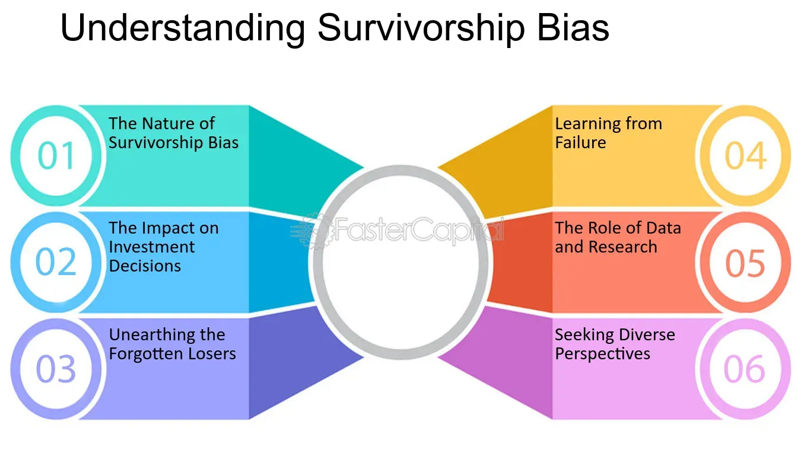

## Table of Contents

## What is survivorship bias?

Survivorship bias is when we only pay attention to the people or things that made it through a tough situation, and ignore those that didn't. It's like only looking at the winners and forgetting about the losers. This can make us think that something is more successful or common than it really is, because we're not seeing the whole picture.

For example, imagine you hear stories about people who started successful businesses from their garages. It might seem easy and common. But you don't hear about all the people who tried and failed. If you only focus on the successful ones, you might think starting a business is easier than it really is. That's survivorship bias - it can trick us into making bad decisions because we're not seeing the full story.

## How does reverse survivorship bias differ from survivorship bias?

Reverse survivorship bias is kind of the opposite of survivorship bias. Instead of focusing only on the winners, reverse survivorship bias happens when we pay too much attention to the losers or the ones who didn't make it. For example, if you only hear stories about businesses that failed, you might think that starting a business is impossible and too risky, even though many businesses do succeed.

Both biases can lead us to make wrong decisions because we're not seeing the whole picture. Survivorship bias makes us think things are easier or more common than they really are, while reverse survivorship bias makes us think things are harder or less common. It's important to look at all the information, not just the successes or the failures, to get a true understanding of any situation.

## Can you provide a simple example of reverse survivorship bias?

Imagine you're thinking about becoming a professional athlete. You hear a lot of stories about athletes who tried hard but never made it to the big leagues. These stories make it seem like becoming a professional athlete is nearly impossible and not worth trying.

But, if you only focus on these stories, you're missing the ones about athletes who did make it. There are many athletes who succeeded and had great careers. By only looking at the failures, you might decide not to pursue your dream, even though there's a chance you could be one of the successful ones. That's reverse survivorship bias - it makes you think something is harder than it really is because you're only seeing the failures.

## What are the common contexts where reverse survivorship bias is observed?

Reverse survivorship bias often shows up when people talk about careers and jobs. For example, if you hear a lot of stories about people who tried to become actors but never got famous, you might think that becoming an actor is impossible. These stories can make you feel like it's not worth trying because everyone seems to fail. But, you're not hearing about all the actors who did make it and have successful careers. This can make you miss out on a career you might have been good at.

Another place where reverse survivorship bias is common is in investing. If you only hear about people who lost money in the stock market, you might think that investing is too risky and always leads to failure. But, there are also many people who make money from investing. By only focusing on the failures, you might decide not to invest at all, even though there's a chance you could be successful. It's important to look at both the successes and failures to get a true picture of any situation.

## How can reverse survivorship bias affect decision-making in business?

Reverse survivorship bias can make business decisions tricky. Imagine you're thinking about starting a new product line. If you only hear stories about other companies that tried something new and failed, you might decide not to go ahead with your idea. You might think that launching new products always leads to failure. But, you're not hearing about all the companies that tried new things and succeeded. This can make you miss out on a great opportunity because you're only focusing on the failures.

This bias can also affect how you see your competition. If you only look at businesses that went bankrupt, you might think that the market is too tough and that it's impossible to succeed. But, there are also many businesses that are doing well. By only focusing on the ones that failed, you might decide to play it safe and not take any risks. This can stop your business from growing and trying new things. It's important to look at the whole picture, not just the failures, to make the best decisions for your business.

## What are the implications of reverse survivorship bias in financial markets?

Reverse survivorship bias can make people think that investing in the stock market is too risky and always leads to losing money. If you only hear stories about people who lost a lot of money, you might decide not to invest at all. But, there are also many people who make money from investing. By only focusing on the failures, you might miss out on a chance to grow your money. It's important to look at both the successes and failures to get a true picture of what investing can be like.

This bias can also affect how people see certain types of investments. For example, if you only hear about people who lost money in tech stocks, you might think that tech stocks are always a bad idea. But, there are also many people who made a lot of money from tech stocks. By only focusing on the failures, you might miss out on good investment opportunities. It's important to look at all the information, not just the failures, to make smart investment choices.

## How can one identify reverse survivorship bias in data analysis?

To spot reverse survivorship bias in data analysis, you need to look closely at what data you are using. If you only see information about things that failed or didn't work out, you might be missing the whole story. For example, if you're looking at data about businesses and only see the ones that went bankrupt, you might think that starting a business is always a bad idea. But, if you don't also look at the businesses that succeeded, you're only seeing part of the picture. This can lead you to make wrong decisions because you think something is harder or less common than it really is.

To avoid reverse survivorship bias, make sure to include data about both successes and failures. If you're studying investment returns, don't just look at the people who lost money. Also look at the ones who made money. By including all the data, you get a better understanding of what's really going on. This helps you make better decisions because you're seeing the whole picture, not just the failures.

## What statistical methods can be used to mitigate the effects of reverse survivorship bias?

To help fix reverse survivorship bias, you can use a method called stratified sampling. This means you divide your data into different groups, like successful and unsuccessful businesses, and then make sure you include a fair number of examples from each group in your analysis. By doing this, you get a more balanced view of what's happening, instead of just focusing on the failures. This helps you see the whole picture and make better decisions.

Another way to deal with reverse survivorship bias is by using survival analysis. This method looks at how long things last before they fail or succeed. By studying both the things that made it and the ones that didn't, you can understand the full story. Survival analysis helps you see patterns over time and can show you that success and failure are not as one-sided as they might seem if you only look at the failures. This gives you a clearer picture and helps you avoid making decisions based on incomplete data.

## Can you discuss a case study where reverse survivorship bias significantly impacted results?

In the world of investing, reverse survivorship bias can make a big difference. A famous case happened in the early 2000s with the dot-com bubble. Many people heard stories about investors who lost a lot of money when the bubble burst. These stories made it seem like investing in tech stocks was always a bad idea. But, what people didn't hear as much about were the investors who made a lot of money from tech stocks before the bubble burst. If you only focused on the failures, you might think that tech stocks were never a good investment, even though many people did well.

This bias affected how people thought about tech stocks for years. Some people decided not to invest in tech at all because they only heard about the failures. But, they missed out on the chance to invest in companies like Amazon and Google, which did very well after the dot-com bubble. If people had looked at both the successes and failures, they would have had a better understanding of the risks and rewards of investing in tech stocks. This shows how important it is to consider all the information, not just the failures, when making decisions.

## How does reverse survivorship bias relate to selection bias and sampling bias?

Reverse survivorship bias is a kind of selection bias and sampling bias. Selection bias happens when you choose who or what to include in your study in a way that's not fair or random. Sampling bias is when the group you study isn't a good example of the whole group you want to learn about. Reverse survivorship bias is a type of these biases because it happens when you only look at the things that didn't work out and ignore the things that did. This makes your sample not a good example of the whole group because you're leaving out the successes.

For example, if you're studying businesses and only look at the ones that failed, you're not getting a full picture. You're selecting only the failures and sampling only from that group, which isn't fair to the businesses that succeeded. This can make you think that starting a business is harder than it really is. By understanding how reverse survivorship bias is a part of selection and sampling bias, you can see why it's important to include both successes and failures in your studies to get a true understanding of any situation.

## What are the ethical considerations when dealing with reverse survivorship bias in research?

When doing research, it's important to think about the ethical side of reverse survivorship bias. If you only look at the failures and ignore the successes, you're not being fair. This can make your research misleading and might hurt the people who read it. They might make bad decisions because they think something is harder or less common than it really is. As a researcher, you have a responsibility to give a true picture of what's happening. By including both the good and bad stories, you help people make better choices based on all the facts.

Another ethical issue is that reverse survivorship bias can make some groups feel left out or ignored. If you only focus on the failures, you're not telling the whole story of the people who succeeded. This can make those who did well feel like their experiences don't matter. It's important to treat everyone's story with respect and include all voices in your research. By doing this, you show that you value fairness and honesty, which are key parts of ethical research.

## How can advanced machine learning techniques be applied to address reverse survivorship bias?

Advanced [machine learning](/wiki/machine-learning) techniques can help fix reverse survivorship bias by using a method called "[data augmentation](/wiki/data-augmentation)." This means adding more data to your study to make it more balanced. For example, if you're studying businesses and only have data on the ones that failed, you can use machine learning to guess what the missing data on successful businesses might look like. By doing this, you get a fuller picture of what's going on and can make better decisions. Machine learning can also help by using "synthetic data" to fill in the gaps, making sure you're not just looking at the failures but also considering what the successes might have been.

Another way machine learning can help is by using "ensemble methods." These methods combine different models to get a better overall view. For instance, you might have one model that looks at businesses that failed and another that looks at businesses that succeeded. By putting these models together, you can see the whole story, not just one side. This helps you understand that success and failure are both important parts of any situation. By using these advanced techniques, you can make sure your research is fair and gives a true picture of what's happening, helping you avoid the problems caused by reverse survivorship bias.

## References & Further Reading

[1]: Fung, W., & Hsieh, D. (2000). ["Performance characteristics of hedge funds and commodity funds: natural vs. spurious biases."](https://scholars.duke.edu/publication/777396) Journal of Financial and Quantitative Analysis.

[2]: ["Advances in Financial Machine Learning"](https://www.amazon.com/Advances-Financial-Machine-Learning-Marcos/dp/1119482089) by Marcos Lopez de Prado.

[3]: Chen, H., & Knez, P. J. (1995). ["Measurement of market integration and arbitrage."](https://www.jstor.org/stable/2962274) Review of Financial Studies, 8(2), 287-325.

[4]: "Evidence-Based Technical Analysis: Applying the Scientific Method and Statistical Inference to Trading Signals" by David Aronson.

[5]: "Quantitative Trading: How to Build Your Own Algorithmic Trading Business" by Ernest P. Chan.

[6]: "Machine Learning for Algorithmic Trading" by Stefan Jansen.