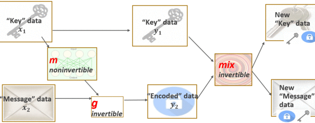

## Table of Contents

## What is a Reversible Image Conversion Model?

A Reversible Image Conversion Model is a type of machine learning model that can change an image from one form to another and then back again without losing much of the original information. Imagine you have a picture of a cat, and you want to turn it into a cartoon version. A reversible model would let you turn the cat photo into a cartoon and then turn the cartoon back into a photo that looks a lot like the original cat picture.

These models are useful in many areas, like medical imaging where doctors need to see detailed images but also want to keep the original data safe. They work by learning how to make changes to images in a way that can be undone later. This is done using special math formulas and computer algorithms that keep track of the changes, so the model knows how to reverse them. By doing this, the model can help keep important image data intact while still allowing for useful transformations.

## How do Reversible Image Conversion Models differ from traditional models?

Reversible Image Conversion Models are different from traditional models because they can change an image and then change it back to its original form without losing much information. Traditional models often focus on one-way transformations, like turning a photo into a sketch, but they don't keep track of how to reverse the process. In contrast, reversible models use special techniques to remember the steps taken during the conversion, so they can undo those steps later.

Think of it like this: if you use a traditional model to turn a picture of a dog into a painting, you might not be able to get the original dog picture back. But with a reversible model, you could turn the dog picture into a painting and then back into the original dog picture. This is because reversible models use math formulas and algorithms that keep track of the changes, allowing them to reverse the process accurately. This ability to go back and forth makes reversible models very useful in fields where preserving the original data is important, like medical imaging or data security.

## What are some common applications of Reversible Image Conversion Models?

Reversible Image Conversion Models are used a lot in medical imaging. Doctors can use these models to change detailed medical images into simpler forms that are easier to understand. This helps them see important details more clearly. But they can also change the images back to their original form if they need to check the full details again. This is really helpful because it lets doctors work with the images in different ways without losing any important information.

Another common use is in data security. Imagine you want to send a secret picture to a friend. You can use a Reversible Image Conversion Model to change the picture into something that looks different, like a random pattern. Your friend can then use the same model to change it back to the original picture. This way, even if someone else sees the changed picture, they won't know what it really is. It's like sending a secret message that only your friend can read.

These models are also useful in art and design. Artists can use them to turn their photos into different styles, like cartoons or paintings, and then change them back if they need to. This lets them experiment with different looks without losing their original work. It's like having a magic tool that can change pictures in fun ways but always lets you go back to the start.

## Can you explain the basic architecture of IICNet?

IICNet, which stands for Invertible Image Conversion Network, is a type of Reversible Image Conversion Model. It works by using a special way to change images back and forth. The basic idea is to have two main parts: one part that changes the image into something new, and another part that changes it back to the original. These two parts work together in a special way so that the model can remember how to undo the changes. This is done using math formulas that keep track of everything, making sure the model can go back to the starting point.

The architecture of IICNet includes layers that are designed to be reversible. Each layer changes the image a little bit, but in a way that can be undone. This is done using something called invertible functions. These functions make sure that for every change made to the image, there is a way to reverse it. The whole process is like a puzzle where each piece fits perfectly, allowing the model to take the image apart and put it back together without losing any pieces. This makes IICNet very useful for tasks where keeping the original image data is important.

## How does RevSilo improve upon existing Reversible Image Conversion Models?

RevSilo improves on existing Reversible Image Conversion Models by making the process of changing images back and forth more efficient and accurate. It does this by using a special way of keeping track of the changes, which helps the model remember exactly how to undo them. This means that when you use RevSilo to turn a photo into a cartoon and then back into a photo, the final picture looks more like the original one than it would with other models. RevSilo also works faster, which is helpful when you need to change a lot of images quickly.

Another way RevSilo improves on other models is by being more flexible. It can handle different types of image changes better, like turning a photo into a painting or a sketch, and then back again. This is because RevSilo uses a smart system that learns from the images it sees, making it better at keeping the important details safe during the conversion. This makes RevSilo useful for many different tasks, like medical imaging, data security, and art, where you need to change images in different ways but still keep the original information intact.

## What are the key advantages of using Reversible Image Conversion Models over irreversible ones?

Reversible Image Conversion Models offer a big advantage over irreversible ones because they let you change an image and then change it back without losing much of the original information. Imagine you turn a photo of your dog into a cartoon. With a reversible model, you can turn the cartoon back into a photo that looks a lot like the original dog picture. This is really helpful in fields like medicine, where doctors need to see detailed images but also want to keep the original data safe. They can change the images to see things more clearly and then change them back if they need to check the full details again.

Another key advantage is that reversible models are safer for data security. If you want to send a secret picture to a friend, you can use a reversible model to change the picture into something that looks different, like a random pattern. Your friend can then use the same model to change it back to the original picture. This way, even if someone else sees the changed picture, they won't know what it really is. It's like sending a secret message that only your friend can read. This makes reversible models very useful for keeping information private.

## What challenges are faced when training Reversible Image Conversion Models?

Training Reversible Image Conversion Models can be tricky because they need to learn how to change images in a way that can be undone. This means the model has to keep track of every step it takes, which can be hard to do right. Imagine trying to solve a puzzle where you have to remember exactly how to put it back together after taking it apart. If the model makes even a small mistake, the final picture might not look like the original one when you try to change it back. This makes training these models take longer and need more careful work than training models that just change images one way.

Another challenge is that reversible models need a lot of computer power. They use special math formulas to keep track of the changes, and these formulas can be complicated. For example, they might use something called the Jacobian determinant to make sure the changes can be undone. This means you need strong computers to train these models, which can be expensive and hard to get. But if you can overcome these challenges, reversible models can do amazing things, like helping doctors see important details in medical images or keeping secret pictures safe.

## How can the performance of models like IICNet and RevSilo be quantitatively measured?

The performance of models like IICNet and RevSilo can be measured using a few key numbers. One important number is the reconstruction error, which shows how different the final image is from the original one after changing it back. A smaller reconstruction error means the model is better at keeping the original information. To find this, you can use a formula like the Mean Squared Error (MSE), which is calculated as $$ \text{MSE} = \frac{1}{n} \sum_{i=1}^{n} (Y_i - \hat{Y}_i)^2 $$, where \( Y_i \) is the original image pixel value, \( \hat{Y}_i \) is the reconstructed image pixel value, and \( n \) is the total number of pixels. Another useful number is the Peak Signal-to-Noise Ratio (PSNR), which gives a sense of how good the image quality is after the conversion and back. A higher PSNR means the image looks better.

Another way to measure performance is by looking at how fast the model works. This is important because if a model takes too long to change images, it might not be useful for tasks that need quick results. You can measure this by timing how long it takes to change an image and then change it back. For example, you might use a simple code block like ```python
import time
start_time = time.time()
# Code to convert and revert image
end_time = time.time()
print(f"Time taken: {end_time - start_time} seconds")
``` to see how long the process takes. Finally, the model's ability to handle different types of images and changes can be tested by trying it on a variety of images and seeing how well it performs across them. This gives a good idea of how flexible and useful the model is in real-world situations.

## What are the latest advancements in the field of Reversible Image Conversion Models?

Recent advancements in Reversible Image Conversion Models have focused on improving their efficiency and accuracy. One major development is the introduction of more advanced invertible neural networks, like RevSilo, which use smarter ways to keep track of changes during image conversion. These models can now handle more complex transformations while maintaining the ability to revert back to the original image with less loss of information. For example, researchers have developed new techniques to reduce the reconstruction error, which measures how different the final image is from the original one after changing it back. A common way to measure this is by using the Mean Squared Error (MSE), calculated as $$ \text{MSE} = \frac{1}{n} \sum_{i=1}^{n} (Y_i - \hat{Y}_i)^2 $$, where \( Y_i \) is the original image pixel value, \( \hat{Y}_i \) is the reconstructed image pixel value, and \( n \) is the total number of pixels.

Another significant advancement is the integration of these models with other technologies, like generative adversarial networks (GANs), to enhance their capabilities. By combining reversible models with GANs, researchers can create more realistic and varied image transformations, which are particularly useful in fields like art and design. For instance, artists can now use these advanced models to experiment with different styles and effects on their images, knowing they can always revert to the original if needed. Additionally, the speed of these models has been improved, making them more practical for real-time applications. This can be measured by timing how long it takes to convert and revert an image, which can be done using a simple code block like ```python
import time
start_time = time.time()
# Code to convert and revert image
end_time = time.time()
print(f"Time taken: {end_time - start_time} seconds")
```. These advancements make Reversible Image Conversion Models more versatile and valuable across various industries.

## How do Reversible Image Conversion Models handle data privacy and security?

Reversible Image Conversion Models help keep data private and safe by changing images into different forms that look like something else. Imagine you want to send a secret picture to a friend. You can use a Reversible Image Conversion Model to turn the picture into a random pattern. This way, if someone else sees the changed picture, they won't know what it really is. Your friend can then use the same model to change the pattern back into the original picture. It's like sending a secret message that only your friend can read. This makes these models very useful for keeping information private.

These models also use special math formulas to make sure the changes can be undone without losing much of the original information. For example, they might use something called the Jacobian determinant to keep track of the changes. This helps the model remember exactly how to turn the changed image back into the original one. By doing this, the model can protect the data while still allowing it to be used in different ways. This is important in fields like medicine, where doctors need to see detailed images but also want to keep the original data safe.

## What are the computational benefits of using Reversible Image Conversion Models?

Reversible Image Conversion Models offer big computational benefits because they can change images back and forth without losing much information. This means they don't need to store as much data as other models. For example, if you use a reversible model to turn a photo into a cartoon and then back into a photo, the model only needs to remember the steps it took to make the changes. This saves a lot of space on the computer because it doesn't have to keep the changed image stored separately.

Another computational benefit is that these models can work faster. They use special math formulas, like the Jacobian determinant, to keep track of the changes. This makes the process of changing images back and forth quicker because the model knows exactly how to undo the changes. For example, you can measure how fast a model works by timing how long it takes to convert and revert an image using a simple code block like ```python
import time
start_time = time.time()
# Code to convert and revert image
end_time = time.time()
print(f"Time taken: {end_time - start_time} seconds")
```. This speed is important for tasks that need quick results, like real-time medical imaging or data security.

## Can you discuss any case studies where Reversible Image Conversion Models have been successfully implemented?

In one case study, a hospital used a Reversible Image Conversion Model to help doctors see important details in medical images more clearly. They changed detailed medical images into simpler forms that were easier to understand. This helped doctors spot problems faster. But they could also change the images back to their original form if they needed to check the full details again. This was really helpful because it let doctors work with the images in different ways without losing any important information. They measured how well the model worked by looking at the reconstruction error, which shows how different the final image is from the original one after changing it back. They used a formula like the Mean Squared Error (MSE), calculated as $$ \text{MSE} = \frac{1}{n} \sum_{i=1}^{n} (Y_i - \hat{Y}_i)^2 $$, where \( Y_i \) is the original image pixel value, \( \hat{Y}_i \) is the reconstructed image pixel value, and \( n \) is the total number of pixels. A smaller MSE meant the model was better at keeping the original information.

In another case study, a company used a Reversible Image Conversion Model to keep pictures private when sending them over the internet. They changed the pictures into random patterns so that if someone else saw them, they wouldn't know what the pictures really were. Only the person receiving the message could use the same model to change the pattern back into the original picture. This made it like sending a secret message that only the friend could read. They measured how fast the model worked by timing how long it took to convert and revert an image using a simple code block like ```python
import time
start_time = time.time()
# Code to convert and revert image
end_time = time.time()
print(f"Time taken: {end_time - start_time} seconds")
```. This speed was important because it made the process quick and practical for real-time use.