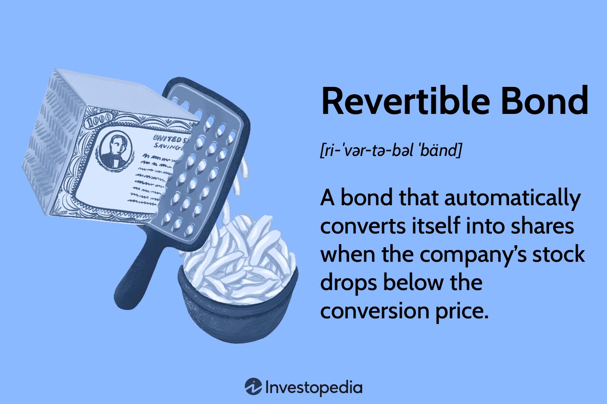

In the rapidly evolving financial markets, various financial instruments are essential for optimizing investment strategies and enhancing trade effectiveness. Among these, bonds stand out as versatile financial tools that serve both investors and issuers in managing capital efficiently. Bonds, by design, are debt securities through which issuers, such as corporations and governments, can raise funds to finance various initiatives. Investors, in return, receive periodic interest payments and the return of principal at maturity.

Within the diverse bond market landscape, certain specialized instruments, such as revertible bonds, have gained attention due to their unique characteristics and potential for high returns. These bonds offer higher interest payments but come bundled with specific conditions that could convert them into equity, depending on certain market triggers. As such, revertible bonds are often employed by high-risk companies seeking to attract investors willing to assume additional risk in exchange for potentially greater rewards.

With the advent of technology in financial markets, the domain of algorithmic trading has transformed how bonds, including specialized types like revertible bonds, are traded. Algorithmic trading employs complex algorithms to execute trades at speeds and efficiencies unachievable by human traders. Such technology has enhanced market liquidity, offering new possibilities and posing new challenges for participants.

This article investigates how these financial tools — bonds, particularly revertible bonds, and algorithmic trading — intertwine to shape market behaviors and outcomes. By understanding the dynamics of these instruments, investors and issuers alike can better navigate the complexities of modern financial markets and leverage opportunities to achieve optimal returns.

## Table of Contents

## Understanding Financial Instruments in Bond Markets

The bond market is a foundational component of the global financial system, enabling governments, corporations, and other entities to raise necessary capital. Bonds are debt instruments that function as loans made by investors to bonds' issuers. These instruments are vital for portfolio diversification and risk management. Several types of bonds exist, each with distinct characteristics and roles in portfolio diversification.

Corporations frequently issue corporate bonds to secure funds for expansion, operations, or other strategic initiatives. These bonds typically offer higher yields than government bonds, reflecting the issuer’s credit risk. Investors in corporate bonds assume this risk in exchange for the potential for greater returns. The financial health and credit rating of the issuing corporation play significant roles in determining the bond’s yield and risk profile.

Government bonds are another essential category, often hailed for their reliability and stability. These bonds are issued by national governments and are used to fund public services, infrastructural projects, and other governmental functions. Given the backing by a sovereign entity, government bonds are generally considered low-risk investments. Interest rates on government bonds are influenced by monetary policy and economic conditions and tend to offer lower returns relative to corporate bonds.

Convertible bonds bridge the worlds of debt and equity markets. They are unique financial instruments that give holders the option to convert their bonds into a predetermined number of shares of the issuing company's stock. This conversion feature offers investors the potential to participate in the company's equity appreciation. Convertible bonds typically entice with lower interest rates due to the added potential for capital gains through stock conversion. However, this conversion option introduces complexity, requiring investors to assess both equity market conditions and the issuing company’s performance.

Understanding the mechanics and strategic uses of each bond type is critical for investors seeking to optimize portfolio diversification. By leveraging different types of bonds, investors can tailor their portfolios to achieve desired returns while managing risk exposure effectively.

## What Are Revertible Bonds?

Revertible bonds, commonly referred to as reverse convertible bonds, are unique financial instruments that provide a hybrid investment opportunity combining features of both bonds and equity. These instruments are mainly utilized by investors seeking high-yield returns, although they come with significant risks due to their dependency on underlying stock performance.

Structurally, a revertible bond is issued with a fixed nominal [interest rate](/wiki/interest-rate-trading-strategies), often significantly higher than traditional bonds, to compensate for the embedded risk. The bondholder receives periodic interest payments until maturity; however, the principal repayment is contingent on the performance of a pre-specified stock or basket of stocks. If the underlying stock price stays above a predetermined strike price, the bondholder receives back the principal in cash. Conversely, if the stock price falls below this strike price, the bond converts into a predetermined number of shares of the underlying stock, potentially resulting in a loss if the stock's market value is less than the initial principal.

The high-interest rates offered by revertible bonds make them appealing to income-focused investors. These bonds are typically issued by entities perceived as high-risk, which further underscores the potential for substantial returns. However, this also correlates with increased risk exposure, as market conditions can trigger conversion into equity, exposing investors to the inherent [volatility](/wiki/volatility-trading-strategies) of stock markets.

Risks associated with revertible bonds primarily revolve around the potential conversion into equity at unfavorable prices. Market fluctuations can lead to scenarios where the bondholder receives stock worth less than the bond's face value, potentially eroding the initial investment principal. Therefore, while revertible bonds can enhance portfolio returns through elevated interest payments, they necessitate a comprehensive risk assessment framework, accounting for the volatility and potential loss scenarios inherent to equity markets. Consequently, they are suited for investors with a higher risk tolerance who are comfortable with market fluctuations and the possibility of equity conversion. 

In summary, revertible bonds serve as a high-risk, high-return component of modern financial markets, offering benefits that must be carefully weighed against their potential drawbacks. Their structure provides an attractive option for those willing to accept the accompanying risks in pursuit of higher yields.

## The Role of Algorithmic Trading

Algorithmic trading has transformed the trading landscape, particularly in the bond markets where efficiency and precision are paramount. This innovative trading method relies on algorithms to execute trades based on predetermined criteria, significantly enhancing the speed and accuracy of transactions. These algorithms leverage complex mathematical models and powerful computing capabilities to identify profitable trading opportunities, analyze vast data sets, and manage risk effectively. 

In bond markets, including those for convertible and revertible bonds, [algorithmic trading](/wiki/algorithmic-trading) plays a vital role by improving the [liquidity](/wiki/liquidity-risk-premium) and pricing accuracy of these financial instruments. By executing trades faster than humanly possible, algorithms mitigate the latency between the decision-making process and the actual trade execution, thus reducing the impact of market volatility on bond prices. Furthermore, these systems can simultaneously monitor multiple markets, allowing for [arbitrage](/wiki/arbitrage) opportunities that help align prices across trading venues, which is crucial for revertible bonds whose values are linked to the equity of high-risk companies.

Algorithmic trading also enhances liquidity in bond markets. Liquidity is a measure of how easily an asset can be bought or sold without affecting its price. High liquidity is desirable as it indicates a robust market where the prices reflect fair value. When algorithmic trading systems enter the market, they introduce a high [volume](/wiki/volume-trading-strategy) of trades, increasing the frequency at which bonds change hands. This frequent trading activity not only stabilizes prices but also draws in more participants, thereby fostering a healthier market where bonds, including revertible ones, are more easily traded.

An important consideration is the impact of algorithmic trading on price discovery. Price discovery is the process through which markets determine the fair price of an asset. The speed and data processing capabilities of trading algorithms contribute to more efficient price discovery by quickly assimilating new information into bond prices. This rapid adjustment is particularly beneficial for revertible bonds, whose values can fluctuate based on complex conditions such as the underlying stock performance. By promptly reflecting such changes in their trading algorithms, market participants can ensure more accurate pricing of these bonds.

However, while algorithmic trading provides numerous benefits, it also introduces risks such as flash crashes and market manipulation. Investors must exercise caution and complement algorithmic strategies with robust risk management techniques to mitigate these potential pitfalls. Ultimately, the integration of algorithmic trading in bond markets exemplifies a significant shift towards more technologically driven finance, offering a glimpse into the future where trading becomes even more reliant on sophisticated algorithms and data analytics.

## Pros and Cons of Revertible Bonds

Revertible bonds, also known as reverse convertible bonds, present an intriguing investment opportunity due to their distinctive features, offering both potential benefits and downsides for investors. The primary allure of these financial instruments is their high yields, which can be significantly greater than those provided by traditional bonds. This high yield is an attractive feature for income-seeking investors, particularly in low-interest-rate environments. Moreover, revertible bonds offer the potential for stock gains. If the underlying conditions for conversion are not met, investors continue to receive the interest payments, and upon maturity, they receive the principal amount back. Therefore, when the issuing company's stock performs well enough to avoid conversion, investors gain the advantage of receiving high-interest rates without the downside risk of equity ownership.

Despite these appealing aspects, revertible bonds are not without significant risks. The most notable risk is the potential loss of principal in scenarios where conversion into the underlying company's stock is triggered. This typically occurs if the stock price falls below a predetermined threshold, at which point investors receive shares that might be worth less than the initial investment. This conversion risk inherently makes revertible bonds more volatile, linking their value closely to the performance of the issuing company's stock.

Additionally, revertible bonds are often issued by companies with higher risk profiles, which might impact their creditworthiness and increase the likelihood of facing financial difficulties. The nature of these bonds means that investors must be observant of stock price movements and consider the issuing company's market conditions, which introduces a layer of complexity and attention compared to more traditional fixed-income investments.

In summary, while revertible bonds can provide significant income through high yields and offer an avenue for capital gains if stocks perform favorably, they expose investors to potential volatility and the risk of conversion, leading to possible principal losses. Thus, these instruments are best suited for investors with a higher risk tolerance and those who maintain a keen eye on market dynamics and the specific prospects of the issuing firm.

## Algorithmic Trading: A Double-Edged Sword

Algorithmic trading, a cornerstone of modern financial markets, significantly enhances market efficiency through the rapid and automated execution of trades. It relies on complex algorithms to analyze a multitude of market data points, executing trades when pre-determined criteria are met. This speed and automation eliminate the delay inherent in human-mediated trading, thus providing traders with the ability to capitalize on fleeting market conditions.

However, with these advantages come intricacies that necessitate advanced trading strategies. The sheer volume of transactions and the speed at which they occur can precipitate unforeseen market dynamics. For instance, during periods of high volatility, algorithmic trading can exacerbate price swings, leading to rapid fluctuations that may not align with the underlying asset values. This is partially due to the feedback effects where trades themselves alter market conditions, triggering further algorithmic responses that amplify movements.

Investors engaged in algorithmic trading must therefore carefully balance the technological advantages with the inherent risks. High-speed execution can lead to significant gains, but the associated risks need a robust management approach. A key consideration is the development of sophisticated algorithms capable of adapting to rapidly changing market conditions without triggering adverse feedback loops. This may involve stress testing algorithms against historical market data and incorporating [machine learning](/wiki/machine-learning) techniques to predict and adapt to potential market trends.

Moreover, the operational risks associated with algorithmic trading cannot be overlooked. Technical failures, whether due to software bugs or hardware malfunctions, can result in substantial financial losses. Therefore, investors must invest in fail-safe mechanisms and ensure that risk management protocols are rigorously followed. Additionally, regulatory oversight increasingly requires documentation and transparency in algorithmic strategies, compelling firms to maintain accurate records and be prepared for compliance audits.

In summary, while algorithmic trading offers significant efficiencies and potential financial benefits, it introduces complexities that demand sophisticated strategies and robust risk management. The equilibrium between leveraging algorithm-driven benefits and mitigating inherent risks forms the crux of successful participation in today's rapidly evolving financial markets.

## Future Implications and Market Trends

The ongoing evolution in financial technologies is significantly impacting the bond markets, introducing innovations that redefine trading dynamics. A key trend is the integration of [artificial intelligence](/wiki/ai-artificial-intelligence) (AI) in trading processes. AI technologies enhance predictive analytics, allowing traders and investors to make data-driven decisions with improved accuracy. By processing vast datasets efficiently, AI can identify patterns and predict market movements, potentially increasing the effectiveness of trading strategies.

In addition to AI, the increasing popularity of hybrid financial instruments is transforming traditional investment paradigms. Hybrid instruments, which combine features of both debt and equity, provide flexible investment options and can appeal to a wider range of investors. These instruments, including convertible and reverse convertible bonds, offer issuers a means to manage capital more dynamically, balancing risk and return to suit strategic objectives.

The interplay between AI and hybrid instruments suggests a future where bond markets are more adaptive and nuanced. For instance, AI algorithms can be designed to assess the optimal timing and conditions for converting bonds, maximizing investor benefits while mitigating risks. Furthermore, blockchain technology offers potential improvements in transparency and security, providing a robust infrastructure for trading and settlement processes.

As financial technologies evolve, regulatory frameworks may also adapt to manage emerging risks and ensure market stability. This evolving landscape necessitates continuous learning and innovation, positioning market participants to capitalize on new opportunities while navigating challenges. The fusion of AI, hybrid instruments, and blockchain technology heralds a new era for bond markets, fostering a more efficient, transparent, and flexible trading environment.

## Conclusion

Revertible bonds and algorithmic trading exemplify the dynamic nature of today's financial markets. These instruments, characterized by their unique features and potential for high returns, present strategic opportunities for both investors and issuers. Revertible bonds offer high-interest rates, but they come with the possibility of converting into equities if certain conditions are met, thereby bearing higher risks. On the other hand, algorithmic trading has transformed the way these and other bonds are traded, enhancing speed and efficiency through automated processes based on pre-defined criteria.

For investors, the key to optimizing returns lies in thoroughly understanding these instruments and the conditions under which they operate. Knowledge of how revertible bonds might affect portfolio composition and risk management is essential. Simultaneously, it is crucial to comprehend how algorithmic trading can alter market liquidity and pricing, thereby impacting investment strategies.

Issuers can also exploit these financial tools to their advantage, using revertible bonds to access capital while managing the equity conversion risk. They can leverage algorithmic trading for more efficient execution of their trades, benefiting from improved market conditions and potentially better pricing.

As the financial landscape continues to evolve, driven by technological advancements and innovation, ongoing education and adaptability remain vital. Stakeholders must be prepared to integrate emerging technologies such as artificial intelligence in trading, which promises to further refine market operations. Staying informed and adaptable will allow investors and issuers to successfully navigate the complexities of the modern financial ecosystem, optimizing their strategies for continued success.

## References & Further Reading

[1]: Fabozzi, F. J. (2007). ["Fixed Income Analysis, Second Edition."](https://books.google.com/books/about/Fixed_Income_Analysis.html?id=lujLawVLS3YC) John Wiley & Sons.

[2]: Lopez de Prado, M. (2018). ["Advances in Financial Machine Learning."](https://www.amazon.com/Advances-Financial-Machine-Learning-Marcos/dp/1119482089) Wiley.

[3]: Chan, E. (2009). ["Quantitative Trading: How to Build Your Own Algorithmic Trading Business."](https://github.com/ftvision/quant_trading_echan_book) Wiley.

[4]: Jansen, S. (2018). ["Machine Learning for Algorithmic Trading: Predictive models to extract signals from market and alternative data for systematic trading strategies."](https://github.com/stefan-jansen/machine-learning-for-trading) Packt Publishing.

[5]: Wilmott, P. (2006). ["Paul Wilmott Introduces Quantitative Finance."](https://www.amazon.com/Paul-Wilmott-Quantitative-Finance-Set/dp/0470018704) Wiley.

[6]: Johnson, B. G. (2016). ["Algorithmic Trading & DMA: An introduction to direct access trading strategies."](https://www.semanticscholar.org/paper/Algorithmic-trading-%26-DMA-%3A-an-introduction-to-Johnson/aa5de1ab883d5e23b6651faa7c1807586d688e4b) 4Myeloma Press.