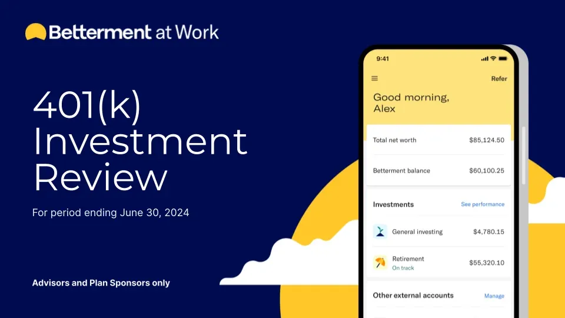

## Table of Contents

## What is Betterment and what services does it offer?

Betterment is a company that helps people manage their money online. It's what's called a robo-advisor, which means it uses computer programs to give advice and manage investments. Instead of going to a bank or a person to help with your money, you can use Betterment's website or app. They make it easy for anyone to start saving and investing, even if you don't know a lot about finance.

Betterment offers a few main services. One is called investing, where they take your money and put it into different investments like stocks and bonds, based on what you want and how much risk you're okay with. They also have a service for saving money, which is called cash management. This is like having a savings account but with Betterment, you can earn a bit more interest than at a regular bank. They also help you plan for the future, like saving for retirement or buying a house, by setting up special accounts and giving you advice on how to reach your goals.

## How does Betterment's investment strategy work for beginners?

Betterment's investment strategy for beginners is designed to be simple and easy to understand. When you start with Betterment, they ask you some questions about your goals, how long you plan to invest, and how much risk you're comfortable with. Based on your answers, Betterment creates a personalized investment plan. They use something called diversification, which means they spread your money across many different investments. This helps to reduce risk because if one investment does poorly, the others might do well and balance it out.

Once your plan is set up, Betterment automatically invests your money in a mix of stocks and bonds. They call this mix a portfolio. Betterment takes care of all the buying and selling of investments for you, so you don't have to worry about it. They also adjust your portfolio over time to keep it in line with your goals and risk level. This is called rebalancing. Betterment's strategy is to help your money grow over the long term, so it's perfect for beginners who want to start investing without having to learn a lot about the stock market.

## What are the fees associated with using Betterment?

Betterment charges fees for their services. For their investing service, they have a fee that depends on how much money you have with them. If you have less than $20,000, the fee is 0.25% of your money each year. If you have more than $20,000, the fee goes down to 0.10% a year. This fee is taken out of your account automatically. Besides this fee, there are also fees from the investments they put your money into, like stocks and bonds. These fees are usually small, around 0.07% to 0.15% a year.

For their cash management service, Betterment doesn't charge a fee. You can keep your money in this account and earn interest. The [interest rate](/wiki/interest-rate-trading-strategies) can change, but it's usually higher than what you would get at a regular bank. So, if you're using Betterment just for saving money, you won't have to pay any fees to Betterment, but you'll still earn interest on your savings.

## How does Betterment's robo-advisor feature compare to others in the market?

Betterment's robo-advisor is known for being easy to use and good for beginners. They have low fees, starting at 0.25% of your money each year, which is similar to other robo-advisors like Wealthfront and Schwab Intelligent Portfolios. Betterment also offers features like tax-loss harvesting, which can help you save money on taxes. This is something not all robo-advisors provide, but it's also available with Wealthfront. Betterment's customer service is helpful, and they have a lot of tools to help you plan for the future, like saving for retirement or buying a house.

Compared to other robo-advisors, Betterment is great for people who want a simple way to start investing. Some other robo-advisors might have lower fees or different features. For example, Schwab Intelligent Portfolios doesn't charge an advisory fee, but they have a higher minimum amount of money you need to start. Wealthfront also has a low fee like Betterment, but they might not have as many planning tools. Betterment stands out because they focus on making investing easy and helping you reach your financial goals with their tools and advice.

## Can you explain Betterment's tax-loss harvesting strategy?

Betterment's tax-loss harvesting strategy is a way to help you save money on taxes when you're investing. When the value of some of your investments goes down, Betterment can sell those investments at a loss. By doing this, you can use the loss to lower the taxes you have to pay on other investments that have made money. It's like using a bad thing (losing money) to make a good thing (paying less in taxes). Betterment does all of this automatically, so you don't have to think about it.

This strategy is especially helpful for people who are in higher tax brackets or who have a lot of investments. Betterment keeps an eye on your investments all the time, looking for chances to use tax-loss harvesting. They make sure to follow the tax rules, so you can get the most benefit without any trouble. It's one of the ways Betterment tries to help you keep more of your money in your pocket.

## What are the different account types available at Betterment?

Betterment offers different types of accounts to help you save and invest for different goals. One type is the individual taxable account, which is good for general investing. You can put money in and take it out whenever you want. Another type is the joint account, which is for two people, like a couple, to manage their money together. Betterment also has retirement accounts like the Traditional IRA and Roth IRA, which help you save for when you stop working. These accounts have special tax benefits, but there are rules about when you can take the money out.

There are also special accounts for saving for education, like the 529 plan. This is for saving money to help pay for school. Betterment also offers accounts for businesses, like a 401(k) plan for companies to help their employees save for retirement. Each type of account has its own rules and benefits, so you can choose the one that fits what you need. Betterment makes it easy to set up and manage all these different accounts in one place.

## How does Betterment personalize investment portfolios?

Betterment personalizes investment portfolios by asking you questions about your goals, how long you plan to invest, and how much risk you're comfortable with. Based on your answers, they create a plan that's just for you. They use something called diversification, which means they spread your money across many different investments. This helps to lower the risk because if one investment does badly, the others might do well and balance it out. Betterment takes care of all the buying and selling of investments for you, so you don't have to worry about it.

They also adjust your portfolio over time to keep it in line with your goals and risk level. This is called rebalancing. If your goals or how much risk you want changes, you can tell Betterment, and they'll change your portfolio to match. This way, your investments always fit what you want, even if things change. Betterment's strategy is to help your money grow over the long term, so it's perfect for anyone who wants to start investing without having to learn a lot about the stock market.

## What tools does Betterment provide for retirement planning?

Betterment makes retirement planning easy by giving you tools that help you save and invest for the future. When you start with Betterment, they ask you about your retirement goals, like when you want to retire and how much money you'll need. They use this information to create a personalized plan. This plan includes investing your money in a mix of stocks and bonds that fits your goals and how much risk you're okay with. Betterment also lets you set up special retirement accounts like a Traditional IRA or a Roth IRA. These accounts have tax benefits that can help your money grow faster.

Betterment also has tools to help you stay on track with your retirement plan. They show you how your money is doing and give you advice on how to reach your goals. For example, they can suggest how much you should be saving each month. Betterment also automatically adjusts your investments over time to keep them in line with your plan. This is called rebalancing. If you're worried about taxes, Betterment can use a strategy called tax-loss harvesting to help you save money on taxes. All these tools make it easier for you to plan for a comfortable retirement without having to be an expert in finance.

## How does Betterment's performance stack up against traditional investment advisors?

Betterment's performance can be pretty good when compared to traditional investment advisors. They use a computer program to pick investments, which can be cheaper and easier for you. Betterment's fees are usually lower than what you might pay a person to help you invest. They also use smart strategies like tax-loss harvesting to help you save money on taxes. Because they spread your money across many different investments, it can be less risky than having all your money in just a few places.

Traditional investment advisors, on the other hand, might give you more personal advice and can meet with you face-to-face. They might know more about your specific situation and can tailor their advice just for you. But they often charge more because they spend time talking to you and doing research. Over time, the extra fees you pay to a traditional advisor could eat into your returns. So, while Betterment might not give you the same personal touch, it can be a good choice if you want to save on fees and still have a solid investment plan.

## What advanced features does Betterment offer for experienced investors?

Betterment has some cool tools for people who know a lot about investing. One of these is called tax coordination. It's a smart way to put your money into different accounts to save on taxes. For example, if you have both a regular account and a retirement account, Betterment can decide which investments go where to help you pay less in taxes. They also let you choose from different investment strategies, like focusing more on value stocks or socially responsible investments. This gives you more control over where your money goes.

Another advanced feature is called flexible portfolios. This lets you add or change certain investments in your portfolio. If you like a specific stock or want to invest in something special, you can do that with Betterment. They also have something called Smart Beta, which is a way to pick investments that might give you better returns than just following the market. All these features make Betterment a good choice for experienced investors who want more options and control over their money.

## How does Betterment integrate with external financial accounts and tools?

Betterment makes it easy for you to keep track of all your money in one place. They let you connect your Betterment account to other bank accounts, credit cards, and investment accounts. This way, you can see all your money together and make better plans. Betterment works with tools like Mint and Personal Capital, so you can use these apps to see your Betterment money along with your other accounts. They use special technology to make sure your information stays safe when you connect everything.

If you use other financial tools or apps, Betterment can still work with them. For example, if you have a budgeting app or a tool to help you plan for taxes, you can often link your Betterment account to these. This helps you get a full picture of your finances without having to switch between different apps all the time. Betterment's goal is to make managing your money simple, so they try to play nicely with other tools you might be using.

## What are the potential drawbacks or limitations of using Betterment for investment management?

One of the main drawbacks of using Betterment for investment management is that it might not give you the personal touch that you get from a human advisor. If you like talking to someone face-to-face and getting advice that's really tailored to your situation, Betterment might not be the best fit. They use computer programs to manage your money, which can be less personal. Also, while Betterment's fees are low, they still add up over time. If you have a lot of money to invest, the fees might be higher than what you'd pay with some other investment options.

Another limitation is that Betterment might not offer as many investment choices as you'd get with a traditional advisor or if you manage your own investments. They have a set list of investments they use, and while you can tweak things a bit with their advanced features, it's not the same as [picking](/wiki/asset-class-picking) every investment yourself. If you're someone who likes to have a lot of control over where your money goes, this could be a downside. Plus, while Betterment is great for long-term investing, it might not be the best if you're looking to make quick trades or get into more complex investments.

## References & Further Reading

[1]: Bergstra, J., Bardenet, R., Bengio, Y., & Kégl, B. (2011). ["Algorithms for Hyper-Parameter Optimization."](https://dl.acm.org/doi/10.5555/2986459.2986743) Advances in Neural Information Processing Systems 24.

[2]: ["Advances in Financial Machine Learning"](https://www.amazon.com/Advances-Financial-Machine-Learning-Marcos/dp/1119482089) by Marcos Lopez de Prado

[3]: ["Evidence-Based Technical Analysis: Applying the Scientific Method and Statistical Inference to Trading Signals"](https://www.amazon.com/Evidence-Based-Technical-Analysis-Scientific-Statistical/dp/0470008741) by David Aronson

[4]: ["Machine Learning for Algorithmic Trading"](https://github.com/PacktPublishing/Machine-Learning-for-Algorithmic-Trading-Second-Edition) by Stefan Jansen

[5]: ["Quantitative Trading: How to Build Your Own Algorithmic Trading Business"](https://books.google.com/books/about/Quantitative_Trading.html?id=j70yEAAAQBAJ) by Ernest P. Chan