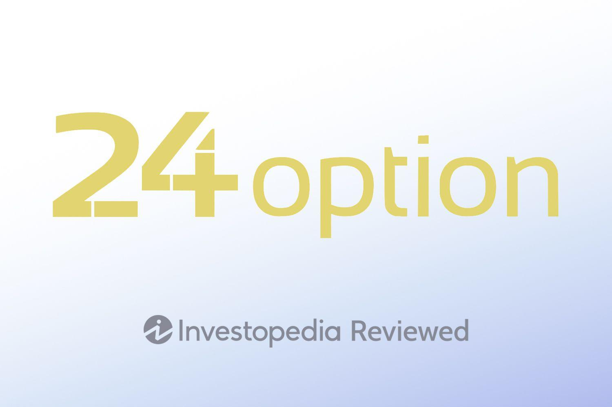

## Table of Contents

## What is 24Option and what services do they offer?

24Option is a trading platform where people can buy and sell different financial products like stocks, currencies, and commodities. It's designed to be easy to use, even if you're new to trading. The platform is available online, so you can use it from your computer or phone.

They offer several services to help people trade. You can get real-time information about the markets, use different tools to analyze trends, and learn from educational resources they provide. They also have customer support to help you if you have questions or problems.

## How does one get started with 24Option?

To get started with 24Option, you first need to visit their website and sign up for an account. You'll need to provide some personal information and choose a username and password. Once your account is set up, you'll need to make a deposit to start trading. 24Option accepts various payment methods like credit cards, bank transfers, and e-wallets, so you can choose what works best for you.

After you've made your deposit, you can start exploring the platform. 24Option offers a practice account where you can trade with virtual money to get a feel for how everything works without risking real money. When you're ready, you can switch to trading with real money. The platform has lots of tools and resources to help you make smart trading decisions, and their customer support team is there to help if you have any questions.

## What are the minimum deposit and withdrawal amounts at 24Option?

At 24Option, the minimum amount you need to deposit to start trading is $250. This is the smallest amount you can put into your account to begin using their services. It's a good idea to start with this amount if you're new to trading, as it lets you get a feel for the platform without risking too much money.

When it comes to withdrawing money from your 24Option account, the minimum amount you can take out is $10. This means if you want to move your earnings back to your bank or another account, you need to have at least $10 to do so. Withdrawals are usually processed quickly, but it can take a few days for the money to show up in your account, depending on the method you use.

## What types of trading accounts does 24Option offer?

24Option offers different types of trading accounts to fit different levels of traders. They have a basic account that's great for beginners. It lets you trade with smaller amounts of money and gives you access to all the basic tools and resources you need to start trading. This account is perfect if you're new to trading and want to learn the ropes without risking too much.

As you get more comfortable with trading, you might want to upgrade to a higher-level account. 24Option has accounts like Silver, Gold, and Platinum. These accounts come with more benefits, like better trading conditions, higher payouts, and personalized support from a dedicated account manager. The more you trade and the more money you deposit, the higher the level of account you can get, which means more perks to help you trade better.

## How does 24Option ensure the security of user funds and data?

24Option takes the security of your money and information very seriously. They use strong encryption to keep your data safe when you're using their website or app. This means your personal details and trading activities are protected from people who might try to steal them. They also follow strict rules set by financial authorities to make sure they're doing everything right and keeping your money safe.

To make sure your money is secure, 24Option keeps it in separate bank accounts, away from their own money. This way, even if something bad happens to the company, your money is still safe. They also have a team that watches for any strange activity on your account, so if someone tries to get in without your permission, they can stop it quickly.

## What are the trading platforms available at 24Option and their features?

24Option offers a trading platform that is easy to use, whether you are a beginner or an experienced trader. The main platform is web-based, which means you can use it directly from your internet browser without needing to download any software. This makes it convenient because you can access your account from any device, like your computer or smartphone. The platform has a simple layout with clear charts and tools to help you make trading decisions. It also includes real-time market data, so you can see what's happening in the markets right away.

In addition to the web platform, 24Option offers a mobile app for trading on the go. The app works on both Android and iOS devices, so you can trade from your phone or tablet whenever you want. It has many of the same features as the web platform, including the ability to check your account balance, make trades, and look at market trends. The app is designed to be user-friendly, with a clean interface that makes it easy to navigate, even if you're new to trading. Both the web platform and the mobile app are built to help you trade confidently and securely.

## What assets can be traded on 24Option?

At 24Option, you can trade a variety of assets. These include stocks from big companies around the world, like Apple or Google. You can also trade currencies, which means you can buy and sell different kinds of money, like the US dollar or the Euro. Another type of asset you can trade is commodities, which are things like gold, oil, and wheat. These are important goods that people use every day.

In addition to these, 24Option also lets you trade indices, which are collections of stocks that represent a part of the market, like the S&P 500 or the Dow Jones. You can also trade cryptocurrencies, like Bitcoin and Ethereum, which are digital money that you can use online. All these different types of assets give you lots of choices for what to trade, depending on what you're interested in and what you think will do well in the market.

## How does 24Option's customer support perform?

24Option's customer support is really good. They have people ready to help you whenever you need it, no matter what time it is. You can reach them by phone, email, or live chat on their website. If you have a question or run into a problem, they try to fix it fast. They speak lots of different languages, so you can talk to them in the language you're most comfortable with.

Their support team knows a lot about trading and can help with all sorts of things. Whether you need help understanding how to use the platform, have questions about your account, or want to learn more about trading, they're there to help. They're friendly and patient, which makes it easy to get the help you need. Overall, 24Option's customer support is reliable and helpful, making sure you have a good experience while trading.

## What are the fees and commissions associated with trading on 24Option?

Trading on 24Option comes with different fees and commissions that you need to know about. When you make a trade, you'll see that there is a spread, which is the difference between the buying and selling price of an asset. This spread is how 24Option makes money from your trades. The spread can change depending on what you're trading and how the market is doing. There are no extra commissions for opening or closing trades, which is good because it keeps your costs down.

There are also some fees for things like deposits and withdrawals. Usually, making a deposit is free, but sometimes your bank or payment provider might charge you a fee. When you want to take money out of your 24Option account, there might be a small fee, depending on how you choose to get your money. It's a good idea to check the fees for different payment methods before you decide which one to use. Overall, 24Option tries to keep their fees low, but it's important to understand all the costs so you can trade smartly.

## How does 24Option's educational resources help in trading?

24Option's educational resources are really helpful for people who want to learn more about trading. They have lots of different materials like videos, articles, and guides that explain how trading works. These resources are made for everyone, whether you're just starting out or you've been trading for a while. They teach you the basics, like what stocks and currencies are, and how to read market charts. They also have more advanced stuff, like strategies for making better trades and understanding market trends.

Using these resources can make you a better trader. They give you the knowledge you need to make smart choices when you're trading. For example, if you watch a video about how to use the trading platform, you'll feel more comfortable using it. Or if you read an article about market analysis, you'll know how to look at the market and decide when to buy or sell. 24Option's educational materials are easy to understand and can really help you improve your trading skills.

## What are the advanced trading tools provided by 24Option?

24Option has some advanced trading tools that can help you trade better. One of these tools is called technical analysis, which lets you look at charts and graphs to see how the market is moving. You can use different indicators and drawing tools to spot trends and patterns that might help you decide when to buy or sell. Another tool is called risk management, which helps you set limits on how much money you're willing to lose on a trade. This can keep you from losing too much if the market goes against you.

They also have something called trading signals, which are like tips that tell you when it might be a good time to make a trade. These signals are based on a lot of data and can help you make faster decisions. Plus, 24Option offers an economic calendar that shows you when important news or events are happening that might affect the markets. Knowing about these events ahead of time can help you plan your trades better. All these tools together make it easier for you to trade smarter and with more confidence.

## How does 24Option compare to other trading platforms in terms of performance and user experience?

24Option stands out among other trading platforms because it's easy to use and works well. When you first start using it, you'll notice that the website and app are simple and clear. You don't need to be a tech expert to figure out how to trade. The platform runs smoothly and doesn't slow down, even when the markets are busy. This makes it easier to make quick trades without worrying about the platform crashing. Plus, 24Option has lots of tools and charts that help you see what's happening in the markets, which is something not all platforms offer.

Compared to other platforms, 24Option also does a great job with customer support. If you have a question or run into a problem, their team is quick to help. They're available all the time, and you can reach them by phone, email, or live chat. This is better than some other platforms where you might have to wait a long time to get help. Overall, 24Option gives you a good mix of easy-to-use features and strong performance, making it a solid choice for both new and experienced traders.

## References & Further Reading

[1]: Green, D. (2020). ["The Rise and Fall of 24Option and the Binary Options Industry"](https://academic.oup.com/joc/article-abstract/72/1/E38/6355320). Finance Magnates.

[2]: Cyprus Securities and Exchange Commission (CySEC). ["Investor Protection with CySEC"](https://www.cysec.gov.cy/en-GB/registries-portals/).

[3]: Lopez de Prado, M. (2018). ["Advances in Financial Machine Learning"](https://www.amazon.com/Advances-Financial-Machine-Learning-Marcos/dp/1119482089). Wiley.

[4]: Van Tharp, D. (2013). ["Trading Beyond the Matrix: The Red Pill for Traders and Investors"](https://www.amazon.com/Trading-Beyond-Matrix-Traders-Investors/dp/1118525663). Wiley.

[5]: Jansen, S. (2020). ["Machine Learning for Algorithmic Trading"](https://github.com/stefan-jansen/machine-learning-for-trading). Packt Publishing.

[6]: CySEC. (2019). ["Circular C168 - Binary Options."](https://forum.binaryoptions.net/discussion/3481/deposit-bonus-prohibited-important-notice-must-read) Cyprus Securities and Exchange Commission.