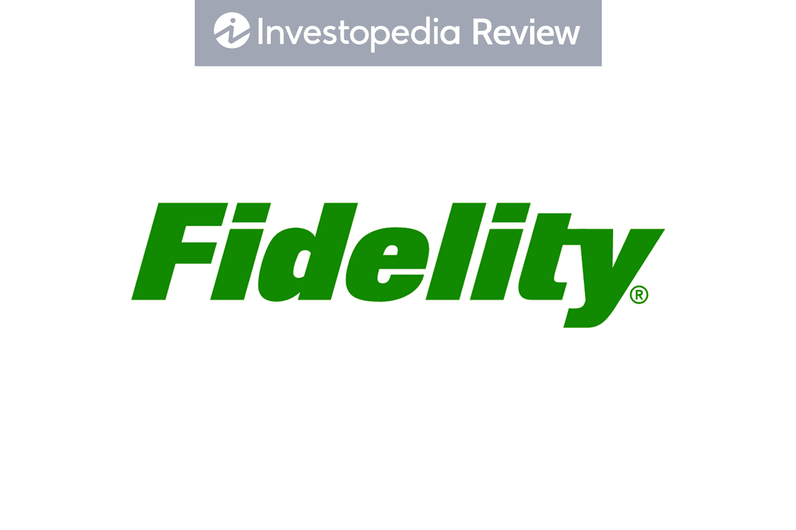

## Table of Contents

## What is Fidelity Investments and what services do they offer?

Fidelity Investments is a big company that helps people with their money. They started in 1946 and have been helping people save, invest, and plan for the future ever since. They work with lots of different people, from those just starting to save to those who are already retired. They have offices all over the United States and also help people in other countries.

Fidelity offers many services to help people manage their money. They let you open different types of accounts, like retirement accounts and regular investment accounts. They also have tools and advice to help you pick where to invest your money, like in stocks, bonds, or mutual funds. If you need help, they have people you can talk to who can give you advice on what to do with your money. They also have a website and an app that make it easy to check on your investments anytime you want.

## How can someone start an account with Fidelity Investments?

To start an account with Fidelity Investments, you first need to visit their website or use their mobile app. On the website, look for a button or link that says something like "Open an Account" or "Get Started." Click on it, and you'll be asked to choose the type of account you want. Fidelity offers different accounts like retirement accounts (like a 401(k) or an IRA), brokerage accounts for investing in stocks and funds, and even accounts for kids. Pick the one that fits what you need.

After choosing your account type, you'll need to fill out some forms with your personal information. This includes your name, address, Social Security number, and maybe some details about your job and income. It's important to fill everything out correctly. Once you submit the forms, Fidelity will review your application. If everything looks good, they'll open your account, and you can start adding money to it. You might need to deposit a minimum amount to get started, depending on the account type. If you have any questions, Fidelity has customer service people who can help you through the process.

## What are the fees associated with Fidelity's investment products?

Fidelity offers many investment products, and the fees can vary depending on what you choose. For their brokerage accounts, Fidelity doesn't charge a fee for buying or selling stocks, ETFs, and options. They also offer many mutual funds with no transaction fees. However, some mutual funds might have a fee if you buy or sell them, but Fidelity has a lot of no-fee options. For retirement accounts like IRAs, there are no account fees, but you might have to pay fees for certain investment products inside the account.

If you want to use a robo-advisor through Fidelity, called Fidelity Go, there are no advisory fees if your account balance is less than $25,000. If it's more than that, you'll pay a small fee of 0.35% per year on the money over $25,000. For more personalized advice, Fidelity's wealth management services have different fees based on how much money you have and what services you need. It's a good idea to check with Fidelity directly to understand all the fees that might apply to your specific situation.

## How does Fidelity's customer service compare to other investment firms?

Fidelity Investments is known for having really good customer service. They have people you can call, chat with online, or even visit in their offices if you need help. Lots of people say that Fidelity's customer service team is friendly and knows a lot about investing. They can help you with everything from opening an account to figuring out what to invest in. Compared to other investment firms, Fidelity often gets high marks for how fast they answer questions and how helpful they are.

Other investment firms might have good customer service too, but they can be different. For example, some firms might be good at answering questions quickly but might not have as many ways to get help. Others might have good online help but not as many offices you can visit. When people compare Fidelity to places like Vanguard or Charles Schwab, they often say that Fidelity's customer service feels more personal and is easier to reach. So, if you want help with your investments and like having different ways to get it, Fidelity could be a good choice.

## What types of investment accounts does Fidelity offer, such as IRAs, 401(k)s, and brokerage accounts?

Fidelity offers different types of accounts to help people save and invest their money. One type is an Individual Retirement Account (IRA), which helps you save for retirement. There are traditional IRAs, where you might get a tax break now, and Roth IRAs, where you might not pay taxes later when you take the money out. Another type is a 401(k) account, which is often offered through your job. This helps you save for retirement by taking money out of your paycheck before taxes. Fidelity also has 403(b) accounts for people who work at schools or non-profits.

Fidelity also offers brokerage accounts, which are good if you want to invest in stocks, bonds, mutual funds, or ETFs. These accounts let you buy and sell investments whenever you want. They have different types of brokerage accounts, like individual accounts for one person, joint accounts for two people, and custodial accounts for kids. No matter what type of account you choose, Fidelity has tools and advice to help you make smart choices about your money.

## Can you explain the process of trading stocks and other securities on Fidelity's platform?

Trading stocks and other securities on Fidelity's platform is easy. First, you need to log into your Fidelity account on their website or app. Once you're in, go to the trading section. Here, you can choose what you want to buy or sell, like stocks, ETFs, or mutual funds. Type in the name or symbol of the stock you're interested in, and Fidelity will show you all the details about it, like its price and how it's been doing. Decide how many shares you want to trade and if you want to buy or sell them. You can set a specific price you're willing to pay or accept, or you can choose to trade at the current market price. When you're ready, hit the button to place your order, and Fidelity will do the rest.

After you place your order, Fidelity will work to complete it. If you chose to trade at the market price, your order will usually go through right away. If you set a specific price, your order might take a little longer, depending on when the stock reaches that price. You can check the status of your order anytime on the Fidelity platform. Once your trade is done, you'll see the changes in your account, like more or fewer shares and any money that changed hands. If you ever need help, Fidelity has customer service people who can guide you through the process.

## What are the tools and resources provided by Fidelity for investment research and portfolio management?

Fidelity offers a bunch of tools and resources to help you learn about investing and keep track of your money. On their website and app, you can use something called the Research tab to find out about different stocks, ETFs, and mutual funds. They give you lots of information like how the stock has been doing, what people think about it, and even what the company does. You can also read reports and see charts that make it easier to understand. If you're not sure where to start, Fidelity has guides and articles that explain things in simple ways, so you can learn at your own pace.

For managing your investments, Fidelity has tools like the Portfolio Analysis tool. This helps you see how all your investments are doing together and if they're spread out in a good way. You can also set up alerts to tell you when your stocks go up or down by a certain amount. If you want more help, you can use the Fidelity Go robo-advisor, which can pick investments for you based on how much risk you want to take. And if you want to talk to a real person, Fidelity has advisors who can give you advice and help you plan what to do with your money.

## How does Fidelity's robo-advisor service, Fidelity Go, work and what are its benefits?

Fidelity Go is a robo-advisor service that helps you invest your money without having to pick stocks or funds yourself. When you sign up for Fidelity Go, you answer some questions about your goals, how much risk you're okay with, and how long you plan to invest. Based on your answers, Fidelity Go makes an investment plan for you and puts your money into a mix of ETFs that fit your needs. You don't have to do anything else after that—Fidelity Go keeps an eye on your investments and makes changes if needed to keep your plan on track. It's like having a smart computer helping you invest.

The benefits of using Fidelity Go are pretty cool. First, it's really easy to use because it does all the work for you. You don't need to know a lot about investing to get started. Second, it's pretty cheap. If you have less than $25,000 in your account, you don't pay any advisory fees at all. If you have more than that, you only pay a small fee of 0.35% on the amount over $25,000 each year. Plus, Fidelity Go is part of Fidelity, so you get all the other tools and help from Fidelity if you need it. It's a great way to start investing without feeling overwhelmed.

## What are the tax implications of investing with Fidelity and how can they be managed?

When you invest with Fidelity, you might have to pay taxes on the money you make from your investments. If you have a regular brokerage account, you'll pay taxes on any profits you make from selling stocks or funds, and also on any dividends you get. The tax rate depends on how long you held the investment before selling it. If you sell something you've owned for less than a year, you'll pay a higher tax rate than if you held it for more than a year. For retirement accounts like IRAs and 401(k)s, the tax rules are different. With a traditional IRA or 401(k), you might get a tax break now, but you'll pay taxes when you take the money out later. With a Roth IRA, you pay taxes now, but your money can grow without taxes, and you won't pay taxes when you take it out if you follow the rules.

To manage these taxes, you can use some smart strategies. One way is to hold onto your investments for more than a year to get the lower tax rate on profits. Another way is to use tax-advantaged accounts like IRAs and 401(k)s to save for retirement. You can also use a strategy called tax-loss harvesting, where you sell investments that have gone down in value to offset the taxes on your profits. Fidelity has tools and advisors who can help you figure out the best ways to manage your taxes. They can show you how different choices might affect your taxes and help you plan to keep more of your money.

## How does Fidelity's mutual fund and ETF offerings compare to competitors in terms of performance and cost?

Fidelity offers a wide range of mutual funds and ETFs, and they often do well when compared to other companies. Their mutual funds have different levels of risk and reward, so you can pick ones that fit what you want. Some of Fidelity's mutual funds, like the Fidelity 500 Index Fund, have done really well over time and are pretty cheap to own. They don't charge you a lot of money to buy or sell them, and the yearly fees, called expense ratios, are low compared to many other companies. When you look at how much money you make after fees, Fidelity's funds often come out ahead.

ETFs from Fidelity are also competitive. They have a lot of ETFs that follow different parts of the market, like stocks or bonds. Many of these ETFs have very low expense ratios, sometimes even lower than what you'd find at other big companies like Vanguard or Schwab. This means you keep more of your money over time. When it comes to how well they do, Fidelity's ETFs often perform as well as or better than similar ETFs from other companies. So, if you're looking for good performance and low costs, Fidelity's mutual funds and ETFs are a solid choice.

## What advanced trading features does Fidelity offer for experienced investors?

Fidelity has some cool tools for people who really know their stuff about trading. If you're an experienced investor, you can use their Active Trader Pro platform. This is a special software that gives you lots of information and charts to help you make smart choices about buying and selling stocks. It lets you see what's happening in the market in real-time and even lets you set up your own custom views so you can see exactly what you need to see. You can also use something called options trading, which is a bit more complicated but can be a good way to make money if you know what you're doing. Fidelity gives you tools to help you understand and use options better.

Another thing Fidelity offers is something called margin trading. This means you can borrow money from Fidelity to buy more stocks than you could with just your own money. It can help you make more money if the market goes up, but it's risky because if the market goes down, you could lose a lot. Fidelity also has a feature called conditional orders, which lets you set up trades that only happen if certain things happen in the market. This can be really helpful for planning ahead and making sure you don't miss out on opportunities. Overall, Fidelity gives experienced investors a lot of powerful tools to help them trade smarter and manage their money better.

## How does Fidelity incorporate sustainable and ESG investing into their product offerings?

Fidelity makes it easy for people who care about the environment and social issues to invest in a way that matches their values. They offer a bunch of funds and ETFs that focus on Environmental, Social, and Governance ([ESG](/wiki/esg-investing)) factors. These investments look at things like how a company treats the planet, its workers, and how it's run. Fidelity has tools that help you see how well a company does on these issues, so you can pick investments that support what's important to you. They also have special funds, like the Fidelity U.S. Sustainability Index Fund, which only invest in companies that do well on ESG measures.

If you're interested in sustainable investing, Fidelity can help you learn more and make smart choices. They have guides and articles that explain what ESG investing is and why it matters. Plus, their advisors can give you personalized advice on how to build a portfolio that fits your values. Whether you're just starting out or you're a pro at investing, Fidelity has options for everyone who wants to invest with a focus on sustainability.

## References & Further Reading

[1]: ["Advances in Financial Machine Learning"](https://books.google.com/books/about/Advances_in_Financial_Machine_Learning.html?id=oU9KDwAAQBAJ) by Marcos Lopez de Prado

[2]: ["Machine Learning for Algorithmic Trading"](https://www.amazon.com/Machine-Learning-Algorithmic-Trading-alternative/dp/1839217715) by Stefan Jansen

[3]: ["Quantitative Trading: How to Build Your Own Algorithmic Trading Business"](https://books.google.com/books/about/Quantitative_Trading.html?id=j70yEAAAQBAJ) by Ernest P. Chan

[4]: ["The Man Who Solved the Market: How Jim Simons Launched the Quant Revolution"](https://www.amazon.com/Man-Who-Solved-Market-Revolution/dp/073521798X) by Gregory Zuckerman

[5]: ["Trading and Exchanges: Market Microstructure for Practitioners"](https://www.amazon.com/Trading-Exchanges-Market-Microstructure-Practitioners/dp/0195144708) by Larry Harris